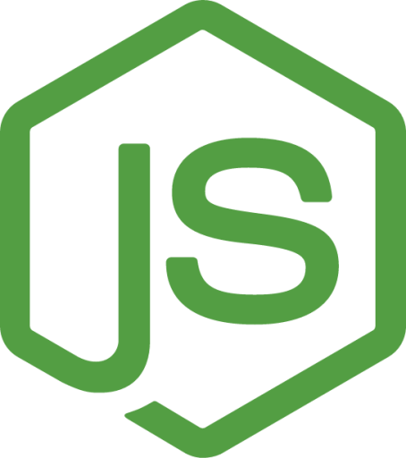

<p align="center"></p>

:information_source: &nbsp;Este repositório contém perguntas e exercícios sobre vários tópicos técnicos, às vezes relacionados a DevOps e SRE

:bar_chart: &nbsp;Atualmente, existem **2624** exercícios e perguntas

:warning: &nbsp;Você pode usá-los para se preparar para uma entrevista, mas a maioria das perguntas e exercícios não representam uma entrevista real. Por favor, leia a [página de FAQ](faq.md) para mais detalhes

:stop_sign: &nbsp;Se você está interessado em seguir uma carreira como engenheiro de DevOps, aprender alguns dos conceitos mencionados aqui seria útil, mas você deve saber que não se trata de aprender todos os tópicos e tecnologias mencionados neste repositório

:pencil: &nbsp;Você pode adicionar mais exercícios enviando pull requests :) Leia sobre as diretrizes de contribuição [aqui](CONTRIBUTING.md)

****

<!-- ALL-TOPICS-LIST:START -->
<!-- prettier-ignore-start -->
<!-- markdownlint-disable -->
<center>
<table>
  <tr>
    <td align="center"><a href="topics/devops/README.md"><br /><b>DevOps</b></a></td>
    <td align="center"><a href="topics/git/README.md"><br /><b>Git</b></a></td>
    <td align="center"><a href="#network"><br /><b>Rede</b></a></td>
    <td align="center"><a href="#hardware"><br /><b>Hardware</b></a></td>
    <td align="center"><a href="topics/kubernetes/README.md"><br /><b>Kubernetes</b></a></td>
  </tr>

  <tr>
    <td align="center"><a href="topics/software_development/README.md"><br /><b>Desenvolvimento de Software</b></a></td>
    <td align="center"><a href="https://github.com/bregman-arie/python-exercises"><br /><b>Python</b></a></td>
    <td align="center"><a href="https://github.com/bregman-arie/go-exercises"><br /><b>Go</b></a></td>
    <td align="center"><a href="topics/perl/README.md"><br /><b>Perl</b></a></td>
    <td align="center"><a href="#regex"><br /><b>Regex</b></a></td>
  </tr>

  <tr>
      <td align="center"><a href="topics/cloud/README.md"><br /><b>Nuvem</b></a></td>
      <td align="center"><a href="topics/aws/README.md"><br /><b>AWS</b></a></td>
      <td align="center"><a href="topics/azure/README.md"><br /><b>Azure</b></a></td>
      <td align="center"><a href="topics/gcp/README.md"><br /><b>Google Cloud Platform</b></a></td>
      <td align="center"><a href="#openstack/README.md"><br /><b>OpenStack</b></a></td>
  </tr>

  <tr>
      <td align="center"><a href="#operating-system"><br /><b>Sistema Operacional</b></a></td>
      <td align="center"><a href="topics/linux/README.md"><br /><b>Linux</b></a></td>
      <td align="center"><a href="#virtualization"><br /><b>Virtualização</b></a></td>
      <td align="center"><a href="topics/dns/README.md"><br /><b>DNS</b></a></td>
      <td align="center"><a href="topics/shell/README.md"><br /><b>Shell Scripting</b></a></td>
  </tr>

  <tr>
      <td align="center"><a href="topics/databases/README.md"><br /><b>Bancos de Dados</b></a></td>
      <td align="center"><a href="#sql"><br /><b>SQL</b></a></td>
      <td align="center"><a href="#mongo"><br /><b>Mongo</b></a></td>
      <td align="center"><a href="#testing"><br /><b>Testes</b></a></td>
      <td align="center"><a href="#big-data"><br /><b>Big Data</b></a></td>

  </tr>

  <tr>
      <td align="center"><a href="topics/cicd/README.md"><br /><b>CI/CD</b></a></td>
      <td align="center"><a href="#certificates"><br /><b>Certificados</b></a></td>
      <td align="center"><a href="topics/containers/README.md"><br /><b>Contêineres</b></a></td>
      <td align="center"><a href="topics/openshift/README.md"><br /><b>OpenShift</b></a></td>
      <td align="center"><a href="#storage"><br /><b>Armazenamento</b></a></td>
  </tr>

  <tr>
      <td align="center"><a href="topics/terraform/README.md"><br /><b>Terraform</b></a></td>
      <td align="center"><a href="#puppet"><br /><b>Puppet</b></a></td>
      <td align="center"><a href="#distributed"><br /><b>Distribuído</b></a></td>
      <td align="center"><a href="#questions-you-ask"><br /><b>Perguntas que você pode fazer</b></a></td>
      <td align="center"><a href="topics/ansible/README.md"><br /><b>Ansible</b></a></td>
  </tr>

  <tr>
      <td align="center"><a href="topics/observability/README.md"><br /><b>Observabilidade</b></a></td>
      <td align="center"><a href="#prometheus"><br /><b>Prometheus</b></a></td>
      <td align="center"><a href="topics/circleci/README.md"><br /><b>Circle CI</b></a></td>
      <td align="center"><a href="topics/datadog/README.md"><br /><b></b></a></td>
      <td align="center"><a href="topics/grafana/README.md"><br /><b>Grafana</b></a></td>
  </tr>

  <tr>
    <td align="center"><a href="topics/argo/README.md"><br /><b>Argo</b></a></td>
    <td align="center"><a href="topics/soft_skills/README.md"><br /><b>Soft Skills</b></a></td>
    <td align="center"><a href="topics/security/README.md"><br /><b>Segurança</b></a></td>
    <td align="center"><a href="#system-design"><br /><b>System Design</b></a></td>
   </tr>

   <tr>
    <td align="center"><a href="topics/chaos_engineering/README.md"><br /><b>Engenharia do Caos</b></a></td>
    <td align="center"><a href="#Misc"><br /><b>Diversos</b></a></td>
    <td align="center"><a href="#elastic"><br /><b>Elastic</b></a></td>
    <td align="center"><a href="topics/kafka/README.md"><br /><b>Kafka</b></a></td>
    <td align="center"><a href="topics/node/node_questions_basic.md"><br /><b>NodeJs</b></a></td>
   </tr>
   
</table>
</center>
<!-- markdownlint-enable -->
<!-- prettier-ignore-end -->
<!-- ALL-TOPICS-LIST:END -->

## Aplicações DevOps

<table>
<tr>
  <td align="center"><a href="https://play.google.com/store/apps/details?id=com.codingshell.kubeprep"><br /><b>KubePrep</b></a></td>
  <td align="center"><a href="https://play.google.com/store/apps/details?id=com.codingshell.linuxmaster"><br /><b>Linux Master</b></a></td>
  <td align="center"><a href="https://play.google.com/store/apps/details?id=com.codingshell.system_design_hero"><br /><b>System Design Hero</b></a></td>
</tr>
</table>


## Rede

<details>
<summary>Em geral, o que você precisa para se comunicar?</summary><br><b>

  - Uma linguagem comum (para as duas pontas entenderem)
  - Uma maneira de endereçar com quem você quer se comunicar
  - Uma Conexão (para que o conteúdo da comunicação possa chegar aos destinatários)

</b></details>

<details>
<summary>O que é TCP/IP?</summary><br><b>

Um conjunto de protocolos que definem como dois ou mais dispositivos podem se comunicar.

Para saber mais sobre TCP/IP, leia [aqui](http://www.penguintutor.com/linux/basic-network-reference)

</b></details>

<details>
<summary>O que é Ethernet?</summary><br><b>

Ethernet simplesmente se refere ao tipo mais comum de Rede de Área Local (LAN) usada hoje. Uma LAN — em contraste com uma WAN (Rede de Área Ampla), que abrange uma área geográfica maior — é uma rede conectada de computadores em uma pequena área, como seu escritório, campus universitário ou até mesmo em casa.

</b></details>

<details>
<summary>O que é um endereço MAC? Para que é usado?</summary><br><b>

Um endereço MAC é um número ou código de identificação único usado para identificar dispositivos individuais na rede.

Pacotes que são enviados na ethernet estão sempre vindo de um endereço MAC e sendo enviados para um endereço MAC. Se um adaptador de rede está recebendo um pacote, ele compara o endereço MAC de destino do pacote com o próprio endereço MAC do adaptador.

</b></details>

<details>
<summary>Quando este endereço MAC é usado?: ff:ff:ff:ff:ff:ff</summary><br><b>

Quando um dispositivo envia um pacote para o endereço MAC de broadcast (FF:FF:FF:FF:FF:FF), ele é entregue a todas as estações na rede local. Broadcasts Ethernet são usados para resolver endereços IP para endereços MAC (por ARP) na camada de enlace de dados.
</b></details>

<details>
<summary>O que é um endereço IP?</summary><br><b>

Um endereço de Protocolo de Internet (endereço IP) é um rótulo numérico atribuído a cada dispositivo conectado a uma rede de computadores que usa o Protocolo de Internet para comunicação. Um endereço IP serve a duas funções principais: identificação de host ou interface de rede e endereçamento de localização.
</b></details>

<details>
<summary>Explique a máscara de sub-rede e dê um exemplo</summary><br><b>

Uma máscara de sub-rede é um número de 32 bits que mascara um endereço IP e divide os endereços IP em endereços de rede e endereços de host. A Máscara de Sub-rede é feita definindo os bits de rede como todos "1"s e os bits de host como todos "0"s. Dentro de uma determinada rede, do total de endereços de host utilizáveis, dois são sempre reservados para fins específicos e não podem ser alocados a nenhum host. Estes são o primeiro endereço, que é reservado como um endereço de rede (também conhecido como ID de rede), e o último endereço usado para broadcast de rede.

[Exemplo](https://github.com/philemonnwanne/projects/tree/main/exercises/exe-09)

</b></details>

<details>
<summary>O que é um endereço IP privado? Em quais cenários/designs de sistema, deve-se usá-lo?</summary><br><b>
Endereços IP privados são atribuídos aos hosts na mesma rede para se comunicarem uns com os outros. Como o nome "privado" sugere, os dispositivos com endereços IP privados atribuídos não podem ser alcançados por dispositivos de nenhuma rede externa. Por exemplo, se eu estou morando em um albergue e quero que meus colegas de albergue entrem no servidor de jogo que hospedei, pedirei a eles que entrem através do endereço IP privado do meu servidor, já que a rede é local para o albergue.
</b></details>

<details>
<summary>O que é um endereço IP público? Em quais cenários/designs de sistema, deve-se usá-lo?</summary><br><b>
Um endereço IP público é um endereço IP voltado para o público. No caso de você estar hospedando um servidor de jogo que deseja que seus amigos entrem, você dará a seus amigos seu endereço IP público para permitir que seus computadores identifiquem e localizem sua rede e servidor para que a conexão ocorra. Uma vez que você não precisaria usar um endereço IP voltado para o público no caso de estar jogando com amigos que estavam conectados à mesma rede que você, nesse caso, você usaria um endereço IP privado. Para que alguém possa se conectar ao seu servidor que está localizado internamente, você terá que configurar um encaminhamento de porta para dizer ao seu roteador para permitir o tráfego do domínio público para sua rede e vice-versa.
</b></details>

<details>
<summary>Explique o modelo OSI. Quais camadas existem? Pelo que cada camada é responsável?</summary><br><b>

- Aplicação: ponta do usuário (HTTP está aqui)
- Apresentação: estabelece o contexto entre as entidades da camada de aplicação (A criptografia está aqui)
- Sessão: estabelece, gerencia e encerra as conexões
- Transporte: transfere sequências de dados de comprimento variável de uma fonte para um host de destino (TCP e UDP estão aqui)
- Rede: transfere datagramas de uma rede para outra (IP está aqui)
- Enlace de dados: fornece um link entre dois nós diretamente conectados (MAC está aqui)
- Física: a especificação elétrica e física da conexão de dados (Bits estão aqui)

Você pode ler mais sobre o modelo OSI em [penguintutor.com](http://www.penguintutor.com/linux/basic-network-reference)
</b></details>

<details>
<summary>Para cada um dos seguintes, determine a qual camada OSI pertence:

  * Correção de erros
  * Roteamento de pacotes
  * Cabos e sinais elétricos
  * Endereço MAC
  * Endereço IP
  * Encerrar conexões
  * Handshake de 3 vias</summary><br><b>
  * Correção de erros - Enlace de dados
  * Roteamento de pacotes - Rede
  * Cabos e sinais elétricos - Física
  * Endereço MAC - Enlace de dados
  * Endereço IP - Rede
  * Encerrar conexões - Sessão
  * Handshake de 3 vias - Transporte
</b></details>

<details>
<summary>Quais esquemas de entrega você conhece?</summary><br><b>

Unicast: Comunicação um-para-um onde há um remetente e um receptor.

Broadcast: Envio de uma mensagem para todos na rede. O endereço ff:ff:ff:ff:ff:ff é usado para broadcasting.
           Dois protocolos comuns que usam broadcast são ARP e DHCP.

Multicast: Envio de uma mensagem para um grupo de assinantes. Pode ser um-para-muitos ou muitos-para-muitos.
</b></details>

<details>
<summary>O que é CSMA/CD? É usado em redes ethernet modernas?</summary><br><b>

CSMA/CD significa Carrier Sense Multiple Access / Collision Detection.
Seu foco principal é gerenciar o acesso a um meio/barramento compartilhado onde apenas um host pode transmitir em um determinado momento.

Algoritmo CSMA/CD:

1. Antes de enviar um quadro, ele verifica se outro host já está transmitindo um quadro.
2. Se ninguém estiver transmitindo, ele começa a transmitir o quadro.
3. Se dois hosts transmitem ao mesmo tempo, temos uma colisão.
4. Ambos os hosts param de enviar o quadro e enviam a todos um 'sinal de congestionamento' notificando a todos que ocorreu uma colisão
5. Eles esperam um tempo aleatório antes de enviá-lo novamente
6. Uma vez que cada host esperou por um tempo aleatório, eles tentam enviar o quadro novamente e assim o ciclo começa novamente
</b></details>

<details>
<summary>Descreva os seguintes dispositivos de rede e a diferença entre eles:

  * roteador
  * switch
  * hub</summary><br><b>

Um roteador, switch e hub são todos dispositivos de rede usados para conectar dispositivos em uma rede de área local (LAN). No entanto, cada dispositivo opera de maneira diferente e tem seus casos de uso específicos. Aqui está uma breve descrição de cada dispositivo e as diferenças entre eles:

1. Roteador: um dispositivo de rede que conecta vários segmentos de rede. Ele opera na camada de rede (Camada 3) do modelo OSI e usa protocolos de roteamento para direcionar dados entre redes. Os roteadores usam endereços IP para identificar dispositivos e rotear pacotes de dados para o destino correto.
2. Switch: um dispositivo de rede que conecta vários dispositivos em uma LAN. Ele opera na camada de enlace de dados (Camada 2) do modelo OSI e usa endereços MAC para identificar dispositivos e direcionar pacotes de dados para o destino correto. Os switches permitem que dispositivos na mesma rede se comuniquem de forma mais eficiente e podem evitar colisões de dados que podem ocorrer quando vários dispositivos enviam dados simultaneamente.
3. Hub: um dispositivo de rede que conecta vários dispositivos através de um único cabo e é usado para conectar vários dispositivos sem segmentar uma rede. No entanto, ao contrário de um switch, ele opera na camada física (Camada 1) do modelo OSI e simplesmente transmite pacotes de dados para todos os dispositivos conectados a ele, independentemente de o dispositivo ser o destinatário pretendido ou não. Isso significa que podem ocorrer colisões de dados e a eficiência da rede pode sofrer como resultado. Hubs geralmente não são usados em configurações de rede modernas, pois os switches são mais eficientes e fornecem melhor desempenho de rede.
</b></details>

<details>
<summary>O que é um "Domínio de Colisão"?</summary><br><b>
Um domínio de colisão é um segmento de rede no qual os dispositivos podem potencialmente interferir uns com os outros tentando transmitir dados ao mesmo tempo. Quando dois dispositivos transmitem dados ao mesmo tempo, pode ocorrer uma colisão, resultando em dados perdidos ou corrompidos. Em um domínio de colisão, todos os dispositivos compartilham a mesma largura de banda, e qualquer dispositivo pode potencialmente interferir na transmissão de dados de outros devices.
</b></details>

<details>
<summary>O que é um "Domínio de Broadcast"?</summary><br><b>
Um domínio de broadcast é um segmento de rede no qual todos os dispositivos podem se comunicar uns com os outros enviando mensagens de broadcast. Uma mensagem de broadcast é uma mensagem enviada a todos os dispositivos em uma rede, em vez de a um dispositivo específico. Em um domínio de broadcast, todos os dispositivos podem receber e processar mensagens de broadcast, independentemente de a mensagem ter sido destinada a eles ou não.
</b></details>

<details>
<summary>três computadores conectados a um switch. Quantos domínios de colisão existem? Quantos domínios de broadcast?</summary><br><b>

Três domínios de colisão e um domínio de broadcast
</b></details>

<details>
<summary>Como um roteador funciona?</summary><br><b>

Um roteador é um aparelho físico ou virtual que passa informações entre duas ou more redes de computadores comutadas por pacotes. Um roteador inspeciona o endereço de Protocolo de Internet (endereço IP) de destino de um determinado pacote de dados, calcula a melhor maneira de ele chegar ao seu destino e o encaminha de acordo.

</b></details>

<details>
<summary>O que é NAT?</summary><br><b>

 Network Address Translation (NAT) é um processo no qual um ou mais endereços IP locais são traduzidos em um ou mais endereços IP globais e vice-versa para fornecer acesso à Internet aos hosts locais.

</b></details>

<details>
<summary>O que é um proxy? Como funciona? Para que precisamos dele?</summary><br><b>

Um servidor proxy atua como um gateway entre você e a internet. É um servidor intermediário que separa os usuários finais dos sites que eles navegam.

Se você estiver usando um servidor proxy, o tráfego da internet flui através do servidor proxy a caminho do endereço que você solicitou. A solicitação então volta através do mesmo servidor proxy (há exceções a esta regra), e então o servidor proxy encaminha os dados recebidos do site para você.

Servidores proxy fornecem vários níveis de funcionalidade, segurança e privacidade, dependendo do seu caso de uso, necessidades ou política da empresa.
</b></details>

<details>
<summary>O que é TCP? Como funciona? O que é o handshake de 3 vias?</summary><br><b>

O handshake de 3 vias do TCP ou handshake de três vias é um processo usado em uma rede TCP/IP para fazer uma conexão entre servidor e cliente.

Um handshake de três vias é usado principalmente para criar uma conexão de soquete TCP. Funciona quando:

- Um nó cliente envia um pacote de dados SYN por uma rede IP para um servidor na mesma rede ou em uma rede externa. O objetivo deste pacote é perguntar/inferir se o servidor está aberto para novas conexões.
- O servidor de destino deve ter portas abertas que possam aceitar e iniciar novas conexões. Quando o servidor recebe o pacote SYN do nó cliente, ele responde e retorna um recibo de confirmação – o pacote ACK ou pacote SYN/ACK.
- O nó cliente recebe o SYN/ACK do servidor e responde com um pacote ACK.
</b></details>

<details>
<summary>O que é atraso de ida e volta ou tempo de ida e volta?</summary><br><b>

Da [wikipedia](https://en.wikipedia.org/wiki/Round-trip_delay): "o tempo que leva para um sinal ser enviado mais o tempo que leva para um reconhecimento desse sinal ser recebido"

Pergunta bônus: qual é o RTT da LAN?
</b></details>

<details>
<summary>Como funciona um handshake SSL?</summary><br><b>
O handshake SSL é um processo que estabelece uma conexão segura entre um cliente e um servidor.

1. O cliente envia uma mensagem Client Hello para o servidor, que inclui a versão do cliente do protocolo SSL/TLS, uma lista dos algoritmos criptográficos suportados pelo cliente e um valor aleatório.
2. O servidor responde com uma mensagem Server Hello, que inclui a versão do servidor do protocolo SSL/TLS, um valor aleatório e um ID de sessão.
3. O servidor envia uma mensagem de Certificado, que contém o certificado do servidor.
4. O servidor envia uma mensagem Server Hello Done, que indica que o servidor terminou de enviar mensagens para a fase Server Hello.
5. O cliente envia uma mensagem Client Key Exchange, que contém a chave pública do cliente.
6. O cliente envia uma mensagem Change Cipher Spec, que notifica o servidor que o cliente está prestes a enviar uma mensagem criptografada com a nova especificação de cifra.
7. O cliente envia uma Mensagem de Handshake Criptografada, que contém o segredo pré-mestre criptografado com a chave pública do servidor.
8. O servidor envia uma mensagem Change Cipher Spec, que notifica o cliente que o servidor está prestes a enviar uma mensagem criptografada com a nova especificação de cifra.
9. O servidor envia uma Mensagem de Handshake Criptografada, que contém o segredo pré-mestre criptografado com a chave pública do cliente.
10. O cliente e o servidor agora podem trocar dados de aplicação.
</b></details>

<details>
<summary>Qual é a diferença entre TCP e UDP?</summary><br><b>

O TCP estabelece uma conexão entre o cliente e o servidor para garantir a ordem dos pacotes, por outro lado, o UDP não estabelece uma conexão entre o cliente e o servidor e não lida com a ordem dos pacotes. Isso torna o UDP mais leve que o TCP e um candidato perfeito para serviços como streaming.

[Penguintutor.com](http://www.penguintutor.com/linux/basic-network-reference) fornece uma boa explicação.
</b></details>

<details>
<summary>Quais protocolos TCP/IP você conhece?</summary><br><b>
</b></details>

<details>
<summary>Explique o "gateway padrão"</summary><br><b>

Um gateway padrão serve como um ponto de acesso ou roteador IP que um computador em rede usa para enviar informações para um computador em outra rede ou na internet.
</b></details>

<details>
<summary>O que é ARP? Como funciona?</summary><br><b>

ARP significa Address Resolution Protocol. Quando você tenta pingar um endereço IP em sua rede local, digamos 192.168.1.1, seu sistema precisa transformar o endereço IP 192.168.1.1 em um endereço MAC. Isso envolve o uso de ARP para resolver o endereço, daí o nome.

Os sistemas mantêm uma tabela de consulta ARP onde armazenam informações sobre quais endereços IP estão associados a quais endereços MAC. Ao tentar enviar um pacote para um endereço IP, o sistema primeiro consultará esta tabela para ver se já conhece o endereço MAC. Se houver um valor em cache, o ARP não é usado.
</b></details>

<details>
<summary>O que é TTL? O que ajuda a prevenir?</summary><br><b>

- TTL (Time to Live) é um valor em um pacote IP (Internet Protocol) que determina quantos saltos ou roteadores um pacote pode percorrer antes de ser descartado. Cada vez que um pacote é encaminhado por um roteador, o valor TTL é diminuído em um. Quando o valor TTL chega a zero, o pacote é descartado e uma mensagem ICMP (Internet Control Message Protocol) é enviada de volta ao remetente indicando que o pacote expirou.
- TTL é usado para evitar que pacotes circulem indefinidamente na rede, o que pode causar congestionamento e degradar o desempenho da rede.
- Também ajuda a evitar que pacotes fiquem presos em loops de roteamento, onde os pacotes viajam continuamente entre o mesmo conjunto de roteadores sem nunca chegar ao seu destino.
- Além disso, o TTL pode ser usado para ajudar a detectar e prevenir ataques de spoofing de IP, onde um invasor tenta se passar por outro dispositivo na rede usando um endereço IP falso. Ao limitar o número de saltos que um pacote pode percorrer, o TTL pode ajudar a evitar que pacotes sejam roteados para destinos que não são legítimos.
</b></details>

<details>
<summary>O que é DHCP? Como funciona?</summary><br><b>

Significa Dynamic Host Configuration Protocol e aloca endereços IP, máscaras de sub-rede e gateways para hosts. É assim que funciona:

* Um host ao entrar em uma rede transmite uma mensagem em busca de um servidor DHCP (DHCP DISCOVER)
* Uma mensagem de oferta é enviada de volta pelo servidor DHCP como um pacote contendo tempo de locação, máscara de sub-rede, endereços IP, etc (DHCP OFFER)
* Dependendo de qual oferta é aceita, o cliente envia de volta uma resposta de broadcast informando a todos os servidores DHCP (DHCP REQUEST)
* O servidor envia um reconhecimento (DHCP ACK)

Leia mais [aqui](https://linuxjourney.com/lesson/dhcp-overview)
</b></details>

<details>
<summary>Você pode ter dois servidores DHCP na mesma rede? Como funciona?</summary><br><b>

É possível ter dois servidores DHCP na mesma rede, no entanto, não é recomendado, e é importante configurá-los cuidadosamente para evitar conflitos e problemas de configuração.
- Quando dois servidores DHCP são configurados na mesma rede, há o risco de que ambos os servidores atribuam endereços IP e outras configurações de rede ao mesmo dispositivo, o que pode causar conflitos e problemas de conectividade. Além disso, se os servidores DHCP forem configurados com diferentes configurações ou opções de rede, os dispositivos na rede podem receber configurações conflitantes ou inconsistentes.
- No entanto, em alguns casos, pode ser necessário ter dois servidores DHCP na mesma rede, como em grandes redes onde um servidor DHCP pode não ser capaz de lidar com todas as solicitações. Nesses casos, os servidores DHCP podem ser configurados para servir diferentes faixas de endereços IP ou diferentes sub-redes, para que não interfiram uns com os outros.
</b></details>

<details>
<summary>O que é tunelamento SSL? Como funciona?</summary><br><b>

- O tunelamento SSL (Secure Sockets Layer) é uma técnica usada para estabelecer uma conexão segura e criptografada entre dois pontos finais em uma rede insegura, como a Internet. O túnel SSL é criado encapsulando o tráfego dentro de uma conexão SSL, que fornece confidencialidade, integridade e autenticação.

Veja como funciona o tunelamento SSL:

1. Um cliente inicia uma conexão SSL com um servidor, que envolve um processo de handshake para estabelecer a sessão SSL.
2. Uma vez que a sessão SSL é estabelecida, o cliente e o servidor negociam parâmetros de criptografia, como o algoritmo de criptografia e o comprimento da chave, e então trocam certificados digitais para autenticar um ao outro.
3. O cliente então envia tráfego através do túnel SSL para o servidor, que descriptografa o tráfego e o encaminha para seu destino.
4. O servidor envia o tráfego de volta através do túnel SSL para o cliente, que descriptografa o tráfego e o encaminha para a aplicação.
</b></details>

<details>
<summary>O que é um soquete? Onde você pode ver a lista de soquetes em seu sistema?</summary><br><b>

- Um soquete é um ponto final de software que permite a comunicação bidirecional entre processos em uma rede. Os soquetes fornecem uma interface padronizada para comunicação de rede, permitindo que as aplicações enviem e recebam dados através de uma rede. Para visualizar a lista de soquetes abertos em um sistema Linux:
***netstat -an***
- Este comando exibe uma lista de todos os soquetes abertos, juntamente com seu protocolo, endereço local, endereço estrangeiro e estado.
</b></details>

<details>
<summary>O que é IPv6? Por que devemos considerar usá-lo se temos IPv4?</summary><br><b>

- IPv6 (Internet Protocol version 6) é a versão mais recente do Protocolo de Internet (IP), que é usado para identificar e se comunicar com dispositivos em uma rede. Os endereços IPv6 são endereços de 128 bits e são expressos em notação hexadecimal, como 2001:0db8:85a3:0000:0000:8a2e:0370:7334.

Existem várias razões pelas quais devemos considerar o uso de IPv6 em vez de IPv4:

1. Espaço de endereço: O IPv4 tem um espaço de endereço limitado, que foi esgotado em muitas partes do mundo. O IPv6 fornece um espaço de endereço muito maior, permitindo trilhões de endereços IP únicos.
2. Segurança: O IPv6 inclui suporte integrado para IPsec, que fornece criptografia e autenticação de ponta a ponta para o tráfego de rede.
3. Desempenho: O IPv6 inclui recursos que podem ajudar a melhorar o desempenho da rede, como o roteamento multicast, que permite que um único pacote seja enviado para vários destinos simultaneamente.
4. Configuração de rede simplificada: O IPv6 inclui recursos que podem simplificar a configuração da rede, como a autoconfiguração sem estado, que permite que os dispositivos configurem automaticamente seus próprios endereços IPv6 sem a necessidade de um servidor DHCP.
5. Melhor suporte à mobilidade: O IPv6 inclui recursos que podem melhorar o suporte à mobilidade, como o Mobile IPv6, que permite que os dispositivos mantenham seus endereços IPv6 à medida que se movem entre diferentes redes.
</b></details>

<details>
<summary>O que é VLAN?</summary><br><b>

- Uma VLAN (Virtual Local Area Network) é uma rede lógica que agrupa um conjunto de dispositivos em uma rede física, independentemente de sua localização física. As VLANs são criadas configurando switches de rede para atribuir um ID de VLAN específico aos quadros enviados por dispositivos conectados a uma porta ou grupo de portas específico no switch.
</b></details>

<details>
<summary>O que é MTU?</summary><br><b>
	
MTU significa Maximum Transmission Unit. É o tamanho da maior PDU (Unidade de Dados de Protocolo) que pode ser enviada em uma única transação.
</b></details>

<details>
<summary>O que acontece se você enviar um pacote maior que o MTU?</summary><br><b>
	
Com o protocolo IPv4, o roteador pode fragmentar a PDU e então enviar todas as PDUs fragmentadas através da transação.
	
Com o protocolo IPv6, ele emite um erro para o computador do usuário.
</b></details>

<details>
<summary>Verdadeiro ou Falso? O Ping usa UDP porque não se importa com uma conexão confiável</summary><br><b>

Falso. O Ping na verdade usa ICMP (Internet Control Message Protocol), que é um protocolo de rede usado para enviar mensagens de diagnóstico e mensagens de controle relacionadas à comunicação de rede.
</b></details>

<details>
<summary>O que é SDN?</summary><br><b>

- SDN significa Software-Defined Networking. É uma abordagem para o gerenciamento de rede que enfatiza a centralização do controle da rede, permitindo que os administradores gerenciem o comportamento da rede através de uma abstração de software.
- Em uma rede tradicional, dispositivos de rede como roteadores, switches e firewalls são configurados e gerenciados individualmente, usando software especializado ou interfaces de linha de comando. Em contraste, o SDN separa o plano de controle da rede do plano de dados, permitindo que os administradores gerenciem o comportamento da rede através de um controlador de software centralizado.
</b></details>

<details>
<summary>O que é ICMP? Para que é usado?</summary><br><b>

- ICMP significa Internet Control Message Protocol. É um protocolo usado para fins de diagnóstico e controle em redes IP. Faz parte do conjunto de protocolos da Internet, operando na camada de rede.

As mensagens ICMP são usadas para uma variedade de propósitos, incluindo:
1. Relatório de erros: mensagens ICMP são usadas para relatar erros que ocorrem na rede, como um pacote que não pôde ser entregue ao seu destino.
2. Ping: ICMP é usado para enviar mensagens de ping, que são usadas para testar se um host ou rede está acessível e para medir o tempo de ida e volta dos pacotes.
3. Descoberta de MTU do caminho: ICMP é usado para descobrir a Unidade Máxima de Transmissão (MTU) de um caminho, que é o maior tamanho de pacote que pode ser transmitido sem fragmentação.
4. Traceroute: ICMP é usado pelo utilitário traceroute para traçar o caminho que os pacotes percorrem pela rede.
5. Descoberta de roteador: ICMP é usado para descobrir os roteadores em uma rede.
</b></details>

<details>
<summary>O que é NAT? Como funciona?</summary><br><b>

NAT significa Network Address Translation. É uma maneira de mapear vários endereços privados locais para um público antes de transferir as informações. Organizações que desejam que vários dispositivos utilizem um único endereço IP usam NAT, assim como a maioria dos roteadores domésticos.
Por exemplo, o IP privado do seu computador pode ser 192.168.1.100, mas seu roteador mapeia o tráfego para seu IP público (por exemplo, 1.1.1.1). Qualquer dispositivo na internet veria o tráfego vindo do seu IP público (1.1.1.1) em vez do seu IP privado (192.168.1.100).
</b></details>

<details>
<summary>Qual número de porta é usado em cada um dos seguintes protocolos?:

  * SSH
  * SMTP
  * HTTP
  * DNS
  * HTTPS
  * FTP
  * SFTP
</summary><br><b>

  * SSH - 22
  * SMTP - 25
  * HTTP - 80
  * DNS - 53
  * HTTPS - 443
  * FTP - 21
  * SFTP - 22
</b></details>

<details>
<summary>Quais fatores afetam o desempenho da rede?</summary><br><b>

Vários fatores podem afetar o desempenho da rede, incluindo:

1. Largura de banda: A largura de banda disponível de uma conexão de rede pode impactar significativamente seu desempenho. Redes com largura de banda limitada podem sofrer com taxas de transferência de dados lentas, alta latência e baixa responsividade.
2. Latência: A latência refere-se ao atraso que ocorre quando os dados são transmitidos de um ponto em uma rede para outro. A alta latência pode resultar em desempenho de rede lento, especialmente para aplicações em tempo real como videoconferência e jogos online.
3. Congestionamento da rede: Quando muitos dispositivos estão usando uma rede ao mesmo tempo, pode ocorrer congestionamento da rede, levando a taxas de transferência de dados lentas e baixo desempenho da rede.
4. Perda de pacotes: A perda de pacotes ocorre quando pacotes de dados são descartados durante a transmissão. Isso pode resultar em velocidades de rede mais lentas e menor desempenho geral da rede.
5. Topologia da rede: O layout físico de uma rede, incluindo a localização de switches, roteadores e outros dispositivos de rede, pode impactar o desempenho da rede.
6. Protocolo de rede: Diferentes protocolos de rede têm diferentes características de desempenho, que podem impactar o desempenho da rede. Por exemplo, o TCP é um protocolo confiável que pode garantir a entrega de dados, mas também pode resultar em desempenho mais lento devido à sobrecarga necessária para verificação de erros e retransmissão.
7. Segurança da rede: Medidas de segurança como firewalls e criptografia podem impactar o desempenho da rede, especialmente se exigirem poder de processamento significativo ou introduzirem latência adicional.
8. Distância: A distância física entre os dispositivos em uma rede pode impactar o desempenho da rede, especialmente para redes sem fio onde a força do sinal e a interferência podem afetar a conectividade e as taxas de transferência de dados.
</b></details>

<details>
<summary>O que é APIPA?</summary><br><b>

APIPA é um conjunto de endereços IP que os dispositivos recebem
quando o servidor DHCP principal não está acessível

</b></details>

<details>
<summary>Qual faixa de IP o APIPA usa?</summary><br><b>

APIPA usa a faixa de IP: 169.254.0.1 - 169.254.255.254.

</b></details>

#### Plano de Controle e Plano de Dados

<details>
<summary>A que se refere o "plano de controle"?</summary><br><b>

O plano de controle é uma parte da rede que decide como rotear e encaminhar pacotes para um local diferente.
</b></details>

<details>
<summary>A que se refere o "plano de dados"?</summary><br><b>

O plano de dados é uma parte da rede que realmente encaminha os dados/pacotes.
</b></details>

<details>
<summary>A que se refere o "plano de gerenciamento"?</summary><br><b>

Refere-se às funções de monitoramento e gerenciamento.
</b></details>

<details>
<summary>A qual plano (dados, controle, ...) pertence a criação de tabelas de roteamento?</summary><br><b>

Plano de Controle.
</b></details>

<details>
<summary>Explique o Protocolo Spanning Tree (STP).</summary><br><b>
</b></details>

<details>
<summary>O que é agregação de link? Por que é usado?</summary><br><b>
</b></details>

<details>
<summary>O que é Roteamento Assimétrico? Como lidar com isso?</summary><br><b>
</b></details>

<details>
<summary>Quais protocolos de sobreposição (túnel) você conhece?</summary><br><b>
</b></details>

<details>
<summary>O que é GRE? Como funciona?</summary><br><b>
</b></details>

<details>
<summary>O que é VXLAN? Como funciona?</summary><br><b>
</b></details>

<details>
<summary>O que é SNAT?</summary><br><b>
</b></details>

<details>
<summary>Explique o OSPF.</summary><br><b>


OSPF (Open Shortest Path First) é um protocolo de roteamento que pode ser implementado em vários tipos de roteadores. Em geral, o OSPF é suportado na maioria dos roteadores modernos, incluindo os de fornecedores como Cisco, Juniper e Huawei. O protocolo é projetado para funcionar com redes baseadas em IP, incluindo IPv4 e IPv6. Além disso, ele usa um design de rede hierárquico, onde os roteadores são agrupados em áreas, com cada área tendo seu próprio mapa de topologia e tabela de roteamento. Este design ajuda a reduzir a quantidade de informações de roteamento que precisam ser trocadas entre os roteadores e a melhorar a escalabilidade da rede.

Os 4 Tipos de roteadores OSPF são:
  * Roteador Interno
  * Roteadores de Borda de Área
  * Roteadores de Borda de Sistemas Autônomos
  * Roteadores de Backbone

  Saiba mais sobre os tipos de roteadores OSPF: https://www.educba.com/ospf-router-types/
</b></details>

<details>
<summary>O que é latência?</summary><br><b>
	
Latência é o tempo que a informação leva para chegar ao seu destino a partir da fonte.
</b></details>

<details>
<summary>O que é largura de banda?</summary><br><b>
	
Largura de banda é a capacidade de um canal de comunicação para medir quantos dados este último pode manipular durante um período de tempo específico. Mais largura de banda implicaria mais manipulação de tráfego e, portanto, mais transferência de dados.
</b></details>

<details>
<summary>O que é throughput?</summary><br><b>
	
Throughput refere-se à medição da quantidade real de dados transferidos durante um certo período de tempo através de qualquer canal de transmissão.
</b></details>

<details>
<summary>Ao realizar uma consulta de pesquisa, o que é mais importante, latência ou throughput? E como garantir isso gerenciando a infraestrutura global?
</summary><br><b>

Latência. Para ter boa latência, uma consulta de pesquisa deve ser encaminhada para o data center mais próximo.
</b></details>

<details>
<summary>Ao fazer upload de um vídeo, o que é mais importante, latência ou throughput? E como garantir isso?</summary><br><b>

Throughput. Para ter um bom throughput, o fluxo de upload deve ser roteado para um link subutilizado.
</b></details>

<details>
<summary>Quais outras considerações (exceto latência e throughput) existem ao encaminhar solicitações?</summary><br><b>

* Manter caches atualizados (o que significa que a solicitação pode não ser encaminhada para o data center mais próximo)
</b></details>

<details>
<summary>Explique Spine & Leaf</summary><br><b>
"Spine & Leaf" é uma topologia de rede comumente usada em ambientes de data center para conectar múltiplos switches e gerenciar o tráfego de rede de forma eficiente. Também é conhecida como arquitetura "spine-leaf" ou topologia "leaf-spine". Este design fornece alta largura de banda, baixa latência e escalabilidade, tornando-o ideal para data centers modernos que lidam com grandes volumes de dados e tráfego.

Dentro de uma rede Spine & Leaf existem dois tipos principais de switches:

* Switches Spine: Switches Spine são switches de alto desempenho dispostos em uma camada de espinha dorsal (spine). Esses switches atuam como o núcleo da rede e são tipicamente interconectados com cada switch leaf. Cada switch spine está conectado a todos os switches leaf no data center.
* Switches Leaf: Switches Leaf estão conectados a dispositivos finais como servidores, arrays de armazenamento e outros equipamentos de rede. Cada switch leaf está conectado a cada switch spine no data center. Isso cria uma conectividade de malha completa e sem bloqueio entre os switches leaf e spine, garantindo que qualquer switch leaf possa se comunicar com qualquer outro switch leaf com a máxima taxa de transferência.

A arquitetura Spine & Leaf tornou-se cada vez mais popular em data centers devido à sua capacidade de lidar com as demandas da computação em nuvem moderna, virtualização e aplicações de big data, fornecendo uma infraestrutura de rede escalável, de alto desempenho e confiável.
</b></details>

<details>
<summary>O que é Congestionamento de Rede? O que pode causá-lo?</summary><br><b>

O congestionamento da rede ocorre quando há muitos dados para transmitir em uma rede e ela não tem capacidade suficiente para lidar com a demanda. </br>
Isso pode levar ao aumento da latência e perda de pacotes. As causas podem ser múltiplas, como alto uso da rede, grandes transferências de arquivos, malware, problemas de hardware ou problemas de design da rede. </br>
Para evitar o congestionamento da rede, é importante monitorar o uso da sua rede e implementar estratégias para limitar ou gerenciar a demanda.
</b></details>

<details>
<summary>O que você pode me dizer sobre o formato do pacote UDP? E sobre o formato do pacote TCP? Como é diferente?</summary><br><b>
</b></details>

<details>
<summary>O que é o algoritmo de recuo exponencial? Onde é usado?</summary><br><b>
</b></details>

<details>
<summary>Usando o código de Hamming, qual seria a palavra de código para a seguinte palavra de dados 100111010001101?</summary><br><b>

00110011110100011101
</b></details>

<details>
<summary>Dê exemplos de protocolos encontrados na camada de aplicação</summary><br><b>

* Protocolo de Transferência de Hipertexto (HTTP) - usado para as páginas da web na internet
* Protocolo de Transferência de Correio Simples (SMTP) - transmissão de e-mail
* Rede de Telecomunicações - (TELNET) - emulação de terminal para permitir que um cliente acesse um servidor telnet
* Protocolo de Transferência de Arquivos (FTP) - facilita a transferência de arquivos entre quaisquer duas máquinas
* Sistema de Nomes de Domínio (DNS) - tradução de nomes de domínio
* Protocolo de Configuração Dinâmica de Host (DHCP) - aloca endereços IP, máscaras de sub-rede e gateways para hosts
* Protocolo Simples de Gerenciamento de Rede (SNMP) - coleta dados sobre dispositivos na rede
</b></details>

<details>
<summary>Dê exemplos de protocolos encontrados na Camada de Rede</summary><br><b>

* Protocolo de Internet (IP) - auxilia no roteamento de pacotes de uma máquina para outra
* Protocolo de Mensagens de Controle da Internet (ICMP) - informa o que está acontecendo, como mensagens de erro e informações de depuração
</b></details>

<details>
<summary>O que é HSTS?</summary><br><b>
HTTP Strict Transport Security é uma diretiva de servidor web que informa agentes de usuário e navegadores da web como lidar com sua conexão através de um cabeçalho de resposta enviado no início e de volta para o navegador. Isso força conexões sobre criptografia HTTPS, desconsiderando qualquer chamada de script para carregar qualquer recurso nesse domínio sobre HTTP.

Leia mais [aqui](https://www.globalsign.com/en/blog/what-is-hsts-and-how-do-i-use-it#:~:text=HTTP%20Strict%20Transport%20Security%20(HSTS,and%20back%20to%20the%20browser.)
</b></details>

#### Rede - Diversos

<details>
<summary>O que é a Internet? É o mesmo que a World Wide Web?</summary><br><b>

A internet refere-se a uma rede de redes, transferindo enormes quantidades de dados ao redor do globo.<br>
A World Wide Web é uma aplicação rodando em milhões de servidores, sobre a internet, acessada através do que é conhecido como navegador web
</b></details>

<details>
<summary>O que é o ISP?</summary><br><b>

ISP (Internet Service Provider) é o provedor local de empresa de internet.
</b></details>

## Sistema Operacional

### Exercícios de Sistema Operacional

|Nome|Tópico|Objetivo & Instruções|Solução|Comentários|
|--------|--------|------|----|----|
|Fork 101|Fork|[Link](topics/os/fork_101.md)|[Link](topics/os/solutions/fork_101_solution.md)
|Fork 102|Fork|[Link](topics/os/fork_102.md)|[Link](topics/os/solutions/fork_102_solution.md)

### Sistema Operacional - Autoavaliação

<details>
<summary>O que é um sistema operacional?</summary><br><b>

Do livro "Operating Systems: Three Easy Pieces":

"responsável por facilitar a execução de programas (permitindo até mesmo que você execute muitos aparentemente ao mesmo tempo), permitindo que programas compartilhem memória, permitindo que programas interajam com dispositivos e outras coisas divertidas como essa".
</b></details>

#### Sistema Operacional - Processo

<details>
<summary>Você pode explicar o que é um processo?</summary><br><b>

Um processo é um programa em execução. Um programa é uma ou mais instruções e o programa (ou processo) é executado pelo sistema operacional.
</b></details>

<details>
<summary>Se você tivesse que projetar uma API para processos em um sistema operacional, como seria essa API?</summary><br><b>

Ela suportaria o seguinte:

* Criar - permitir a criação de novos processos
* Excluir - permitir a remoção/destruição de processos
* Estado - permitir verificar o estado do processo, se está em execução, parado, esperando, etc.
* Parar - permitir parar um processo em execução
</b></details>

<details>
<summary>Como um processo é criado?</summary><br><b>

* O SO lê o código do programa e quaisquer outros dados relevantes
* O código do programa é carregado na memória ou, mais especificamente, no espaço de endereço do processo.
* A memória é alocada para a pilha do programa (também conhecida como pilha de tempo de execução). A pilha também é inicializada pelo SO com dados como argv, argc e parâmetros para main()
* A memória é alocada para o heap do programa, que é necessário para dados alocados dinamicamente, como as estruturas de dados de listas encadeadas e tabelas de hash
* Tarefas de inicialização de E/S são executadas, como em sistemas baseados em Unix/Linux, onde cada processo tem 3 descritores de arquivo (entrada, saída e erro)
* O SO executa o programa, começando por main()
</b></details>

<details>
<summary>Verdadeiro ou Falso? O carregamento do programa na memória é feito de forma ansiosa (tudo de uma vez)</summary><br><b>

Falso. Era verdade no passado, mas os sistemas operacionais de hoje realizam o carregamento preguiçoso, o que significa que apenas as partes relevantes necessárias para o processo ser executado são carregadas primeiro.
</b></details>

<details>
<summary>Quais são os diferentes estados de um processo?</summary><br><b>

* Em execução - está executando instruções
* Pronto - está pronto para ser executado, mas por diferentes razões está em espera
* Bloqueado - está esperando alguma operação ser concluída, por exemplo, solicitação de disco de E/S
</b></details>

<details>
<summary>Quais são algumas razões para um processo se tornar bloqueado?</summary><br><b>

  - Operações de E/S (por exemplo, leitura de um disco)
  - Esperando por um pacote de uma rede
</b></details>

<details>
<summary>O que é Comunicação Interprocessos (IPC)?</summary><br><b>

A comunicação interprocessos (IPC) refere-se aos mecanismos fornecidos por um sistema operacional que permitem que os processos gerenciem dados compartilhados.
</b></details>

<details>
<summary>O que é "compartilhamento de tempo"?</summary><br><b>

Mesmo ao usar um sistema com uma única CPU física, é possível permitir que vários usuários trabalhem nele e executem programas. Isso é possível com o compartilhamento de tempo, onde os recursos de computação são compartilhados de uma forma que parece ao usuário que o sistema tem várias CPUs, mas na verdade é simplesmente uma CPU compartilhada aplicando multiprogramação e multitarefa.
</b></details>

<details>
<summary>O que é "compartilhamento de espaço"?</summary><br><b>

De certa forma, o oposto do compartilhamento de tempo. Enquanto no compartilhamento de tempo um recurso é usado por um tempo por uma entidade e depois o mesmo recurso pode ser usado por outro recurso, no compartilhamento de espaço o espaço é compartilhado por várias entidades, mas de uma forma que não está sendo transferido entre elas.<br>
É usado por uma entidade, até que essa entidade decida se livrar dele. Tome como exemplo o armazenamento. No armazenamento, um arquivo é seu, até que você decida excluí-lo.
</b></details>

<details>
<summary>Qual componente determina qual processo é executado em um determinado momento?</summary><br><b>

Escalonador da CPU
</b></details>

#### Sistema Operacional - Memória

<details>
<summary>O que é "memória virtual" e qual o seu propósito?</summary><br><b>

A memória virtual combina a RAM do seu computador com espaço temporário no seu disco rígido. Quando a RAM fica baixa, a memória virtual ajuda a mover dados da RAM para um espaço chamado arquivo de paginação. Mover dados para o arquivo de paginação pode liberar a RAM, para que seu computador possa concluir seu trabalho. Em geral, quanto mais RAM seu computador tiver, mais rápido os programas serão executados.
https://www.minitool.com/lib/virtual-memory.html
</b></details>

<details>
<summary>O que é paginação por demanda?</summary><br><b>

Paginação por demanda é uma técnica de gerenciamento de memória onde as páginas são carregadas na memória física apenas quando acessadas por um processo. Ela otimiza o uso da memória carregando páginas sob demanda, reduzindo a latência de inicialização e a sobrecarga de espaço. No entanto, introduz alguma latência ao acessar páginas pela primeira vez. No geral, é uma abordagem econômica para gerenciar recursos de memória em sistemas operacionais.
</b></details>

<details>
<summary>O que é copy-on-write?</summary><br><b>
Copy-on-write (COW) é um conceito de gerenciamento de recursos, com o objetivo de reduzir a cópia desnecessária de informações. É um conceito, que é implementado, por exemplo, na chamada de sistema fork do POSIX, que cria um processo duplicado do processo chamador.

A ideia:
1. Se os recursos são compartilhados entre 2 ou mais entidades (por exemplo, segmentos de memória compartilhada entre 2 processos), os recursos não precisam ser copiados para cada entidade, mas sim cada entidade tem uma permissão de operação de LEITURA no recurso compartilhado. (os segmentos compartilhados são marcados como somente leitura)
(Pense em cada entidade tendo um ponteiro para a localização do recurso compartilhado, que pode ser desreferenciado para ler seu valor)
2. Se uma entidade realizasse uma operação de ESCRITA em um recurso compartilhado, um problema surgiria, pois o recurso também seria permanentemente alterado para TODAS as outras entidades que o compartilham.
(Pense em um processo modificando algumas variáveis na pilha, ou alocando alguns dados dinamicamente no heap, essas alterações no recurso compartilhado também se aplicariam a TODOS os outros processos, este é definitivamente um comportamento indesejável)
3. Como solução, apenas se uma operação de ESCRITA estiver prestes a ser realizada em um recurso compartilhado, este recurso é COPIADO primeiro e depois as alterações são aplicadas.
</b></details>

<details>
<summary>O que é um kernel e o que ele faz?</summary><br><b>

O kernel faz parte do sistema operacional e é responsável por tarefas como:

  * Alocar memória
  * Escalonar processos
  * Controlar a CPU
</b></details>

<details>
<summary>Verdadeiro ou Falso? Algumas partes do código no kernel são carregadas em áreas protegidas da memória para que as aplicações não possam sobrescrevê-las.</summary><br><b>

Verdadeiro
</b></details>

<details>
<summary>O que é POSIX?</summary><br><b>

POSIX (Portable Operating System Interface) é um conjunto de padrões que definem a interface entre um sistema operacional do tipo Unix e programas de aplicação.
</b></details>

<details>
<summary>Explique o que é Semáforo e qual o seu papel nos sistemas operacionais.</summary><br><b>

Um semáforo é uma primitiva de sincronização usada em sistemas operacionais e programação concorrente para controlar o acesso a recursos compartilhados. É uma variável ou tipo de dado abstrato que atua como um contador ou um mecanismo de sinalização para gerenciar o acesso a recursos por múltiplos processos ou threads.
</b></details>

<details>
<summary>O que é cache? O que é buffer?</summary><br><b>

Cache: O cache é geralmente usado quando os processos estão lendo e escrevendo no disco para tornar o processo mais rápido, tornando dados semelhantes usados por diferentes programas facilmente acessíveis.
Buffer: Lugar reservado na RAM, que é usado para manter dados para fins temporários.
</b></details>

## Virtualização

<details>
<summary>O que é Virtualização?</summary><br><b>

A virtualização usa software para criar uma camada de abstração sobre o hardware do computador, que permite que os elementos de hardware de um único computador - processadores, memória, armazenamento e mais - sejam divididos em vários computadores virtuais, comumente chamados de máquinas virtuais (VMs).
</b></details>

<details>
<summary>O que é um hipervisor?</summary><br><b>

Red Hat: "Um hipervisor é um software que cria e executa máquinas virtuais (VMs). Um hipervisor, às vezes chamado de monitor de máquina virtual (VMM), isola o sistema operacional e os recursos do hipervisor das máquinas virtuais e permite a criação e o gerenciamento dessas VMs."

Leia mais [aqui](https://www.redhat.com/en/topics/virtualization/what-is-a-hypervisor)
</b></details>

<details>
<summary>Que tipos de hipervisores existem?</summary><br><b>

Hipervisores hospedados e hipervisores bare-metal.
</b></details>

<details>
<summary>Quais são as vantagens e desvantagens do hipervisor bare-metal em relação a um hipervisor hospedado?</summary><br><b>

Devido a ter seus próprios drivers e um acesso direto aos componentes de hardware, um hipervisor bare-metal geralmente terá melhores desempenhos, juntamente com estabilidade e escalabilidade.

Por outro lado, provavelmente haverá alguma limitação em relação ao carregamento de (quaisquer) drivers, então um hipervisor hospedado geralmente se beneficiará de ter uma melhor compatibilidade de hardware.
</b></details>

<details>
<summary>Que tipos de virtualização existem?</summary><br><b>

Virtualização de sistema operacional
Virtualização de funções de rede
Virtualização de desktop
</b></details>

<details>
<summary>A conteinerização é um tipo de Virtualização?</summary><br><b>

Sim, é uma virtualização em nível de sistema operacional, onde o kernel é compartilhado e permite o uso de múltiplas instâncias de espaços de usuário isolados.
</b></details>

<details>
<summary>Como a introdução de máquinas virtuais mudou a indústria e a forma como as aplicações eram implantadas?</summary><br><b>

A introdução de máquinas virtuais permitiu que as empresas implantassem várias aplicações de negócios no mesmo hardware, enquanto cada aplicação é separada uma da outra de forma segura, onde cada uma está rodando em seu próprio sistema operacional separado.
</b></details>

#### Máquinas Virtuais

<details>
<summary>Precisamos de máquinas virtuais na era dos contêineres? Elas ainda são relevantes?</summary><br><b>

Sim, as máquinas virtuais ainda são relevantes mesmo na era dos contêineres. Embora os contêineres forneçam uma alternativa leve e portátil às máquinas virtuais, eles têm certas limitações. As máquinas virtuais ainda importam porque oferecem isolamento e segurança, podem executar diferentes sistemas operacionais e são boas para aplicativos legados. As limitações dos contêineres, por exemplo, são o compartilhamento do kernel do host.
</b></details>

## Prometheus

<details>
<summary>O que é Prometheus? Quais são algumas das principais características do Prometheus?</summary><br><b>

Prometheus é um popular kit de ferramentas de monitoramento e alerta de sistemas de código aberto, originalmente desenvolvido no SoundCloud. Ele é projetado para coletar e armazenar dados de séries temporais e para permitir a consulta e análise desses dados usando uma poderosa linguagem de consulta chamada PromQL. O Prometheus é frequentemente usado para monitorar aplicações nativas da nuvem, microsserviços e outras infraestruturas modernas.

Algumas das principais características do Prometheus incluem:

    1. Modelo de dados: O Prometheus usa um modelo de dados flexível que permite aos usuários organizar e rotular seus dados de séries temporais de uma maneira que faça sentido para seu caso de uso particular. Os rótulos são usados para identificar diferentes dimensões dos dados, como a fonte dos dados ou o ambiente em que foram coletados.

    2. Arquitetura baseada em pull: O Prometheus usa um modelo baseado em pull para coletar dados de alvos, o que significa que o servidor Prometheus consulta ativamente seus alvos em busca de dados de métricas em intervalos regulares. Essa arquitetura é mais escalável e confiável do que um modelo baseado em push, que exigiria que cada alvo enviasse dados para o servidor.

    3. Banco de dados de séries temporais: O Prometheus armazena todos os seus dados em um banco de dados de séries temporais, que permite aos usuários realizar consultas em intervalos de tempo e agregar e analisar seus dados de várias maneiras. O banco de dados é otimizado para cargas de trabalho pesadas de escrita e pode lidar com um alto volume de dados com baixa latência.

    4. Alerta: O Prometheus inclui um poderoso sistema de alerta que permite aos usuários definir regras com base em seus dados de métricas e enviar alertas quando certas condições são atendidas. Os alertas podem ser enviados por e-mail, chat ou outros canais e podem ser personalizados para incluir detalhes específicos sobre o problema.

    5. Visualização: O Prometheus possui uma ferramenta de gráficos e visualização integrada, chamada PromDash, que permite aos usuários criar painéis personalizados para monitorar seus sistemas e aplicações. O PromDash suporta uma variedade of tipos de gráficos e opções de visualização, e pode ser personalizado usando CSS e JavaScript.

No geral, o Prometheus é uma ferramenta poderosa e flexível para monitorar e analisar sistemas e aplicações, e é amplamente utilizado na indústria para monitoramento e observabilidade nativos da nuvem.

</b></details>

<details>
<summary>Em que cenários pode ser melhor NÃO usar o Prometheus?</summary><br><b>

Da documentação do Prometheus: "se você precisar de 100% de precisão, como para faturamento por solicitação".
</b></details>

<details>
<summary>Descreva a arquitetura e os componentes do Prometheus</summary><br><b>

A arquitetura do Prometheus consiste em quatro componentes principais:

    1. Servidor Prometheus: O servidor Prometheus é responsável por coletar e armazenar dados de métricas. Ele possui uma camada de armazenamento simples e integrada que permite armazenar dados de séries temporais em um banco de dados ordenado por tempo.

    2. Bibliotecas de Cliente: O Prometheus fornece uma variedade de bibliotecas de cliente que permitem que as aplicações exponham seus dados de métricas em um formato que pode ser ingerido pelo servidor Prometheus. Essas bibliotecas estão disponíveis para uma variedade de linguagens de programação, incluindo Java, Python e Go.

    3. Exportadores: Exportadores são componentes de software que expõem métricas existentes de sistemas de terceiros e as tornam disponíveis para ingestão pelo servidor Prometheus. O Prometheus fornece exportadores para uma variedade de tecnologias populares, incluindo MySQL, PostgreSQL e Apache.

    4. Alertmanager: O componente Alertmanager é responsável por processar alertas gerados pelo servidor Prometheus. Ele pode lidar com alertas de várias fontes e fornece uma variedade de recursos para desduplicar, agrupar e rotear alertas para os canais apropriados.

No geral, a arquitetura do Prometheus é projetada para ser altamente escalável e resiliente. O servidor e as bibliotecas de cliente podem ser implantados de forma distribuída para suportar o monitoramento em ambientes de grande escala e altamente dinâmicos
</b></details>

<details>
<summary>Você pode comparar o Prometheus com outras soluções como o InfluxDB, por exemplo?</summary><br><b>

Comparado a outras soluções de monitoramento, como o InfluxDB, o Prometheus é conhecido por seu alto desempenho e escalabilidade. Ele pode lidar com grandes volumes de dados e pode ser facilmente integrado a outras ferramentas no ecossistema de monitoramento. O InfluxDB, por outro lado, é conhecido por sua facilidade de uso e simplicidade. Possui uma interface amigável e fornece APIs fáceis de usar para coletar e consultar dados.

Outra solução popular, o Nagios, é um sistema de monitoramento mais tradicional que depende de um modelo baseado em push para coletar dados. O Nagios existe há muito tempo e é conhecido por sua estabilidade e confiabilidade. No entanto, em comparação com o Prometheus, o Nagios carece de alguns dos recursos mais avançados, como modelo de dados multidimensional e linguagem de consulta poderosa.

No geral, a escolha de uma solução de monitoramento depende das necessidades e requisitos específicos da organização. Embora o Prometheus seja uma ótima escolha para monitoramento e alerta em grande escala, o InfluxDB pode ser uma opção melhor para ambientes menores que exigem facilidade de uso e simplicidade. O Nagios continua sendo uma escolha sólida para organizações que priorizam estabilidade e confiabilidade em detrimento de recursos avançados.
</b></details>

<details>
<summary>O que é um Alerta?</summary><br><b>
No Prometheus, um alerta é uma notificação acionada quando uma condição ou limite específico é atingido. Os alertas podem ser configurados para serem acionados quando certas métricas ultrapassam um determinado limite ou quando ocorrem eventos específicos. Uma vez que um alerta é acionado, ele pode ser roteado para vários canais, como e-mail, pager ou chat, para notificar as equipes ou indivíduos relevantes para tomar as medidas apropriadas. Os alertas são um componente crítico de qualquer sistema de monitoramento, pois permitem que as equipes detectem e respondam proativamente a problemas antes que eles afetem os usuários ou causem tempo de inatividade do sistema.
</b></details>

<details>
<summary>O que é uma Instância? O que é um Job?</summary><br><b>

No Prometheus, uma instância refere-se a um único alvo que está sendo monitorado. Por exemplo, um único servidor ou serviço. Um job é um conjunto de instâncias que executam a mesma função, como um conjunto de servidores web servindo a mesma aplicação. Os jobs permitem que você defina e gerencie um grupo de alvos juntos.

Em essência, uma instância é um alvo individual do qual o Prometheus coleta métricas, enquanto um job é uma coleção de instâncias semelhantes que podem ser gerenciadas como um grupo.
</b></details>

<details>
<summary>Quais tipos de métricas principais o Prometheus suporta?</summary><br><b>
O Prometheus suporta vários tipos de métricas, incluindo:

    1. Contador: Um valor monotonicamente crescente usado para rastrear contagens de eventos ou amostras. Exemplos incluem o número de solicitações processadas ou o número total de erros encontrados.

    2. Medidor (Gauge): Um valor que pode subir ou descer, como o uso da CPU ou o uso da memória. Ao contrário dos contadores, os valores dos medidores podem ser arbitrários, o que significa que eles podem subir e descer com base nas mudanças no sistema que está sendo monitorado.

    3. Histograma: Um conjunto de observações ou eventos que são divididos em baldes (buckets) com base em seu valor. Histogramas ajudam a analisar a distribuição de uma métrica, como latências de solicitação ou tamanhos de resposta.

    4. Resumo (Summary): Um resumo é semelhante a um histograma, mas em vez de baldes, ele fornece um conjunto de quantis para os valores observados. Resumos são úteis para monitorar a distribuição de latências de solicitação ou tamanhos de resposta ao longo do tempo.

O Prometheus também suporta várias funções e operadores para agregar e manipular métricas, como soma, máximo, mínimo e taxa. Esses recursos o tornam uma ferramenta poderosa para monitorar e alertar sobre métricas do sistema.
</b></details>

<details>
<summary>O que é um exportador? Para que é usado?</summary><br><b>
O exportador serve como uma ponte entre o sistema ou aplicação de terceiros e o Prometheus, tornando possível para o Prometheus monitorar e coletar dados desse sistema ou aplicação.

O exportador atua como um servidor, ouvindo em uma porta de rede específica por solicitações do Prometheus para coletar métricas. Ele coleta métricas do sistema ou aplicação de terceiros e as transforma em um formato que pode ser entendido pelo Prometheus. O exportador então expõe essas métricas ao Prometheus através de um endpoint HTTP, tornando-as disponíveis para coleta e análise.

Exportadores são comumente usados para monitorar vários tipos de componentes de infraestrutura, como bancos de dados, servidores web e sistemas de armazenamento. Por exemplo, existem exportadores disponíveis para monitorar bancos de dados populares como MySQL и PostgreSQL, bem como servidores web como Apache e Nginx.

No geral, os exportadores são um componente crítico do ecossistema Prometheus, permitindo o monitoramento de uma ampla gama de sistemas e aplicações, e fornecendo um alto grau de flexibilidade e extensibilidade para a plataforma.
</b></details>

<details>
<summary>Quais são as melhores práticas do Prometheus?</summary><br><b>
Aqui estão três delas:

    1. Rotule com cuidado: A rotulagem cuidadosa e consistente das métricas é crucial para consultas e alertas eficazes. Os rótulos devem ser claros, concisos e incluir todas as informações relevantes sobre a métrica.

    2. Mantenha as métricas simples: As métricas expostas pelos exportadores devem ser simples e focar em um único aspecto do sistema que está sendo monitorado. Isso ajuda a evitar confusão e garante que as métricas sejam facilmente compreensíveis por todos os membros da equipe.

    3. Use alertas com moderação: Embora o alerta seja um recurso poderoso do Prometheus, ele deve ser usado com moderação e apenas para os problemas mais críticos. Configurar muitos alertas pode levar à fadiga de alertas e resultar em alertas importantes sendo ignorados. Recomenda-se configurar apenas os alertas mais importantes e ajustar os limites ao longo do tempo com base na frequência real dos alertas.
</b></details>

<details>
<summary>Como obter o total de solicitações em um determinado período de tempo?</summary><br><b>
Para obter o total de solicitações em um determinado período de tempo usando o Prometheus, você pode usar a função *sum* junto com a função *rate*. Aqui está um exemplo de consulta que lhe dará o número total de solicitações na última hora:

```
sum(rate(http_requests_total[1h]))
```
Nesta consulta, *http_requests_total* é o nome da métrica que rastreia o número total de solicitações HTTP, e a função *rate* calcula a taxa por segundo de solicitações na última hora. A função *sum* então soma todas as solicitações para lhe dar o número total de solicitações na última hora.

Você pode ajustar o intervalo de tempo alterando a duração na função *rate*. Por exemplo, se você quisesse obter o número total de solicitações no último dia, poderia alterar a função para *rate(http_requests_total[1d])*.
</b></details>

<details>
<summary>O que significa HA no Prometheus?</summary><br><b>

HA significa Alta Disponibilidade (High Availability). Isso significa que o sistema é projetado para ser altamente confiável e sempre disponível, mesmo diante de falhas ou outros problemas. Na prática, isso geralmente envolve a configuração de várias instâncias do Prometheus e a garantia de que todas estejam sincronizadas e capazes de trabalhar juntas sem problemas. Isso pode ser alcançado por meio de uma variedade de técnicas, como balanceamento de carga, replicação e mecanismos de failover. Ao implementar HA no Prometheus, os usuários podem garantir que seus dados de monitoramento estejam sempre disponíveis e atualizados, mesmo diante de falhas de hardware ou software, problemas de rede ou outros problemas que poderiam causar tempo de inatividade ou perda de dados.
</b></details>

<details>
<summary>Como você junta duas métricas?</summary><br><b>
No Prometheus, a junção de duas métricas pode ser alcançada usando a função *join()*. A função *join()* combina duas ou mais séries temporais com base em seus valores de rótulo. Ela recebe dois argumentos obrigatórios: *on* e *table*. O argumento *on* especifica os rótulos para juntar e o argumento *table* especifica a série temporal a ser juntada.

Aqui está um exemplo de como juntar duas métricas usando a função *join()*:

```
sum_series(
  join(
    on(service, instance) request_count_total,
    on(service, instance) error_count_total,
  )
)
```
Neste exemplo, a função *join()* combina as séries temporais *request_count_total* e *error_count_total* com base em seus valores de rótulo *service* e *instance*. A função *sum_series()* então calcula a soma da série temporal resultante
</b></details>

<details>
<summary>Como escrever uma consulta que retorna o valor de um rótulo?</summary><br><b>
Para escrever uma consulta que retorna o valor de um rótulo no Prometheus, você pode usar a função *label_values*. A função *label_values* recebe dois argumentos: o nome do rótulo e o nome da métrica.

Por exemplo, se você tem uma métrica chamada *http_requests_total* com um rótulo chamado *method*, e você quer retornar todos os valores do rótulo *method*, você pode usar a seguinte consulta:

```
label_values(http_requests_total, method)
```

Isso retornará uma lista de todos os valores para o rótulo *method* na métrica *http_requests_total*. Você pode então usar esta lista em consultas futuras ou para filtrar seus dados.
</b></details>

<details>
<summary>Como você converte cpu_user_seconds em uso de CPU em porcentagem?</summary><br><b>
Para converter *cpu_user_seconds* em uso de CPU em porcentagem, você precisa dividi-lo pelo tempo total decorrido e pelo número de núcleos de CPU, e então multiplicar por 100. A fórmula é a seguinte:

```
100 * sum(rate(process_cpu_user_seconds_total{job="<job-name>"}[<time-period>])) by (instance) / (<time-period> * <num-cpu-cores>)
```

Aqui, *<job-name>* é o nome do job que você quer consultar, *<time-period>* é o intervalo de tempo que você quer consultar (por exemplo, *5m*, *1h*), e *<num-cpu-cores>* é o número de núcleos de CPU na máquina que você está consultando.

Por exemplo, para obter o uso de CPU em porcentagem nos últimos 5 minutos para um job chamado *my-job* rodando em uma máquina com 4 núcleos de CPU, você pode usar a seguinte consulta:

```
100 * sum(rate(process_cpu_user_seconds_total{job="my-job"}[5m])) by (instance) / (5m * 4)
```
</b></details>

## Go

<details>
<summary>Quais são algumas características da linguagem de programação Go?</summary><br><b>

  * Tipagem forte e estática - o tipo das variáveis não pode ser alterado ao longo do tempo e elas devem ser definidas em tempo de compilação
  * Simplicidade
  * Tempos de compilação rápidos
  * Concorrência integrada
  * Coleta de lixo
  * Independente de plataforma
  * Compila para binário autônomo - tudo o que você precisa para executar seu aplicativo será compilado em um único binário. Muito útil para gerenciamento de versão em tempo de execução.

Go também tem uma boa comunidade.
</b></details>

<details>
<summary>Qual é a diferença entre <code>var x int = 2</code> e <code>x := 2</code>?</summary><br><b>

O resultado é o mesmo, uma variável com o valor 2.

Com <code>var x int = 2</code> estamos definindo o tipo da variável como inteiro, enquanto com <code>x := 2</code> estamos deixando o Go descobrir o tipo por si só.
</b></details>

<details>
<summary>Verdadeiro ou Falso? Em Go, podemos redeclarar variáveis e, uma vez declaradas, devemos usá-las.</summary>

Falso. Não podemos redeclarar variáveis, mas sim, devemos usar as variáveis declaradas.
</b></details>

<details>
<summary>Quais bibliotecas de Go você já usou?</summary><br><b>

Isso deve ser respondido com base no seu uso, mas alguns exemplos são:

  * fmt - E/S formatada
</b></details>

<details>
<summary>Qual é o problema com o seguinte bloco de código? Como consertá-lo?

```
func main() {
    var x float32 = 13.5
    var y int
    y = x
}
```
</summary><br><b>
</b></details>

<details>
<summary>O seguinte bloco de código tenta converter o inteiro 101 para uma string, mas em vez disso obtemos "e". Por que isso? Como consertar?


```go
package main

import "fmt"

func main() {
    var x int = 101
    var y string
    y = string(x)
    fmt.Println(y)
}
```
</summary><br><b>

Ele verifica qual valor unicode está definido em 101 e o usa para converter o inteiro em uma string.
Se você quiser obter "101", deve usar o pacote "strconv" e substituir <code>y = string(x)</code> por <code>y = strconv.Itoa(x)</code>
</b></details>

<details>
<summary>O que está errado com o seguinte código?:

```
package main

func main() {
    var x = 2
    var y = 3
    const someConst = x + y
}
```
</summary><br><b>

Constantes em Go só podem ser declaradas usando expressões constantes.
Mas `x`, `y` e sua soma são variáveis.
<br>
<code>const initializer x + y is not a constant</code>
</b></details>

<details>
<summary>Qual será a saída do seguinte bloco de código?:

```go
package main

import "fmt"

const (
	x = iota
	y = iota
)
const z = iota

func main() {
	fmt.Printf("%v\n", x)
	fmt.Printf("%v\n", y)
	fmt.Printf("%v\n", z)
}
```
</summary><br><b>

O identificador iota do Go é usado em declarações const para simplificar definições de números incrementais. Como pode ser usado em expressões, ele fornece uma generalidade além da de simples enumerações.
<br>
`x` e `y` no primeiro grupo iota, `z` no segundo.
<br>
Página Iota na Wiki do Go
</b></details>

<details>
<summary>Para que _ é usado em Go?</summary><br><b>

Ele evita ter que declarar todas as variáveis para os valores de retorno.
É chamado de identificador em branco.
<br>
resposta no SO
</b></details>

<details>
<summary>Qual será a saída do seguinte bloco de código?:

```go
package main

import "fmt"

const (
	_ = iota + 3
	x
)

func main() {
	fmt.Printf("%v\n", x)
}
```
</summary><br><b>

Como o primeiro iota é declarado com o valor `3` (` + 3`), o próximo tem o valor `4`
</b></details>

<details>
<summary>Qual será a saída do seguinte bloco de código?:

```go
package main

import (
	"fmt"
	"sync"
	"time"
)

func main() {
	var wg sync.WaitGroup

	wg.Add(1)
	go func() {
		time.Sleep(time.Second * 2)
		fmt.Println("1")
		wg.Done()
	}()

	go func() {
		fmt.Println("2")
	}()

	wg.Wait()
	fmt.Println("3")
}
```
</summary><br><b>

Saída: 2 1 3

Artigo sobre sync/waitgroup

Pacote sync do Golang
</b></details>

<details>
<summary>Qual será a saída do seguinte bloco de código?:

```go
package main

import (
	"fmt"
)

func mod1(a []int) {
	for i := range a {
		a[i] = 5
	}

	fmt.Println("1:", a)
}

func mod2(a []int) {
	a = append(a, 125) // !

	for i := range a {
		a[i] = 5
	}

	fmt.Println("2:", a)
}

func main() {
	s1 := []int{1, 2, 3, 4}
	mod1(s1)
	fmt.Println("1:", s1)

	s2 := []int{1, 2, 3, 4}
	mod2(s2)
	fmt.Println("2:", s2)
}
```
</summary><br><b>

Saída: <code><br>
1 [5 5 5 5]<br>
1 [5 5 5 5]<br>
2 [5 5 5 5 5]<br>
2 [1 2 3 4]<br>
</code>

Em `mod1`, `a` é um link, e quando usamos `a[i]`, estamos mudando o valor de `s1` também.
Mas em `mod2`, `append` cria uma nova fatia, e estamos mudando apenas o valor de `a`, não de `s2`.

Artigo sobre arrays,
Postagem no blog sobre `append`
</b></details>

<details>
<summary>Qual será a saída do seguinte bloco de código?:

```go
package main

import (
	"container/heap"
	"fmt"
)

// An IntHeap is a min-heap of ints.
type IntHeap []int

func (h IntHeap) Len() int           { return len(h) }
func (h IntHeap) Less(i, j int) bool { return h[i] < h[j] }
func (h IntHeap) Swap(i, j int)      { h[i], h[j] = h[j], h[i] }

func (h *IntHeap) Push(x interface{}) {
	// Push and Pop use pointer receivers because they modify the slice's length,
	// not just its contents.
	*h = append(*h, x.(int))
}

func (h *IntHeap) Pop() interface{} {
	old := *h
	n := len(old)
	x := old[n-1]
	*h = old[0 : n-1]
	return x
}

func main() {
	h := &IntHeap{4, 8, 3, 6}
	heap.Init(h)
	heap.Push(h, 7)

  fmt.Println((*h)[0])
}
```
</summary><br><b>

Saída: 3

Pacote container/heap do Golang
</b></details>

## Mongo

<details>
<summary>Quais são as vantagens do MongoDB? Ou, em outras palavras, por que escolher o MongoDB e não outra implementação de NoSQL?</summary><br><b>

As vantagens do MongoDB são as seguintes:
- Sem esquema (Schemaless)
- Fácil de escalar horizontalmente
- Sem junções complexas
- A estrutura de um único objeto é clara

</b></details>

<details>
<summary>Qual é a diferença entre SQL e NoSQL?</summary><br><b>

A principal diferença é que os bancos de dados SQL são estruturados (os dados são armazenados na forma de
tabelas com linhas e colunas - como uma tabela de planilha do Excel) enquanto o NoSQL é
não estruturado, e o armazenamento de dados pode variar dependendo de como o banco de dados NoSQL é configurado, como
par chave-valor, orientado a documentos, etc.
</b></details>

<details>
<summary>Em que cenários você preferiria usar NoSQL/Mongo em vez de SQL?</summary><br><b>

  * Dados heterogêneos que mudam com frequência
  * A consistência e integridade dos dados não são prioridade máxima
  * Melhor se o banco de dados precisar escalar rapidamente
</b></details>

<details>
<summary>O que é um documento? O que é uma coleção?</summary><br><b>

  * Um documento é um registro no MongoDB, que é armazenado no formato BSON (Binary JSON) e é a unidade básica de dados no MongoDB.
  * Uma coleção é um grupo de documentos relacionados armazenados em um único banco de dados no MongoDB.
</b></details>

<details>
<summary>O que é um agregador?</summary><br><b>

  * Um agregador é um framework no MongoDB que realiza operações em um conjunto de dados para retornar um único resultado computado.
</b></details>

<details>
<summary>O que é melhor? Documentos embutidos ou referenciados?</summary><br><b>

  * Não há uma resposta definitiva sobre qual é melhor, depende do caso de uso e dos requisitos específicos. Algumas explicações: Documentos embutidos fornecem atualizações atômicas, enquanto documentos referenciados permitem uma melhor normalização.
</b></details>

<details>
<summary>Você já realizou otimizações de recuperação de dados no Mongo? Se não, você pode pensar em maneiras de otimizar uma recuperação de dados lenta?</summary><br><b>

  * Algumas maneiras de otimizar a recuperação de dados no MongoDB são: indexação, design de esquema adequado, otimização de consulta e balanceamento de carga do banco de dados.
</b></details>

##### Consultas

<details>
<summary>Explique esta consulta: <code>db.books.find({"name": /abc/})</code></summary><br><b>
</b></details>

<details>
<summary>Explique esta consulta: <code>db.books.find().sort({x:1})</code></summary><br><b>
</b></details>

<details>
<summary>Qual é a diferença entre find() e find_one()?</code></summary><br><b>
	
  * `find()` retorna todos os documentos que correspondem às condições da consulta.
  * find_one() retorna apenas um documento que corresponde às condições da consulta (ou nulo se nenhuma correspondência for encontrada).
</b></details>

<details>
<summary>Como você pode exportar dados do Mongo DB?</code></summary><br><b>

* mongoexport
* linguagens de programação
</b></details>

## SQL

### Exercícios de SQL

|Nome|Tópico|Objetivo & Instruções|Solução|Comentários|
|--------|--------|------|----|----|
| Funções vs. Comparações | Melhorias de Consulta | Exercício | Solução

### Autoavaliação de SQL

<details>
<summary>O que é SQL?</summary><br><b>

SQL (Structured Query Language) é uma linguagem padrão para bancos de dados relacionais (como MySQL, MariaDB, ...).<br>
É usada para ler, atualizar, remover e criar dados em um banco de dados relacional.
</b></details>

<details>
<summary>Como o SQL é diferente do NoSQL</summary><br><b>

A principal diferença é que os bancos de dados SQL são estruturados (os dados são armazenados na forma de
tabelas com linhas e colunas - como uma tabela de planilha do Excel) enquanto o NoSQL é
não estruturado, e o armazenamento de dados pode variar dependendo de como o banco de dados NoSQL é configurado, como
par chave-valor, orientado a documentos, etc.
</b></details>

<details>
<summary>Quando é melhor usar SQL? NoSQL?</summary><br><b>

SQL - Melhor usado quando a integridade dos dados é crucial. O SQL é normalmente implementado em muitas
empresas e áreas do setor financeiro devido à sua conformidade com o ACID.

NoSQL - Ótimo se você precisar escalar as coisas rapidamente. O NoSQL foi projetado com aplicações web
em mente, então funciona muito bem se você precisar espalhar rapidamente a mesma informação para
vários servidores

Além disso, como o NoSQL não adere à estrutura rígida de tabela com colunas e linhas
que os Bancos de Dados Relacionais exigem, você pode armazenar diferentes tipos de dados juntos.
</b></details>

##### SQL Prático - Básico

Para estas perguntas, usaremos as tabelas Clientes e Pedidos mostradas abaixo:

**Clientes**

ID_Cliente | Nome_Cliente | Itens_no_carrinho | Dinheiro_gasto_ate_Data
------------ | ------------- | ------------- | -------------
100204 | John Smith | 0 | 20.00
100205 | Jane Smith | 3 | 40.00
100206 | Bobby Frank | 1 | 100.20

**PEDIDOS**

ID_Cliente | ID_Pedido | Item | Preço | Data_vendido
------------ | ------------- | ------------- | ------------- | -------------
100206 | A123 | Pato de Borracha | 2.20 | 2019-09-18
100206 | A123 | Banho de Espuma | 8.00 | 2019-09-18
100206 | Q987 | Pacote com 80 Papéis Higiênicos | 90.00 | 2019-09-20
100205 | Z001 | Ração de Gato - Atum | 10.00 | 2019-08-05
100205 | Z001 | Ração de Gato - Frango | 10.00 | 2019-08-05
100205 | Z001 | Ração de Gato - Carne | 10.00 | 2019-08-05
100205 | Z001 | Ração de Gato - quesadilla de gatinho | 10.00 | 2019-08-05
100204 | X202 | Café | 20.00 | 2019-04-29

<details>
<summary>Como eu selecionaria todos os campos desta tabela?</summary><br><b>

Select * <br>
From Clientes;
</b></details>

<details>
<summary>Quantos itens estão no carrinho de John?</summary><br><b>

Select Itens_no_carrinho <br>
From Clientes <br>
Where Nome_Cliente = "John Smith";
</b></details>

<details>
<summary>Qual é a soma de todo o dinheiro gasto por todos os clientes?</summary><br><b>

Select SUM(Dinheiro_gasto_ate_Data) as SOMA_DINHEIRO <br>
From Clientes;
</b></details>

<details>
<summary>Quantas pessoas têm itens em seus carrinhos?</summary><br><b>

Select count(1) as Numero_de_Pessoas_c_itens <br>
From Clientes <br>
where Itens_no_carrinho > 0;
</b></details>

<details>
<summary>Como você juntaria a tabela de clientes à tabela de pedidos?</summary><br><b>

Você os juntaria pela chave única. Neste caso, a chave única é ID_Cliente em
ambas as tabelas Clientes e Pedidos
</b></details>

<details>
<summary>Como você mostraria qual cliente pediu quais itens?</summary><br><b>

Select c.Nome_Cliente, o.Item <br>
From Clientes c <br>
Left Join Pedidos o <br>
  On c.ID_Cliente = o.ID_Cliente;

</b></details>

<details>
<summary>Usando uma instrução with, como você mostraria quem pediu ração de gato e o valor total gasto?</summary><br><b>

with racao_gato as ( <br>
Select ID_Cliente, SUM(Preco) as PRECO_TOTAL <br>
From Pedidos <br>
Where Item like "%Ração de Gato%" <br>
Group by ID_Cliente <br>
) <br>
Select Nome_Cliente, PRECO_TOTAL <br>
From Clientes c <br>
Inner JOIN racao_gato f <br>
  ON c.ID_Cliente = f.ID_Cliente <br>
where c.ID_Cliente in (Select ID_Cliente from racao_gato);

Embora esta tenha sido uma instrução simples, a cláusula "with" realmente brilha quando
uma consulta complexa precisa ser executada em uma tabela antes de se juntar a outra. As instruções With são boas,
porque você cria um pseudo temp ao executar sua consulta, em vez de criar uma tabela totalmente nova.

A Soma de todas as compras de ração de gato não estava prontamente disponível, então usamos uma instrução with para criar
a pseudo tabela para recuperar a soma dos preços gastos por cada cliente, e então juntamos a tabela normalmente.
</b></details>

<details>
<summary>Qual das seguintes consultas você usaria?

```
SELECT count(*)                             SELECT count(*)
FROM compras_shawarma                     FROM compras_shawarma
WHERE                               vs.     WHERE
  YEAR(comprado_em) == '2017'              comprado_em >= '2017-01-01' AND
                                            comprado_em <= '2017-31-12'
```
</summary><br><b>

```
SELECT count(*)
FROM compras_shawarma
WHERE
  comprado_em >= '2017-01-01' AND
  comprado_em <= '2017-31-12'
```

Quando você usa uma função (`YEAR(comprado_em)`), ela precisa varrer todo o banco de dados, em oposição ao uso de índices e, basicamente, da coluna como ela é, em seu estado natural.
</b></details>

## OpenStack

<details>
<summary>Quais componentes/projetos do OpenStack você conhece?</summary><br><b>
Estou mais familiarizado com vários componentes principais do OpenStack:

- Nova para provisionamento de recursos de computação, incluindo gerenciamento do ciclo de vida de VMs.
- Neutron para redes, com foco na criação e gerenciamento de redes, sub-redes e roteadores.
- Cinder para armazenamento em bloco, usado para anexar e gerenciar volumes de armazenamento.
- Keystone para serviços de identidade, lidando com autenticação e autorização.

Já implementei estes em projetos anteriores, configurando-os para escalabilidade e segurança para suportar ambientes multi-tenant.
 
</b></details>

<details>
<summary>Você pode me dizer pelo que cada um dos seguintes serviços/projetos é responsável?:

  - Nova
  - Neutron
  - Cinder
  - Glance
  - Keystone</summary><br><b>

  * Nova - Gerenciar instâncias virtuais
  * Neutron - Gerenciar redes fornecendo Rede como Serviço (NaaS)
  * Cinder - Armazenamento em Bloco
  * Glance - Gerenciar imagens para máquinas virtuais e contêineres (pesquisar, obter e registrar)
  * Keystone - Serviço de autenticação em toda a nuvem
</b></details>

<details>
<summary>Identifique o serviço/projeto usado para cada um dos seguintes:

  * Copiar ou fazer snapshot de instâncias
  * GUI para visualizar e modificar recursos
  * Armazenamento em Bloco
  * Gerenciar instâncias virtuais
</summary><br><b>

  * Glance - Serviço de Imagens. Também usado para copiar ou fazer snapshot de instâncias
  * Horizon - GUI para visualizar e modificar recursos
  * Cinder - Armazenamento em Bloco
  * Nova - Gerenciar instâncias virtuais
</b></details>

<details>
<summary>O que é um tenant/projeto?</summary><br><b>
</b></details>

<details>
<summary>Determine verdadeiro ou falso:

  * OpenStack é gratuito para usar
  * O serviço responsável pela rede é o Glance
  * O propósito do tenant/projeto é compartilhar recursos entre diferentes projetos e usuários do OpenStack</summary><br><b>
</b></details>

<details>
<summary>Descreva em detalhes como você inicia uma instância com um IP flutuante</summary><br><b>
</b></details>

<details>
<summary>Você recebe uma ligação de um cliente dizendo: "Eu consigo pingar minha instância, mas não consigo conectar (ssh) nela". Qual pode ser o problema?</summary><br><b>
</b></details>

<details>
<summary>Que tipos de redes o OpenStack suporta?</summary><br><b>
</b></details>

<details>
<summary>Como você depura problemas de armazenamento do OpenStack? (ferramentas, logs, ...)</summary><br><b>
</b></details>

<details>
<summary>Como você depura problemas de computação do OpenStack? (ferramentas, logs, ...)</summary><br><b>
</b></details>

#### Implantação do OpenStack & TripleO

<details>
<summary>Você já implantou o OpenStack no passado? Se sim, pode descrever como fez isso?</summary><br><b>
</b></details>

<details>
<summary>Você está familiarizado com o TripleO? Como ele é diferente do Devstack ou Packstack?</summary><br><b>

Você pode ler sobre o TripleO aqui aqui
</b></details>

#### Computação OpenStack

<details>
<summary>Você pode descrever o Nova em detalhes?</summary><br><b>

  * Usado para provisionar e gerenciar instâncias virtuais
  * Suporta Multi-Tenancy em diferentes níveis - logging, controle do usuário final, auditoria, etc.
  * Altamente escalável
  * A autenticação pode ser feita usando sistema interno ou LDAP
  * Suporta múltiplos tipos de armazenamento em bloco
  * Tenta ser agnóstico em relação a hardware e hipervisor
</b></details>

<details>
<summary>O que você sabe sobre a arquitetura e os componentes do Nova?</summary><br><b>

  * nova-api - o servidor que serve metadados e APIs de computação
  * os diferentes componentes do Nova se comunicam usando uma fila (geralmente Rabbitmq) e um banco de dados
  * uma solicitação para criar uma instância é inspecionada pelo nova-scheduler, que determina onde a instância será criada e executada
  * nova-compute é o componente responsável por se comunicar com o hipervisor para criar a instância e gerenciar seu ciclo de vida
</b></details>

#### Rede OpenStack (Neutron)

<details>
<summary>Explique o Neutron em detalhes</summary><br><b>

  * Um dos componentes principais do OpenStack e um projeto autônomo
  * O Neutron foca em entregar rede como serviço
  * Com o Neutron, os usuários podem configurar redes na nuvem e configurar e gerenciar uma variedade de serviços de rede
  * O Neutron interage com:
      * Keystone - autorizar chamadas de API
      * Nova - o nova se comunica com o neutron para conectar NICs a uma rede
      * Horizon - suporta entidades de rede no painel e também fornece uma visão de topologia que inclui detalhes de rede
</b></details>

<details>
<summary>Explique cada um dos seguintes componentes:

  - neutron-dhcp-agent
  - neutron-l3-agent
  - neutron-metering-agent
  - neutron-*-agtent
  - neutron-server</summary><br><b>


  * neutron-l3-agent - Encaminhamento L3/NAT (fornece acesso à rede externa para VMs, por exemplo)
  * neutron-dhcp-agent - Serviços DHCP
  * neutron-metering-agent - Medição de tráfego L3
  * neutron-*-agtent - gerencia a configuração local do vSwitch em cada computação (com base no plugin escolhido)
  * neutron-server - expõe a API de rede e passa as solicitações para outros plugins, se necessário
</b></details>

<details>
<summary>Explique estes tipos de rede:

  - Rede de Gerenciamento
  - Rede de Convidado
  - Rede de API
  - Rede Externa</summary><br><b>

  * Rede de Gerenciamento - usada para comunicação interna entre os componentes do OpenStack. Qualquer endereço IP nesta rede é acessível apenas dentro do datacenter
  * Rede de Convidado - usada para comunicação entre instâncias/VMs
  * Rede de API - usada para comunicação da API de serviços. Qualquer endereço IP nesta rede é acessível publicamente
  * Rede Externa - usada para comunicação pública. Qualquer endereço IP nesta rede é acessível por qualquer pessoa na internet
</b></details>

<details>
<summary>Em que ordem você deve remover as seguintes entidades:

  * Rede
  * Porta
  * Roteador
  * Sub-rede</summary><br><b>

  - Porta
  - Sub-rede
  - Roteador
  - Rede

Existem muitas razões para isso. Uma, por exemplo: você não pode remover o roteador se houver portas ativas atribuídas a ele.
</b></details>

<details>
<summary>O que é uma rede provedora?</summary><br><b>
</b></details>

<details>
<summary>Quais componentes e serviços existem para L2 e L3?</summary><br><b>
</b></details>

<details>
<summary>O que é o plug-in ML2? Explique sua arquitetura</summary><br><b>
</b></details>

<details>
<summary>O que é o agente L2? Como ele funciona e pelo que é responsável?</summary><br><b>
</b></details>

<details>
<summary>O que é o agente L3? Como ele funciona e pelo que é responsável?</summary><br><b>
</b></details>

<details>
<summary>Explique pelo que o agente de Metadados é responsável</summary><br><b>
</b></details>

<details>
<summary>Quais entidades de rede o Neutron suporta?</summary><br><b>
</b></details>

<details>
<summary>Como você depura problemas de rede do OpenStack? (ferramentas, logs, ...)</summary><br><b>
</b></details>

#### OpenStack - Glance

<details>
<summary>Explique o Glance em detalhes</summary><br><b>

  * Glance é o serviço de imagem do OpenStack
  * Ele lida com solicitações relacionadas a discos e imagens de instâncias
  * O Glance também é usado para criar snapshots para backups rápidos de instâncias
  * Os usuários podem usar o Glance para criar novas imagens ou fazer upload de existentes
</b></details>

<details>
<summary>Descreva a arquitetura do Glance</summary><br><b>

  * glance-api - responsável por lidar com chamadas de API de imagem, como recuperação e armazenamento. Consiste em duas APIs: 1. registry-api - responsável por solicitações internas 2. API do usuário - pode ser acessada publicamente
  * glance-registry - responsável por lidar com solicitações de metadados de imagem (por exemplo, tamanho, tipo, etc). Este componente é privado, o que significa que não está disponível publicamente
  * serviço de definição de metadados - API para metadados personalizados
  * banco de dados - para armazenar metadados de imagens
  * repositório de imagens - para armazenar imagens. Pode ser um sistema de arquivos, armazenamento de objetos swift, HTTP, etc.
</b></details>

#### OpenStack - Swift

<details>
<summary>Explique o Swift em detalhes</summary><br><b>

  * Swift é o serviço de Object Store e é um armazenamento altamente disponível, distribuído e consistente, projetado para armazenar muitos dados
  * O Swift distribui dados por vários servidores enquanto os grava em vários discos
  * Pode-se optar por adicionar servidores adicionais para escalar o cluster. Tudo isso enquanto o swift mantém a integridade das informações e replicações de dados.
</b></details>

<details>
<summary>Os usuários podem armazenar por padrão um objeto de 100GB de tamanho?</summary><br><b>

Não por padrão. A API de Armazenamento de Objetos limita o máximo a 5GB por objeto, mas pode ser ajustado.
</b></details>

<details>
<summary>Explique o seguinte em relação ao Swift:

  * Contêiner
  * Conta
  * Objeto
</summary><br><b>

  - Contêiner - Define um namespace para objetos.
  - Conta - Define um namespace para contêineres
  - Objeto - Conteúdo de dados (por exemplo, imagem, documento, ...)
</b></details>

<details>
<summary>Verdadeiro ou Falso? pode haver dois objetos com o mesmo nome no mesmo contêiner, mas não em dois contêineres diferentes</summary><br><b>

Falso. Dois objetos podem ter o mesmo nome se estiverem em contêineres diferentes.
</b></details>

#### OpenStack - Cinder

<details>
<summary>Explique o Cinder em detalhes</summary><br><b>

  * Cinder é o serviço de Armazenamento em Bloco do OpenStack
  * Basicamente, ele fornece aos usuários recursos de armazenamento que eles podem consumir com outros serviços, como o Nova
  * Uma das implementações de armazenamento mais usadas e suportadas pelo Cinder é o LVM
  * Do ponto de vista do usuário, isso é transparente, o que significa que o usuário não sabe onde, nos bastidores, o armazenamento está localizado ou que tipo de armazenamento é usado
</b></details>

<details>
<summary>Descreva os componentes do Cinder</summary><br><b>

  * cinder-api - recebe solicitações de API
  * cinder-volume - gerencia dispositivos de bloco anexados
  * cinder-scheduler - responsável por armazenar volumes
</b></details>

#### OpenStack - Keystone

<details>
<summary>Você pode descrever os seguintes conceitos em relação ao Keystone?

  - Papel (Role)
  - Inquilino/Projeto (Tenant/Project)
  - Serviço (Service)
  - Ponto de extremidade (Endpoint)
  - Token
</summary><br><b>

  - Papel - Uma lista de direitos e privilégios que determinam o que um usuário ou um projeto pode realizar
  - Inquilino/Projeto - Representação lógica de um grupo de recursos isolado de outros grupos de recursos. Pode ser uma conta, organização, ...
  - Serviço - Um ponto de extremidade que o usuário pode usar para acessar diferentes recursos
  - Ponto de extremidade - um endereço de rede que pode ser usado para acessar um determinado serviço OpenStack
  - Token - Usado para acessar recursos enquanto descreve quais recursos podem ser acessados usando um escopo
</b></details>

<details>
<summary>Quais são as propriedades de um serviço? Em outras palavras, como um serviço é identificado?</summary><br><b>

Usando:
  - Nome
  - Número de ID
  - Tipo
  - Descrição
</b></details>

<details>
<summary>Explique o seguinte:
  - PublicURL
  - InternalURL
  - AdminURL</summary><br><b>

  - PublicURL - Acessível publicamente através da internet pública
  - InternalURL - Usado para comunicação entre serviços
  - AdminURL - Usado para gerenciamento administrativo
</b></details>

<details>
<summary>O que é um catálogo de serviços?</summary><br><b>

Uma lista de serviços e seus pontos de extremidade
</b></details>

#### OpenStack Avançado - Serviços

<details>
<summary>Descreva cada um dos seguintes serviços

  * Swift
  * Sahara
  * Ironic
  * Trove
  * Aodh
  * Ceilometer
</summary><br><b>

  * Swift - armazenamento de objeto/blob altamente disponível, distribuído e eventualmente consistente
  * Sahara - Gerenciar Clusters Hadoop
  * Ironic - Provisionamento Bare Metal
  * Trove - Banco de dados como serviço que roda no OpenStack
  * Aodh - Serviço de Alarmes
  * Ceilometer - Rastrear e monitorar o uso
</b></details>

<details>
<summary>Identifique o serviço/projeto usado para cada um dos seguintes:

  * Banco de dados como serviço que roda no OpenStack
  * Provisionamento Bare Metal
  * Rastrear e monitorar o uso
  * Serviço de Alarmes
  * Gerenciar Clusters Hadoop
  * armazenamento de objeto/blob altamente disponível, distribuído e eventualmente consistente
</summary><br><b>

  * Banco de dados como serviço que roda no OpenStack - Trove
  * Provisionamento Bare Metal - Ironic
  * Rastrear e monitorar o uso - Ceilometer
  * Serviço de Alarmes - Aodh
  * Gerenciar Clusters Hadoop
  * Gerenciar Clusters Hadoop - Sahara
  * armazenamento de objeto/blob altamente disponível, distribuído e eventualmente consistente - Swift
</b></details>

#### OpenStack Avançado - Keystone

<details>
<summary>Você pode descrever o serviço Keystone em detalhes?</summary><br><b>

  * Você não pode ter o OpenStack implantado sem o Keystone
  * Ele fornece serviços de identidade, política и token
    * A autenticação fornecida é para usuários e serviços
    * A autorização suportada é baseada em token e baseada em usuário.
  * Existe uma política definida com base em RBAC armazenada em um arquivo JSON e cada linha nesse arquivo define o nível de acesso a ser aplicado
</b></details>

<details>
<summary>Descreva a arquitetura do Keystone</summary><br><b>

  * Existe uma API de serviço e uma API de administração através das quais o Keystone recebe solicitações
  * O Keystone tem quatro backends:
    * Backend de Token - Tokens temporários para usuários e serviços
    * Backend de Política - Gerenciamento de regras e autorização
    * Backend de Identidade - usuários e grupos (banco de dados autônomo, LDAP, ...)
    * Backend de Catálogo - Pontos de extremidade
  * Possui um ambiente conectável onde você pode integrar com:
    * LDAP
    * KVS (Key Value Store)
    * SQL
    * PAM
    * Memcached
</b></details>

<details>
<summary>Descreva o processo de autenticação do Keystone</summary><br><b>

  * O Keystone recebe uma chamada/solicitação e verifica se é de um usuário autorizado, usando nome de usuário, senha e authURL
  * Uma vez confirmado, o Keystone fornece um token.
  * Um token contém uma lista de projetos do usuário, então não há necessidade de autenticar todas as vezes e um token pode ser enviado em vez disso
</b></details>

#### OpenStack Avançado - Computação (Nova)

<details>
<summary>O que cada um dos seguintes faz?:

  * nova-api
  * nova-compuate
  * nova-conductor
  * nova-cert
  * nova-consoleauth
  * nova-scheduler
</summary><br><b>

  * nova-api - responsável por gerenciar solicitações/chamadas
  * nova-compute - responsável por gerenciar o ciclo de vida da instância
  * nova-conductor - Media entre o nova-compute e o banco de dados para que o nova-compute não o acesse diretamente
</b></details>

<details>
<summary>Que tipos de proxies Nova você conhece?</summary><br><b>

  * Nova-novncproxy - Acesso através de conexões VNC
  * Nova-spicehtml5proxy - Acesso através de SPICE
  * Nova-xvpvncproxy - Acesso através de uma conexão VNC
</b></details>

#### OpenStack Avançado - Rede (Neutron)

<details>
<summary>Explique o roteamento dinâmico BGP</summary><br><b>
</b></details>

<details>
<summary>Qual é o papel dos namespaces de rede no OpenStack?</summary><br><b>
</b></details>

#### OpenStack Avançado - Horizon

<details>
<summary>Você pode descrever o Horizon em detalhes?</summary><br><b>

  * Projeto baseado em Django com foco em fornecer um painel do OpenStack e a capacidade de criar painéis personalizados adicionais
  * Você pode usá-lo para acessar os diferentes recursos de serviços do OpenStack - instâncias, imagens, redes, ...
    * Ao acessar o painel, os usuários podem usá-lo para listar, criar, remover e modificar os diferentes recursos
  * Também é altamente personalizável e você pode modificar ou adicionar a ele com base em suas necessidades
</b></details>

<details>
<summary>O que você pode dizer sobre a arquitetura do Horizon?</summary><br><b>

  * A API é compatível com versões anteriores
  * Existem três tipos de painéis: usuário, sistema e configurações
  * Ele fornece suporte principal para todos os projetos principais do OpenStack, como Neutron, Nova, etc. (pronto para uso, sem necessidade de instalar pacotes ou plugins extras)
  * Qualquer pessoa pode estender os painéis e adicionar novos componentes
  * O Horizon fornece modelos e classes principais a partir dos quais se pode construir seu próprio painel
</b></details>

## Puppet

<details>
<summary>O que é Puppet? Como funciona?</summary><br><b> 

  * Puppet é uma ferramenta de gerenciamento de configuração que garante que todos os sistemas sejam configurados para um estado desejado e previsível.
</b></details>
<details>
<summary>Explique a arquitetura do Puppet</summary><br><b>

  * O Puppet tem uma arquitetura de nó primário-secundário. Os clientes são distribuídos pela rede e se comunicam com o ambiente primário-secundário onde os módulos do Puppet estão presentes. O agente cliente envia um certificado com seu ID para o servidor; o servidor então assina esse certificado e o envia de volta para o cliente. Essa autenticação permite uma comunicação segura e verificável entre o cliente e o mestre.
</b></details>

<details>
<summary>Você pode comparar o Puppet com outras ferramentas de gerenciamento de configuração? Por que você escolheu usar o Puppet?</summary><br><b>

  * O Puppet é frequentemente comparado a outras ferramentas de gerenciamento de configuração como Chef, Ansible, SaltStack e cfengine. A escolha de usar o Puppet geralmente depende das necessidades de uma organização, como facilidade de uso, escalabilidade e suporte da comunidade.
</b></details>

<details>
<summary>Explique o seguinte:

  * Módulo
  * Manifesto
  * Nó
</summary><br><b>
  
  * Módulos - são uma coleção de manifestos, modelos e arquivos
  * Manifestos - são os códigos reais para configurar os clientes
  * Nó - permite atribuir configurações específicas a nós específicos
</b></details>

<details>
<summary>Explique o Facter</summary><br><b>

  * Facter é uma ferramenta autônoma no Puppet que coleta informações sobre um sistema e sua configuração, como o sistema operacional, endereços IP, memória e interfaces de rede. Essas informações podem ser usadas em manifestos do Puppet para tomar decisões sobre como os recursos devem ser gerenciados e para personalizar o comportamento do Puppet com base nas características do sistema. O Facter está integrado ao Puppet, e seus fatos podem ser usados dentro dos manifestos do Puppet para tomar decisões sobre o gerenciamento de recursos.
</b></details>

<details>
<summary>O que é MCollective?</summary><br><b>

  * MCollective é um sistema de middleware que se integra ao Puppet para fornecer recursos de orquestração, execução remota e execução de trabalhos paralelos.
</b></details>

<details>
<summary>Você tem experiência em escrever módulos? Qual módulo você criou e para quê?</summary><br><b>
</b></details>

<details>
<summary>Explique o que é Hiera</summary><br><b>

  * Hiera é um armazenamento de dados hierárquico no Puppet que é usado para separar dados do código, permitindo que os dados sejam mais facilmente separados, gerenciados e reutilizados.
</b></details>

## Elastic

<details>
<summary>O que é a Stack Elástica?</summary><br><b>

A Stack Elástica consiste em:

  * Elasticsearch
  * Kibana
  * Logstash
  * Beats
  * Elastic Hadoop
  * Servidor APM

Elasticsearch, Logstash e Kibana também são conhecidos como a stack ELK.
</b></details>

<details>
<summary>Explique o que é Elasticsearch</summary><br><b>

Da documentação oficial:

"Elasticsearch é um armazenamento de documentos distribuído. Em vez de armazenar informações como linhas de dados colunares, o Elasticsearch armazena estruturas de dados complexas que foram serializadas como documentos JSON"
</b></details>

<details>
<summary>O que é Logstash?</summary><br><b>
	
Do blog:

"Logstash é um pipeline poderoso e flexível que coleta, enriquece e transporta dados. Ele funciona como uma ferramenta de extração, transformação e carga (ETL) para coletar mensagens de log."
</b></details>

<details>
<summary>Explique o que são beats</summary><br><b>

Beats são remetentes de dados leves. Esses remetentes de dados são instalados no cliente onde os dados residem.
Exemplos de beats: Filebeat, Metricbeat, Auditbeat. Existem muitos mais.<br>
</b></details>

<details>
<summary>O que é Kibana?</summary><br><b>

Da documentação oficial:

"Kibana é uma plataforma de análise e visualização de código aberto projetada para funcionar com o Elasticsearch. Você usa o Kibana para pesquisar, visualizar e interagir com dados armazenados nos índices do Elasticsearch. Você pode facilmente realizar análises de dados avançadas e visualizar seus dados em uma variedade de gráficos, tabelas e mapas."
</b></details>

<details>
<summary>Descreva o que acontece desde o momento em que um aplicativo registra algumas informações até que elas sejam exibidas para o usuário em um painel quando a stack Elastic é usada</summary><br><b>

O processo pode variar com base na arquitetura escolhida e no processamento que você pode querer aplicar aos logs. Um fluxo de trabalho possível é:

1. Os dados registrados pelo aplicativo são coletados pelo filebeat e enviados para o logstash
2. O Logstash processa o log com base nos filtros definidos. Uma vez feito, a saída é enviada para o Elasticsearch
2. O Elasticsearch armazena o documento que recebeu e o documento é indexado para acesso rápido no futuro
4. O usuário cria visualizações no Kibana com base nos dados indexados
5. O usuário cria um painel composto pela visualização criada na etapa anterior
</b></details>

##### Elasticsearch

<details>
<summary>O que é um nó de dados?</summary><br><b>

É aqui que os dados são armazenados e também onde ocorrem diferentes processamentos (por exemplo, quando você pesquisa por um dado).
</b></details>

<details>
<summary>O que é um nó mestre?</summary><br><b>

Parte das responsabilidades de um nó mestre:
  * Rastrear o status de todos os nós no cluster
  * Verificar se as réplicas estão funcionando e se os dados estão disponíveis em todos os nós de dados.
  * Sem nós quentes (nenhum nó de dados que trabalhe muito mais do que outros nós)

Embora possa haver vários nós mestres, na realidade, apenas um deles é o nó mestre eleito.
</b></details>

<details>
<summary>O que é um nó de ingestão?</summary><br><b>

Um nó responsável por processar os dados de acordo com o pipeline de ingestão. Caso você não precise usar
logstash, então este nó pode receber dados de beats e processá-los, de forma semelhante a como pode ser processado
no Logstash.
</b></details>

<details>
<summary>O que é um nó Apenas de Coordenação?</summary><br><b>

Da documentação oficial:

Nós apenas de coordenação podem beneficiar grandes clusters, descarregando a função de nó de coordenação dos nós de dados e elegíveis a mestre. Eles se juntam ao cluster e recebem o estado completo do cluster, como qualquer outro nó, e usam o estado do cluster para rotear solicitações diretamente para o(s) local(is) apropriado(s).

</b></details>

<details>
<summary>Como os dados são armazenados no Elasticsearch?</summary><br><b>

* Os dados são armazenados em um índice
* O índice é distribuído pelo cluster usando shards
</b></details>

<details>
<summary>O que é um Índice?</summary><br><b>

Índice no Elasticsearch é na maioria dos casos comparado a um banco de dados inteiro do mundo SQL/NoSQL.<br>
Você pode optar por ter um índice para conter todos os dados do seu aplicativo ou ter vários índices onde cada índice contém um tipo diferente do seu aplicativo (por exemplo, índice para cada serviço que seu aplicativo está executando).

A documentação oficial também oferece uma ótima explicação (em geral, é uma documentação muito boa, como todo projeto deveria ter):

"Um índice pode ser pensado como uma coleção otimizada de documentos e cada documento é uma coleção de campos, que são os pares chave-valor que contêm seus dados"
</b></details>

<details>
<summary>Explique os Shards</summary><br><b>

Um índice é dividido em shards e os documentos são hash para um shard específico. Cada shard pode estar em um nó diferente em um cluster e cada um dos shards é um índice autocontido.<br>
Isso permite que o Elasticsearch escale para um cluster inteiro de servidores.
</b></details>

<details>
<summary>O que é um Índice Invertido?</summary><br><b>

Da documentação oficial:

"Um índice invertido lista cada palavra única que aparece em qualquer documento e identifica todos os documentos em que cada palavra ocorre."
</b></details>

<details>
<summary>O que é um Documento?</summary><br><b>

Continuando com a comparação com SQL/NoSQL, um Documento no Elasticsearch é uma linha em uma tabela no caso de SQL ou um documento em uma coleção no caso de NoSQL.
Como no NoSQL, um documento é um objeto JSON que contém dados sobre uma unidade em seu aplicativo. O que é essa unidade depende do seu aplicativo. Se o seu aplicativo está relacionado a livros, cada documento descreve um livro. Se o seu aplicativo é sobre camisas, cada documento é uma camisa.
</b></details>

<details>
<summary>Você verifica a saúde do seu cluster elasticsearch e está vermelho. O que isso significa? O que pode fazer com que o status seja amarelo em vez de verde?</summary><br><b>

Vermelho significa que alguns dados não estão disponíveis em seu cluster. Alguns shards de seus índices não estão atribuídos.
Existem alguns outros estados para o cluster.
Amarelo significa que você tem shards não atribuídos no cluster. Você pode estar neste estado se tiver um único nó e seus índices tiverem réplicas.
Verde significa que todos os shards no cluster estão atribuídos a nós e seu cluster está saudável.
</b></details>

<details>
<summary>Verdadeiro ou Falso? O Elasticsearch indexa todos os dados em todos os campos e cada campo indexado tem a mesma estrutura de dados para capacidade de consulta unificada и rápida</summary><br><b>

Falso.
Da documentação oficial:

"Cada campo indexado tem uma estrutura de dados dedicada e otimizada. Por exemplo, campos de texto são armazenados em índices invertidos, e campos numéricos e geográficos são armazenados em árvores BKD."
</b></details>

<details>
<summary>Quais campos reservados um documento possui?</summary><br><b>

  * _index
  * _id
  * _type
</b></details>

<details>
<summary>Explique o Mapeamento</summary><br><b>
</b></details>

<details>
<summary>Quais são as vantagens de definir seu próprio mapeamento? (ou: quando você usaria seu próprio mapeamento?)</summary><br><b>

* Você pode otimizar campos para correspondência parcial
* Você pode definir formatos personalizados de campos conhecidos (por exemplo, data)
* Você pode realizar análises específicas do idioma
</b></details>

<details>
<summary>Explique as Réplicas</summary><br><b>

Em um ambiente de rede/nuvem onde falhas podem ser esperadas a qualquer momento, é muito útil e altamente recomendado ter um mecanismo de failover caso um shard/nó de alguma forma fique offline ou desapareça por qualquer motivo.
Para este fim, o Elasticsearch permite que você faça uma ou mais cópias dos shards do seu índice no que são chamados de shards de réplica, ou réplicas para abreviar.
</b></details>

<details>
<summary>Você pode explicar a Frequência de Termo & Frequência de Documento?</summary><br><b>

Frequência de Termo é a frequência com que um termo aparece em um determinado documento e Frequência de Documento é a frequência com que um termo aparece em todos os documentos. Ambos são usados para determinar a relevância de um termo, calculando Frequência de Termo / Frequência de Documento.
</b></details>

<details>
<summary>Você verifica a "Fase Atual" em "Gerenciamento do ciclo de vida do índice" e vê que está definido como "quente". O que isso significa?</summary><br><b>

"O índice está sendo ativamente escrito".
Mais sobre as fases aqui
</b></details>

<details>
<summary>O que este comando faz? <code>curl -X PUT "localhost:9200/customer/_doc/1?pretty" -H 'Content-Type: application/json' -d'{ "name": "John Doe" }'</code></summary><br><b>

Ele cria o índice do cliente se ele não existir e adiciona um novo documento com o campo nome definido como "John Doe". Além disso, se for o primeiro documento, ele receberá o ID 1.
</b></details>

<details>
<summary>O que acontecerá se você executar o comando anterior duas vezes? E se executá-lo 100 vezes?</code></summary><br><b>

1. Se o valor do nome fosse diferente, ele atualizaria "nome" para o novo valor
2. Em qualquer caso, ele aumenta o campo de versão em um
</b></details>

<details>
<summary>O que é a API em Massa? Para que você a usaria?</code></summary><br><b>

A API em massa é usada quando você precisa indexar vários documentos. Para um grande número de documentos, seria significativamente mais rápido usar em vez de solicitações individuais, pois há menos viagens de ida e volta na rede.
</b></details>

##### Query DSL

<details>
<summary>Explique a sintaxe de consulta do Elasticsearch (Booleanos, Campos, Intervalos)</summary><br><b>
</b></details>

<details>
<summary>Explique o que é Pontuação de Relevância</summary><br><b>
</b></details>

<details>
<summary>Explique o Contexto de Consulta e o Contexto de Filtro</summary><br><b>

Da documentação oficial:

"No contexto de consulta, uma cláusula de consulta responde à pergunta “Quão bem este documento corresponde a esta cláusula de consulta?” Além de decidir se o documento corresponde ou não, a cláusula de consulta também calcula uma pontuação de relevância no meta-campo _score."

"Em um contexto de filtro, uma cláusula de consulta responde à pergunta “Este documento corresponde a esta cláusula de consulta?” A resposta é um simples Sim ou Não — nenhuma pontuação é calculada. O contexto de filtro é usado principalmente para filtrar dados estruturados"
</b></details>

<details>
<summary>Descreva como uma arquitetura de ambiente de produção com grandes quantidades de dados seria diferente de um ambiente de pequena escala</summary><br><b>

Existem várias respostas possíveis para esta pergunta. Uma delas é a seguinte:

Uma arquitetura de pequena escala do elastic consistirá na stack elástica como ela é. Isso significa que teremos beats, logstash, elastcsearch e kibana.<br>
Um ambiente de produção com grandes quantidades de dados pode incluir algum tipo de componente de buffer (por exemplo, Reddis ou RabbitMQ) e também um componente de segurança, como o Nginx.
</b></details>

##### Logstash

<details>
<summary>O que são plugins do Logstash? Que tipos de plugins existem?</summary><br><b>

  * Plugins de Entrada - como coletar dados de diferentes fontes
  * Plugins de Filtro - processamento de dados
  * Plugins de Saída - enviar dados para diferentes saídas/serviços/plataformas
</b></details>

<details>
<summary>O que é grok?</summary><br><b>

Um plugin do logstash que modifica informações em um formato e as imerge em outro.
</b></details>

<details>
<summary>Como o grok funciona?</summary><br><b>
</b></details>

<details>
<summary>Quais padrões grok você conhece?</summary><br><b>
</b></details>

<details>
<summary>O que é `_grokparsefailure?`</summary><br><b>
</b></details>

<details>
<summary>Como você testa ou depura padrões grok?</summary><br><b>
</b></details>

<details>
<summary>O que são Codecs do Logstash? Que codecs existem?</summary><br><b>
</b></details>

##### Kibana

<details>
<summary>O que você pode encontrar em "Discover" no Kibana?</summary><br><b>

Os dados brutos como estão armazenados no índice. Você pode pesquisar e filtrá-los.
</b></details>

<details>
<summary>Você vê no Kibana, após clicar em Discover, "561 hits". O que isso significa?</summary><br><b>

Número total de documentos que correspondem aos resultados da pesquisa. Se nenhuma consulta for usada, então simplesmente o número total de documentos.
</b></details>

<details>
<summary>O que você pode encontrar em "Visualize"?</summary><br><b>

"Visualize" é onde você pode criar representações visuais para seus dados (gráficos de pizza, gráficos, ...)
</b></details>

<details>
<summary>Quais tipos de visualização são suportados/incluídos no Kibana?</summary><br><b>
</b></details>

<details>
<summary>Que tipo de visualização você usaria para outliers estatísticos</summary><br><b>
</b></details>

<details>
<summary>Descreva em detalhes como você cria um painel no Kibana</summary><br><b>
</b></details>

#### Filebeat

<details>
<summary>O que é Filebeat?</summary><br><b>

Filebeat é usado para monitorar os diretórios de log dentro de VMs ou montado como um sidecar se estiver exportando logs de contêineres, e então encaminhar esses logs para processamento posterior, geralmente para o logstash.
</b></details>

<details>
<summary>Se alguém está usando ELK, é obrigatório usar também o filebeat? Em que cenários é útil usar o filebeat?</summary><br><b>

Filebeat é um componente típico da stack ELK, uma vez que foi desenvolvido pela Elastic para funcionar com os outros produtos (Logstash e Kibana). É possível enviar logs diretamente para o logstash, embora isso geralmente exija alterações de codificação para a aplicação. Particularmente para aplicações legadas com pouca cobertura de teste, pode ser uma opção melhor usar o filebeat, já que você não precisa fazer nenhuma alteração no código da aplicação.
</b></details>

<details>
<summary>O que é um harvester?</summary><br><b>

Leia aqui
</b></details>

<details>
<summary>Verdadeiro ou Falso? um único harvester colhe vários arquivos, de acordo com os limites definidos em filebeat.yml</summary><br><b>

Falso. Um harvester colhe um arquivo.
</b></details>

<details>
<summary>O que são módulos do filebeat?</summary><br><b>

Estes são módulos pré-configurados para tipos específicos de locais de log (por exemplo, Traefik, Fargate, HAProxy) para facilitar a configuração do encaminhamento de logs usando o filebeat. Eles têm configurações diferentes com base em onde você está coletando logs.
</b></details>

#### Stack Elástica

<details>
<summary>Como você protege uma Stack Elástica?</summary><br><b>

Você pode gerar certificados com as utilidades elásticas fornecidas e alterar a configuração para habilitar a segurança usando o modelo de certificados.
</b></details>

## Distribuído

<details>
<summary>Explique Computação Distribuída (ou Sistema Distribuído)</summary><br><b>

De acordo com Martin Kleppmann:

"Muitos processos rodando em muitas máquinas... apenas passagem de mensagens através de uma rede não confiável com atrasos variáveis, e o sistema pode sofrer de falhas parciais, relógios não confiáveis e pausas de processo."

Outra definição: "Sistemas que estão fisicamente separados, mas logicamente conectados"
</b></details>

<details>
<summary>O que pode causar a falha de um sistema?</summary><br><b>

* Rede
* CPU
* Memória
* Disco
</b></details>

<details>
<summary>Você sabe o que é o "teorema CAP"? (também conhecido como teorema de Brewer)</summary><br><b>

De acordo com o teorema CAP, não é possível para um armazenamento de dados distribuído fornecer mais de dois dos seguintes ao mesmo tempo:

* Disponibilidade: Cada solicitação recebe uma resposta (não precisa ser os dados mais recentes)
* Consistência: Cada solicitação recebe uma resposta com os dados mais recentes/atuais
* Tolerância a partição: Mesmo que alguns dados sejam perdidos/descartados, o sistema continua funcionando
</b></details>

<details>
<summary>Quais são os problemas com o seguinte design? Como melhorá-lo?<br>

</summary><br><b>
1. A transição pode levar tempo. Em outras palavras, tempo de inatividade perceptível.
2. O servidor de standby é um desperdício de recursos - se o primeiro servidor de aplicação estiver funcionando, o de standby não faz nada
</b></details>

<details>
<summary>Quais são os problemas com o seguinte design? Como melhorá-lo?<br>

</summary><br><b>
Problemas:
Se o balanceador de carga morrer, perdemos a capacidade de nos comunicar com a aplicação.

Maneiras de melhorar:
* Adicionar outro balanceador de carga
* Usar registro DNS A para ambos os balanceadores de carga
* Usar fila de mensagens
</b></details>

<details>
<summary>O que é arquitetura "Shared-Nothing"?</summary><br><b>

É uma arquitetura na qual os dados são e recuperados de uma única fonte não compartilhada, geralmente conectada exclusivamente a um nó, em oposição a arquiteturas onde a solicitação pode chegar a um de muitos nós e os dados serão recuperados de um local compartilhado (armazenamento, memória, ...).
</b></details>

<details>
<summary>Explique o Padrão Sidecar (Ou proxy sidecar)</summary><br><b>
</b></details>

## Diversos

|Nome|Tópico|Objetivo & Instruções|Solução|Comentários|
|--------|--------|------|----|----|
| "Hello World" Altamente Disponível | Exercício | Solução

<details>
<summary>O que acontece quando você digita uma URL em uma barra de endereços em um navegador?</summary><br><b>

1. O navegador procura o registro do endereço IP do nome de domínio no DNS na seguinte ordem:
  * Cache do navegador
  * Cache do sistema operacional
  * O servidor DNS configurado no sistema do usuário (pode ser DNS do ISP, DNS público, ...)
2. Se não conseguiu encontrar um registro DNS localmente, uma resolução DNS completa é iniciada.
3. Ele se conecta ao servidor usando o protocolo TCP
4. O navegador envia uma solicitação HTTP para o servidor
5. O servidor envia uma resposta HTTP de volta para o navegador
6. O navegador renderiza a resposta (por exemplo, HTML)
7. O navegador então envia solicitações subsequentes conforme necessário para o servidor para obter os links embutidos, javascript, imagens no HTML e então os passos 3 a 5 são repetidos.

TODO: adicionar mais detalhes!
</b></details>

#### API

<details>
<summary>Explique o que é uma API</summary><br><b>

Gosto desta definição de blog.christianposta.com:

"Uma interface explicitamente e propositalmente definida, projetada para ser invocada sobre uma rede que permite aos desenvolvedores de software obter acesso programático a dados e funcionalidades dentro de uma organização de maneira controlada e confortável."
</b></details>

<details>
<summary>O que é uma especificação de API?</summary><br><b>

De swagger.io:

"Uma especificação de API fornece uma ampla compreensão de como uma API se comporta e como a API se conecta com outras APIs. Ela explica como a API funciona e os resultados a serem esperados ao usar a API"
</b></details>

<details>
<summary>Verdadeiro ou Falso? Definição de API é o mesmo que Especificação de API</summary><br><b>

Falso. De swagger.io:

"Uma definição de API é semelhante a uma especificação de API, pois fornece uma compreensão de como uma API é organizada e como a API funciona. Mas a definição de API é destinada ao consumo por máquina, em vez do consumo humano de APIs."
</b></details>

<details>
<summary>O que é um gateway de API?</summary><br><b>

Um gateway de API é como o porteiro que controla como diferentes partes conversam entre si e como as informações são trocadas entre elas.

O gateway de API fornece um único ponto de entrada para todos os clientes e pode executar várias tarefas, incluindo roteamento de solicitações para o serviço de backend apropriado, balanceamento de carga, segurança e autenticação, limitação de taxa, cache e monitoramento.

Ao usar um gateway de API, as organizações podem simplificar o gerenciamento de suas APIs, garantir segurança e governança consistentes e melhorar o desempenho e a escalabilidade de seus serviços de backend. Eles também são comumente usados em arquiteturas de microsserviços, onde existem muitos serviços pequenos e independentes que precisam ser acessados por diferentes clientes.
</b></details>

<details>
<summary>Quais são as vantagens de usar/implementar um gateway de API?</summary><br><b>

Vantagens:

  - Simplifica o gerenciamento de API: Fornece um único ponto de entrada para todas as solicitações, o que simplifica o gerenciamento e o monitoramento de várias APIs.
  - Melhora a segurança: Capaz de implementar recursos de segurança como autenticação, autorização e criptografia para proteger os serviços de backend contra acesso não autorizado.
  - Aumenta a escalabilidade: Pode lidar com picos de tráfego e distribuir solicitações para serviços de backend de uma forma que maximiza a utilização de recursos e melhora o desempenho geral do sistema.
  - Permite a composição de serviços: Pode combinar diferentes serviços de backend em uma única API, fornecendo controle mais granular sobre os serviços que os clientes podem acessar.
  - Facilita a integração com sistemas externos: Pode ser usado para expor serviços internos a parceiros ou clientes externos, facilitando a integração com sistemas externos e permitindo novos modelos de negócios.

</b></details>

<details>
<summary>O que é uma Carga Útil (Payload) em API?</summary><br><b>
</b></details>

<details>
<summary>O que é Automação? Como está relacionada ou é diferente de Orquestração?</summary><br><b>

Automação é o ato de automatizar tarefas para reduzir a intervenção ou interação humana em relação à tecnologia e sistemas de TI.<br>
Enquanto a automação se concentra no nível da tarefa, a Orquestração é o processo de automatizar processos e/ou fluxos de trabalho que consistem em várias tarefas que geralmente abrangem vários sistemas.
</b></details>

<details>
<summary>Conte-me sobre bugs interessantes que você encontrou e também corrigiu</summary><br><b>
</b></details>

<details>
<summary>O que é um Depurador e como ele funciona?</summary><br><b>
</b></details>

<details>
<summary>Quais serviços um aplicativo pode ter?</summary><br><b>

  * Autorização
  * Logging
  * Autenticação
  * Pedidos
  * Front-end
  * Back-end
  ...
</b></details>

<details>
<summary>O que são Metadados?</summary><br><b>

Dados sobre dados. Basicamente, descreve o tipo de informação que um dado subjacente conterá.
</b></details>

<details>
<summary>Você pode usar um dos seguintes formatos: JSON, YAML, XML. Qual você usaria? Por quê?</summary><br><b>

Não posso responder isso por você :)
</b></details>

<details>
<summary>O que é KPI?</summary><br><b>
</b></details>

<details>
<summary>O que é OKR?</summary><br><b>
</b></details>

<details>
<summary>O que é DSL (Domain Specific Language)?</summary><br><b>

Linguagens Específicas de Domínio (DSLs) são usadas para criar uma linguagem personalizada que representa o domínio de tal forma que especialistas do domínio possam interpretá-la facilmente.
</b></details>

<details>
<summary>Qual é a diferença entre KPI e OKR?</summary><br><b>
</b></details>

#### YAML

<details>
<summary>O que é YAML?</summary><br><b>

Linguagem de serialização de dados usada por muitas tecnologias hoje como Kubernetes, Ansible, etc.
</b></details>

<details>
<summary>Verdadeiro ou Falso? Qualquer arquivo JSON válido também é um arquivo YAML válido</summary><br><b>

Verdadeiro. Porque YAML é um superconjunto de JSON.
</b></details>

<details>
<summary>Qual é o formato dos seguintes dados?

```
{
    "applications": [
        {
            "name": "my_app",
            "language": "python",
            "version": 20.17
        }
    ]
}
```
</summary><br><b>
JSON
</b></details>

<details>
<summary>Qual é o formato dos seguintes dados?

```
applications:
  - app: "my_app"
    language: "python"
    version: 20.17
```
</summary><br><b>
YAML
</b></details>

<details>
<summary>Como escrever uma string de várias linhas com YAML? Para quais casos de uso é bom?</summary><br><b>

```
someMultiLineString: |
  olha mamãe
  Eu posso escrever uma string de várias linhas
  Eu amo YAML
```

É bom para casos de uso como escrever um script de shell onde cada linha do script é um comando diferente.
</b></details>

<details>
<summary>Qual é a diferença entre <code>someMultiLineString: |</code> e <code>someMultiLineString: ></code>?</summary><br><b>

usar `>` fará com que a string de várias linhas se dobre em uma única linha

```
someMultiLineString: >
  Isso é na verdade
  uma única linha
  não se deixe enganar pelas aparências
```
</b></details>

<details>
<summary>O que são placeholders em YAML?</summary><br><b>

Eles permitem que você referencie valores em vez de escrevê-los diretamente e é usado assim:

```
username: {{ my.user_name }}
```
</b></details>

<details>
<summary>Como você pode definir vários componentes YAML em um arquivo?</summary><br><b>

Usando isto: `---`
Por exemplo:

```
document_number: 1
---
document_number: 2
```
</b></details>

#### Firmware

<details>
<summary>Explique o que é um firmware</summary><br><b>

Wikipedia: "Em computação, firmware é uma classe específica de software de computador que fornece o controle de baixo nível para o hardware específico de um dispositivo. Firmware, como o BIOS de um computador pessoal, pode conter funções básicas de um dispositivo e pode fornecer serviços de abstração de hardware para software de nível superior, como sistemas operacionais."
</b></details>

## Cassandra

<details>
<summary>Ao executar um cluster cassandra, com que frequência você precisa executar o nodetool repair para manter o cluster consistente?

  * Dentro do GC-grace da columnFamily uma vez por semana
  * Menos que o mínimo de bytes da partição compactada
  * Depende da estratégia de compactação
</summary><br><b>
</b></details>

## HTTP

<details>
<summary>O que é HTTP?</summary><br><b>

Avinetworks: HTTP significa Hypertext Transfer Protocol. O HTTP usa a porta TCP 80 para permitir a comunicação na internet. Faz parte da Camada de Aplicação (L7) no Modelo OSI.
</b></details>

<details>
<summary>Descreva o ciclo de vida da solicitação HTTP</summary><br><b>

* Resolver host por solicitação ao resolvedor DNS
* Cliente SYN
* Servidor SYN+ACK
* Cliente SYN
* Solicitação HTTP
* Resposta HTTP
</b></details>

<details>
<summary>Verdadeiro ou Falso? HTTP é stateful</summary><br><b>

Falso. Ele не mantém o estado para a solicitação recebida.
</b></details>

<details>
<summary>Como é uma solicitação HTTP?</summary><br><b>

Consiste em:

 * Linha de solicitação - tipo de solicitação
 * Cabeçalhos - informações de conteúdo como comprimento, codificação, etc.
 * Corpo (nem sempre incluído)
</b></details>

<details>
<summary>Quais tipos de método HTTP existem?</summary><br><b>

* GET
* POST
* HEAD
* PUT
* DELETE
* CONNECT
* OPTIONS
* TRACE
</b></details>

<details>
<summary>Quais códigos de resposta HTTP existem?</summary><br><b>

* 1xx - informativo
* 2xx - Sucesso
* 3xx - Redirecionamento
* 4xx - Erro, falha do cliente
* 5xx - Erro, falha do servidor
</b></details>

<details>
<summary>O que é HTTPS?</summary><br><b>


HTTPS é uma versão segura do protocolo HTTP usada para transferir dados entre um navegador da web e um servidor da web. Ele criptografa a comunicação usando criptografia SSL/TLS para garantir que os dados sejam privados e seguros.

Saiba mais: https://www.cloudflare.com/learning/ssl/why-is-http-not-secure/
</b></details>

<details>
<summary>Explique os Cookies HTTP</summary><br><b>

HTTP é stateless. Para compartilhar estado, podemos usar Cookies.

TODO: explicar o que é realmente um Cookie
</b></details>

<details>
<summary>O que é Pipelining HTTP?</summary><br><b>
</b></details>

<details>
<summary>Você recebe o erro "504 Gateway Timeout" de um servidor HTTP. O que isso significa?</summary><br><b>

O servidor não recebeu uma resposta de outro servidor com o qual se comunica em tempo hábil.
</b></details>

<details>
<summary>O que é um proxy?</summary><br><b>

Um proxy é um servidor que atua como intermediário entre um dispositivo cliente e um servidor de destino. Ele pode ajudar a melhorar a privacidade, segurança e desempenho, ocultando o endereço IP do cliente, filtrando conteúdo e armazenando em cache dados acessados com frequência.
  - Os proxies podem ser usados para balanceamento de carga, distribuindo o tráfego por vários servidores para ajudar a evitar a sobrecarga do servidor и melhorar o desempenho do site ou da aplicação. Eles também podem ser usados para análise de dados, pois podem registrar solicitações e tráfego, fornecendo insights úteis sobre o comportamento e as preferências do usuário.
</b></details>

<details>
<summary>O que é um proxy reverso?</summary><br><b>

Um proxy reverso é um tipo de servidor proxy que fica entre um cliente e um servidor, mas é usado para gerenciar o tráfego que vai na direção oposta de um proxy de encaminhamento tradicional. Em um proxy de encaminhamento, o cliente envia solicitações para o servidor proxy, que as encaminha para o servidor de destino. No entanto, em um proxy reverso, o cliente envia solicitações para o servidor de destino, mas as solicitações são interceptadas pelo proxy reverso antes de chegarem ao servidor.
  - Eles são comumente usados para melhorar o desempenho do servidor web, fornecer alta disponibilidade e tolerância a falhas e aprimorar a segurança, impedindo o acesso direto ao servidor de back-end. Eles são frequentemente usados em aplicações web de grande escala e sites de alto tráfego para gerenciar e distribuir solicitações para vários servidores, resultando em melhor escalabilidade e confiabilidade.
</b></details>

<details>
<summary>Quando você publica um projeto, geralmente o publica com uma licença. Que tipos de licenças você conhece e qual prefere usar?</summary><br><b>
</b></details>

<details>
<summary>Explique o que é "X-Forwarded-For"</summary><br><b>

Wikipedia: "O campo de cabeçalho HTTP X-Forwarded-For (XFF) é um método comum para identificar o endereço IP de origem de um cliente que se conecta a um servidor web através de um proxy HTTP ou balanceador de carga."
</b></details>

#### Balanceadores de Carga

<details>
<summary>O que é um balanceador de carga?</summary><br><b>

Um balanceador de carga aceita (ou nega) o tráfego de rede de entrada de um cliente e, com base em alguns critérios (relacionados à aplicação, rede, etc.), distribui essas comunicações para os servidores (pelo menos um).
</b></details>

<details>
<summary>Por que usar um balanceador de carga?</summary><br><b>

* Escalabilidade - usando um balanceador de carga, você pode possivelmente adicionar mais servidores no backend para lidar com mais solicitações/tráfego dos clientes, em oposição ao uso de um servidor.
* Redundância - se um servidor no backend morrer, o balanceador de carga continuará encaminhando o tráfego/solicitações para o segundo servidor para que os usuários nem percebam que um dos servidores no backend está inativo.
</b></details>

<details>
<summary>Quais técnicas/algoritmos de balanceamento de carga você conhece?</summary><br><b>

  * Round Robin
  * Round Robin Ponderado
  * Menor Conexão
  * Menor Conexão Ponderada
  * Baseado em Recurso
  * Ponderação Fixa
  * Tempo de Resposta Ponderado
  * Hash de IP de Origem
  * Hash de URL
</b></details>

<details>
<summary>Quais são as desvantagens do algoritmo round robin no balanceamento de carga?</summary><br><b>

  * Um algoritmo round robin simples não sabe nada sobre a carga e a especificação de cada servidor para o qual encaminha as solicitações. É possível que várias solicitações de cargas de trabalho pesadas cheguem ao mesmo servidor, enquanto outros servidores receberão apenas solicitações leves, o que resultará em um servidor fazendo a maior parte do trabalho, talvez até travando em algum momento porque não consegue lidar com todas as solicitações de cargas de trabalho pesadas sozinho.
  * Cada solicitação do cliente cria uma sessão totalmente nova. Isso pode ser um problema para certos cenários em que você gostaria de realizar várias operações onde o servidor precisa saber sobre o resultado da operação, basicamente, sendo uma espécie de ciente do histórico que tem com o cliente. No round robin, a primeira solicitação pode atingir o servidor X, enquanto a segunda solicitação pode atingir o servidor Y e pedir para continuar processando os dados que já foram processados no servidor X.
</b></details>

<details>
<summary>O que é um Balanceador de Carga de Aplicação?</summary><br><b>
</b></details>

<details>
<summary>Em que cenários você usaria o ALB?</summary><br><b>
</b></details>

<details>
<summary>Em quais camadas um balanceador de carga pode operar?</summary><br><b>

L4 e L7
</b></details>

<details>
<summary>Você pode realizar balanceamento de carga sem usar uma instância de balanceador de carga dedicada?</summary><br><b>

Sim, você pode usar o DNS para realizar o balanceamento de carga.
</b></details>

<details>
<summary>O que é balanceamento de carga DNS? Quais são suas vantagens? Quando você o usaria?</summary><br><b>
</b></details>

#### Balanceadores de Carga - Sessões Fixas (Sticky Sessions)

<details>
<summary>O que são sessões fixas? Quais são seus prós e contras?</summary><br><b>

Leitura recomendada:
  * Artigo da Red Hat

Contras:
  * Pode causar carga desigual na instância (já que as solicitações são roteadas para as mesmas instâncias)
Prós:
  * Garante que as sessões em processo não sejam perdidas quando uma nova solicitação é criada
</b></details>

<details>
<summary>Nomeie um caso de uso para usar sessões fixas</summary><br><b>

Você gostaria de garantir que o usuário não perca os dados da sessão atual.
</b></details>

<details>
<summary>O que as sessões fixas usam para habilitar a "fixação"?</summary><br><b>

Cookies. Existem cookies baseados em aplicação e cookies baseados em duração.
</b></details>

<details>
<summary>Explique os cookies baseados em aplicação</summary><br><b>

* Gerado pela aplicação e/ou pelo balanceador de carga
* Geralmente permite incluir dados personalizados
</b></details>

<details>
<summary>Explique os cookies baseados em duração</summary><br><b>

* Gerado pelo balanceador de carga
* A sessão não é mais fixa quando a duração expira
</b></details>

#### Balanceadores de Carga - Algoritmos de Balanceamento de Carga

<details>
<summary>Explique cada uma das seguintes técnicas de balanceamento de carga

  * Round Robin
  * Round Robin Ponderado
  * Menor Conexão
  * Menor Conexão Ponderada
  * Baseado em Recurso
  * Ponderação Fixa
  * Tempo de Resposta Ponderado
  * Hash de IP de Origem
  * Hash de URL
</summary><br><b>
</b></details>

<details>
<summary>Explique o caso de uso para drenagem de conexão?</summary><br><b>
Para garantir que um Balanceador de Carga Clássico pare de enviar solicitações para instâncias que estão sendo desregistradas ou não saudáveis, enquanto mantém as conexões existentes abertas, use a drenagem de conexão. Isso permite que o balanceador de carga conclua as solicitações em andamento feitas para instâncias que estão sendo desregistradas ou não saudáveis.

O valor máximo do tempo limite pode ser definido entre 1 e 3.600 segundos tanto no GCP quanto na AWS.

</b></details>

#### Licenças

<details>
<summary>Você está familiarizado com "Creative Commons"? O que você sabe sobre isso?</summary><br><b>

A licença Creative Commons é um conjunto de licenças de direitos autorais que permitem aos criadores compartilhar seu trabalho com o público, mantendo algum controle sobre como ele pode ser usado. A licença foi desenvolvida como uma resposta aos padrões restritivos das leis de direitos autorais tradicionais, que limitavam o acesso a obras criativas. Ela permite que os criadores escolham os termos sob os quais suas obras podem ser compartilhadas, distribuídas e usadas por outros. Existem seis tipos principais de licenças Creative Commons, cada uma com diferentes níveis de restrições e permissões, as seis licenças são:

  * Atribuição (CC BY): Permite que outros distribuam, remixem e criem a partir do trabalho, mesmo comercialmente, desde que creditem o criador original.
  * Atribuição-CompartilhaIgual (CC BY-SA): Permite que outros remixem e criem a partir do trabalho, mesmo comercialmente, desde que creditem o criador original e liberem quaisquer novas criações sob a mesma licença.
  * Atribuição-SemDerivações (CC BY-ND): Permite que outros distribuam o trabalho, mesmo comercialmente, mas não podem remixá-lo ou alterá-lo de forma alguma e devem creditar o criador original.
  * Atribuição-NãoComercial (CC BY-NC): Permite que outros remixem e criem a partir do trabalho, mas não podem usá-lo comercialmente e devem creditar o criador original.
  * Atribuição-NãoComercial-CompartilhaIgual (CC BY-NC-SA): Permite que outros remixem e criem a partir do trabalho, mas não podem usá-lo comercialmente, devem creditar o criador original e devem liberar quaisquer novas criações sob a mesma licença.
  * Atribuição-NãoComercial-SemDerivações (CC BY-NC-ND): Permite que outros baixem e compartilhem o trabalho, mas não podem usá-lo comercialmente, remixá-lo ou alterá-lo de forma alguma e devem creditar o criador original.

Simplificando, as licenças Creative Commons são uma forma de os criadores compartilharem seu trabalho com o público, mantendo algum controle sobre como ele pode ser usado. As licenças promovem a criatividade, a inovação e a colaboração, ao mesmo tempo que respeitam os direitos dos criadores e incentivam o uso responsável de obras criativas.

Mais informações: https://creativecommons.org/licenses/
</b></details>

<details>
<summary>Explique as diferenças entre licenças copyleft e permissivas</summary><br><b>

No Copyleft, qualquer trabalho derivado deve usar o mesmo licenciamento, enquanto no licenciamento permissivo não existe tal condição. A GPL-3 é um exemplo de licença copyleft, enquanto a BSD é um exemplo de licença permissiva.
</b></details>

#### Aleatório

<details>
<summary>Como funciona um motor de busca?</summary><br><b>
</b></details>

<details>
<summary>Como funciona o preenchimento automático?</summary><br><b>
</b></details>

<details>
<summary>O que é mais rápido que a RAM?</summary><br><b>

Cache da CPU.
Fonte
</b></details>

<details>
<summary>O que é um vazamento de memória?</summary><br><b>

Um vazamento de memória é um erro de programação que ocorre quando um programa falha em liberar a memória que não é mais necessária, fazendo com que o programa consuma quantidades crescentes de memória ao longo do tempo.

Os vazamentos podem levar a uma variedade de problemas, incluindo travamentos do sistema, degradação do desempenho e instabilidade. Geralmente ocorrem após manutenção malsucedida em sistemas mais antigos e compatibilidade com novos componentes ao longo do tempo.
</b></details>

<details>
<summary>Qual é o seu protocolo favorito?</summary><br><b>

SSH
HTTP
DHCP
DNS
...
</b></details>

<details>
<summary>O que é a API de Cache?</summary><br><b>
</b></details>

<details>
<summary>O que é o problema C10K? É relevante hoje?</summary><br><b>

https://idiallo.com/blog/c10k-2016
</b></details>

## Armazenamento

<details>
<summary>Que tipos de armazenamento existem?</summary><br><b>

  * Arquivo
  * Bloco
  * Objeto
</b></details>

<details>
<summary>Explique o Armazenamento de Objetos</summary><br><b>

- Os dados são divididos em objetos autocontidos
- Os objetos podem conter metadados
</b></details>

<details>
<summary>Quais são os prós e contras do armazenamento de objetos?</summary><br><b>

Prós:
  - Geralmente com o armazenamento de objetos, você paga pelo que usa, em oposição a outros tipos de armazenamento onde você paga pelo espaço de armazenamento que aloca
  - Armazenamento escalável: O armazenamento de objetos é baseado principalmente em um modelo onde o que você usa, é o que você obtém e você pode adicionar armazenamento conforme necessário
Contras:
  - Geralmente tem um desempenho mais lento do que outros tipos de armazenamento
  - Sem modificação granular: para alterar um objeto, você precisa recriá-lo
</b></details>

<details>
<summary>Quais são alguns casos de uso para usar o armazenamento de objetos?</summary><br><b>
</b></details>

<details>
<summary>Explique o Armazenamento de Arquivos</summary><br><b>

- O Armazenamento de Arquivos é usado para armazenar dados em arquivos, em uma estrutura hierárquica
- Alguns dos dispositivos para armazenamento de arquivos: disco rígido, pen drive, armazenamento de arquivos baseado em nuvem
- Os arquivos geralmente são organizados em diretórios
</b></details>

<details>
<summary>Quais são os prós e contras do Armazenamento de Arquivos?</summary><br><b>

Prós:
- Os usuários têm controle total de seus próprios arquivos e podem executar uma variedade de operações nos arquivos: excluir, ler, escrever e mover.
- O mecanismo de segurança permite que os usuários tenham um controle melhor em coisas como bloqueio de arquivos
</b></details>

<details>
<summary>Quais são alguns exemplos de armazenamento de arquivos?</summary><br><b>

Sistema de arquivos local
Dropbox
Google Drive
</b></details>

<details>
<summary>Que tipos de dispositivos de armazenamento existem?</summary><br><b>
</b></details>

<details>
<summary>Explique o IOPS</summary><br><b>
</b></details>

<details>
<summary>Explique o throughput de armazenamento</summary><br><b>
</b></details>

<details>
<summary>O que é um sistema de arquivos?</summary><br><b>

Um sistema de arquivos é uma maneira pela qual computadores e outros dispositivos eletrônicos organizam e armazenam arquivos de dados. Ele fornece uma estrutura que ajuda a organizar os dados em arquivos e diretórios, facilitando a localização e o gerenciamento de informações. Um sistema de arquivos é crucial para fornecer uma maneira de armazenar e gerenciar dados de maneira organizada.

Sistemas de arquivos comumente usados:
  Windows:
  * NTFS
  * exFAT

  Mac OS:
  * HFS+
  *APFS

</b></details>

<details>
<summary>Explique os Dados Escuros (Dark Data)</summary><br><b>
</b></details>

<details>
<summary>Explique o MBR</summary><br><b>
</b></details>

<a name="questions-you-ask"></a>
## Perguntas que VOCÊ PODE fazer

Uma lista de perguntas que você, como candidato, pode fazer ao entrevistador durante ou após a entrevista.
Estas são apenas sugestões, use-as com cuidado. Nem todo entrevistador será capaz de respondê-las (ou ficará feliz em fazê-lo), o que talvez deva ser um sinal de alerta para você em relação a trabalhar em tal lugar, mas isso realmente depende de você.

<details>
<summary>O que você gosta em trabalhar aqui?</summary><br><b>
</b></details>

<details>
<summary>Como a empresa promove o crescimento pessoal?</summary><br><b>
</b></details>

<details>
<summary>Qual é o nível atual de dívida técnica com que vocês estão lidando?</summary><br><b>

Tenha cuidado ao fazer esta pergunta - todas as empresas, independentemente do tamanho, têm algum nível de dívida técnica.
Formule a pergunta à luz de que todas as empresas têm que lidar com isso, mas você quer ver os pontos problemáticos atuais com os quais eles estão lidando <br>

Esta é uma ótima maneira de descobrir como os gerentes lidam com o trabalho não planejado e quão bons eles são em
definir expectativas com os projetos.
</b></details>

<details>
<summary>Por que eu NÃO deveria me juntar a vocês? (ou 'o que você não gosta em trabalhar aqui?')</summary><br><b>
</b></details>

<details>
<summary>Qual foi o seu projeto favorito em que você trabalhou?</summary><br><b>

Isso pode lhe dar insights sobre alguns dos projetos legais em que uma empresa está trabalhando, e se
você gostaria de trabalhar em projetos como esses. Esta também é uma boa maneira de ver se
os gerentes estão permitindo que os funcionários aprendam e cresçam com projetos fora do
trabalho normal que você faria.
</b></details>

<details>
<summary>Se você pudesse mudar uma coisa no seu dia a dia, o que seria?</summary><br><b>

Semelhante à pergunta sobre dívida técnica, isso ajuda a identificar quaisquer pontos problemáticos na empresa.
Além disso, pode ser uma ótima maneira de mostrar como você seria um ativo para a equipe.<br>

Por exemplo, se eles mencionarem que têm o problema X, e você já resolveu isso no passado,
você pode mostrar como seria capaz de mitigar esse problema.
</b></details>

<details>
<summary>Digamos que concordamos e você me contrata para esta posição, após X meses, o que você espera que eu tenha alcançado?</summary><br><b>

Isso não apenas lhe dirá o que é esperado de você, mas também fornecerá uma grande dica sobre o tipo de trabalho que você fará nos primeiros meses de seu trabalho.
</b></details>

## Testes

<details>
<summary>Explique o teste de caixa-branca</summary><br><b>
</b></details>

<details>
<summary>Explique o teste de caixa-preta</summary><br><b>
</b></details>

<details>
<summary>O que são testes unitários?</summary><br><b>

Testes unitários são uma técnica de teste de software que envolve a quebra sistemática de um sistema e o teste de cada parte individual da montagem. Esses testes são automatizados e podem ser executados repetidamente para permitir que os desenvolvedores capturem cenários de borda ou bugs rapidamente durante o desenvolvimento.

O principal objetivo dos testes unitários é verificar se cada função está produzindo saídas adequadas, dado um conjunto de entradas.
</b></details>

<details>
<summary>Que tipos de testes você executaria para testar uma aplicação web?</summary><br><b>
</b></details>

<details>
<summary>Explique o arnês de teste (test harness)?</summary><br><b>
</b></details>

<details>
<summary>O que é teste A/B?</summary><br><b>
</b></details>

<details>
<summary>O que é simulação de rede e como você a realiza?</summary><br><b>
</b></details>

<details>
<summary>Que tipos de testes de desempenho você conhece?</summary><br><b>
</b></details>

<details>
<summary>Explique os seguintes tipos de testes:

  * Teste de Carga
  * Teste de Estresse
  * Teste de Capacidade
  * Teste de Volume
  * Teste de Resistência
</summary><br><b>
</b></details>

## Regex

Dado um arquivo de texto, realize os seguintes exercícios

#### Extrair

<details>
<summary>Extraia todos os números</summary><br><b>

  - "\d+"
</b></details>

<details>
<summary>Extraia a primeira palavra de cada linha</summary><br><b>

  - "^\w+"
Bônus: extraia a última palavra de cada linha

  - "\w+(?=\W*$)" (na maioria dos casos, depende da formatação da linha)
</b></details>

<details>
<summary>Extraia todos os endereços IP</summary><br><b>

  - "\b(?:\d{1,3}\ .){3}\d{1,3}\b" IPV4:(Este formato procura por uma sequência de 1 a 3 dígitos 3 vezes)
</b></details>

<details>
<summary>Extraia datas no formato aaaa-mm-dd ou aaaa-dd-mm</summary><br><b>
</b></details>

<details>
<summary>Extraia endereços de e-mail</summary><br><b>

  - "\b[A-Za-z0-9._%+-]+@[A-Za-z0-9.-]+\ .[A-Za-z]{2,}\b"
</b></details>

#### Substituir

<details>
<summary>Substitua tabulações por quatro espaços</summary><br><b>
</b></details>

<details>
<summary>Substitua 'vermelho' por 'verde'</summary><br><b>
</b></details>

## Design de Sistemas

<details>
<summary>Explique o que é um "ponto único de falha". </summary><br><b>
Um "ponto único de falha", em um sistema ou organização, se falhasse, causaria a falha de todo o sistema ou perturbaria significativamente sua operação. Em outras palavras, é uma vulnerabilidade onde não
há backup para compensar a falha.
</b></details>

<details>
<summary>O que é CDN?</summary><br><b>

CDN (Content Delivery Network) responsável por distribuir conteúdo geograficamente. Parte disso, é o que é conhecido como locais de borda, também conhecidos como proxies de cache, que permitem aos usuários obter seu conteúdo rapidamente devido a recursos de cache e distribuição geográfica.
</b></details>

<details>
<summary>Explique Multi-CDN</summary><br><b>

Em CDN único, todo o conteúdo é originado da rede de entrega de conteúdo.<br>
Em multi-CDN, o conteúdo é distribuído por várias CDNs diferentes, cada uma podendo estar em um provedor/nuvem completamente diferente.
</b></details>

<details>
<summary>Quais são os benefícios do Multi-CDN em relação a um único CDN?</summary><br><b>

* Resiliência: Confiar em um CDN significa nenhuma redundância. Com vários CDNs, você não precisa se preocupar com a queda do seu CDN
* Flexibilidade nos Custos: Usar um CDN o força a taxas específicas desse CDN. Com vários CDNs, você pode levar em consideração o uso de CDNs menos caros para entregar o conteúdo.
* Desempenho: Com Multi-CDN, há um potencial maior na escolha de melhores locais que estejam mais próximos do cliente que solicita o conteúdo
* Escala: Com vários CDNs, você pode escalar serviços para suportar condições mais extremas
</b></details>

<details>
<summary>Explique a "Arquitetura de 3 Camadas" (incluindo prós e contras)</summary><br><b>
Uma "Arquitetura de 3 Camadas" é um padrão usado no desenvolvimento de software para projetar e estruturar aplicações. Ela divide a aplicação em 3 camadas interconectadas: Apresentação, Lógica de Negócios e Armazenamento de Dados.
PRÓS:
* Escalabilidade
* Segurança
* Reutilização
CONTRAS:
* Complexidade
* Sobrecarga de desempenho
* Custo e tempo de desenvolvimento
</b></details>

<details>
<summary>Explique Mono-repo vs. Multi-repo. Quais são os contras e prós de cada abordagem?</summary><br><b>
Em um Mono-repo, todo o código de uma organização é armazenado em um único repositório centralizado.
PRÓS (Mono-repo):
* Ferramentas unificadas
* Compartilhamento de código
CONTRAS (Mono-repo):
* Complexidade aumentada
* Clonagem mais lenta

Em uma configuração Multi-repo, cada componente é armazenado em seu próprio repositório separado. Cada repositório tem seu próprio histórico de controle de versão.
PRÓS (Multi-repo):
* Mais simples de gerenciar
* Diferentes equipes e desenvolvedores podem trabalhar em diferentes partes do projeto de forma independente, facilitando o desenvolvimento paralelo.
CONTRAS (Multi-repo):
* Duplicação de código
* Desafios de integração
</b></details>

<details>
<summary>Quais são as desvantagens da arquitetura monolítica?</summary><br><b>

* Não é adequada para mudanças frequentes de código e a capacidade de implantar novos recursos
* Não foi projetada para a infraestrutura de hoje (como nuvens públicas)
* Escalar uma equipe para trabalhar em uma arquitetura monolítica é mais desafiador
* Se um único componente nesta arquitetura falhar, toda a aplicação falha.
</b></details>

<details>
<summary>Quais são as vantagens da arquitetura de microsserviços sobre uma arquitetura monolítica?</summary><br><b>

* Cada um dos serviços falha individualmente sem escalar para uma interrupção em toda a aplicação.
* Cada serviço pode ser desenvolvido e mantido por uma equipe separada e essa equipe pode escolher suas próprias ferramentas e linguagem de codificação
</b></details>

<details>
<summary>O que é uma malha de serviço (service mesh)?</summary><br><b>
É uma camada que facilita o gerenciamento e o controle da comunicação entre microsserviços em uma aplicação conteinerizada. Ela lida com tarefas como balanceamento de carga, criptografia e monitoramento.
</b></details>

<details>
<summary>Explique "Acoplamento Fraco"</summary><br><b>
Em "Acoplamento Fraco", os componentes de um sistema se comunicam com pouco conhecimento do funcionamento interno um do outro. Isso melhora a escalabilidade e a facilidade de modificação em sistemas complexos.
</b></details>

<details>
<summary>O que é uma fila de mensagens? Quando é usada?</summary><br><b>
É um mecanismo de comunicação usado em sistemas distribuídos para permitir a comunicação assíncrona entre diferentes componentes. Geralmente é usado quando os sistemas usam uma abordagem de microsserviços.
</b></details>

#### Escalabilidade

<details>
<summary>Explique Escalabilidade</summary><br><b>

A capacidade de crescer facilmente em tamanho e capacidade com base na demanda e no uso.
</b></details>

<details>
<summary>Explique Elasticidade</summary><br><b>

A capacidade de crescer, mas também de reduzir com base no que é necessário
</b></details>

<details>
<summary>Explique a Recuperação de Desastres</summary><br><b>


A recuperação de desastres é o processo de restaurar sistemas e dados críticos de negócios após um evento disruptivo. O objetivo é minimizar o impacto e retomar as atividades normais de negócios rapidamente. Isso envolve a criação de um plano, testá-lo, fazer backup de dados críticos e armazená-los em locais seguros. Em caso de desastre, o plano é então executado, os backups são restaurados e os sistemas são, esperançosamente, trazidos de volta online. O processo de recuperação pode levar horas ou dias, dependendo dos danos à infraestrutura. Isso torna o planejamento de negócios importante, pois um plano de recuperação de desastres bem projetado e testado pode minimizar o impacto de um desastre e manter as operações em andamento.
</b></details>

<details>
<summary>Explique Tolerância a Falhas e Alta Disponibilidade</summary><br><b>

Tolerância a Falhas - A capacidade de se auto-curar e retornar à capacidade normal. Também a capacidade de resistir a uma falha e permanecer funcional.

Alta Disponibilidade - Ser capaz de acessar um recurso (em alguns casos de uso, usando diferentes plataformas)
</b></details>

<details>
<summary>Qual é a diferença entre alta disponibilidade e Recuperação de Desastres?</summary><br><b>

wintellect.com: "Alta disponibilidade, simplesmente, é eliminar pontos únicos de falha e a recuperação de desastres é o processo de levar um sistema de volta a um estado operacional quando um sistema é tornado inoperante. Em essência, a recuperação de desastres assume quando a alta disponibilidade falha, então HA primeiro."
</b></details>

<details>
<summary>Explique o Escalonamento Vertical</summary><br><b>

O Escalonamento Vertical é o processo de adicionar recursos para aumentar a potência dos servidores existentes. Por exemplo, adicionar mais CPUs, adicionar mais RAM, etc.
</b></details>

<details>
<summary>Quais são as desvantagens do Escalonamento Vertical?</summary><br><b>

Apenas com o escalonamento vertical, o componente ainda permanece um ponto único de falha.
Além disso, ele tem um limite de hardware onde, se você não tiver mais recursos, pode não ser capaz de escalar verticalmente.
</b></details>

<details>
<summary>Que tipo de serviços em nuvem geralmente suportam escalonamento vertical?</summary><br><b>

Bancos de dados, cache. É comum principalmente para sistemas não distribuídos.
</b></details>

<details>
<summary>Explique o Escalonamento Horizontal</summary><br><b>

O Escalonamento Horizontal é o processo de adicionar mais recursos que serão capazes de lidar com solicitações como uma única unidade
</b></details>

<details>
<summary>Qual é a desvantagem do Escalonamento Horizontal? O que é frequentemente necessário para realizar o Escalonamento Horizontal?</summary><br><b>

Um balanceador de carga. Você pode adicionar mais recursos, mas se quiser que eles façam parte do processo, você precisa servir a eles as solicitações/respostas.
Além disso, a inconsistência de dados é uma preocupação com o escalonamento horizontal.
</b></details>

<details>
<summary>Explique em quais casos de uso você usará o escalonamento vertical e em quais casos de uso você usará o escalonamento horizontal</summary><br><b>
</b></details>

<details>
<summary>Explique a Resiliência e quais maneiras existem para tornar um sistema mais resiliente</summary><br><b>
</b></details>

<details>
<summary>Explique o "Hashing Consistente"</summary><br><b>
</b></details>

<details>
<summary>Como você atualizaria cada um dos serviços no desenho a seguir sem ter tempo de inatividade do aplicativo (foo.com)?<br>

</summary><br><b>
</b></details>

<details>
<summary>Qual é o problema com a seguinte arquitetura e como você a consertaria?<br>

</summary><br><b>

A carga sobre os produtores ou consumidores pode ser alta, o que pode fazer com que eles travem ou falhem.<br>
Em vez de trabalhar no "modo push", os consumidores podem puxar tarefas apenas quando estiverem prontos para lidar com elas. Isso pode ser corrigido usando uma plataforma de streaming como Kafka, Kinesis, etc. Esta plataforma garantirá o tratamento da alta carga/tráfego e passará tarefas/mensagens para os consumidores apenas quando estiverem prontos para recebê-las.


</b></details>

<details>
<summary>Os usuários relatam que há um pico enorme no tempo de processo ao adicionar um pouco mais de dados para processar como entrada. Qual pode ser o problema?<br>

</summary><br><b>
</b></details>

<details>
<summary>Como você escalaria a arquitetura da pergunta anterior para centenas de usuários?</summary><br><b>
</b></details>

#### Cache

<details>
<summary>O que é "cache"? Em que casos você o usaria?</summary><br><b>
</b></details>

<details>
<summary>O que é "cache distribuído"?</summary><br><b>
</b></details>

<details>
<summary>O que é uma "política de substituição de cache"?</summary><br><b>

Dê uma olhada aqui
</b></details>

<details>
<summary>Quais políticas de substituição de cache você conhece?</summary><br><b>

Você pode encontrar uma lista aqui
</b></details>

<details>
<summary>Explique as seguintes políticas de cache:

  * FIFO
  * LIFO
  * LRU</summary><br><b>

Leia sobre isso aqui
</b></details>

<details>
<summary>Por que não escrever tudo no cache em vez de em um banco de dados/datastore?</summary><br><b>
Cache e bancos de dados servem a propósitos diferentes e são otimizados para casos de uso diferentes.

O cache é usado para acelerar as operações de leitura, armazenando dados acessados com frequência na memória ou em um meio de armazenamento rápido. Ao manter os dados próximos à aplicação, o cache reduz a latência e a sobrecarga de acessar dados de um sistema de armazenamento mais lento e distante, como um banco de dados ou disco.

Por outro lado, os bancos de dados são otimizados para armazenar e gerenciar dados persistentes. Os bancos de dados são projetados para lidar com operações simultâneas de leitura e escrita, impor restrições de consistência e integridade e fornecer recursos como indexação e consulta.
</b></details>

#### Migrações

<details>
<summary>Como você se prepara para uma migração? (ou planeja uma migração)</summary><br><b>

Você pode mencionar:

roll-back & roll-forward
cut over
ensaios gerais
redirecionamento de DNS
</b></details>

<details>
<summary>Explique a técnica "Branch by Abstraction"</summary><br><b>
</b></details>

#### Projete um sistema

<details>
<summary>Você pode projetar um site de streaming de vídeo?</summary><br><b>
</b></details>

<details>
<summary>Você pode projetar um site de upload de fotos?</summary><br><b>
</b></details>

<details>
<summary>Como você construiria um encurtador de URL?</summary><br><b>
</b></details>

#### Mais Perguntas de Design de Sistemas

Exercícios adicionais podem ser encontrados no repositório system-design-notebook.

<p align="center"><a href="https://github.com/bregman-arie/system-design-notebook"></a></p>

## Hardware

<details>
<summary>O que é uma CPU?</summary><br><b>

Uma unidade central de processamento (CPU) realiza operações básicas de aritmética, lógica, controle e entrada/saída (E/S) especificadas pelas instruções no programa. Isso contrasta com componentes externos, como memória principal e circuitos de E/S, e processadores especializados, como unidades de processamento gráfico (GPUs).
</b></details>

<details>
<summary>O que é RAM?</summary><br><b>

RAM (Random Access Memory) é o hardware em um dispositivo de computação onde o sistema operacional (SO), programas de aplicação e dados em uso atual são mantidos para que possam ser rapidamente alcançados pelo processador do dispositivo. A RAM é a memória principal em um computador. É muito mais rápido ler e escrever nela do que em outros tipos de armazenamento, como uma unidade de disco rígido (HDD), unidade de estado sólido (SSD) ou unidade óptica.
</b></details>

<details>
<summary>O que é uma GPU?</summary><br><b>
Uma GPU, ou Unidade de Processamento Gráfico, é um circuito eletrônico especializado projetado para acelerar o processamento de imagens e vídeos para exibição em uma tela de computador.

</b></details>

<details>
<summary>O que é um sistema embarcado?</summary><br><b>

Um sistema embarcado é um sistema de computador - uma combinação de um processador de computador, memória de computador e dispositivos periféricos de entrada/saída - que tem uma função dedicada dentro de um sistema mecânico ou eletrônico maior. Ele é embarcado como parte de um dispositivo completo, muitas vezes incluindo hardware elétrico ou eletrônico e peças mecânicas.
</b></details>

<details>
<summary>Você pode dar um exemplo de um sistema embarcado?</summary><br><b>

Um exemplo comum de um sistema embarcado é o painel de controle digital de um forno de micro-ondas, que é gerenciado por um microcontrolador.

Quando comprometido com um determinado objetivo, o Raspberry Pi pode servir como um sistema embarcado.

</b></details>

<details>
<summary>Que tipos de armazenamento existem?</summary><br><b>

Existem vários tipos de armazenamento, incluindo unidades de disco rígido (HDDs), unidades de estado sólido (SSDs) e unidades ópticas (CD/DVD/Blu-ray). Outros tipos de armazenamento incluem pen drives USB, cartões de memória e armazenamento conectado à rede (NAS).
</b></details>

<details>
<summary>Quais são algumas considerações que as equipes de DevOps devem ter em mente ao selecionar hardware para seu trabalho?</summary><br>

A escolha do hardware DevOps certo é essencial para garantir pipelines de CI/CD simplificados, loops de feedback oportunos e disponibilidade de serviço consistente. Aqui está um guia destilado sobre o que as equipes de DevOps devem considerar:

1. **Entendendo as Cargas de Trabalho**:
    - **CPU**: Considere a necessidade de CPUs multi-core ou de alta frequência com base em suas tarefas.
    - **RAM**: Memória suficiente é vital para atividades como codificação em grande escala ou automação intensiva.
    - **Armazenamento**: Avalie a velocidade e a capacidade de armazenamento. SSDs podem ser preferíveis para operações rápidas.

2. **Expansibilidade**:
    - **Crescimento Horizontal**: Verifique se você pode aumentar a capacidade adicionando mais dispositivos.
    - **Crescimento Vertical**: Determine se as atualizações (como RAM, CPU) para máquinas individuais são viáveis.

3. **Considerações de Conectividade**:
    - **Transferência de Dados**: Garanta conexões de rede de alta velocidade para atividades como recuperação de código e transferências de dados.
    - **Velocidade**: Vise redes de baixa latência, particularmente importantes para tarefas distribuídas.
    - **Rotas de Backup**: Pense em ter rotas de rede de backup para evitar tempos de inatividade.

4. **Tempo de Atividade Consistente**:
    - Planeje backups de hardware como configurações RAID, fontes de energia de backup ou conexões de rede alternativas para garantir o serviço contínuo.

5. **Compatibilidade do Sistema**:
    - Certifique-se de que seu hardware esteja alinhado com seu software, sistema operacional e plataformas pretendidas.

6. **Eficiência Energética**:
    - Hardware que usa energia de forma eficiente pode reduzir custos a longo prazo, especialmente em grandes configurações.

7. **Medidas de Segurança**:
    - Explore recursos de segurança em nível de hardware, como TPM, para aprimorar a proteção.

8. **Supervisão & Controle**:
    - Ferramentas como ILOM podem ser benéficas para o manuseio remoto.
    - Certifique-se de que o hardware possa ser monitorado sem problemas para saúde e desempenho.

9. **Orçamento**:
    - Considere tanto as despesas iniciais quanto os custos de longo prazo ao orçar.

10. **Suporte & Comunidade**:
    - Escolha hardware de fornecedores respeitáveis conhecidos por suporte confiável.
    - Verifique se há drivers, atualizações e discussões da comunidade disponíveis sobre o hardware.

11. **Planejamento Futuro**:
    - Opte por hardware que possa atender tanto aos requisitos presentes quanto aos futuros.

12. **Ambiente Operacional**:
    - **Controle de Temperatura**: Garanta sistemas de refrigeração para gerenciar o calor de unidades de alto desempenho.
    - **Gerenciamento de Espaço**: Avalie o tamanho do hardware considerando o espaço de rack disponível.
    - **Energia Confiável**: Leve em conta fontes de energia consistentes e de backup.

13. **Coordenação com a Nuvem**:
    - Se você está inclinado a uma configuração de nuvem híbrida, concentre-se em como o hardware local se integrará com os recursos da nuvem.

14. **Vida Útil do Hardware**:
    - Esteja ciente da duração esperada do hardware e quando você pode precisar de substituições ou atualizações.

15. **Otimizado para Virtualização**:
    - Se estiver utilizando máquinas virtuais ou contêineres, garanta que o hardware seja compatível e otimizado para tais cargas de trabalho.

16. **Adaptabilidade**:
    - O hardware modular permite substituições de componentes individuais, oferecendo mais flexibilidade.

17. **Evitando a Dependência de um Único Fornecedor**:
    - Tente evitar a dependência de um único fornecedor, a menos que haja vantagens claras.

18. **Escolhas Ecológicas**:
    - Priorize hardware produzido de forma sustentável, que seja eficiente em termos de energia e ambientalmente responsável.

Em essência, as equipes de DevOps devem escolher um hardware que seja compatível com suas tarefas, versátil, que ofereça bom desempenho e que se mantenha dentro do orçamento. Além disso, considerações de longo prazo, como manutenção, atualizações potenciais e compatibilidade com mudanças tecnológicas iminentes, devem ser priorizadas.

</details>

<details>
<summary>Qual é o papel do hardware no planejamento e implementação da recuperação de desastres?</summary><br>

O hardware é crítico nas soluções de recuperação de desastres (DR). Embora o escopo mais amplo do DR inclua coisas como procedimentos padrão, normas e papéis humanos, é o hardware que mantém os processos de negócios funcionando sem problemas. Aqui está um esboço de como o hardware funciona com o DR:

1. **Armazenando Dados e Garantindo sua Duplicação**:
    - **Equipamento de Backup**: Dispositivos como armazenamento em fita, servidores de backup e HDDs externos mantêm dados essenciais armazenados com segurança em um local diferente.
    - **Arrays de Disco**: Sistemas como RAID oferecem uma rede de segurança. Se um disco falhar, os outros compensam.

2. **Sistemas Alternativos para Recuperação**:
    - **Servidores de Backup**: Estes entram em ação quando os servidores principais falham, mantendo o fluxo de serviço.
    - **Distribuidores de Tráfego**: Dispositivos como balanceadores de carga compartilham o tráfego entre os servidores. Se um servidor falhar, eles redirecionam os usuários para os operacionais.

3. **Hubs de Operação Alternativos**:
    - **Centros Prontos para Uso**: Locais equipados e preparados para assumir o comando imediatamente quando o centro principal falha.
    - **Instalações Básicas**: Locais com equipamentos necessários, mas sem dados recentes, levando mais tempo para ativar.
    - **Instalações Semi-preparadas**: Locais um tanto preparados com sistemas e dados selecionados, levando uma duração moderada para ativar.

4. **Mecanismos de Backup de Energia**:
    - **Backup de Energia Instantâneo**: Dispositivos como no-breaks (UPS) oferecem energia durante breves interrupções, garantindo que não haja desligamentos abruptos.
    - **Soluções de Energia de Longo Prazo**: Geradores mantêm sistemas vitais operacionais durante perdas de energia prolongadas.

5. **Equipamento de Rede**:
    - **Conexões de Internet de Backup**: Ter alternativas garante a conectividade mesmo que um provedor enfrente problemas.
    - **Ferramentas de Conexão Segura**: Dispositivos que garantem acesso remoto seguro, especialmente crucial durante situações de DR.

6. **Configuração Física no Local**:
    - **Alojamento Organizado**: Estruturas como racks para armazenar e gerenciar hardware de forma organizada.
    - **Controle de Temperatura de Emergência**: Mecanismos de refrigeração de backup para combater o superaquecimento do servidor em caso de mau funcionamento do HVAC.

7. **Canais de Comunicação Alternativos**:
    - **Telefones baseados em Órbita**: Úteis quando os métodos de comunicação regulares falham.
    - **Dispositivos de Comunicação Direta**: Dispositivos como rádios úteis quando os sistemas primários estão inoperantes.

8. **Mecanismos de Proteção**:
    - **Barreiras Eletrônicas & Sistemas de Alerta**: Dispositivos como firewalls e detecção de intrusão mantêm os sistemas de DR protegidos.
    - **Controle de Entrada Física**: Sistemas que controlam a entrada e monitoram, garantindo que apenas pessoal autorizado tenha acesso.

9. **Uniformidade e Compatibilidade no Hardware**:
    - É mais simples gerenciar e substituir equipamentos em emergências se as configurações de hardware forem consistentes e compatíveis.

10. **Equipamento para Testes e Manutenção**:
    - Os exercícios de DR podem usar equipamentos específicos para garantir que os sistemas primários permaneçam inalterados. Isso verifica a prontidão e a capacidade do equipamento para gerenciar crises reais.

Em resumo, embora o software e as intervenções humanas sejam importantes nas operações de recuperação de desastres, é o hardware que fornece o suporte subjacente. É fundamental para planos eficientes de recuperação de desastres manter este hardware resiliente, duplicado e rotineiramente avaliado.

</details>

<details>
<summary>O que é um RAID?</summary><br>
<b>
RAID é um acrônimo que significa "Redundant Array of Independent Disks" (Arranjo Redundante de Discos Independentes). É uma técnica que combina vários discos rígidos em um único dispositivo conhecido como array para melhorar o desempenho, expandir a capacidade de armazenamento e/ou oferecer redundância para evitar a perda de dados. Os níveis de RAID (por exemplo, RAID 0, RAID 1 e RAID 5) oferecem benefícios variados em termos de desempenho, redundância e eficiência de armazenamento.

</b></details>

<details>
<summary>O que é um microcontrolador?</summary><br>
<b>
Um microcontrolador é um pequeno circuito integrado que controla certas tarefas em um sistema embarcado. Ele normalmente inclui uma CPU, memória e periféricos de entrada/saída.

</b></details>

<details>
<summary>O que é um Controlador de Interface de Rede ou NIC?</summary><br><b>
Um Controlador de Interface de Rede (NIC) é uma peça de hardware que conecta um computador a uma rede e permite que ele se comunique com outros dispositivos.

</b></details>

<details>
<summary>O que é um DMA?</summary><br><b>

O acesso direto à memória (DMA) é um recurso de sistemas de computador que permite que certos subsistemas de hardware acessem a memória principal do sistema independentemente da unidade central de processamento (CPU). O DMA permite que os dispositivos compartilhem e recebam dados da memória principal em um computador. Ele faz isso enquanto ainda permite que a CPU execute outras tarefas.
</b></details>

<details>
<summary>O que são Sistemas Operacionais de Tempo Real?</summary><br><b>

Um sistema operacional de tempo real (RTOS) é um sistema operacional (SO) para aplicações de computação em tempo real que processa dados e eventos que têm restrições de tempo criticamente definidas. Um RTOS é distinto de um sistema operacional de tempo compartilhado, como o Unix, que gerencia o compartilhamento de recursos do sistema com um agendador, buffers de dados ou priorização de tarefas fixas em um ambiente multitarefa ou multiprogramação. Os requisitos de tempo de processamento precisam ser totalmente compreendidos e limitados, em vez de apenas mantidos como um mínimo. Todo o processamento deve ocorrer dentro das restrições definidas. Os sistemas operacionais de tempo real são orientados a eventos e preemptivos, o que significa que o SO pode monitorar a prioridade relevante de tarefas concorrentes e fazer alterações na prioridade da tarefa. Os sistemas orientados a eventos alternam entre tarefas com base em suas prioridades, enquanto os sistemas de tempo compartilhado alternam a tarefa com base em interrupções de relógio.
</b></details>

<details>
<summary>Lista de tipos de interrupção</summary><br><b>

Existem seis classes de interrupções possíveis:
* Externa
* Verificação de máquina
* E/S
* Programa
* Reiniciar
* Chamada de supervisor (SVC)
</b></details>

## Big Data

<details>
<summary>Explique o que é exatamente Big Data</summary><br><b>

Conforme definido por Doug Laney:

* Volume: Volumes extremamente grandes de dados
* Velocidade: Tempo real, lote, fluxos de dados
* Variedade: Várias formas de dados, estruturados, semi-estruturados e não estruturados
* Veracidade ou Variabilidade: Dados inconsistentes, às vezes imprecisos e variáveis
</b></details>

<details>
<summary>O que é DataOps? Como está relacionado ao DevOps?</summary><br><b>

 DataOps busca reduzir o tempo de ciclo de ponta a ponta da análise de dados, desde a origem das ideias até a criação literal de gráficos, gráficos e modelos que criam valor.
 DataOps combina desenvolvimento Ágil, DevOps e controles de processo estatístico e os aplica à análise de dados.
</b></details>

<details>
<summary>O que é Arquitetura de Dados?</summary><br><b>

Uma resposta de talend.com:

"Arquitetura de dados é o processo de padronizar como as organizações coletam, armazenam, transformam, distribuem e usam dados. O objetivo é entregar dados relevantes para as pessoas que precisam deles, quando precisam, e ajudá-las a entendê-los."
</b></details>

<details>
<summary>Explique os diferentes formatos de dados</summary><br><b>

* Estruturado - dados que têm formato e comprimento definidos (por exemplo, números, palavras)
* Semi-estruturado - Não se conforma a um formato específico, mas é autodescritivo (por exemplo, XML, SWIFT)
* Não estruturado - não segue um formato específico (por exemplo, imagens, mensagens de teste)
</b></details>

<details>
<summary>O que é um Data Warehouse?</summary><br><b>

Explicação da Wikipedia sobre Data Warehouse
Explicação da Amazon sobre Data Warehouse
</b></details>

<details>
<summary>O que é Data Lake?</summary><br><b>

Data Lake - Wikipedia
</b></details>

<details>
<summary>Você pode explicar a diferença entre um data lake e um data warehouse?</summary><br><b>
</b></details>

<details>
<summary>O que é "Versionamento de Dados"? Quais modelos de "Versionamento de Dados" existem?</summary><br><b>
</b></details>

<details>
<summary>O que é ETL?</summary><br><b>
</b></details>

#### Apache Hadoop

<details>
<summary>Explique o que é Hadoop</summary><br><b>

Apache Hadoop - Wikipedia
</b></details>

<details>
<summary>Explique o Hadoop YARN</summary><br><b>

Responsável por gerenciar os recursos de computação em clusters e agendar as aplicações dos usuários
</b></details>

<details>
<summary>Explique o Hadoop MapReduce</summary><br><b>

Um modelo de programação para processamento de dados em grande escala
</b></details>

<details>
<summary>Explique o Hadoop Distributed File Systems (HDFS)</summary><br><b>

* Sistema de arquivos distribuído que fornece alta largura de banda agregada em todo o cluster.
* Para um usuário, parece uma estrutura de sistema de arquivos regular, mas nos bastidores é distribuído por várias máquinas em um cluster
* O tamanho típico do arquivo é TB e pode escalar e suportar milhões de arquivos
* É tolerante a falhas, o que significa que fornece recuperação automática de falhas
* É mais adequado para executar operações em lote longas do que para análises ao vivo
</b></details>

<details>
<summary>O que você sabe sobre a arquitetura HDFS?</summary><br><b>

Arquitetura HDFS

* Arquitetura Mestre-escravo
* Namenode - mestre, Datanodes - escravos
* Arquivos divididos em blocos
* Blocos armazenados em datanodes
* Namenode controla todos os metadados
</b></details>

## Ceph

<details>
<summary>Explique o que é Ceph</summary><br><b>
Ceph é um Sistema de Armazenamento Distribuído de Código Aberto projetado para fornecer excelente desempenho, confiabilidade e escalabilidade. É frequentemente usado em ambientes de computação em nuvem e Data Centers.
</b></details>

<details>
<summary>Verdadeiro ou Falso? Ceph favorece consistência e correção em detrimento do desempenho</summary><br><b>
Verdadeiro
</b></details>

<details>
<summary>Quais serviços ou tipos de armazenamento o Ceph suporta?</summary><br><b>

* Objeto (RGW)
* Bloco (RBD)
* Arquivo (CephFS)
</b></details>

<summary>O que é RADOS?</summary><br><b>

* Reliable Autonomic Distributed Object Storage (Armazenamento de Objetos Distribuído Autônomo e Confiável)
* Fornece serviço de armazenamento de objetos de dados de baixo nível
* Consistência Forte
* Simplifica o design e a implementação de camadas superiores (bloco, arquivo, objeto)
</b></details>

<details>
<summary>Descreva os componentes de software do RADOS</summary><br><b>

* Monitor
  * Autoridade central para autenticação, posicionamento de dados, política
  * Ponto de coordenação para todos os outros componentes do cluster
  * Protege o estado crítico do cluster com Paxos
* Gerenciador
  * Agrega métricas em tempo real (throughput, uso de disco, etc.)
  * Host para funções de gerenciamento conectáveis
  * 1 ativo, 1+ em espera por cluster
* OSD (Object Storage Daemon)
  * Armazena dados em um HDD ou SSD
  * Atende a solicitações de E/S do cliente
</b></details>

<details>
<summary>Qual é o fluxo de trabalho para recuperar dados do Ceph?</summary><br><b>
O fluxo de trabalho é o seguinte:

1. O cliente envia uma solicitação ao cluster ceph para recuperar dados:
> **O cliente pode ser qualquer um dos seguintes**
>> * Dispositivo de Bloco Ceph
>> * Gateway de Objeto Ceph
>> * Qualquer cliente ceph de terceiros


2. O cliente recupera o mapa de cluster mais recente do Monitor Ceph
3. O cliente usa o algoritmo CRUSH para mapear o objeto para um grupo de posicionamento. O grupo de posicionamento é então atribuído a um OSD.
4. Uma vez que o grupo de posicionamento e o Daemon OSD são determinados, o cliente pode recuperar os dados do OSD apropriado


</b></details>

<details>
<summary>Qual é o fluxo de trabalho para escrever dados no Ceph?</summary><br><b>
O fluxo de trabalho é o seguinte:

1. O cliente envia uma solicitação ao cluster ceph para recuperar dados
2. O cliente recupera o mapa de cluster mais recente do Monitor Ceph
3. O cliente usa o algoritmo CRUSH para mapear o objeto para um grupo de posicionamento. O grupo de posicionamento é então atribuído a um Daemon Ceph OSD dinamicamente.
4. O cliente envia os dados para o OSD primário do grupo de posicionamento determinado. Se os dados forem armazenados em um pool com codificação de apagamento, o OSD primário é responsável por codificar o objeto em pedaços de dados e pedaços de codificação, e distribuí-los para os outros OSDs.

</b></details>

<details>
<summary>O que são "Grupos de Posicionamento"?</summary><br><b>
</b></details>

<details>
<summary>Descreva em detalhes o seguinte: Objetos -> Pool -> Grupos de Posicionamento -> OSDs</summary><br><b>
</b></details>

<details>
<summary>O que é OMAP?</summary><br><b>
</b></details>

<details>
<summary>O que é um servidor de metadados? Como funciona?</summary><br><b>
</b></details>

## Packer

<details>
<summary>O que é Packer? Para que é usado?</summary><br><b>

Em geral, o Packer automatiza a criação de imagens de máquina.
Ele permite que você se concentre na configuração antes da implantação enquanto cria as imagens. Isso permite que você inicie as instâncias muito mais rápido na maioria dos casos.
</b></details>

<details>
<summary>O Packer segue um modelo de "configuração->implantação" ou "implantação->configuração"?</summary><br><b>

Uma configuração->implantação que tem algumas vantagens como:

1. Velocidade de Implantação - você configura uma vez antes da implantação em vez de configurar toda vez que implanta. Isso permite que você inicie instâncias/serviços muito mais rápido.
2. Infraestrutura mais imutável - com configuração->implantação não é provável ter implantações muito diferentes, pois a maior parte da configuração é feita antes da implantação. Problemas como erros de dependências são tratados/descobertos antes da implantação neste modelo.
</b></details>

## Lançamento

<details>
<summary>Explique o Versionamento Semântico</summary><br><b>

Esta página explica perfeitamente:

```
Dado um número de versão MAJOR.MINOR.PATCH, incremente o:

versão MAJOR quando você faz alterações de API incompatíveis
versão MINOR quando você adiciona funcionalidade de maneira compatível com versões anteriores
versão PATCH quando você faz correções de bugs compatíveis com versões anteriores
Rótulos adicionais para pré-lançamento e metadados de compilação estão disponíveis como extensões para o formato MAJOR.MINOR.PATCH.
```
</b></details>

## Certificados

Se você está procurando uma maneira de se preparar para um determinado exame, esta é a seção para você. Aqui você encontrará uma lista de certificados, cada um referenciando um arquivo separado com perguntas focadas que o ajudarão a se preparar para o exame. Boa sorte :)

#### AWS

* Cloud Practitioner (Última atualização: 2020)
* Solutions Architect Associate (Última atualização: 2021)
* Cloud SysOps Administration Associate (Última atualização: Out 2022)


#### Azure

* AZ-900 (Última atualização: 2021)

#### Kubernetes

* Certified Kubernetes Administrator (CKA) (Última atualização: 2022)

## Projetos Adicionais de DevOps e SRE

<p align="center"><a href="https://github.com/bregman-arie/sre-checklist"></a></p>

<p align="center"><a href="https://github.com/bregman-arie/howtheydevops"></a></p>
<p align="center"><a href="https://github.com/bregman-arie/devops-resources"></a></p>
<p align="center"><a href="https://github.com/bregman-arie/infraverse"></a></p>

## Créditos

Obrigado a todos os nossos incríveis colaboradores que tornam fácil para todos aprenderem coisas novas :)

Os créditos dos logotipos podem ser encontrados aqui

## Licença

[!License: CC BY-NC-ND 3.0](https://creativecommons.org/licenses/by-nc-nd/3.0/)