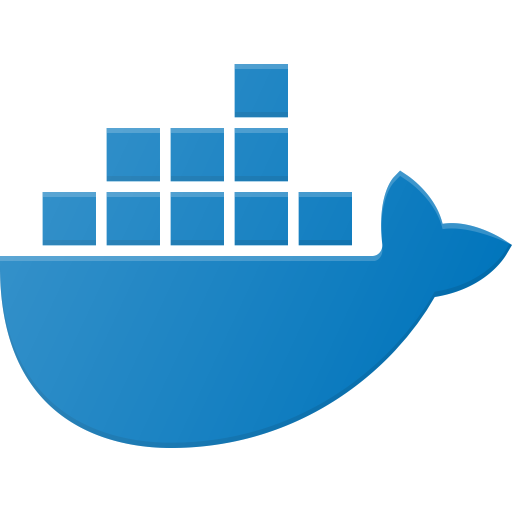
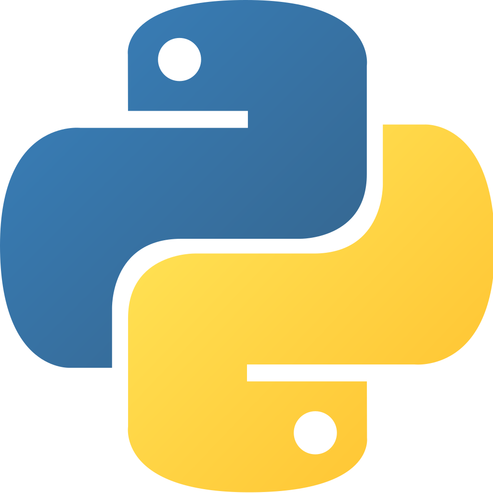

# DevOps 面试问题

<!--  -->

:information_source: &nbsp;本仓库包含各种 DevOps 相关主题的面试问题

:bar_chart: &nbsp;当前有 **413** 个问题


:warning: &nbsp;你不需要知道回答这个仓库的所有问题。 DevOps并不是知道一切:)

:page_facing_up: &nbsp;不同的面试官专注于不同的事情。 有些人将重点放在你的简历上，而另一些人可能将重点放在方案问题或特定的技术问题上。 在这个仓库，我尽力覆盖各种类型的DevOps问题，供你练习和测试你的知识

:pencil: &nbsp;你可以通过PR来添加更多问题和答案:)

****

<!-- ALL-TOPICS-LIST:START -->
<!-- prettier-ignore-start -->
<!-- markdownlint-disable -->
<center>
<table>
  <tr>
    <td align="center"><a href="#devops"><br /><b>DevOps</b></a><br /><sub><a href="#devops-beginner">初级</a></sub><br><sub><a href="#devops-advanced">高级</a></sub></td>
    <td align="center"><a href="#jenkins"><br /><b>Jenkins</b></a><br /><sub><a href="#jenkins-beginner">初级</a></sub><br><sub><a href="#jenkins-advanced">高级</a></sub></td>
    <td align="center"><a href="#git"><br /><b>Git</b></a><br /><sub><a href="#git-beginner">初级</a></sub><br><sub><a href="#git-advanced">高级</a></sub></td>
    <td align="center"><a href="#ansible"><br /><b>Ansible</b></a><br /><sub><a href="#ansible-beginner">初级</a></sub><br><sub><a href="#ansible-advanced">高级</a></sub></td>
    <td align="center"><a href="#Network"><br /><b>Network</b></a><br /><sub><a href="#network-beginner">初级</a></sub><br><sub><a href="#network-advanced">高级</a></sub></td>
    <td align="center"><a href="#linux"><br /><b>Linux</b></a><br /><sub><a href="#linux-beginner">初级</a></sub><br><sub><a href="#linux-advanced">高级</a></sub></td>
    <td align="center"><a href="#terraform"><br /><b>Terraform</b></a><br /><sub><a href="#terraform-beginner">初级</a></sub><br><sub><a href="#terraform-advanced">高级</a></sub></td>
    <td align="center"><a href="#docker"><br /><b>Docker</b></a><br /><sub><a href="#docker-beginner">初级</a></sub><br><sub><a href="#docker-advanced">高级</a></sub></td>
  </tr>
  <tr>
    <td align="center"><a href="#coding"><br /><b>Coding</b></a><br /><sub><a href="#coding-beginner">初级</a></sub><br><sub><a href="#coding-advanced">高级</a></sub></td>
    <td align="center"><a href="#python"><br /><b>Python</b></a><br /><sub><a href="#python-beginner">初级</a></sub><br><sub><a href="#python-advanced">高级</a></sub></td>
    <td align="center"><a href="#go"><br /><b>Go</b></a><br /><sub><a href="#go-beginner">初级</a></sub><br><sub></td>
    <td align="center"><a href="#shell-scripting"><br /><b>Shell Scripting</b></a><br /><sub><a href="#shell-scripting-beginner">初级</a></sub><br><sub><a href="#shell-scripting-advanced">高级</a></sub></td>
    <td align="center"><a href="#kubernetes"><br /><b>Kubernetes</b></a><br /><sub><a href="#kubernetes-beginner">初级</a></sub><br><sub></td>
    <td align="center"><a href="#prometheus"><br /><b>Prometheus</b></a><br /><sub><a href="#prometheus-beginner">初级</a></sub><br><sub><a href="#prometheus-advanced">高级</a></sub></td>
    <td align="center"><a href="#mongo"><br /><b>Mongo</b></a><br /><sub><a href="#mongo-beginner">初级</a></sub><br><sub></td>
    <td align="center"><a href="#sql"><br /><b>SQL</b></a><br /><sub><a href="#sql-beginner">初级</a></sub><br><sub><a href="#sql-advanced">高级</a></sub></td>
  </tr>
  <tr>
    <td align="center"><a href="#cloud"><br /><b>Cloud</b></a><br /><sub><a href="#cloud-beginner">初级</a></sub><br><sub></td>
    <td align="center"><a href="#aws"><br /><b>AWS</b></a><br /><sub><a href="#aws-beginner">初级</a></sub><br><sub></td>
    <td align="center"><a href="#azure"><br /><b>Azure</b></a><br /><sub><a href="#azure-beginner">初级</a></sub><br><sub></td>
    <td align="center"><a href="#gcp"><br /><b>Google Cloud Platform</b></a><br /><sub><a href="#gcp-beginner">初级</a></sub><br><sub></td>
    <td align="center"><a href="#openstack"><br /><b>OpenStack</b></a><br /><sub><a href="#openstack-beginner">初级</a></sub><br><sub><a href="#openstack-advanced">高级</a></sub></td>
    <td align="center"><a href="#security"><br /><b>Security</b></a><br /><sub><a href="#security-beginner">初级</a></sub><br><sub></td>
    <td align="center"><a href="#puppet"><br /><b>Puppet</b></a><br /><sub><a href="#puppet-beginner">初级</a></sub><br><sub><a href="#puppet-advanced">高级</a></sub></td>
    <td align="center"><a href="#openshift"><br /><b>OpenShift</b></a><br /><sub><a href="#openshift-beginner">初级</a></sub><br><sub></td>
  </tr>
</table>
</center>
<!-- markdownlint-enable -->
<!-- prettier-ignore-end -->
<!-- ALL-TOPICS-LIST:END -->


## DevOps

<a name="devops-beginner"></a>
#### 初级

<details>
<summary>什么是 DevOps? DevOps 帮助我们完成什么?</summary><br><b>
</b></details>

<details>
<summary>DevOps 的反模式是什么?</summary><br><b>
</b></details>

<details>
<summary>什么是持续集成?</summary><br><b>

开发人员经常将代码集成到共享仓库中的一种开发实践。 它的范围可以从每天或每周进行几次更改，到大规模在一个小时内进行几次更改。

验证每段代码（更改/补丁），以使更改可以安全地合并。 如今，使用自动构建来确保代码可以集成的测试更改是一种常见的做法。 它可以是一个运行在不同级别（单元，功能等）的多个测试的构建，也可以是所有或某些必须通过以将更改合并到存储库中的多个单独的构建。
</b></details>

<details>
<summary>什么是持续部署?</summary><br><b>
</b></details>

<details>
<summary>什么是持续交付?</summary><br><b>
</b></details>

<details>
<summary>你认为CI / CD的最佳做法是什么?</summary><br><b>
</b></details>

<details>
<summary>你将用于以下哪些系统和/或工具？：


  * CI/CD
  * 基础架构
  * 配置管理
  * 监控 & 报警
  * 日志
  * 代码审查
  * 代码覆盖率
  * 测试集</summary><br><b>
  * CI/CD - Jenkins, Circle CI, Travis
  * 基础架构 - Terraform, CloudFormation
  * 配置管理 - Ansible, Puppet, Chef
  * 监控 & 报警 - Prometheus, Nagios
  * 日志 - Logstash, Graylog, Fluentd
  * 代码审查 - Gerrit, Review Board
  * 代码覆盖率 - Cobertura, Clover, JaCoCo
  * 测试集 - Robot, Serenity, Gauge
</b></details>

<details>
<summary>你在选择工具/技术时是怎么考虑的?</summary><br><b>

你可以使用以下一项或全部：
   * 成熟与尖端
   * 社区规模
   * 体系结构方面-代理与无代理，主控与无主控等
</b></details>

<details>
<summary>解释可变基础架构与不变基础架构</summary><br><b>

在可变的基础架构原则中，更改将应用到现有基础架构之上并随着时间的推移而变化
基础架构建立了变化的历史。 Ansible，Puppet和Chef这些工具
遵循可变的基础架构原则。

在不变的基础架构原则中，每项更改实际上都是新的基础架构。 所以改变
到服务器将导致新服务器而不是更新服务器。 Terraform是
遵循不变的基础架构原则的一个例子。
</b></details>

<details>
<summary>你熟悉什么方式来交付软件?</summary><br><b>
  * 存档 - 将你所有的应用文件收集到一个存档中（例如tar），并将其交付给用户。
  * 打包 - 取决于操作系统，你可以使用OS软件包格式（例如，在RHEL / Fefodra中为RPM）来交付软件，并使用标准打包程序命令来安装，卸载和更新它
  * 映像 - VM或容器映像，其中包已包含在其中，以便成功运行。
</b></details>

<details>
<summary>什么是缓存? 缓存是怎么工作的? 为什么缓存很重要?</summary><br><b>
</b></details>

<details>
<summary>解释一下无状态和有状态</summary><br><b>
</b></details>

<details>
<summary>什么是HTTP及其工作方式?</summary><br><b>
</b></details>

<details>
<summary>描述一下设置某些类型的Web服务器的工作流程 (Apache, IIS, Tomact, ...)</summary><br><b>
</b></details>

<details>
<summary>解释一下监控. 它是什么? 为什么监控是重要的?</summary><br><b>
</b></details>

<details>
<summary>你熟悉那些监控方法?</summary><br><b>
</b></details>

<a name="devops-advanced"></a>
#### 高级

<details>
<summary>告诉我你是如何执行CI / CD资源的计划容量 (如服务器, 存储, 等等.)</summary><br><b>
</b></details>

<details>
<summary>你将如何为依赖于其他多个应用程序的应用程序构建/实现CD?</summary><br><b>
</b></details>

<details>
<summary>你如何衡量CI / CD的质量？ 有那些你正在使用的指标吗？</summary><br><b>
</b></details>

<details>
<summary>什么是配置漂移？ 它引起什么问题？</summary><br><b>

当配置和软件完全相同的服务器环境中的某个服务器上发生配置漂移
或服务器正在应用其他服务器无法获得的更新或配置，并且随着时间的推移，这些服务器将变为
略有不同。

这种情形可能会导致难以识别和重现的错误。
</b></details>

<details>
<summary>怎样处理配置漂移?</summary><br><b>
</b></details>

<details>
<summary>你是否有跨项目变更测试的经验？ (又名交叉依赖)</summary><br><b>

注意：交叉依赖是指你对单独的项目进行了两个或多个更改，并且你希望在相互构建中对其进行测试，而不是分别测试每个更改。
</b></details>

<details>
<summary>在哪种情况下，你希望使用SQL?</summary><br><b>
  * 同类数据，预计不会发生变化
  * ACID合规性很重要
</b></details>


## Jenkins

<a name="jenkins-beginner"></a>
#### 初级

<details>
<summary>什么是 Jenkins? 你用它来做什么?</summary><br><b>
</b></details>

<details>
<summary>相比其他的竞争者 jenkins 有什么优势? 你能把jenkins 和下面的系统做一个比较吗?:

  * Travis
  * Bamboo
  * Teamcity
  * CircleCI</summary><br><b>
</b></details>

<details>
<summary>解释以下:

  * Job
  * Build
  * Plugin
  * Slave
  * Executor</summary><br><b>
</b></details>

<details>
<summary> 你在 Jenkins 用过什么插件?</summary><br><b>
</b></details>

<details>
<summary>解释一下 CI/CD 你在 Jenkins 是怎么实现他们的 </summary><br><b>
</b></details>

<details>
<summary>有什么类型的工作？ 你使用了哪些类型，为什么？</summary><br><b>
</b></details>

<details>
<summary>你如何向用户报告构建结果？ 你熟悉什么那些方式？</summary><br><b>
</b></details>

<details>
<summary>每次有更改提交，你都需要运行单元测试。 详细描述管道的环境以及每个阶段将执行的操作</summary><br><b>
</b></details>

<details>
<summary>怎样保护 Jenkins?</summary><br><b>
</b></details>

<details>
<summary>你能描述一些 Jenkins 最佳实践吗?</summary><br><b>
</b></details>

<a name="jenkins-advanced"></a>
#### 高级

<details>
<summary>如何为一个特定的构建获取多个从属?</summary><br><b>
</b></details>

<details>
<summary>你的组织中有四个团队。 如何优先考虑每个团队的建设？ 例如，x团队的工作将始终在y团队之前运行</summary><br><b>
</b></details>

<details>
<summary>你有部署 Jenkins 插件的经验吗? 你能描述一下吗?</summary><br><b>
</b></details>

<details>
<summary>如果你要管理许多工作，你可能使用Jenkins UI。 你如何每周/每月管理数百个作业的创建和删除？</summary><br><b>
</b></details>

<details>
<summary>Jenkins 有那些限制?</summary><br><b>

  * 测试交叉依赖关系（来自多个项目的变更）
  * 从任何阶段开始构建（尽管cloudbees实现了称为检查点的东西）
</b></details>

<details>
<summary>你是如何实施从某个阶段而不是从最开始构建的选项？</summary><br><b>
</b></details>

<details>
<summary>你曾经写过 Jenkins 脚本吗? 如果有，有哪些? 分别是怎么样工作的？</summary><br><b>
</b></details>

## Cloud 

<a name="cloud-beginner"></a>
#### 初级

<details>
<summary>云计算的优势是什么？ 至少列出3个优势</summary><br><b>
</b></details>

<details>
<summary>他们分别是那种类型的云计算?</summary><br><b>

IAAS
PAAS
SAAS
</b></details>

<details>
<summary>解释一下以下云计算部署：

  * Public
  * Hybrid
  * Private</summary><br><b>
</b></details>


## AWS

<a name="aws-beginner"></a>
#### 初级

##### 全局基础设施

<details>
<summary>解释以下

  * 可用区
  * 区域
  * 边缘位置</summary><br><b>
</b>
<b>
AWS区域是遍布全球不同地理位置的数据中心，每个区域彼此完全独立。
在每个区域内，有多个隔离的位置，称为可用区。 多个可用区可确保其中之一发生故障时具有高可用性。

边缘位置基本上是内容传递网络，它缓存数据并确保较低的延迟和更快地传递给任何位置的用户。 他们位于世界主要城市。
</b>
</details>

##### S3
 
<details>
<summary>解释一下什么是S3，以及它用来干嘛</summary><br>
<b>
S3代表3 S（Simple Storage Service）。
S3是一种对象存储服务，它是快速，可伸缩和持久的。 S3使客户能够上传，下载或存储最大5 TB的文件或对象。 同时每个文件的最大大小为5 GB（如果大小超过5 GB，则分段上传）。
</b>
</details>

<details>
<summary>什么是存储桶?</summary><br><b>
S3存储桶是一种资源，类似于文件系统中的文件夹，并且允许存储由数据及其元数据组成的对象。
</b></details>

<details>
<summary>对还是错? 存储桶必须全局唯一</summary><br><b>
True
</b></details>

<details>
<summary>S3 中 包含哪些对象 ?
  * 另一种问法: 在对象上下文中解释键，值，版本ID和元数据</summary><br><b>
</b></details>

<details>
<summary>解释一下数据一致性</summary><br><b>
</b></details>

<details>
<summary>你可以在s3上托管动态网站吗？ 静态网站呢?</summary><br><b>
</b></details>

<details>
<summary>你在S3上下文中采取了哪些安全措施?</summary><br><b>
</b></details>

##### CloudFront

<details>
<summary>解释一下什么是CloudFront及其用途</summary><br><b>
</b></details>

<details>
<summary>解释以下
  * 域
  * 边缘位置
  * 分布</summary><br><b>
</b></details>

<details>
<summary>CDN用户可以使用哪些交付方式?</summary><br><b>
</b></details>

<details>
<summary>对还是错? 在TTL的生命周期内缓存对象</summary><br><b>
</b></details>


##### EC2

<details>
<summary>你创建了哪种类型的实例?</summary><br><b>
</b></details>

<details>
<summary>如何为给定的EC2实例增加RAM?</summary><br><b>

停止实例，使其实例类型与所需的RAM匹配，然后启动实例。
</b></details>

<details>
<summary>什么是 AMI?</summary><br><b>
</b></details>

<details>
<summary>EC2实例有多少个存储选项?</summary><br><b>
</b></details>

<details>
<summary>EC2实例停止或终止时会发生什么?</summary><br><b>
</b></details>

<details>
<summary>什么是安全组?</summary><br><b>
</b></details>


<details>
<summary>如何将实例迁移到另一个可用性区域?</summary><br><b>
</b></details>


<details>
<summary>什么是安全组?</summary><br><b>
</b></details>


<details>
<summary>什么是竞价型实例?</summary><br><b>
</b></details>
  

## 网络

<a name="network-beginner"></a>
#### 初级

<details>
<summary>什么是以太网?</summary><br><b>
</b></details>

<details>
<summary>什么是一个 MAC 地址? 它用来干嘛?</summary><br><b>
</b></details>

<details>
<summary>什么时候这个 MAC 地址会被用来使用?: ff:ff:ff:ff:ff:ff</summary><br><b>
</b></details>

<details>
<summary>什么是一个 IP 地址? 什么是子网?</summary><br><b>
</b></details>

<details>
<summary>解释一下 OSI 模型. 有那些层? 每层负责什么?</summary><br><b>


应用层：用户端（HTTP在这一层）
表示层：在应用程序层实体之间建立上下文（加密在这一层）
会话层：建立，管理和终止连接
传输层：将可变长度的数据序列从源传输到目标主机（TCP和UDP在这一层）
网络层：将数据报从一个网络传输到另一个网络（IP 层在这里）
数据链接层：提供两个直接连接的节点之间的链接（MAC在这一层）
物理层：数据连接的电气和物理规格（比特在这一一层）
</b></details>

<details>
<summary>你熟悉哪些传送方案?</summary><br><b>
单位广播：一对一通信，其中有一个发送方和一个接收方。

广播：向网络中的所有人发送消息。 地址ff：ff：ff：ff：ff：ff：ff用于广播。
            使用广播的两个常见协议是ARP和DHCP。

组播：向一组订户发送消息。 它可以是一对多或多对多。
</b></details>

<details>
<summary>什么是 CSMA/CD? 在现代以太网中有使用吗?</summary><br><b>

CSMA / CD代表载波侦听多路访问/冲突检测。
它的主要重点是管理对共享媒体/总线的访问，在该共享媒体/总线上，在给定的时间点只能传输一个主机。

CSMA / CD算法：

1. 在发送帧之前，它会检查其他主机是否已经在发送帧。
2. 如果没有人发送，它将开始发送帧。
3. 如果两个主机同时传输，则发生冲突。
4. 双方主机均停止发送帧，并向每个人发送“干扰信号”，通知每个人发生冲突
5. 他们正在等待随机时间，然后再次发送
6. 一旦每个主机等待一段随机时间，他们就会尝试再次发送帧
</b></details>

<details>
<summary>描述以下网络设备及其之间的区别：

  * 路由器
  * 交换机
  * 集线器</summary><br><b>
</b></details>

<details>
<summary>什么是 NAT?</summary><br><b>
</b></details>

<details>
<summary>TCP 和 UDP 两者之间有那些区别?</summary><br><b>
</b></details>

<details>
<summary>TCP 是怎样工作的? 什么是 3 次握手?</summary><br><b>
</b></details>

<details>
<summary>什么是 ARP? 它是怎么工作的?</summary><br><b>
</b></details>

<details>
<summary>什么是 TTL?</summary><br><b>
</b></details>

<details>
<summary>什么是DHCP? 它是怎么工作的?</summary><br><b>
</b></details>

<details>
<summary>什么是SSL 隧道? 它是怎么工作的?</summary><br><b>
</b></details>

<details>
<summary>什么是套接字? 在哪里可以看到系统中的套接字列表?</summary><br><b>
</b></details>

<details>
<summary>什么是IPv6? 如果我们拥有IPv4，为什么要考虑使用它?</summary><br><b>
</b></details>

<details>
<summary>什么是VLAN?</summary><br><b>
</b></details>

<details>
<summary>什么是MTU?</summary><br><b>
</b></details>

<details>
<summary>什么是SDN?</summary><br><b>
</b></details>

<details>
<summary>什么是ICMP? 它有什么用途?</summary><br><b>
</b></details>

<details>
<summary>什么是NAT? 它是怎么工作的?</summary><br><b>
</b></details>

<a name="network-advanced"></a>
#### 高级

<details>
<summary>解释一下生成树协议 (STP)</summary><br><b>
</b></details>

<details>
<summary>什么是链路聚合? 为什么使用它?</summary><br><b>
</b></details>

<details>
<summary>什么是非对称路由? 怎样处理它?</summary><br><b>
</b></details>

<details>
<summary>你熟悉哪些叠加（隧道）协议?</summary><br><b>
</b></details>

<details>
<summary>什么是GRE? 它是怎么工作的?</summary><br><b>
</b></details>

<details>
<summary>什么是VXLAN? 它是怎么工作的?</summary><br><b>
</b></details>

<details>
<summary>什么是SNAT?</summary><br><b>
</b></details>

<details>
<summary>解释一下 OSPF</summary><br><b>
</b></details>

<details>
<summary>解释一下 Spine & Leaf</summary><br><b>
</b></details>

<details>
<summary>使用海明码, 100111010001101 会编码成什么码?</summary><br><b>

00110011110100011101
</b></details>

## Linux

<a name="linux-beginner"></a>
#### 初级

<details>
<summary>你有那些 Linux 经验? 当你可以在多个操作系统上设置应用程序时，你希望在哪个操作系统上进行设置以及为什么?</summary><br><b>
</b></details>

<details>
<summary>解释以下每个命令的作用，并举例说明如何使用它

  * ls
  * rm 
  * rmdir (你能使用 <code>rm</code>完成同样的结果吗?)
  * grep
  * wc
  * curl
  * touch
  * man
  * nslookup or dig
  * df</summary><br><b>
</b></details>

<details>
<summary>运行命令 <code>df</code> 你会得到 "找不到命令". 可能出现什么问题以及如何修复它?</summary><br><b>
</b></details>

<details>
<summary>如何确保服务将在你选择的操作系统上启动?</summary><br><b>
</b></details>

<details>
<summary>你如何定期安排任务?</summary><br><b>

你能使用命令 <code>cron</code> 和 <code>at</code>.
对于cron，使用以下格式安排任务：

<minute> <hour> <day of month> <month> <day of week> <command to execute>

任务存储在cron文件中。
</b></details>

<details>
<summary>你过去是否安排了任务？ 什么样的任务？</summary><br><b>

通常，你将安排批处理作业。

</b></details>

##### 权限

<details>
<summary>怎样改变一个文件的权限?</summary><br><b>

使用 `chmod` 命令.

</b></details>

<details>
<summary>下面的权限意味着什么?:

  * 777
  * 644
  * 750</summary><br><b>

777 - 所有人有读和写和可执行权限（意味着你很懒）
644 - 拥有者有读和写的权限、其他人只有读权限
750 - 拥有者有所有权限, 组成员可以读和执行权限、其他人没有权限
</b></details>

<details>
<summary>解释一下什么是setgid, setuid 和 sticky bit</summary><br><b>
</b></details>

<details>
<summary>如何在不向其提供登录系统功能的情况下将新用户添加到系统?</summary><br><b>

  * adduser user_name --shell=/bin/false --no-create-home

</b></details>

<details>
<summary>在使用systemd的系统上，如何显示日志?</summary>

  * journalctl

</b></details>

##### 调试

<details>
<summary>你正在使用什么进行故障排除和调试 <b>网络</b> 问题?</summary><br><b>

<code>dstat -t</code> 非常适合辨别网络和磁盘问题。
<code>netstat -tnlaup</code> 可用于查看哪些进程在哪些端口上运行。
<code>lsof -i -P</code> 可以用于与netstat相同的目的。
<code>ngrep -d any metafilter</code> 用于将正则表达式与数据包的载荷相匹配。
<code>tcpdump</code> 用于捕获数据包
<code>wireshark</code> 与tcpdump相同的概念，但带有GUI（可选）。
</b></details>

<details>
<summary>你正在使用什么进行故障排除和调试 <b>磁盘 & 文件系统</b> 问题?</summary><br><b>

<code>dstat -t</code> 非常适合辨别网络和磁盘问题。
<code>opensnoop</code> 可以用来查看正在系统上打开哪些文件（实时）。
</b></details>

<details>
<summary>你正在使用什么进行故障排除和调试 <b>进程</b> 问题?</summary><br><b>

<code>strace</code> 非常适合了解你的程序的功能。 它打印你的程序执行的每个系统调用。
</b></details>

<details>
<summary>你正在使用什么来调试CPU相关问题?</summary><br><b>

<code>top</code> 显示每个进程消耗多少CPU占比
<code>perf</code> 是采样分析器的理想选择，通常来说，找出哪些CPU周期被“浪费”了
<code>flamegraphs</code> 非常适合CPU消耗可视化（http://www.brendangregg.com/flamegraphs.html）
</b></details>

<details>
<summary>你收到一个电话，说“我的系统运行缓慢” - 你将如何处理?</summary><br><b>

1. 使用<code>top</code>检查是否有任何资源消耗你的CPU或RAM。
2. 运行<code>dstat -t</code>来检查它是否与磁盘或网络有关。
3. 使用<code>iostat</code>检查 I/O 统计信息
</b></details>

<details>
<summary>什么是Linux内核模块以及如何加载新模块?</summary><br><b>
</b></details>

<details>
<summary>什么是KVM?</summary><br><b>
</b></details>

<details>
<summary>SSH和SSL之间的区别是什么?</summary><br><b>
</b></details>

<details>
<summary>SSH端口转发是什么?</summary><br><b>
</b></details>

<details>
<summary>解释重定向</summary><br><b>
</b></details>

<details>
<summary>什么是通配符？ 你能举一个使用它们的例子吗？</summary><br><b>
</b></details>

<details>
<summary>我们在以下每个命令中使用grep做什么？

  * <code>grep '[0-9]\{1,3\}\.[0-9]\{1,3\}\.[0-9]\{1,3\}\.[0-9]\{1,3\}' some_file</code>
  * <code>grep -E "error|failure" some_file</code>
  * <code>grep '[0-9]$' some_file</code>
</summary><br><b>

1. 一个 IP 地址
2. 单词 "error" 或 "failure"
3. 以数字结尾的行
</b></details>

<details>
<summary>告诉我你了解所有有关Linux启动过程的知识</summary><br><b>
</b></details>

<details>
<summary>什么是退出码? 你熟悉那些退出码?</summary><br><b>

退出码（或返回码）表示子进程返回其父进程的码。

0是退出码，表示成功，而大于1的码表示错误。
每个数字都有不同的含义，具体取决于应用程序的开发方式。

我认为这是一篇可以了解更多的好博客：https://shapeshed.com/unix-exit-codes
</b></details>

<details>
<summary>软链接和硬链接之间的区别是什么?</summary><br><b>

硬链接是使用相同inode的相同文件。
软链接是使用不同inode的另一个文件的快捷方式。

可以在不同的文件系统之间创建软链接，而硬链接只能在同一文件系统内创建。
</b></details>

<details>
<summary>什么是交换分区? 它用来做什么的?</summary><br><b>
</b></details>

<details>
<summary>你试图创建一个新文件，但显示“文件系统已满”。 你使用df检查是否有可用空间，你看到还有20％的空间。 可能是什么问题?</summary><br><b>
</b></details>

<details>
<summary>你对LVM有什么了解?</summary><br><b>
</b></details>

<details>
<summary>解释以下关于LVM:

  * PV
  * VG
  * LV</summary><br><b>
</b></details>

<details>
<summary>RAID用于什么用途？ 你能否解释RAID 0、1、5和10之间的区别？</summary><br><b>
</b></details>

<details>
<summary>什么是懒卸载?</summary><br><b>
</b></details>

<details>
<summary>修复以下命令：

  * sed "s/1/2/g' /tmp/myFile
  * find . -iname \*.yaml -exec sed -i "s/1/2/g" {} ;</summary><br><b>
</b></details>

<details>
<summary>解释以下每个路径中存储的内容以及是否有一些独特之处</summary><br><b>

  * /tmp
  * /var/log
  * /bin
  * /proc
  * /usr/local
</b></details>

<details>
<summary>你能在 /etc/services 找到什么 </summary><br><b>
</b></details>

<details>
<summary>什么是 chroot?</summary><br><b>
</b></details>

##### 进程

<details>
<summary>如何在后台运行进程以及为什么要优先运行?</summary><br><b>

你可以通过在命令末尾指定＆来实现。至于为什么，因为一些命令/过程会占用大量的时间来完成执行或永远运行
</b></details>

<details>
<summary>你如何查找特定进程占用的内存量?</summary><br><b>
</b></details>

<details>
<summary>运行“ kill”时使用什么信号 <process id>'?</summary><br><b>

默认信号为SIGTERM（15）。 该信号可以优雅地终止进程，这意味着它可以保存当前状态配置。
</b></details>

<details>
<summary>你熟悉哪些信号?</summary><br><b>

SIGTERM - 终止进程的默认信号
SIGHUP - 常用用法是重新加载配置
SIGKILL - 不能捕获或忽略的信号

运行 `kill -l` 查看所有可用的信号
</b></details>

<details>
<summary>什么是 trap?</summary><br><b>
</b></details>

<details>
<summary>当你按下Ctrl + C会发生什么?</summary><br><b>
</b></details>

<details>
<summary>什么是守护程序?</summary><br><b>
</b></details>

<details>
<summary>Linux中进程的可能状态是什么?</summary><br><b>

Running（运行态）
Waiting (等待态))
Stopped（暂停态）
Terminated（终止态）
Zombie（假死态）
</b></details>

<details>
<summary>什么是僵尸进程? 你是如何避免的?</summary>
</b></details>

<details>
<summary>什么是初始进程?</summary><br><b>
</b></details>

<details>
<summary>如何更改进程的优先级？ 你为什么想这么做?</summary><br><b>
</b></details>

<details>
<summary>你能解释一下网络进程/连接如何建立以及如何终止?</summary><br></b>
</b></details>

<details>
<summary>什么是系统调用？ 你熟悉哪些系统调用?</summary><br><b>
</b></details>

<details>
<summary><code>strace</code> 做什么的?</summary><br><b>
</b></details>

<details>
<summary>查找所有以“ .yml”结尾的文件，并替换每个文件中的2分之一的数字</summary><br><b>

ind /some_dir -iname \*.yml -print0 | xargs -0 -r sed -i "s/1/2/g"
</b></details>

<details>
<summary>如何查看系统有多少可用内存？ 如何检查每个进程的内存消耗?</summary><br><b>

你可以使用命令<code>top</code> 和 <code>free</code>
</b></details>

<details>
<summary>你如何将一个50行的文件拆分为两个25行的文件?</summary><br><b>

你可以使用 <code>split</code> 命令就像这样<code>split -l 25 some_file</code>
</b></details>

<details>
<summary>什么是文件描述符? 你熟悉那些文件描述符?</summary><br><b>
Kerberos
文件描述符，也称为文件处理程序，是一个唯一的编号，用于标识操作系统中的打开文件。

在 Linux (和 Unix) 前三个描述符是:
  * 0 - 输入的默认数据流
  * 1 - 输出的默认数据流
  * 2 - 与错误相关的输出的默认数据流

这有一篇好的文章关于这个主题的: https://www.computerhope.com/jargon/f/file-descriptor.htm
</b></details>

<details>
<summary>什么是 inode?</summary><br><b>

Linux中的每个文件（和目录）都有一个索引节点，即与文件相关的存储元数据信息的数据结构
，例如文件的大小，所有者，权限等。
</b></details>

<details>
<summary>如何列出活动的网络连接?</summary><br><b>
</b></details>

<details>
<summary>什么是NTP? 它是用来干什么的?</summary><br><b>
</b></details>

<details>
<summary>什么是SELiunx?</summary><br><b>
</b></details>

<details>
<summary>什么是Kerberos?</summary><br><b>
</b></details>

<details>
<summary>什么是nftables?</summary><br><b>
</b></details>

<details>
<summary>firewalld守护程序负责什么?</summary><br><b>
</b></details>

##### Network

<details>
<summary>什么是网络名称空间? 它用来干什么的?</summary><br><b>
</b></details>

<details>
<summary>你如何将Linux服务器变成路由器?</summary><br><b>
</b></details>

<details>
<summary>什么是路由表? 你是怎样查看它的?</summary><br><b>
</b></details>

<details>
<summary>什么是数据包嗅探器？ 你过去曾经使用过吗？ 如果是，你使用了哪些数据包嗅探器以及用于什么目的？</summary><br><b>
</b></details>

##### DNS

<details>
<summary>文件 <code>/etc/resolv.conf</code> 用来做什么的? 它包含那些内容?</summary><br><b>
</b></details>

<details>
<summary>什么是 "A record"?</summary><br><b>
</b></details>

<details>
<summary>什么是 PTR 记录?</summary><br><b>

A记录将域名指向IP地址，而PTR记录则相反，并将IP地址解析为域名。
</b></details>

<details>
<summary>什么是 MX 记录?</summary><br><b>
</b></details>

<details>
<summary>DNS是使用TCP还是UDP?</summary><br><b>
</b></details>

##### Packaging

<details>
<summary>你有打包经验吗? 你能解释一下它是怎么工作的</summary><br><b>
</b></details>

<details>
<summary>RPM: 解释特定格式（应包括什么内容）</summary><br><b>
</b></details>

<details>
<summary>你如何列出包内容?</summary><br><b>
</b></details>

<a name="linux-advanced"></a>
#### 高级

<details>
<summary>当你执行 <code>ls</code>发生了什么? 提供一个详细的答案</summary><br><b>
</b></details>

<details>
<summary>你能描述流程的创建方式吗?</summary><br><b>
</b></details>

<details>
<summary>以下块做什么?:

```
open("/my/file") = 5
read(5, "file content")
```
</summary><br><b>

系统调用正在读 <code>/my/file</code>文件 以及 5 是文件描述符数字.
</b></details>

<details>
<summary>进程和线程的区别是什么?</summary><br><b>
</b></details>

##### Network

<details>
<summary>当你运行 <code>ip a</code> 你看到一个设备叫做 'lo'. 它是什么以及为什么我们需要它?</summary><br><b>
</b></details>

<details>
<summary><code>traceroute</code> 命令做什么的? 它是怎么工作的?</summary><br><b>
</b></details>

<details>
<summary>什么是网络绑定? 你熟悉什么类型?</summary><br><b>
</b></details>

<details>
<summary>如何链接两个单独的网络名称空间，以便你可以从另一个命名空间ping一个命名空间上的接口?</summary><br><b>
</b></details>

<details>
<summary>什么是cgroup？ 在什么情况下你会使用它们？</summary><br><b>
</b></details>

<details>
<summary>如何创建一定大小的文件?</summary><br><b>

这有一些方式去做:
  
  * dd if=/dev/urandom of=new_file.txt bs=2MB count=1
  * truncate -s 2M new_file.txt
  * fallocate -l 2097152 new_file.txt
</b></details>

<details>
<summary>以下系统调用之间有什么区别?: exec(), fork(), vfork() and clone()?</summary><br><b>
</b></details>

<details>
<summary>解释流程描述符和任务结构</summary><br><b>
</b></details>

<details>
<summary>线程和进程之间有什么区别?</summary><br><b>
</b></details>

<details>
<summary>解释内核线程</summary><br><b>
</b></details>

<details>
<summary>使用套接字系统调用时会发生什么?</summary><br><b>

这有一篇好的文章关于这个主题的: https://ops.tips/blog/how-linux-creates-sockets
</b></details>


## Ansible

<a name="ansible-beginner"></a>
#### 初级

<details>
<summary>在Ansible中描述以下每个组件，包括它们之间的关系：

  * Task
  * Module
  * Play
  * Playbook
  * Role</summary><br><b>

任务 – 调用特定的Ansible模块
模块 – Ansible在你自己的主机或远程主机上执行的实际代码单元。 模块按类别（数据库，文件，网络等）编制索引，也称为任务插件。

Play – 在给定主机上执行的一个或多个任务

Playbook – 一个或多个Play。 每个Play可以在相同或不同的主机上执行

角色 – Ansible角色使你可以基于某些功能/服务对资源进行分组，以便可以轻松地重用它们。 在角色中，你具有变量，默认值，文件，模板，处理程序，任务和元数据的目录。 然后，你只需在剧本中指定角色即可使用该角色。
</b></details>

<details>
<summary>你熟悉哪些Ansible最佳做法? 至少列出 3 条</summary><br><b>
</b></details>

<details>
<summary>什么是清单文件以及如何定义一个?</summary><br><b>

清单文件定义了在其上执行Ansible任务的主机和/或主机组。

一个清单文件的例子

192.168.1.2
192.168.1.3
192.168.1.4

[web_servers]
190.40.2.20
190.40.2.21
190.40.2.22
</b></details>

<details>
<summary>什么是动态清单文件? 什么时候使用?</summary><br><br>

动态清单文件可跟踪来自一个或多个来源（例如云提供商和CMDB系统）的主机。

应该使用当使用外部源时，尤其是在环境中的主机正在自动启动和关闭，而无需跟踪这些源中的所有更改。
</b></details>

<details>
<summary>你只想在特定的次要操作系统上运行Ansible Play，你将如何实现?</summary><br><b>
</b></details>

<details>
<summary>写任务创建目录 ‘/tmp/new_directory’</summary><br><b>

```
- name: Create a new directory
  file:
      path: "/tmp/new_directory"
      state: directory
```
</b></details>

<details>
<summary>接下来的Play会有什么结果?</summary><br><b>

```
---
- name: Print information about my host
  hosts: localhost
  gather_facts: 'no'

  tasks:
      - name: Print hostname
        debug:
            msg: "It's me, {{ ansible_hostname }}"
```

提供完成的代码后，请始终进行彻底检查。 如果你的回答是“这将失败”，那么你是对的。 我们正在使用一个事实（ansible_hostname），
这是我们正在运行的主机上收集到的信息。 但是在这种情况下，我们禁用了事实收集（gather_facts：no），因此该变量将是未定义的，这将导致失败。
</b></details>

<details>
<summary>如果系统上存在文件 "/tmp/mario"，则编写 playbook 以在所有主机上安装 "zlib" 和 "vim" .</summary><br><b>

```
---
- hosts: all
  vars:
      mario_file: /tmp/mario
      package_list:
          - 'zlib'
          - 'vim'
  tasks:
      - name: Check for mario file
        stat:
            path: "{{ mario_file }}"
        register: mario_f

      - name: Install zlib and vim if mario file exists
        become: "yes"
        package:
            name: "{{ item }}"
            state: present
        with_items: "{{ package_list }}"
        when: mario_f.stat.exists
```

</b></details>

<details>
<summary>编写一个 playbook ，将文件 "/tmp/system_info" 部署到除控制器组之外的所有主机上，并具有以下内容：</summary><br><b>

  ```
  我是 <HOSTNAME> 我的操作系统是 <OS>
  ```

  替换 <HOSTNAME> 和  <OS> 以及正在运行的特定主机的实际数据 The playbook 部署system_info文件

```
---
- name: Deploy /tmp/system_info file
  hosts: all:!controllers
  tasks:
      - name: Deploy /tmp/system_info
        template:
            src: system_info.j2 
            dest: /tmp/system_info
```

The content of the system_info.j2 template

```
# {{ ansible_managed }}
I'm {{ ansible_hostname }} and my operating system is {{ ansible_distribution }}
```

</b></details>

<details>
<summary>变量 "whoami" 在以下位置定义：

  * 角色默认设置 -> whoami: mario
  * 额外的变量（使用 -e 传递给Ansible CLI的变量）-> whoami: toad
  * 托管事实 -> whoami: luigi
  * 广告资源变量（与哪种类型无关）-> whoami: browser

根据可变优先级，将使用哪个？
</summary><br><b>

正确的答案是 ‘toad’。

变量优先级是关于变量在不同位置设置时如何相互覆盖的。 如果你到目前为止还没有体验过，我相信你会在某个时候确定的，这使它成为一个有用的话题。

在我们的问题上下文中，顺序将是额外的var（始终覆盖任何其他变量）-> 主机事实 -> 库存变量 -> 角色默认值（最弱）。

完整的列表可以在上面的链接中找到。 另外，请注意Ansible 1.x和2.x之间存在显着差异。
</b></details>

<details>
<summary>对于以下每个语句，确定对还是错:

  * 模块是任务的集合
  * 最好使用shell或命令而不是特定的模块
  * 主机事实会覆盖 play 变量
  * 角色可能包括以下内容：var，meta 和 handler
  * 通过从外部来源提取信息来生成动态清单
  * 最佳做法是使用2个空格而不是4个缩进
  * 用来触发处理程序的“通知”
  * "hosts：all：！controllers"表示 "仅在控制器组主机上运行
</summary><br><b>
</b></details>

<details>
<summary>什么是ansible-pull?  与ansible-playbook相比有何不同?</summary><br><b>
</b></details>


<a name="ansible-advanced"></a>
#### 高级

<details>
<summary>什么是过滤器？ 你有写过滤器的经验吗?</summary><br><b>
</b></details>

<details>
<summary>编写过滤器来转化字符串大写</summary><br><b>

<code>
def cap(self, string):
    return string.capitalize()
</code>
</b></details>

<details>
<summary>你如何测试基于Ansible的项目?</summary><br><b>
</b></details>

<details>
<summary>什么是回调插件？ 使用回调插件可以实现什么？</summary><br><b>
</b></details>


## Terraform

<a name="terraform-beginner"></a>
#### 初级

<details>
<summary>你能解释一下什么是Terraform? 它是怎么工作的?</summary><br><b>

读 [这里](https://www.terraform.io/intro/index.html#what-is-terraform-)
</b></details>

<details>
<summary>什么使基础架构代码受益?</summary><br><b>

- 供应，修改和删除基础架构的全自动过程
- 基础结构的版本控制，可让你快速回滚到以前的版本
- 通过自动化测试和代码审查来验证基础架构的质量和稳定性
- 减少基础架构任务的重复性
</b></details>

<details>
<summary>为什么选择Terraform，而不选择其他技术？ （例如，Ansible，Puppet，CloufFormation)</summary><br><b>

常见的错误答案是说 Ansible 和 Puppet 是配置管理工具而 Terraform 是置备工具。 尽管从技术上讲是正确的，但这并不意味着 Ansible 和 Puppet 不能
用于配置基础结构。 另外，这根本没有解释为什么应该在 CloudFormation上 使用 Terraform。

Terraform与其他工具相比的优势：

  * 它遵循不变的基础架构方法，该方法具有避免配置随时间变化的优势
  * Ansible和Puppet具有更多的过程性（你提到了每个步骤要执行的操作），而Terraform是声明性的，因为你描述的是总体所需的状态，而不是每个资源或任务的状态。 你可以举一个在每个工具中从1台服务器转到2台服务器的示例。 在terrform中，你指定2，在Ansible和puppet中，你仅需配置1个其他服务器，因此你需要明确确保仅配置另一台服务器。
</b></details>

<details>
<summary>解释什么是"Terraform configuration"</summary><br><b>
</b></details>

<details>
<summary>解释以下每个:

  * Provider
  * Resource
  * Provisioner
  </summary>
</b></details>

<details>
<summary><code>terraform.tfstate</code> 文件用来做什么?</summary><br><b> 

它跟踪创建的资源的ID，以便Terraform知道它正在管理什么。
</b></details>

<details>
<summary>解释以下命令的作用:

  * <code>terraform init</code>
  * <code>terraform plan</code>
  * <code>terraform validate</code>
  * <code>terraform apply</code>
</summary><br><b>

<code>terraform init</code> 扫描你的代码以查明你正在使用哪些提供程序并下载它们。
<code>terraform plan</code> 可以让你在实际执行操作之前先查看terraform即将执行的操作。
<code>terraform apply</code> 将提供指定的.tf文件资源。
</b></details>

<details>
<summary>如何记下一个由外部源或者通过 <code>terraform apply</code>改变的变量?</summary><br><b>

你用这种方式: <code>variable “my_var” {}</code>
</b></details>

<details>
<summary>举例说明几种Terraform最佳实践</summary><br><b>
</b></details>

<details>
<summary>解释一下隐式和显式依赖项在Terraform中如何工作</summary><br><b>
</b></details>

<details>
<summary>什么是<code>local-exec</code> and <code>remote-exec</code> in the context of provisioners?</summary><br><b>
</b></details>

<details>
<summary>什么是"tainted 资源"?</summary><br><b>

这是成功创建的资源，但在配置期间失败。 Terraform将失败，并将该资源标记为“tainted”。
</b></details>

<details>
<summary><code>terraform taint</code> 做了什么?</summary><br><b>
</b></details>

<details>
<summary>Terraform支持哪些类型的变量?</summary><br><b>

Strimg
Integer
Map
List
</b></details>

<details>
<summary>什么是输出变量以及 <code>terraform output</code> 做了什么?</summary><br><b>
</b></details>

<details>
<summary>解释 Modules</summary>
</b></details>

<details>
<summary>什么是 Terraform Registry?</summary><br><b>
</b></details>

<a name="terraform-advanced"></a>
#### 高级

<details>
<summary>解释 "Remote State". 什么时候使用它以及如何使用它?</summary><br><b>
</b></details>

<details>
<summary>解释 "State Locking"</summary><br><b>
</b></details>

## Docker

<a name="docker-beginner"></a>

#### 初级

<details>
<summary>什么是Docker? 你用它做什么?</summary><br><b>
</b></details>

<details>
<summary>容器与VM有何不同?</summary><br><b>

容器和虚拟机之间的主要区别是容器使你可以虚拟化
操作系统上有多个工作负载，而对于VM，则将硬件虚拟化为
在多台计算机上运行各自的操作系统。
</b></details>

<details>
<summary>在哪种情况下，你将使用容器，而在哪种情况下，则更喜欢使用虚拟机?</summary><br><b>

在以下情况下，你应该选择虚拟机：
   * 你需要运行一个需要操作系统所有资源和功能的应用程序
   * 你需要完全隔离和安全

在以下情况下，你应该选择容器：
   * 你需要快速启动的轻量级解决方案
   * 运行单个应用程序的多个版本或实例
</b></details>

<details>
<summary>解释一下 Docker 架构</summary><br><b>
</b></details>

<details>
<summary>详细描述一下当运行`docker run hello-world`时背后发生了什么?</summary><br><b>

Docker CLI 将你的请求传递给Docker守护程序。
Docker 守护程序从 Docker Hub 下载映像
Docker 守护程序使用下载的映像创建一个新容器
Docker 守护程序将输出从容器重定向到 Docker CLI，后者将其重定向到标准输出
</b></details>

<details>
<summary>你怎样运行容器?</summary><br><b>
</b></details>

<details>
<summary>你熟悉那些与容器相关的最佳实践?</summary><br><b>
</b></details>

<details>
<summary>`docker commit` 干什么的? 什么时候需要使用它?</summary><br><b>
</b></details>

<details>
<summary>你如何将数据从一个容器转移到另一个容器?</summary><br><b>
</b></details>

<details>
<summary>容器存在时容器的数据会发生什么?</summary><br><b>
</b></details>

<details>
<summary>解释以下每个命令的作用

* docker run
* docker rm
* docker ps
* docker build
* docker commit</summary><br><b>
</b></details>

<details>
<summary>如何删除未运行的旧容器?</summary><br><b>
</b></details>

##### Dockerfile

<details>
<summary>什么是 Dockerfile</summary><br><b>
</b></details>

<details>
<summary>Dockerfile中 ADD 和 COPY 之间的区别是什么?</summary><br><b>
</b></details>

<details>
<summary>Dockerfile中 CMD 和 RUN 之间的区别是什么?</summary><br><b>
</b></details>

<details>
<summary>解释一下什么是 Docker compose 以及它用来做什么</summary><br><b>
</b></details>

<details>
<summary>Docker compose，Docker swarm 和 Kubernetes 有什么区别?</summary><br><b>
</b></details>

<details>
<summary>解释 Docker interlock</summary><br><b>
</b></details>

<details>
<summary>Docker Hub 和 Docker Cloud 之间的区别是什么?</summary><br><b>

Docker Hub是一个本地 Docker 注册表服务，可让你运行 pull 和 push 命令以从 Docker Hub 安装和部署 Docker映像。

Docker Cloud构建在Docker Hub之上，因此Docker Cloud提供了
与Docker Hub相比，你拥有更多的可选/功能。 一个例子是
群管理，这意味着你可以在Docker Cloud中创建新的群。
</b></details>

<details>
<summary>存储 Docker 镜像的位置在哪里?</summary><br><b>
</b></details>

<details>
<summary>解释一下镜像层</summary><br><b>
</b></details>

<a name="docker-advanced"></a>
#### 高级

<details>
<summary>你如何在Docker中管理持久性存储?</summary><br><b>
</b></details>

<details>
<summary>如何从容器内部连接到容器运行所在的主机的本地主机? </summary><br><b>
</b></details>

<details>
<summary>如何将文件从Docker容器复制到主机，反之亦然?</summary><br><b>
</b></details>

## Kubernetes

<a name="kubernetes-beginner"></a>
#### 初级

<details>
<summary>什么是Kubernetes?</summary><br><b>
</b></details>

<details>
<summary>为什么Docker还不够？ 为什么我们需要Kubernetes?</summary><br><b>
</b></details>

<details>
<summary>描述一下 Kuberenets 的架构</summary><br><b>
</b></details>

<details>
<summary>你是怎样监控你的 Kuberenets?</summary><br><b>
</b></details>

<details>
<summary>什么是kubectl? 你如何使用它?</summary><br><b>
</b></details>

<details>
<summary>什么是kubconfig? 你用它来做什么?</summary><br><b>
</b></details>

##### Users

<details>
<summary>你如何创建用户？ 用户信息的存储位置?</summary><br><b>
</b></details>

<details>
<summary>你知道如何不使用 adduser/useradd 命令创建新用户吗?</summary><br><b>
</b></details>

## Coding

<a name="coding-beginner"></a>
#### 初级

<details>
<summary>你更喜欢将哪种编程语言用于与DevOps相关的任务？ 为什么要专门这个?</summary><br><b>
</b></details>

<details>
<summary>什么是面向对象编程? 它为什么如此重要?</summary><br><b>
</b></details>

<details>
<summary>解释一下递归</summary><br><b>
</b></details>

<details>
<summary>解释一下什么是设计模式，并详细描述其中的三个</summary><br><b>
</b></details>

<details>
<summary>解释 big O 符号</summary><br><b>
</b></details>

##### Strings

<details>
<summary>用你想要的任何语言，编写一个函数来确定给定的字符串是否是回文串</summary><br><b>
</b></details>

<a name="coding-advanced"></a>
#### 高级

<details>
<summary>给定3种设计模式。 你知道如何以你选择的任何语言实现（提供示例）这些设计模式?</summary><br><b>
</b></details>

## Python

<a name="python-beginner"></a>
#### 初级

<details>
<summary>Python编程语言的一些特点是什么?</summary><br><b>

```
1. 这是一种由 Guido Van Rosum 于1991年创建的高级通用编程语言。
2. 语言被解释为CPython（用C语言编写）最常用/维护的实现。
3. 它是强类型的。 类型系统是鸭子类型和渐进式的。
4. Python注重可读性，并使用空格/缩进代替括号{}
5. python 包管理器称为PIP“ pip install packages”，具有超过200.000可用的软件包。
6. Python 附带安装了pip和一个大的标准库，为程序员提供了许多预置的解决方案。
7. 在python中，“一切”都是一个对象。

还有许多其他特性，但这是每个python程序员都应该知道的主要特性。

```
</b></details>

<details>
<summary>Python支持哪些数据类型，哪些是可变的？ 如何显示某个数据类型是可变的?</summary><br><b>

可变数据类型是:

    List
    Dictionary
    Set
    
不可变数据类型是:

    Numbers (int, float, ...)
    String
    Bool
    Tuple
    Frozenset

通常，你可以使用函数hash（）来检查对象的可变性，如果它是可哈希的，则是不可变的，尽管由于用户定义的对象可能是可变的且可哈希的，所以它并不总是按预期工作
</b></details>

<details>
<summary>什么是PEP8? 举例说明3种风格指南</summary><br><b>

PEP8是Python的编码约定和样式指南的列表

5 种样式指南:

1. 将所有行限制为最多79个字符。
2. 用两个空行包围顶级函数和类定义。
3. 制作一个元素的元组时使用逗号
4. 使用空格（而不是制表符）进行缩进
5. 每个缩进级别使用4个空格
</b></details>

<details>
<summary>解释一下继承以及如何在Python中使用它</summary><br><b>

```
根据定义，继承是一种机制，其中一个对象充当另一个对象的基础，并保留其所有对象属性。

因此，如果B类继承自A类，那么A类的每个特征也将在B类中提供。A类将是“基类”，B类将是“派生类”。
当你有几个共享相同功能的类时，这很方便。

基本语法:

class Base: pass

class Derived(Base): pass

A more forged example:

class Animal:
    def __init__(self):
        print("and I'm alive!")

    def eat(self, food):
        print("ñom ñom ñom", food)

class Human(Animal):
    def __init__(self, name):
        print('My name is ', name)
        super().__init__()

    def write_poem(self):
        print('Foo bar bar foo foo bar!')

class Dog(Animal):
    def __init__(self, name):
        print('My name is', name)
        super().__init__()

    def bark(self):
        print('woof woof')


michael = Human('Michael')
michael.eat('Spam')
michael.write_poem()

bruno = Dog('Bruno')
bruno.eat('bone')
bruno.bark()

>>> My name is  Michael
>>> and I'm alive!
>>> ñom ñom ñom Spam
>>> Foo bar bar foo foo bar!
>>> My name is Bruno
>>> and I'm alive!
>>> ñom ñom ñom bone
>>> woof woof

调用super（）会调用Base方法，因此，调用super().__init__() 就是调用 Animal__init__。

有一个称为 MetaClasses 的更高级的python功能，可帮助程序员直接控制类的创建。

```

</b></details>

<details>
<summary> 什么是一个错误? 什么是一个异常? 你熟悉哪些异常类型?</summary><br><b>

```

＃ 请注意，你通常不需要了解编译过程，而只需知道一切都来自哪里
＃ 并给出完整的答案表明你真正知道你在说什么。

通常，每个编译过程都有两个步骤。
    - 分析
    - 产生代码.
    
    Analysis can be broken into:
        1. 词法分析   (标记源代码)
        2. 语法分析 (如果语法正确，请检查标记是否合法，tldr)
           
               for i in 'foo'
                          ^
             SyntaxError: invalid syntax
        
        We missed ':'
        
        
        3. 语义分析  (上下文分析，合法语法仍然会触发错误，你是否尝试过除以0，哈希可变对象或使用未声明的函数?)
          
                 1/0
                ZeroDivisionError: division by zero
        
    这三个分析步骤负责错误处理。
    
    第二步将负责错误，主要是语法错误，这是最常见的错误。
    第三步将负责异常。
    
    如我们所见，异常是语义错误，有许多内置的异常：

        ImportError
        ValueError
        KeyError
        FileNotFoundError
        IndentationError
        IndexError
        ...
    
    你还可以具有用户定义的异常，这些异常必须直接或间接地从Exception类继承。

    常见例子:
        
    class DividedBy2Error(Exception):
        def __init__(self, message):
            self.message = message
    
    
    def division(dividend,divisor):
        if divisor == 2:
            raise DividedBy2Error('I dont want you to divide by 2!')
        return dividend / divisor
    
    division(100, 2)
    
    >>> __main__.DividedBy2Error: I dont want you to divide by 2!

```


</b></details>

<details>
<summary>解释 异常处理以及如何在Python中使用它</summary><br><b>
</b></details>

<details>
<summary>编写一个可以恢复字符串的程序（例如，pizza -> azzip）</summary><br><b>

```
最简单的是 str[::-1] 但不是效率最高的.

"经典" 方式:

foo = ''

for char in 'pizza':
    foo = char + foo

>> 'azzip'   

```

</b></details>

<details>
<summary>编写一个函数以返回一个或多个数字的和。 用户将决定要使用多少个数字</summary><br><b>

首先，你询问用户要使用的数字量。 使用while循环，每个循环将amount_of_numbers减1，直到amount_of_numbers变为0。 在while循环中，你想询问用户一个数字，该数字将在每次循环运行时添加一个变量。

```
def return_sum():
	amount_of_numbers = int(input("How many numbers? "))
	total_sum = 0
	while amount_of_numbers != 0:
		num = int(input("Input a number. "))
		total_sum += num
		amount_of_numbers -= 1
	return total_sum

```
</b></details>

<details>
<summary>如何将两个排序列表合并为一个排序列表?</summary><br><b>
</b></details>

<details>
<summary> _ 在 Python 中用于什么?</summary><br><b>

1. i18n中的翻译查询
2. 将最后执行的表达式或语句的结果保存在交互式解释器中。
3. 作为通用“可丢弃”变量名。 例如：x，y，_ = get_data（）（使用了x和y，但是由于我们不关心第三个变量，因此我们将其“扔掉了”）。
</b></details>

##### Algorithms Implementation

<details>
<summary>你可以在Python中实现“二分法搜索”吗?</summary><br><b>
</b></details>

##### Files

<details>
<summary>如何写文件?</summary><br><b>

```
with open('file.txt', 'w') as file:
    file.write("My insightful comment")
```
</b></details>

<details>
<summary>如何反转文件?</summary><br><b>
</b></details>

#### Regex

<details>
<summary>如何在Python中执行与正则表达式相关的操作？ （匹配模式，替代字符串等）</summary><br><b>

使用 re 模式
</b></details>

<details>
<summary>如何用 "blue" 替换字符串 "green"?</summary><br><b>
</b></details>

<details>
<summary>如何找到一个变量中的所有IP地址？ 如何在文件中找到它们?</summary><br><b>
</b></details>

<details>
<summary>按每个嵌套列表的第二项对列表列表进行排序</summary><br><b>

```
li = [[1, 4], [2, 1], [3, 9], [4, 2], [4, 5]]

sorted(x, key=lambda l: l[1])
```
</b></details>

<details>
<summary>你可以编写一个函数来打印给定目录中的所有文件吗？ 包括子目录</summary><br><b>
</b></details>

<details>
<summary>你有下面的列表: <code>[{'name': 'Mario', 'food': ['mushrooms', 'goombas']}, {'name': 'Luigi', 'food': ['mushrooms', 'turtles']}]</code>
  获取所有的食物类型，最后输出: {'mushrooms', 'goombas', 'turtles'}</summary><br><b>

```
brothers_menu =  \
[{'name': 'Mario', 'food': ['mushrooms', 'goombas']}, {'name': 'Luigi', 'food': ['mushrooms', 'turtles']}]

# "经典" 方式
def get_food(brothers_menu) -> set:
    temp = []

    for brother in brothers_menu:
        for food in brother['food']:
            temp.append(food)

    return set(temp)

# 一直先行方式 (Using list comprehension)
set([food for bro in x for food in bro['food']])
```

</b></details>

<details>
<summary>什么是List 加强？ 它比典型的循环更好吗？ 为什么？ 你能示范如何使用它吗?</summary><br><b>
</b></details>

<details>
<summary>怎样反转 string?</summary><br><b>

最简短的方式是: <code>my_string[::-1]</code> 但是这不是效率最高的. <br>
经典方式是:
```
def reverse_string(string):
    temp = ""
    for char in string:
        temp =  char + temp
    return temp
```
</b></details>

<details>
<summary>如何按值对字典排序?</summary><br><b>
</b></details>

<details>
<summary>如何按键对字典排序?</summary><br><b>
</b></details>

<details>
<summary>解释数据序列化以及如何使用Python执行</summary><br><b>
</b></details>

<details>
<summary>你如何在Python中处理参数解析?</summary><br><b>
</b></details>

<details>
<summary>解释什么是GIL</summary><br><b>
</b></details>

<details>
<summary>什么是迭代器? 为什么使用迭代器?</summary><br><b>
</b></details>

<details>
<summary>解释以下方法的类型以及如何使用它们:

  * Static method
  * Class method
  * instance method</summary><br><b>
</b></details>

<details>
<summary>怎样反转 list?</summary><br><b>
</b></details>

<details>
<summary>空的 <code>return</code> 返回什么?</summary><br><b>
</b></details>

##### Time Complexity

<details>
<summary>描述操作的时间复杂度<code>access</code>, <code>search</code> <code>insert</code> and <code>remove</code> 下面的数据结构:</summary><br><b>

  * Stack
  * Queue
  * Linked List
  * Binary Search Tree
</b></details>

<details>
<summary>以下算法的最好，最差和平均情况的复杂度是什么?:

  * Quicksort
  * Mergesort
  * Bucket Sort
  * Radix Sort
  </summary>
</b></details>

<a name="python-advanced"></a>
#### 高级

<details>
<summary>解释什么是装饰器</summary><br><b>
</b></details>

<details>
<summary>你能展示如何编写和使用装饰器吗?</summary><br><b>
</b></details>

<details>
<summary>编写脚本来确定给定端口上是否可以访问给定主机</summary><br><b>
</b></details>

<details>
<summary>这个查询熟悉数据类吗？ 你能解释一下他们是干什么用的吗?</summary><br><b>
</b></details>

<details>
<summary>解释一下上下文管理</summary><br><b>
</b></details>

<details>
<summary>解释一下缓冲协议</summary><br><b>
</b></details>

<details>
<summary>解释一下描述符</summary><br><b>
</b></details>

<details>
<summary>你有抓取网络（爬虫）的经验吗？ 你能描述一下你用过什么以及用什么?</summary><br><b>
</b></details>

<details>
<summary>你可以在Python中实现链接链表吗?</summary><br><b>
</b></details>

<details>
<summary>你已经创建了一个网页，用户可以在其中上传文档。 但是，根据文档大小，读取上传文件的功能会运行很长时间，并且用户必须等待读取操作完成才能继续使用该网站。 你怎么能解决这个问题?</summary><br><b>
</b></details>

## Prometheus

<a name="prometheus-beginner"></a>
#### 初级

<details>
<summary>什么是Prometheus? Prometheus的主要特点是什么?</summary><br><b>
</b></details>

<details>
<summary>描述 Prometheus 架构和组件</summary><br><b>
</b></details>

<details>
<summary>你能否将 Prometheus 与其他解决方案（例如InfluxDB）进行比较?</summary><br><b>
</b></details>

<details>
<summary>什么是an Alert?</summary><br><b>
</b></details>

<details>
<summary>描述以下Prometheus组件:

  * Prometheus server
  * Push Gateway
  * Alert Manager</summary><br><b>

负责抓取存储数据的Prometheus服务器推送网关用于短期作业警报管理负责警报 ;）
</b></details>

<details>
<summary>什么是一个实例? 什么是一个作业?</summary><br><b>
</b></details>

<details>
<summary>Prometheus支持哪些核心指标类型?</summary><br><b>
</b></details>

<details>
<summary>什么是一个 exporter? 它用来做什么?</summary><br><b>
</b></details>

<details>
<summary>你熟悉哪些Prometheus最佳做法？ 至少命名三个</summary><br><b>
</b></details>

<details>
<summary>如何在给定时间内获得总请求?</summary><br><b>
</b></details>

<a name="prometheus-advanced"></a>
#### 高级

<details>
<summary>你如何加入两个指标?</summary><br><b>
</b></details>

<details>
<summary>如何编写返回标签值的查询?</summary><br><b>
</b></details>

<details>
<summary>如何将cpu_user_seconds转换为cpu使用率（百分比）?</summary><br><b>
</b></details>

## Git

<a name="git-beginner"></a>
#### 初级

<details>
<summary><code>git pull</code> 和 <code>git fetch</code>的区别是什么?</summary><br><b>

简单来说, git pull = git fetch + git merge

当你运行git pull时，它会从远程或中央获取所有更改
存储库，并将其附加到本地存储库中的相应分支。

git fetch从远程存储库获取所有更改，将更改存储在
本地存储库中的单独分支
</b></details>

<details>
<summary>解释以下: <code>git 目录</code>, <code>工作目录</code> 和 <code>暂存区</code></summary><br><b>

Git目录是Git存储项目的元数据和对象数据库的地方。 这是Git最重要的部分，当你从另一台计算机克隆存储库时，它就是复制的。

工作目录是项目一个版本的单个签出。 这些文件将从Git目录中的压缩数据库中拉出，并放置在磁盘上供你使用或修改。

暂存区是一个简单文件，通常包含在你的Git目录中，用于存储有关下一次提交的内容的信息。 有时称为索引，但将其称为暂存区已成为标准。

答案来自 [git-scm.com](https://git-scm.com/book/en/v1/Getting-Started-Git-Basics#_the_three_states)
</b></details>

<details>
<summary>怎么解决 git merge 冲突?</summary><br><b>

<p>
首先，打开有冲突的文件，然后确定有什么冲突。
接下来，根据你的公司或团队接受的是什么，你可以与自己的
同事解决冲突或自行解决
解决冲突后，使用 git add <file_name> 添加文件。
最后，运行`git rebase --continue`。
</p>
</b></details>

<details>
<summary><code>git reset</code> 和 <code>git revert</code>区别是什么?</summary><br><b>

<p>

`git revert` 创建一个新的提交，撤消上一次提交的更改。

`git reset` 根据使用情况，可以修改索引或更改分支头当前指向的提交。
</p>
</b></details>

<details>
<summary>你想将提交移至顶部。 你将如何实现?</summary><br><b>

使用 <code>git rebase></code> 命令
</b></details>

<details>
<summary>那种情形你会使用 <code>git rebase</code>?</summary><br><b>
</b></details>

<details>
<summary>你熟悉哪些合并策略?</summary><br><b>

提及两个或三个就足够了，最好提到“递归”作为默认值。

recursive
resolve
ours
theirs

这篇文章解释是最好的: https://git-scm.com/docs/merge-strategies
</b></details>

<details>
<summary>在提交更改之前，如何查看已完成的更改?</summary><br><b>

<code>git diff</code>
</b></details>

<details>
<summary>如何将特定文件还原为先前的提交?</summary><br><b>

```
git checkout HEAD~1 -- /path/of/the/file
```
</b></details>


<a name="git-advanced"></a>
#### 高级

<details>
<summary>解释 Git octopus merge</summary><br><b>

也许不错，它是：

  * 对于合并多个分支的情况（以及此类用例的默认情况）非常有用
  * 主要用于将主题分支捆绑在一起

有一篇文章关于 Octopus merge: http://www.freblogg.com/2016/12/git-octopus-merge.html
</b></details>

## Go

<a name="go-beginner"></a>
#### 初级

<details>
<summary>Go编程语言有哪些特点?</summary><br><b>

  * 强类型和静态类型 - 变量的类型不能随时间更改，必须在编译时进行定义
  * 简单
  * 快速编译时间
  * 内置并发
  * 垃圾回收
  * 平台无关
  * 编译为独立的二进制文件 - 你运行应用程序所需的所有内容都将被编译为一个二进制文件。 对于运行时的版本管理非常有用。

Go 而且有一个很好的社区.
</b></details>

<details>
<summary><code>var x int = 2</code> 和 <code>x := 2</code>区别是什么?</summary><br><b>

结果相同，变量值为2。

with <code>var x int = 2</code> we are setting the variable type to integer while with <code>x := 2</code> we are letting Go figure out by itself the type.
</b></details>

<details>
<summary>对还是错? 在Go中，我们可以重新声明变量，并且一旦声明就必须使用它.</summary>

错. 我们不能重新声明变量，必须使用声明的变量。
</b></details>

<details>
<summary>你使用了哪些Go库?</summary><br><b>

应该根据你的使用情况回答此问题，一些示例是：
  * fmt - formatted I/O
</b></details>

<details>
<summary>下面代码块有什么问题? 怎么解决?

```go
func main() {
    var x float32 = 13.5
    var y int
    y = x
}
```
</summary><br><b>
</b></details>

<details>
<summary>下面的代码块尝试将整数101转换为字符串，但相反，我们得到“ e”。 这是为什么？ 怎么解决?

```go
package main

import "fmt"

func main() {
    var x int = 101
    var y string
    y = string(x)
    fmt.Println(y)
}
```
</summary><br><b>

它看起来在101处设置了什么unicode值，并将其用于将整数转换为字符串。
如果要获取“ 101”，则应使用“ strconv” 软件包，然后替换 <code>y = string(x)</code> with <code>y = strconv.Itoa(x)</code>
</b></details>

<details>
<summary>以下代码块什么是错的?:

```
package main

func main() {
    var x = 2
    var y = 3
    const someConst = x + y
}
```
</summary><br><b>
</b></details>

<details>
<summary>以下代码块的输出是什么？:

```go   
package main

import "fmt"

const (
	x = iota
	y = iota
)
const z = iota

func main() {
	fmt.Printf("%v\n", x)
	fmt.Printf("%v\n", y)
	fmt.Printf("%v\n", z)
}
```
</summary><br><b>
</b></details>

<details>
<summary> _ 在 Go 中的用途是什么?</summary><br><b>
</b></details>

<details>
<summary>以下代码块的输出是什么？:

```go
package main

import "fmt"

const (
	_ = iota + 3
	x
)

func main() {
	fmt.Printf("%v\n", x)
}
```
</summary><br><b>
</b></details>

## Mongo

<a name="mongo-beginner"></a>
#### 初级

<details>
<summary>MongoDB有什么优势？ 换句话说，为什么选择 MongoDB 而不选择 NoSQL 的其他实现?</summary><br><b>
</b></details>

<details>
<summary>SQL和NoSQL之间的区别是什么?</summary><br><b>

主要区别在于SQL数据库是结构化的（数据以带有行和列的表格-像是Excel电子表格表格），而NoSQL是
非结构化的，并且数据存储会根据NoSQL DB的设置方式而有所不同，例如
作为键值对，面向文档等
</b></details>

<details>
<summary>在哪种情况下，这个查询希望使用 NoSQL/Mongo 而不是SQL?</summary><br><b>

  * 经常变化的异构数据
  * 数据一致性和完整性不是重中之重
  * 最好，如果数据库需要快速扩展
</b></details>

<details>
<summary>什么是一个文档? 什么是一个集合?</summary><br><b>
</b></details>

<details>
<summary>什么是一个聚合?</summary><br><b>
</b></details>

<details>
<summary>那个更好? 嵌入文档还是引用?</summary><br><b>
</b></details>

##### Queries

<details>
<summary>解释这个查询: <code>db.books.find({"name": /abc/})</code></summary><br><b>
</b></details>

<details>
<summary>解释这个查询: <code>db.books.find().sort({x:1})</code></summary><br><b>
</b></details>

## OpenShift

<a name="openshift-beginner"></a>
#### 初级

<details>
<summary>什么是OpenShift? 你用过吗？ 如果有，是怎样使用的？</summary><br><b>
</b></details>

<details>
<summary>你能解释一下 OpenShift 和 Kubernetes 之间的区别吗?</summary><br><b>
</b></details>

<details>
<summary>定义 Pods 以及解释什么是有状态的 pods</summary><br><b>
</b></details>

<details>
<summary>你熟悉哪些类型的构建策略?</summary><br><b>
</b></details>

<details>
<summary>解释标签是什么以及它们的用途</summary><br><b>
</b></details>

<details>
<summary>解释什么是注释以及它们与标签的区别</summary><br><b>
</b></details>

<details>
<summary>解释什么是Downward API</summary><br><b>
</b></details>

## Shell 脚本

<a name="shell-scripting-beginner"></a>
#### 初级

<details>
<summary>告诉我你使用Shell脚本的经验</summary><br><b>
</b></details>

<details>
<summary>脚本中的这一行是什么意思?: <code>#!/bin/bash</code></summary><br><b>
</b></details>

<details>
<summary>你倾向于在编写的每个脚本中包含什么?</summary><br><b>
</b></details>

<details>
<summary>对还是错?: 当某个命令行失败时，默认情况下，该脚本将退出并且不会继续运行</summary><br><b>

取决于所使用的语言和设置，例如在Bash中，默认情况下，脚本将继续运行。
</b></details>

<details>
<summary>今天，我们拥有Ansible之类的工具和技术。 为什么还会有人使用Shell脚本?</summary><br><b>
</b></details>

<details>
<summary>说出下面每个命令的结果是什么：

  * <code>echo $0</code>
  * <code>echo $?</code>
  * <code>echo $$</code>
  * <code>echo $@</code>
  * <code>echo $#</code></summary><br><b>
</b></details>

<details>
<summary>你如何调试Shell脚本?</summary><br><b>
</b></details>

<details>
<summary>如何在Shell脚本中从用户获得输入?</summary><br><b>
</b></details>

<details>
<summary>解释一下条件语句以及如何使用它们</summary><br><b>
</b></details>

<details>
<summary>什么是循环? 你熟悉哪些类型的循环?</summary><br><b>
</b></details>

<details>
<summary>解释 <code>continue</code> 和 <code>break</code>. 你什么时候使用它们?</summary><br><b>
</b></details>

<details>
<summary>如何将命令的输出存储在变量中?</summary><br><b>
</b></details>

<details>
<summary>你如何检查可变长度?</summary><br><b>
</b></details>

<details>
<summary>单引号和双引号之间的区别是什么?</summary><br><b>
</b></details>

<a name="shell-scripting-advanced"></a>
#### 高级

<details>
<summary>解释以下代码:

<code>:(){ :|:& };:</code>

</summary><br><b>
</b></details>

<details>
<summary>你能举一些Bash最佳实践的例子吗?</summary><br><b>
</b></details>

<details>
<summary>什么是三元运算符？ 你如何在bash中使用它?</summary><br><b>

使用 if/else 的一种简短方法。 一个例子:

[[ $a = 1 ]] && b="yes, equal" || b="nope"
</b></details>

## SQL

<a name="sql-beginner"></a>
#### 初级

<details>
<summary>SQL 代表什么?</summary><br><b>

Structured Query Language（结构化查询语言）

</b></details>

<details>
<summary>SQL 和 NoSQL 有那些不同</summary><br><b>

主要区别在于SQL数据库是结构化的（数据以
带有行和列的表格-像是Excel电子表格表格），而NoSQL是
非结构化的，并且数据存储会根据NoSQL DB的设置方式而有所不同，例如
作为键值对，面向文档等
</b></details>

<details>
<summary>数据库符合ACID的含义是什么?</summary><br>

ACID代表原子性，一致性，隔离性，耐久性。为了符合ACID，数据库必须满足四个标准中的每个标准

**原子性** - 数据库发生更改时，它整体上应该成功或失败。

例如，如果你要更新表，则更新应完全执行。如果仅部分执行，则
更新被视为整体失败，并且不会通过-数据库将恢复为原始状态
更新发生之前的状态。还应该提到的是，原子性确保每个
事务以其自身的独立“单元”完成 - 如果任何部分失败，则整个语句都会失败。

**一致性** - 对数据库所做的任何更改都应将其从一种有效状态转变为另一种有效状态。

例如，如果你对数据库进行了更改，则不应破坏它。通过检查和约束来保持一致性
在数据库中预定义。例如，如果你尝试将列的值从字符串更改为int
应该是数据类型字符串，一致的数据库将不允许该事务通过，并且该操作将
不执行

**隔离** - 确保数据库不会被“更新中”-因为多个事务正在运行
同时，它仍应保持数据库处于与按顺序运行事务相同的状态。

例如，假设有20个人同时对数据库进行了更改。在
当你执行查询时，已完成20项更改中的15项，但仍有5项正在进行中。你应该
仅看到已完成的15个更改 - 随着更改的进行，你将看不到数据库的更新中。

**耐用性** - 更改一旦提交，无论发生什么情况都将保持提交状态
（电源故障，系统崩溃等）。这意味着所有已完成的交易
必须记录在非挥发性内存中。

请注意，SQL本质上符合ACID。某些NoSQL DB可能符合ACID，具体取决于
它们的工作方式，但是根据一般经验，NoSQL DB不被视为符合ACID
</details>

<details>
<summary>什么时候最好使用SQL/NoSQL？</summary><br><b>

SQL - 当数据完整性至关重要时，最适合使用。 由于符合ACID，SQL通常由许多业务实现特别是金融领域。

NoSQL - 非常适合你需要快速扩展的情况。 请记住NoSQL是为Web应用程序设计的
，如果你需要快速将相同信息散布到多台服务器，它将会很好的用
此外，由于 NoSQL 不遵守具有列和行结构的严格表
关系数据库所要求的，你可以将不同的数据类型存储在一起。
</b></details>

<details>
<summary>什么是笛卡尔积?</summary><br>

笛卡尔积是指第一个表中的所有行都与第二个表中的所有行连接在一起时的结果
表。 这可以通过不定义要联接的键来隐式完成，也可以通过以下方式显式地完成：
在两个表上调用CROSS JOIN，如下所示：

Select * from customers **CROSS JOIN** orders;

请注意，笛卡尔积也可能是一件坏事 - 执行联接时
在两个都没有唯一键的表上，这可能会导致返回信息
是不正确的。
</details>

##### SQL Specific Questions

对于这些问题，我们将使用下面显示的“客户和订单”表：

**Customers**

Customer_ID | Customer_Name | Items_in_cart | Cash_spent_to_Date
------------ | ------------- | ------------- | -------------
100204 | John Smith | 0 | 20.00
100205 | Jane Smith | 3 | 40.00
100206 | Bobby Frank | 1 | 100.20

**ORDERS**

Customer_ID | Order_ID | Item | Price | Date_sold
------------ | ------------- | ------------- | ------------- | -------------
100206 | A123 | Rubber Ducky | 2.20 | 2019-09-18
100206 | A123 | Bubble Bath | 8.00 | 2019-09-18
100206 | Q987 | 80-Pack TP | 90.00 | 2019-09-20
100205 | Z001 | Cat Food - Tuna Fish | 10.00 | 2019-08-05
100205 | Z001 | Cat Food - Chicken | 10.00 | 2019-08-05
100205 | Z001 | Cat Food - Beef | 10.00 | 2019-08-05
100205 | Z001 | Cat Food - Kitty quesadilla | 10.00 | 2019-08-05
100204 | X202 | Coffee | 20.00 | 2019-04-29

<details>
<summary>我如何从该表中选择所有字段?</summary><br><b>

Select * <br>
From Customers;
</b></details>

<details>
<summary>约翰的购物车中有几件？</summary><br><b>

Select Items_in_cart <br>
From Customers <br>
Where Customer_Name = "John Smith";
</b></details>

<details>
<summary>所有客户花费的所有现金的总和是多少?</summary><br><b>

Select SUM(Cash_spent_to_Date) as SUM_CASH <br>
From Customers;
</b></details>

<details>
<summary>在购物车有商品的有多少人?</summary><br><b>

Select count(1) as Number_of_People_w_items <br>
From Customers <br>
where Items_in_cart > 0;
</b></details>

<details>
<summary>你如何将客户表加入订单表?</summary><br><b>

你可以加入他们的唯一键。 在这种情况下，唯一键为中的Customer_ID
客户表和订单表
</b></details>

<details>
<summary>你如何显示哪些客户订购了哪些物品?</summary><br><b>

Select c.Customer_Name, o.Item <br>
From Customers c <br>
Left Join Orders o <br>
  On c.Customer_ID = o.Customer_ID;

</b></details>

<a name="sql-advanced"></a>
#### 高级

<details>
<summary>使用with语句，你将如何显示谁订购了猫粮以及花费的总金额?</summary><br><b>

with cat_food as ( <br>
Select Customer_ID, SUM(Price) as TOTAL_PRICE <br>
From Orders <br>
Where Item like "%Cat Food%" <br>
Group by Customer_ID <br>
) <br>
Select Customer_name, TOTAL_PRICE <br>
From Customers c <br>
Inner JOIN cat_food f <br>
  ON c.Customer_ID = f.Customer_ID <br>
where c.Customer_ID in (Select Customer_ID from cat_food);

尽管这是一个简单的声明，但“ with”子句在
在连接到另一个表之前，需要在一个表上运行一个复杂的查询。 用语句很好，
因为你在运行查询时会创建一个伪临时文件，而不是创建一个新表。

目前尚无法获得所有猫粮的总和，因此我们使用了with语句来创建
伪表检索每个客户花费的价格总和，然后正常加入该表。

</b></details>

## Azure

<a name="azure-beginner"></a>
#### 初级

<details>
<summary>解释一下可用性集和可用性区域</summary><br><b>
</b></details>

<details>
<summary>什么是Azure资源管理器？ 你可以描述ARM模板的格式吗？</summary><br><b>
</b></details>

<details>
<summary>解释一下Azure托管磁盘</summary><br><b>
</b></details>

## GCP

<a name="gcp-beginner"></a>
#### 初级

<details>
<summary>GCP的主要组件和服务是什么?</summary><br><b>
</b></details>

<details>
<summary>你熟悉哪些GCP管理工具?</summary><br><b>
</b></details>

<details>
<summary>告诉我对GCP联网了解多少</summary><br><b>
</b></details>

## OpenStack

<a name="openstack-beginner"></a>
#### 初级

<details>
<summary>告诉我你使用OpenStack的经验。 你认为OpenStack的优缺点是什么?</summary><br><b>
</b></details>

<details>
<summary>你熟悉OpenStack的哪些组件/项目?</summary><br><b>
</b></details>

<details>
<summary>你能告诉我以下每个组件/项目负责什么吗?:

  * Nova
  * Neutron
  * Cinder
  * Glance
  * Keystone</summary><br><b>
</b></details>

<details>
<summary>详细描述如何使用可以从云外部访问的IP来启动实例</summary><br><b>
</b></details>

<details>
<summary>你收到客户打来的电话，说：“我可以ping我的实例，但不能连接（ssh）它”。 可能是什么问题？</summary><br><b>
</b></details>

<details>
<summary>OpenStack支持哪些类型的网络？</summary><br><b>
</b></details>

<details>
<summary>你如何调试OpenStack存储问题？ （工具，日志等）</summary><br><b>
</b></details>

<details>
<summary>你如何调试OpenStack计算问题？ （工具，日志等）</summary><br><b>
</b></details>

<details>
<summary>你熟悉 TripleO吗? 它有那些优点?</summary><br><b>
</b></details>

##### 网络

<details>
<summary>什么是供应商网络?</summary><br><b>
</b></details>

<details>
<summary>L2和L3中存在哪些组件和服务?</summary><br><b>
</b></details>

<details>
<summary>什么是ML2 plug-in? 解释一下它的架构</summary><br><b>
</b></details>

<details>
<summary>什么是L2 代理? 它是怎么工作的以及它主要负责什么?</summary><br><b>
</b></details>

<details>
<summary>什么是L3 代理? 它是怎么工作的以及它主要负责什么?</summary><br><b>
</b></details>

<details>
<summary>解释元数据代理是怎么工作的以及它主要负责什么</summary><br><b>
</b></details>

<details>
<summary>你如何调试OpenStack网络问题？ （工具，日志等）</summary><br><b>
</b></details>

<a name="openstack-advanced"></a>
#### 中级

##### 网络

<details>
<summary>解释 BGP 动态路由</summary>
</b></details>

## 安全

<a name="security-beginner"></a>
#### 初级

<details>
<summary>你能描述一下DevSecOps的核心原理吗?</summary><br><b>
</b></details>

<details>
<summary>你熟悉哪些DevOps安全最佳实践?</summary><br><b>
</b></details>

<details>
<summary>你熟悉哪些安全技术?</summary><br><b>
</b></details>

<details>
<summary>如何在不同的工具和平台中管理密码?</summary><br><b>
</b></details>

<details>
<summary>你如何识别和管理漏洞?</summary><br><b>
</b></details>

<details>
<summary>什么是权限限制?</summary><br><b>
</b></details>

## Puppet

<a name="puppet-beginner"></a>
#### 初级

<details>
<summary>什么是Puppet? 它是怎么工作的?</summary><br><b>
</b></details>

<details>
<summary>解释一下 Puppet 结构</summary><br><b>
</b></details>

<details>
<summary>你可以将Puppet与其他配置管理工具进行比较吗？ 你为什么选择使用Puppet？</summary><br><b>
</b></details>

<details>
<summary>解释以下:

  * Module
  * Manifest
  * Node</summary><br><b>
</b></details>

<details>
<summary>解释一下Facter</summary><br><b>
</b></details>

<details>
<summary>什么是MCollective?</summary><br><b>
</b></details>

<a name="puppet-advanced"></a>
#### 中级

<details>
<summary>你有编写模块的经验吗？ 你创建了哪个模块以及用于什么?</summary><br><b>
</b></details>

<details>
<summary>解释一下什么是Hiera</summary><br><b>
</b></details>

## 场景

方案是没有口头回答的问题，需要你满足以下条件之一：

* 设置环境
* 编写脚本
* 设计和/或开发基础设施项目

这些问题通常作为应聘者的一项家庭任务作为候选，可以将多个主题结合在一起。
在下面，你可以找到一些场景问题：

* [Elasticsearch & Kibana on AWS](scenarios/elk_kibana_aws.md)
* [Ansible, Minikube and Docker](scenarios/ansible_minikube_docker.md)
* [Cloud Slack bot](scenarios/cloud_slack_bot.md)
* [Writing Jenkins Scripts](scenarios/jenkins_scripts.md)
* [Writing Jenkins Pipelines](scenarios/jenkins_pipelines.md)

<!--  -->