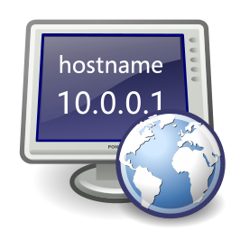
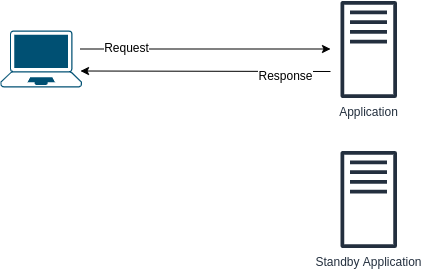
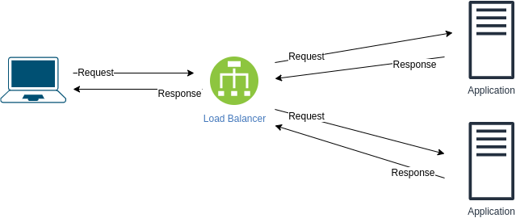
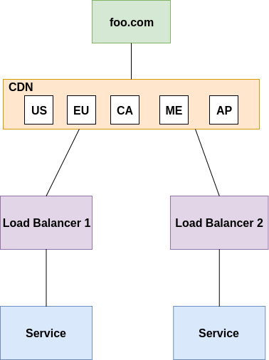
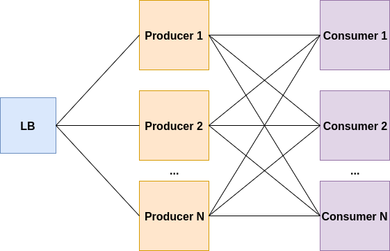
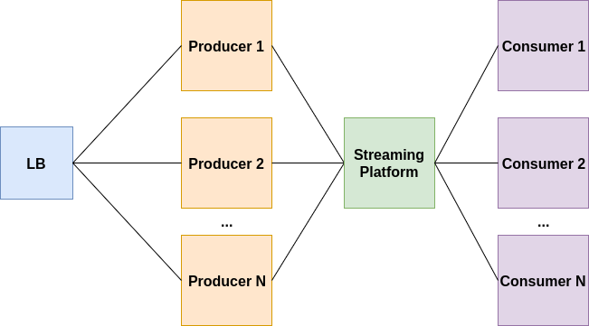
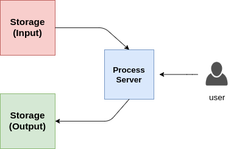

<p align="center"></p>

:information_source: &nbsp;This repo contains questions and exercises on various technical topics, sometimes related to DevOps and SRE

:bar_chart: &nbsp;There are currently **2624** exercises and questions

:warning: &nbsp;You can use these for preparing for an interview but most of the questions and exercises don't represent an actual interview. Please read [FAQ page](faq.md) for more details

:stop_sign: &nbsp;If you are interested in pursuing a career as DevOps engineer, learning some of the concepts mentioned here would be useful, but you should know it's not about learning all the topics and technologies mentioned in this repository

:pencil: &nbsp;You can add more exercises by submitting pull requests :) Read about contribution guidelines [here](CONTRIBUTING.md)

****

<!-- ALL-TOPICS-LIST:START -->
<!-- prettier-ignore-start -->
<!-- markdownlint-disable -->
<center>
<table>
  <tr>
    <td align="center"><a href="topics/devops/README.md"><br /><b>DevOps</b></a></td>
    <td align="center"><a href="topics/git/README.md"><br /><b>Git</b></a></td>
    <td align="center"><a href="#network"><br /><b>Network</b></a></td>
    <td align="center"><a href="#hardware"><br /><b>Hardware</b></a></td>
    <td align="center"><a href="topics/kubernetes/README.md"><br /><b>Kubernetes</b></a></td>
  </tr>

  <tr>
    <td align="center"><a href="topics/software_development/README.md"><br /><b>Software Development</b></a></td>
    <td align="center"><a href="https://github.com/bregman-arie/python-exercises"><br /><b>Python</b></a></td>
    <td align="center"><a href="https://github.com/bregman-arie/go-exercises"><br /><b>Go</b></a></td>
    <td align="center"><a href="topics/perl/README.md"><br /><b>Perl</b></a></td>
    <td align="center"><a href="#regex"><br /><b>Regex</b></a></td>
  </tr>

  <tr>
      <td align="center"><a href="topics/cloud/README.md"><br /><b>Cloud</b></a></td>
      <td align="center"><a href="topics/aws/README.md"><br /><b>AWS</b></a></td>
      <td align="center"><a href="topics/azure/README.md"><br /><b>Azure</b></a></td>
      <td align="center"><a href="topics/gcp/README.md"><br /><b>Google Cloud Platform</b></a></td>
      <td align="center"><a href="#openstack/README.md"><br /><b>OpenStack</b></a></td>
  </tr>

  <tr>
      <td align="center"><a href="#operating-system"><br /><b>Operating System</b></a></td>
      <td align="center"><a href="topics/linux/README.md"><br /><b>Linux</b></a></td>
      <td align="center"><a href="#virtualization"><br /><b>Virtualization</b></a></td>
      <td align="center"><a href="topics/dns/README.md"><br /><b>DNS</b></a></td>
      <td align="center"><a href="topics/shell/README.md"><br /><b>Shell Scripting</b></a></td>
  </tr>

  <tr>
      <td align="center"><a href="topics/databases/README.md"><br /><b>Databases</b></a></td>
      <td align="center"><a href="#sql"><br /><b>SQL</b></a></td>
      <td align="center"><a href="#mongo"><br /><b>Mongo</b></a></td>
      <td align="center"><a href="#testing"><br /><b>Testing</b></a></td>
      <td align="center"><a href="#big-data"><br /><b>Big Data</b></a></td>

  </tr>

  <tr>
      <td align="center"><a href="topics/cicd/README.md"><br /><b>CI/CD</b></a></td>
      <td align="center"><a href="#certificates"><br /><b>Certificates</b></a></td>
      <td align="center"><a href="topics/containers/README.md"><br /><b>Containers</b></a></td>
      <td align="center"><a href="topics/openshift/README.md"><br /><b>OpenShift</b></a></td>
      <td align="center"><a href="#storage"><br /><b>Storage</b></a></td>
  </tr>

  <tr>
      <td align="center"><a href="topics/terraform/README.md"><br /><b>Terraform</b></a></td>
      <td align="center"><a href="#puppet"><br /><b>Puppet</b></a></td>
      <td align="center"><a href="#distributed"><br /><b>Distributed</b></a></td>
      <td align="center"><a href="#questions-you-ask"><br /><b>Questions you can ask</b></a></td>
      <td align="center"><a href="topics/ansible/README.md"><br /><b>Ansible</b></a></td>
  </tr>

  <tr>
      <td align="center"><a href="topics/observability/README.md"><br /><b>Observability</b></a></td>
      <td align="center"><a href="#prometheus"><br /><b>Prometheus</b></a></td>
      <td align="center"><a href="topics/circleci/README.md"><br /><b>Circle CI</b></a></td>
      <td align="center"><a href="topics/datadog/README.md"><br /><b></b></a></td>
      <td align="center"><a href="topics/grafana/README.md"><br /><b>Grafana</b></a></td>
  </tr>

  <tr>
    <td align="center"><a href="topics/argo/README.md"><br /><b>Argo</b></a></td>
    <td align="center"><a href="topics/soft_skills/README.md"><br /><b>Soft Skills</b></a></td>
    <td align="center"><a href="topics/security/README.md"><br /><b>Security</b></a></td>
    <td align="center"><a href="#system-design"><br /><b>System Design</b></a></td>
   </tr>

   <tr>
    <td align="center"><a href="topics/chaos_engineering/README.md"><br /><b>Chaos Engineering</b></a></td>
    <td align="center"><a href="#Misc"><br /><b>Misc</b></a></td>
    <td align="center"><a href="#elastic"><br /><b>Elastic</b></a></td>
    <td align="center"><a href="topics/kafka/README.md"><br /><b>Kafka</b></a></td>
   </tr>
   
</table>
</center>
<!-- markdownlint-enable -->
<!-- prettier-ignore-end -->
<!-- ALL-TOPICS-LIST:END -->

## Network

<details>
<summary>In general, what do you need in order to communicate?</summary><br><b>

  - A common language (for the two ends to understand)
  - A way to address who you want to communicate with
  - A Connection (so the content of the communication can reach the recipients)

</b></details>

<details>
<summary>What is TCP/IP?</summary><br><b>

A set of protocols that define how two or more devices can communicate with each other.

To learn more about TCP/IP, read [here](http://www.penguintutor.com/linux/basic-network-reference)

</b></details>

<details>
<summary>What is Ethernet?</summary><br><b>

Ethernet simply refers to the most common type of Local Area Network (LAN) used today. A LAN—in contrast to a WAN (Wide Area Network), which spans a larger geographical area—is a connected network of computers in a small area, like your office, college campus, or even home.

</b></details>

<details>
<summary>What is a MAC address? What is it used for?</summary><br><b>

A MAC address is a unique identification number or code used to identify individual devices on the network.

Packets that are sent on the ethernet are always coming from a MAC address and sent to a MAC address. If a network adapter is receiving a packet, it is comparing the packet’s destination MAC address to the adapter’s own MAC address.

</b></details>

<details>
<summary>When is this MAC address used?: ff:ff:ff:ff:ff:ff</summary><br><b>

When a device sends a packet to the broadcast MAC address (FF:FF:FF:FF:FF:FF​), it is delivered to all stations on the local network. Ethernet broadcasts are used to resolve IP addresses to MAC addresses (by ARP) at the data link layer.
</b></details>

<details>
<summary>What is an IP address?</summary><br><b>

An Internet Protocol address (IP address) is a numerical label assigned to each device connected to a computer network that uses the Internet Protocol for communication.An IP address serves two main functions: host or network interface identification and location addressing.
</b></details>

<details>
<summary>Explain the subnet mask and give an example</summary><br><b>

A Subnet mask is a 32-bit number that masks an IP address and divides the IP addresses into network addresses and host addresses. Subnet Mask is made by setting network bits to all "1"s and setting host bits to all "0"s. Within a given network, out of the total usable host addresses, two are always reserved for specific purposes and cannot be allocated to any host. These are the first address, which is reserved as a network address (a.k.a network ID), and the last address used for network broadcast.

[Example](https://github.com/philemonnwanne/projects/tree/main/exercises/exe-09)

</b></details>

<details>
<summary>What is a private IP address? In which scenarios/system designs, one should use it?</summary><br><b>
Private IP addresses are assigned to the hosts in the same network to communicate with one another. As the name "private" suggests, the devices having the private IP addresses assigned can't be reached by the devices from any external network. For example, if I am living in a hostel and I want my hostel mates to join the game server I have hosted, I will ask them to join via my server's private IP address, since the network is local to the hostel.
</b></details>

<details>
<summary>What is a public IP address? In which scenarios/system designs, one should use it?</summary><br><b>
A public IP address is a public-facing IP address. In the event that you were hosting a game server that you want your friends to join, you will give your friends your public IP address to allow their computers to identify and locate your network and server in order for the connection to take place. One time that you would not need to use a public-facing IP address is in the event that you were playing with friends who were connected to the same network as you, in that case, you would use a private IP address. In order for someone to be able to connect to your server that is located internally, you will have to set up a port forward to tell your router to allow traffic from the public domain into your network and vice versa.
</b></details>

<details>
<summary>Explain the OSI model. What layers there are? What each layer is responsible for?</summary><br><b>

- Application: user end (HTTP is here)
- Presentation: establishes context between application-layer entities (Encryption is here)
- Session: establishes, manages, and terminates the connections
- Transport: transfers variable-length data sequences from a source to a destination host (TCP & UDP are here)
- Network: transfers datagrams from one network to another (IP is here)
- Data link: provides a link between two directly connected nodes (MAC is here)
- Physical: the electrical and physical spec of the data connection (Bits are here)

You can read more about the OSI model in [penguintutor.com](http://www.penguintutor.com/linux/basic-network-reference)
</b></details>

<details>
<summary>For each of the following determines to which OSI layer it belongs:

  * Error correction
  * Packets routing
  * Cables and electrical signals
  * MAC address
  * IP address
  * Terminate connections
  * 3 way handshake</summary><br><b>
  * Error correction - Data link
  * Packets routing - Network
  * Cables and electrical signals - Physical
  * MAC address - Data link
  * IP address - Network
  * Terminate connections - Session
  * 3-way handshake - Transport
</b></details>

<details>
<summary>What delivery schemes are you familiar with?</summary><br><b>

Unicast: One-to-one communication where there is one sender and one receiver.

Broadcast: Sending a message to everyone in the network. The address ff:ff:ff:ff:ff:ff is used for broadcasting.
           Two common protocols which use broadcast are ARP and DHCP.

Multicast: Sending a message to a group of subscribers. It can be one-to-many or many-to-many.
</b></details>

<details>
<summary>What is CSMA/CD? Is it used in modern ethernet networks?</summary><br><b>

CSMA/CD stands for Carrier Sense Multiple Access / Collision Detection.
Its primary focus is to manage access to a shared medium/bus where only one host can transmit at a given point in time.

CSMA/CD algorithm:

1. Before sending a frame, it checks whether another host is already transmitting a frame.
2. If no one is transmitting, it starts transmitting the frame.
3. If two hosts transmit at the same time, we have a collision.
4. Both hosts stop sending the frame and they send everyone a 'jam signal' notifying everyone that a collision occurred
5. They are waiting for a random time before sending it again
6. Once each host waited for a random time, they try to send the frame again and so the cycle starts again
</b></details>

<details>
<summary>Describe the following network devices and the difference between them:

  * router
  * switch
  * hub</summary><br><b>

A router, switch, and hub are all network devices used to connect devices in a local area network (LAN). However, each device operates differently and has its specific use cases. Here is a brief description of each device and the differences between them:

1. Router: a network device that connects multiple network segments together. It operates at the network layer (Layer 3) of the OSI model and uses routing protocols to direct data between networks. Routers use IP addresses to identify devices and route data packets to the correct destination.
2. Switch: a network device that connects multiple devices on a LAN. It operates at the data link layer (Layer 2) of the OSI model and uses MAC addresses to identify devices and direct data packets to the correct destination. Switches allow devices on the same network to communicate with each other more efficiently and can prevent data collisions that can occur when multiple devices send data simultaneously.
3. Hub: a network device that connects multiple devices through a single cable and is used to connect multiple devices without segmenting a network. However, unlike a switch, it operates at the physical layer (Layer 1) of the OSI model and simply broadcasts data packets to all devices connected to it, regardless of whether the device is the intended recipient or not. This means that data collisions can occur, and the network's efficiency can suffer as a result. Hubs are generally not used in modern network setups, as switches are more efficient and provide better network performance.
</b></details>

<details>
<summary>What is a "Collision Domain"?</summary><br><b>
A collision domain is a network segment in which devices can potentially interfere with each other by attempting to transmit data at the same time. When two devices transmit data at the same time, it can cause a collision, resulting in lost or corrupted data. In a collision domain, all devices share the same bandwidth, and any device can potentially interfere with the transmission of data by other devices.
</b></details>

<details>
<summary>What is a "Broadcast Domain"?</summary><br><b>
A broadcast domain is a network segment in which all devices can communicate with each other by sending broadcast messages. A broadcast message is a message that is sent to all devices in a network rather than a specific device. In a broadcast domain, all devices can receive and process broadcast messages, regardless of whether the message was intended for them or not.
</b></details>

<details>
<summary>three computers connected to a switch. How many collision domains are there? How many broadcast domains?</summary><br><b>

Three collision domains and one broadcast domain
</b></details>

<details>
<summary>How does a router work?</summary><br><b>

A router is a physical or virtual appliance that passes information between two or more packet-switched computer networks. A router inspects a given data packet's destination Internet Protocol address (IP address), calculates the best way for it to reach its destination, and then forwards it accordingly.

</b></details>

<details>
<summary>What is NAT?</summary><br><b>

 Network Address Translation (NAT) is a process in which one or more local IP addresses are translated into one or more Global IP address and vice versa in order to provide Internet access to the local hosts.

</b></details>

<details>
<summary>What is a proxy? How does it work? What do we need it for?</summary><br><b>

A proxy server acts as a gateway between you and the internet. It’s an intermediary server separating end users from the websites they browse.

If you’re using a proxy server, internet traffic flows through the proxy server on its way to the address you requested. The request then comes back through that same proxy server (there are exceptions to this rule), and then the proxy server forwards the data received from the website to you.

Proxy servers provide varying levels of functionality, security, and privacy depending on your use case, needs, or company policy.
</b></details>

<details>
<summary>What is TCP? How does it work? What is the 3-way handshake?</summary><br><b>

TCP 3-way handshake or three-way handshake is a process that is used in a TCP/IP network to make a connection between server and client.

A three-way handshake is primarily used to create a TCP socket connection. It works when:

- A client node sends an SYN data packet over an IP network to a server on the same or an external network. The objective of this packet is to ask/infer if the server is open for new connections.
- The target server must have open ports that can accept and initiate new connections. When the server receives the SYN packet from the client node, it responds and returns a confirmation receipt – the ACK packet or SYN/ACK packet.
- The client node receives the SYN/ACK from the server and responds with an ACK packet.
</b></details>

<details>
<summary>What is round-trip delay or round-trip time?</summary><br><b>

From [wikipedia](https://en.wikipedia.org/wiki/Round-trip_delay): "the length of time it takes for a signal to be sent plus the length of time it takes for an acknowledgment of that signal to be received"

Bonus question: what is the RTT of LAN?
</b></details>

<details>
<summary>How does an SSL handshake work?</summary><br><b>
SSL handshake is a process that establishes a secure connection between a client and a server.

1. The client sends a Client Hello message to the server, which includes the client's version of the SSL/TLS protocol, a list of the cryptographic algorithms supported by the client, and a random value.
2. The server responds with a Server Hello message, which includes the server's version of the SSL/TLS protocol, a random value, and a session ID.
3. The server sends a Certificate message, which contains the server's certificate.
4. The server sends a Server Hello Done message, which indicates that the server is done sending messages for the Server Hello phase.
5. The client sends a Client Key Exchange message, which contains the client's public key.
6. The client sends a Change Cipher Spec message, which notifies the server that the client is about to send a message encrypted with the new cipher spec.
7. The client sends an Encrypted Handshake Message, which contains the pre-master secret encrypted with the server's public key.
8. The server sends a Change Cipher Spec message, which notifies the client that the server is about to send a message encrypted with the new cipher spec.
9. The server sends an Encrypted Handshake Message, which contains the pre-master secret encrypted with the client's public key.
10. The client and server can now exchange application data.
</b></details>

<details>
<summary>What is the difference between TCP and UDP?</summary><br><b>

TCP establishes a connection between the client and the server to guarantee the order of the packages, on the other hand, UDP does not establish a connection between the client and server and doesn't handle package orders. This makes UDP more lightweight than TCP and a perfect candidate for services like streaming.

[Penguintutor.com](http://www.penguintutor.com/linux/basic-network-reference) provides a good explanation.
</b></details>

<details>
<summary>What TCP/IP protocols are you familiar with?</summary><br><b>
</b></details>

<details>
<summary>Explain the "default gateway"</summary><br><b>

A default gateway serves as an access point or IP router that a networked computer uses to send information to a computer in another network or the internet.
</b></details>

<details>
<summary>What is ARP? How does it work?</summary><br><b>

ARP stands for Address Resolution Protocol. When you try to ping an IP address on your local network, say 192.168.1.1, your system has to turn the IP address 192.168.1.1 into a MAC address. This involves using ARP to resolve the address, hence its name.

Systems keep an ARP look-up table where they store information about what IP addresses are associated with what MAC addresses. When trying to send a packet to an IP address, the system will first consult this table to see if it already knows the MAC address. If there is a value cached, ARP is not used.
</b></details>

<details>
<summary>What is TTL? What does it help to prevent?</summary><br><b>

- TTL (Time to Live) is a value in an IP (Internet Protocol) packet that determines how many hops or routers a packet can travel before it is discarded. Each time a packet is forwarded by a router, the TTL value is decreased by one. When the TTL value reaches zero, the packet is dropped, and an ICMP (Internet Control Message Protocol) message is sent back to the sender indicating that the packet has expired.
- TTL is used to prevent packets from circulating indefinitely in the network, which can cause congestion and degrade network performance.
- It also helps to prevent packets from being trapped in routing loops, where packets continuously travel between the same set of routers without ever reaching their destination.
- In addition, TTL can be used to help detect and prevent IP spoofing attacks, where an attacker attempts to impersonate another device on the network by using a false or fake IP address. By limiting the number of hops that a packet can travel, TTL can help prevent packets from being routed to destinations that are not legitimate.
</b></details>

<details>
<summary>What is DHCP? How does it work?</summary><br><b>

It stands for Dynamic Host Configuration Protocol and allocates IP addresses, subnet masks, and gateways to hosts. This is how it works:

* A host upon entering a network broadcasts a message in search of a DHCP server (DHCP DISCOVER)
* An offer message is sent back by the DHCP server as a packet containing lease time, subnet mask, IP addresses, etc (DHCP OFFER)
* Depending on which offer is accepted, the client sends back a reply broadcast letting all DHCP servers know (DHCP REQUEST)
* The server sends an acknowledgment (DHCP ACK)

Read more [here](https://linuxjourney.com/lesson/dhcp-overview)
</b></details>

<details>
<summary>Can you have two DHCP servers on the same network? How does it work?</summary><br><b>

It is possible to have two DHCP servers on the same network, however, it is not recommended, and it is important to configure them carefully to prevent conflicts and configuration problems.
- When two DHCP servers are configured on the same network, there is a risk that both servers will assign IP addresses and other network configuration settings to the same device, which can cause conflicts and connectivity issues. Additionally, if the DHCP servers are configured with different network settings or options, devices on the network may receive conflicting or inconsistent configuration settings.
- However, in some cases, it may be necessary to have two DHCP servers on the same network, such as in large networks where one DHCP server may not be able to handle all the requests. In such cases, DHCP servers can be configured to serve different IP address ranges or different subnets, so they do not interfere with each other.
</b></details>

<details>
<summary>What is SSL tunneling? How does it work?</summary><br><b>

- SSL (Secure Sockets Layer) tunneling is a technique used to establish a secure, encrypted connection between two endpoints over an insecure network, such as the Internet. The SSL tunnel is created by encapsulating the traffic within an SSL connection, which provides confidentiality, integrity, and authentication.

Here's how SSL tunneling works:

1. A client initiates an SSL connection to a server, which involves a handshake process to establish the SSL session.
2. Once the SSL session is established, the client and server negotiate encryption parameters, such as the encryption algorithm and key length, then exchange digital certificates to authenticate each other.
3. The client then sends traffic through the SSL tunnel to the server, which decrypts the traffic and forwards it to its destination.
4. The server sends traffic back through the SSL tunnel to the client, which decrypts the traffic and forwards it to the application.
</b></details>

<details>
<summary>What is a socket? Where can you see the list of sockets in your system?</summary><br><b>

- A socket is a software endpoint that enables two-way communication between processes over a network. Sockets provide a standardized interface for network communication, allowing applications to send and receive data across a network. To view the list of open sockets on a Linux system: 
***netstat -an***
- This command displays a list of all open sockets, along with their protocol, local address, foreign address, and state.
</b></details>

<details>
<summary>What is IPv6? Why should we consider using it if we have IPv4?</summary><br><b>

- IPv6 (Internet Protocol version 6) is the latest version of the Internet Protocol (IP), which is used to identify and communicate with devices on a network. IPv6 addresses are 128-bit addresses and are expressed in hexadecimal notation, such as 2001:0db8:85a3:0000:0000:8a2e:0370:7334.

There are several reasons why we should consider using IPv6 over IPv4:

1. Address space: IPv4 has a limited address space, which has been exhausted in many parts of the world. IPv6 provides a much larger address space, allowing for trillions of unique IP addresses.
2. Security: IPv6 includes built-in support for IPsec, which provides end-to-end encryption and authentication for network traffic.
3. Performance: IPv6 includes features that can help to improve network performance, such as multicast routing, which allows a single packet to be sent to multiple destinations simultaneously.
4. Simplified network configuration: IPv6 includes features that can simplify network configuration, such as stateless autoconfiguration, which allows devices to automatically configure their own IPv6 addresses without the need for a DHCP server.
5. Better mobility support: IPv6 includes features that can improve mobility support, such as Mobile IPv6, which allows devices to maintain their IPv6 addresses as they move between different networks.
</b></details>

<details>
<summary>What is VLAN?</summary><br><b>

- A VLAN (Virtual Local Area Network) is a logical network that groups together a set of devices on a physical network, regardless of their physical location. VLANs are created by configuring network switches to assign a specific VLAN ID to frames sent by devices connected to a specific port or group of ports on the switch.
</b></details>

<details>
<summary>What is MTU?</summary><br><b>
	
MTU stands for Maximum Transmission Unit. It's the size of the largest PDU (protocol Data Unit) that can be sent in a single transaction.
</b></details>

<details>
<summary>What happens if you send a packet that is bigger than the MTU?</summary><br><b>
	
With the IPv4 protocol, the router can fragment the PDU and then send all the fragmented PDU through the transaction.
	
With IPv6 protocol, it issues an error to the user's computer.
</b></details>

<details>
<summary>True or False? Ping is using UDP because it doesn't care about reliable connection</summary><br><b>

False. Ping is actually using ICMP (Internet Control Message Protocol) which is a network protocol used to send diagnostic messages and control messages related to network communication.
</b></details>

<details>
<summary>What is SDN?</summary><br><b>

- SDN stands for Software-Defined Networking. It is an approach to network management that emphasizes the centralization of network control, enabling administrators to manage network behavior through a software abstraction.
- In a traditional network, network devices such as routers, switches, and firewalls are configured and managed individually, using specialized software or command-line interfaces. In contrast, SDN separates the network control plane from the data plane, allowing administrators to manage network behavior through a centralized software controller.
</b></details>

<details>
<summary>What is ICMP? What is it used for?</summary><br><b>

- ICMP stands for Internet Control Message Protocol. It is a protocol used for diagnostic and control purposes in IP networks. It is a part of the Internet Protocol suite, operating at the network layer.

ICMP messages are used for a variety of purposes, including:
1. Error reporting: ICMP messages are used to report errors that occur in the network, such as a packet that could not be delivered to its destination.
2. Ping: ICMP is used to send ping messages, which are used to test whether a host or network is reachable and to measure the round-trip time for packets.
3. Path MTU discovery: ICMP is used to discover the Maximum Transmission Unit (MTU) of a path, which is the largest packet size that can be transmitted without fragmentation.
4. Traceroute: ICMP is used by the traceroute utility to trace the path that packets take through the network.
5. Router discovery: ICMP is used to discover the routers in a network.
</b></details>

<details>
<summary>What is NAT? How does it work?</summary><br><b>

NAT stands for Network Address Translation. It’s a way to map multiple local private addresses to a public one before transferring the information. Organizations that want multiple devices to employ a single IP address use NAT, as do most home routers.
For example, your computer's private IP could be 192.168.1.100, but your router maps the traffic to its public IP (e.g. 1.1.1.1). Any device on the internet would see the traffic coming from your public IP (1.1.1.1) instead of your private IP (192.168.1.100).
</b></details>

<details>
<summary>Which port number is used in each of the following protocols?:

  * SSH
  * SMTP
  * HTTP
  * DNS
  * HTTPS
  * FTP
  * SFTP
</summary><br><b>

  * SSH - 22
  * SMTP - 25
  * HTTP - 80
  * DNS - 53
  * HTTPS - 443
  * FTP - 21
  * SFTP - 22
</b></details>

<details>
<summary>Which factors affect network performance?</summary><br><b>

Several factors can affect network performance, including:

1. Bandwidth: The available bandwidth of a network connection can significantly impact its performance. Networks with limited bandwidth can experience slow data transfer rates, high latency, and poor responsiveness.
2. Latency: Latency refers to the delay that occurs when data is transmitted from one point in a network to another. High latency can result in slow network performance, especially for real-time applications like video conferencing and online gaming.
3. Network congestion: When too many devices are using a network at the same time, network congestion can occur, leading to slow data transfer rates and poor network performance.
4. Packet loss: Packet loss occurs when packets of data are dropped during transmission. This can result in slower network speeds and lower overall network performance.
5. Network topology: The physical layout of a network, including the placement of switches, routers, and other network devices, can impact network performance.
6. Network protocol: Different network protocols have different performance characteristics, which can impact network performance. For example, TCP is a reliable protocol that can guarantee the delivery of data, but it can also result in slower performance due to the overhead required for error checking and retransmission.
7. Network security: Security measures such as firewalls and encryption can impact network performance, especially if they require significant processing power or introduce additional latency.
8. Distance: The physical distance between devices on a network can impact network performance, especially for wireless networks where signal strength and interference can affect connectivity and data transfer rates.
</b></details>

<details>
<summary>What is APIPA?</summary><br><b>

APIPA is a set of IP addresses that devices are allocated
when the main DHCP server is not reachable

</b></details>

<details>
<summary>What IP range does APIPA use?</summary><br><b>

APIPA uses the IP range: 169.254.0.1 - 169.254.255.254.

</b></details>

#### Control Plane and Data Plane

<details>
<summary>What does "control plane" refer to?</summary><br><b>

The control plane is a part of the network that decides how to route and forward packets to a different location.
</b></details>

<details>
<summary>What does "data plane" refer to?</summary><br><b>

The data plane is a part of the network that actually forwards the data/packets.
</b></details>

<details>
<summary>What does "management plane" refer to?</summary><br><b>

It refers to monitoring and management functions.
</b></details>

<details>
<summary>To which plane (data, control, ...) does creating routing tables belong to?</summary><br><b>

Control Plane.
</b></details>

<details>
<summary>Explain Spanning Tree Protocol (STP).</summary><br><b>
</b></details>

<details>
<summary>What is link aggregation? Why is it used?</summary><br><b>
</b></details>

<details>
<summary>What is Asymmetric Routing? How to deal with it?</summary><br><b>
</b></details>

<details>
<summary>What overlay (tunnel) protocols are you familiar with?</summary><br><b>
</b></details>

<details>
<summary>What is GRE? How does it work?</summary><br><b>
</b></details>

<details>
<summary>What is VXLAN? How does it work?</summary><br><b>
</b></details>

<details>
<summary>What is SNAT?</summary><br><b>
</b></details>

<details>
<summary>Explain OSPF.</summary><br><b>


OSPF (Open Shortest Path First) is a routing protocol that can be implemented on various types of routers. In general, OSPF is supported on most modern routers, including those from vendors such as Cisco, Juniper, and Huawei. The protocol is designed to work with IP-based networks, including both IPv4 and IPv6. Also, it uses a hierarchical network design, where routers are grouped into areas, with each area having its own topology map and routing table. This design helps to reduce the amount of routing information that needs to be exchanged between routers and improve network scalability.

The OSPF 4 Types of routers are:
  * Internal Router
  * Area Border Routers
  * Autonomous Systems Boundary Routers
  * Backbone Routers

  Learn more about OSPF router types: https://www.educba.com/ospf-router-types/
</b></details>

<details>
<summary>What is latency?</summary><br><b>
	
Latency is the time taken for information to reach its destination from the source.
</b></details>

<details>
<summary>What is bandwidth?</summary><br><b>
	
Bandwidth is the capacity of a communication channel to measure how much data the latter can handle over a specific time period. More bandwidth would imply more traffic handling and thus more data transfer.
</b></details>

<details>
<summary>What is throughput?</summary><br><b>
	
Throughput refers to the measurement of the real amount of data transferred over a certain period of time across any transmission channel.
</b></details>

<details>
<summary>When performing a search query, what is more important, latency or throughput? And how to ensure that we manage global infrastructure?
</summary><br><b>

Latency. To have good latency, a search query should be forwarded to the closest data center.
</b></details>

<details>
<summary>When uploading a video, what is more important, latency or throughput? And how to assure that?</summary><br><b>

Throughput. To have good throughput, the upload stream should be routed to an underutilized link.
</b></details>

<details>
<summary>What other considerations (except latency and throughput) are there when forwarding requests?</summary><br><b>

* Keep caches updated (which means the request could be forwarded not to the closest data center)
</b></details>

<details>
<summary>Explain Spine & Leaf</summary><br><b>
</b></details>

<details>
<summary>What is Network Congestion? What can cause it?</summary><br><b>

Network congestion occurs when there is too much data to transmit on a network and it doesn't have enough capacity to handle the demand. </br>
This can lead to increased latency and packet loss. The causes can be multiple, such as high network usage, large file transfers, malware, hardware issues, or network design problems. </br>
To prevent network congestion, it's important to monitor your network usage and implement strategies to limit or manage the demand.
</b></details>

<details>
<summary>What can you tell me about the UDP packet format? What about the TCP packet format? How is it different?</summary><br><b>
</b></details>

<details>
<summary>What is the exponential backoff algorithm? Where is it used?</summary><br><b>
</b></details>

<details>
<summary>Using Hamming code, what would be the code word for the following data word 100111010001101?</summary><br><b>

00110011110100011101
</b></details>

<details>
<summary>Give examples of protocols found in the application layer</summary><br><b>

* Hypertext Transfer Protocol (HTTP) - used for the webpages on the internet
* Simple Mail Transfer Protocol (SMTP) - email transmission
* Telecommunications Network - (TELNET) - terminal emulation to allow a client access to a telnet server
* File Transfer Protocol (FTP) - facilitates the transfer of files between any two machines
* Domain Name System (DNS) - domain name translation
* Dynamic Host Configuration Protocol (DHCP) - allocates IP addresses, subnet masks, and gateways to hosts
* Simple Network Management Protocol (SNMP) - gathers data on devices on the network
</b></details>

<details>
<summary>Give examples of protocols found in the Network Layer</summary><br><b>

* Internet Protocol (IP) - assists in routing packets from one machine to another
* Internet Control Message Protocol (ICMP) - lets one know what is going such as error messages and debugging information
</b></details>

<details>
<summary>What is HSTS?</summary><br><b>
HTTP Strict Transport Security is a web server directive that informs user agents and web browsers how to handle its connection through a response header sent at the very beginning and back to the browser. This forces connections over HTTPS encryption, disregarding any script's call to load any resource in that domain over HTTP.

Read more [here](https://www.globalsign.com/en/blog/what-is-hsts-and-how-do-i-use-it#:~:text=HTTP%20Strict%20Transport%20Security%20(HSTS,and%20back%20to%20the%20browser.)
</b></details>

#### Network - Misc

<details>
<summary>What is the Internet? Is it the same as the World Wide Web?</summary><br><b>

The internet refers to a network of networks, transferring huge amounts of data around the globe.<br>
The World Wide Web is an application running on millions of servers, on top of the internet, accessed through what is known as the web browser
</b></details>

<details>
<summary>What is the ISP?</summary><br><b>

ISP (Internet Service Provider) is the local internet company provider.
</b></details>

## Operating System

### Operating System Exercises

|Name|Topic|Objective & Instructions|Solution|Comments|
|--------|--------|------|----|----|
|Fork 101|Fork|[Link](topics/os/fork_101.md)|[Link](topics/os/solutions/fork_101_solution.md)
|Fork 102|Fork|[Link](topics/os/fork_102.md)|[Link](topics/os/solutions/fork_102_solution.md)

### Operating System - Self Assessment

<details>
<summary>What is an operating system?</summary><br><b>

From the book "Operating Systems: Three Easy Pieces":

"responsible for making it easy to run programs (even allowing you to seemingly run many at the same time), allowing programs to share memory, enabling programs to interact with devices, and other fun stuff like that".
</b></details>

#### Operating System - Process

<details>
<summary>Can you explain what is a process?</summary><br><b>

A process is a running program. A program is one or more instructions and the program (or process) is executed by the operating system.
</b></details>

<details>
<summary>If you had to design an API for processes in an operating system, what would this API look like?</summary><br><b>

It would support the following:

* Create - allow to create new processes
* Delete - allow to remove/destroy processes
* State - allow to check the state of the process, whether it's running, stopped, waiting, etc.
* Stop - allow to stop a running process
</b></details>

<details>
<summary>How a process is created?</summary><br><b>

* The OS is reading program's code and any additional relevant data
* Program's code is loaded into the memory or more specifically, into the address space of the process.
* Memory is allocated for program's stack (aka run-time stack). The stack also initialized by the OS with data like argv, argc and parameters to main()
* Memory is allocated for program's heap which is required for dynamically allocated data like the data structures linked lists and hash tables
* I/O initialization tasks are performed, like in Unix/Linux based systems where each process has 3 file descriptors (input, output and error)
* OS is running the program, starting from main()
</b></details>

<details>
<summary>True or False? The loading of the program into the memory is done eagerly (all at once)</summary><br><b>

False. It was true in the past but today's operating systems perform lazy loading which means only the relevant pieces required for the process to run are loaded first.
</b></details>

<details>
<summary>What are different states of a process?</summary><br><b>

* Running - it's executing instructions
* Ready - it's ready to run but for different reasons it's on hold
* Blocked - it's waiting for some operation to complete. For example I/O disk request
</b></details>

<details>
<summary>What are some reasons for a process to become blocked?</summary><br><b>

  - I/O operations (e.g. Reading from a disk)
  - Waiting for a packet from a network
</b></details>

<details>
<summary>What is Inter Process Communication (IPC)?</summary><br><b>
</b></details>

<details>
<summary>What is "time sharing"?</summary><br><b>

Even when using a system with one physical CPU, it's possible to allow multiple users to work on it and run programs. This is possible with time sharing where computing resources are shared in a way it seems to the user the system has multiple CPUs but in fact it's simply one CPU shared by applying multiprogramming and multi-tasking.
</b></details>

<details>
<summary>What is "space sharing"?</summary><br><b>

Somewhat the opposite of time sharing. While in time sharing a resource is used for a while by one entity and then the same resource can be used by another resource, in space sharing the space is shared by multiple entities but in a way where it's not being transferred between them.<br>
It's used by one entity until this entity decides to get rid of it. Take for example storage. In storage, a file is yours until you decide to delete it.
</b></details>

<details>
<summary>What component determines which process runs at a given moment in time?</summary><br><b>

CPU scheduler
</b></details>

#### Operating System - Memory

<details>
<summary>What is "virtual memory" and what purpose it serves?</summary><br><b>

Virtual memory combines your computer's RAM with temporary space on your hard disk. When RAM runs low, virtual memory helps to move data from RAM to a space called a paging file. Moving data to paging file can free up the RAM so your computer can complete its work. In general, the more RAM your computer has, the faster the programs run.
https://www.minitool.com/lib/virtual-memory.html
</b></details>

<details>
<summary>What is demand paging?</summary><br><b>
</b></details>

<details>
<summary>What is copy-on-write?</summary><br><b>
Copy-on-write (COW) is a resource management concept, with the goal to reduce unnecessary copying of information. It is a concept which is implemented for instance within the POSIX fork syscall, which creates a duplicate process of the calling process.

The idea:
1. If resources are shared between 2 or more entities (for example shared memory segments between 2 processes) the resources don't need to be copied for every entity, but rather every entity has a READ operation access permission on the shared resource. (the shared segements are marked as read-only) 
(Think of every entity having a pointer to the location of the shared resource which can be dereferenced to read its value)
2. If one entity would perform a WRITE operation on a shared resource a problem would arise since the resource also would be permanently changed for ALL other entities sharing it.
(Think of a process modifying some variables on the stack, or allocatingy some data dynamically on the heap, these changes to the shared resource would also apply for ALL other processes, this is definetly an undesirable behaviour)
3. As a solution only if a WRITE operation is about to be performed on a shared resource, this resource gets COPIED first and then the changes are applied.
</b></details>

<details>
<summary>What is a kernel, and what does it do?</summary><br><b>

The kernel is part of the operating system and is responsible for tasks like:

  * Allocating memory
  * Schedule processes
  * Control CPU
</b></details>

<details>
<summary>True or False? Some pieces of the code in the kernel are loaded into protected areas of the memory so applications can't overwritten them</summary><br><b>

True
</b></details>

<details>
<summary>What is POSIX?</summary><br><b>
</b></details>

<details>
<summary>Explain what is Semaphore and what its role in operating systems</summary><br><b>
</b></details>

<details>
<summary>What is cache? What is buffer?</summary><br><b>

Buffer: Reserved place in RAM which is used to hold data for temporary purposes
Cache: Cache is usually used when processes reading and writing to the disk to make the process faster by making similar data used by different programs easily accessible.
</b></details>

## Virtualization

<details>
<summary>What is Virtualization?</summary><br><b>

Virtualization uses software to create an abstraction layer over computer hardware that allows the hardware elements of a single computer—processors, memory, storage and more - to be divided into multiple virtual computers, commonly called virtual machines (VMs).
</b></details>

<details>
<summary>What is a hypervisor?</summary><br><b>

Red Hat: "A hypervisor is software that creates and runs virtual machines (VMs). A hypervisor, sometimes called a virtual machine monitor (VMM), isolates the hypervisor operating system and resources from the virtual machines and enables the creation and management of those VMs."

Read more [here](https://www.redhat.com/en/topics/virtualization/what-is-a-hypervisor)
</b></details>

<details>
<summary>What types of hypervisors are there?</summary><br><b>

Hosted hypervisors and bare-metal hypervisors.
</b></details>

<details>
<summary>What are the advantages and disadvantges of bare-metal hypervisor over a hosted hypervisor?</summary><br><b>

Due to having its own drivers and a direct access to hardware components, a baremetal hypervisor will often have better performances along with stability and scalability.

On the other hand, there will probably be some limitation regarding loading (any) drivers so a hosted hypervisor will usually benefit from having a better hardware compatibility.
</b></details>

<details>
<summary>What types of virtualization are there?</summary><br><b>

Operating system virtualization
Network functions virtualization
Desktop virtualization
</b></details>

<details>
<summary>Is containerization is a type of Virtualization?</summary><br><b>

Yes, it's a operating-system-level virtualization, where the kernel is shared and allows to use multiple isolated user-spaces instances.
</b></details>

<details>
<summary>How the introduction of virtual machines changed the industry and the way applications were deployed?</summary><br><b>

The introduction of virtual machines allowed companies to deploy multiple business applications on the same hardware while each application is separated from each other in secured way, where each is running on its own separate operating system.
</b></details>

#### Virtual Machines

<details>
<summary>Do we need virtual machines in the age of containers? Are they still relevant?</summary><br><b>

Yes, virtual machines are still relevant even in the age of containers. While containers provide a lightweight and portable alternative to virtual machines, they do have certain limitations. Virtual machines still matter because they offer isolation and security, can run different operating systems, and are good for legacy apps. Containers limitations for example are sharing the host kernel.
</b></details>

## Prometheus

<details>
<summary>What is Prometheus? What are some of Prometheus's main features?</summary><br><b>
</b></details>

<details>
<summary>In what scenarios it might be better to NOT use Prometheus?</summary><br><b>

From Prometheus documentation: "if you need 100% accuracy, such as for per-request billing".
</b></details>

<details>
<summary>Describe Prometheus architecture and components</summary><br><b>
</b></details>

<details>
<summary>Can you compare Prometheus to other solutions like InfluxDB for example?</summary><br><b>
</b></details>

<details>
<summary>What is an Alert?</summary><br><b>
</b></details>

<details>
<summary>Describe the following Prometheus components:

  * Prometheus server
  * Push Gateway
  * Alert Manager</summary><br><b>

Prometheus server is responsible for scraping and storing the data<br>
Push gateway is used for short-lived jobs<br>
Alert manager is responsible for alerts ;)
</b></details>

<details>
<summary>What is an Instance? What is a Job?</summary><br><b>
</b></details>

<details>
<summary>What core metrics types Prometheus supports?</summary><br><b>
</b></details>

<details>
<summary>What is an exporter? What is it used for?</summary><br><b>
</b></details>

<details>
<summary>Which Prometheus best practices are you familiar with?. Name at least three</summary><br><b>
</b></details>

<details>
<summary>How to get total requests in a given period of time?</summary><br><b>
</b></details>

<details>
<summary>What HA in Prometheus means?</summary><br><b>
</b></details>

<details>
<summary>How do you join two metrics?</summary><br><b>
</b></details>

<details>
<summary>How to write a query that returns the value of a label?</summary><br><b>
</b></details>

<details>
<summary>How do you convert cpu_user_seconds to cpu usage in percentage?</summary><br><b>
</b></details>

## Go

<details>
<summary>What are some characteristics of the Go programming language?</summary><br><b>

  * Strong and static typing - the type of the variables can't be changed over time and they have to be defined at compile time
  * Simplicity
  * Fast compile times
  * Built-in concurrency
  * Garbage collected
  * Platform independent
  * Compile to standalone binary - anything you need to run your app will be compiled into one binary. Very useful for version management in run-time.

Go also has good community.
</b></details>

<details>
<summary>What is the difference between <code>var x int = 2</code> and <code>x := 2</code>?</summary><br><b>

The result is the same, a variable with the value 2.

With <code>var x int = 2</code> we are setting the variable type to integer while with <code>x := 2</code> we are letting Go figure out by itself the type.
</b></details>

<details>
<summary>True or False? In Go we can redeclare variables and once declared we must use it.</summary>

False. We can't redeclare variables but yes, we must used declared variables.
</b></details>

<details>
<summary>What libraries of Go have you used?</summary><br><b>

This should be answered based on your usage but some examples are:

  * fmt - formatted I/O
</b></details>

<details>
<summary>What is the problem with the following block of code? How to fix it?

```
func main() {
    var x float32 = 13.5
    var y int
    y = x
}
```
</summary><br><b>
</b></details>

<details>
<summary>The following block of code tries to convert the integer 101 to a string but instead we get "e". Why is that? How to fix it?


```go
package main

import "fmt"

func main() {
    var x int = 101
    var y string
    y = string(x)
    fmt.Println(y)
}
```
</summary><br><b>

It looks what unicode value is set at 101 and uses it for converting the integer to a string.
If you want to get "101" you should use the package "strconv" and replace <code>y = string(x)</code> with <code>y = strconv.Itoa(x)</code>
</b></details>

<details>
<summary>What is wrong with the following code?:

```
package main

func main() {
    var x = 2
    var y = 3
    const someConst = x + y
}
```
</summary><br><b>

Constants in Go can only be declared using constant expressions.
But `x`, `y` and their sum is variable.
<br>
<code>const initializer x + y is not a constant</code>
</b></details>

<details>
<summary>What will be the output of the following block of code?:

```go
package main

import "fmt"

const (
	x = iota
	y = iota
)
const z = iota

func main() {
	fmt.Printf("%v\n", x)
	fmt.Printf("%v\n", y)
	fmt.Printf("%v\n", z)
}
```
</summary><br><b>

Go's iota identifier is used in const declarations to simplify definitions of incrementing numbers. Because it can be used in expressions, it provides a generality beyond that of simple enumerations.
<br>
`x` and `y` in the first iota group, `z` in the second.
<br>
[Iota page in Go Wiki](https://github.com/golang/go/wiki/Iota)
</b></details>

<details>
<summary>What _ is used for in Go?</summary><br><b>

It avoids having to declare all the variables for the returns values.
It is called the [blank identifier](https://golang.org/doc/effective_go.html#blank).
<br>
[answer in SO](https://stackoverflow.com/questions/27764421/what-is-underscore-comma-in-a-go-declaration#answer-27764432)
</b></details>

<details>
<summary>What will be the output of the following block of code?:

```go
package main

import "fmt"

const (
	_ = iota + 3
	x
)

func main() {
	fmt.Printf("%v\n", x)
}
```
</summary><br><b>

Since the first iota is declared with the value `3` (` + 3`), the next one has the value `4`
</b></details>

<details>
<summary>What will be the output of the following block of code?:

```go
package main

import (
	"fmt"
	"sync"
	"time"
)

func main() {
	var wg sync.WaitGroup

	wg.Add(1)
	go func() {
		time.Sleep(time.Second * 2)
		fmt.Println("1")
		wg.Done()
	}()

	go func() {
		fmt.Println("2")
	}()

	wg.Wait()
	fmt.Println("3")
}
```
</summary><br><b>

Output: 2 1 3

[Aritcle about sync/waitgroup](https://tutorialedge.net/golang/go-waitgroup-tutorial/)

[Golang package sync](https://golang.org/pkg/sync/)
</b></details>

<details>
<summary>What will be the output of the following block of code?:

```go
package main

import (
	"fmt"
)

func mod1(a []int) {
	for i := range a {
		a[i] = 5
	}

	fmt.Println("1:", a)
}

func mod2(a []int) {
	a = append(a, 125) // !

	for i := range a {
		a[i] = 5
	}

	fmt.Println("2:", a)
}

func main() {
	s1 := []int{1, 2, 3, 4}
	mod1(s1)
	fmt.Println("1:", s1)

	s2 := []int{1, 2, 3, 4}
	mod2(s2)
	fmt.Println("2:", s2)
}
```
</summary><br><b>

Output: <code><br>
1 [5 5 5 5]<br>
1 [5 5 5 5]<br>
2 [5 5 5 5 5]<br>
2 [1 2 3 4]<br>
</code>

In `mod1` a is link, and when we're using `a[i]`, we're changing `s1` value to.
But in `mod2`, `append` creats new slice, and we're changing only `a` value, not `s2`.

[Aritcle about arrays](https://golangbot.com/arrays-and-slices/),
[Blog post about `append`](https://blog.golang.org/slices)
</b></details>

<details>
<summary>What will be the output of the following block of code?:

```go
package main

import (
	"container/heap"
	"fmt"
)

// An IntHeap is a min-heap of ints.
type IntHeap []int

func (h IntHeap) Len() int           { return len(h) }
func (h IntHeap) Less(i, j int) bool { return h[i] < h[j] }
func (h IntHeap) Swap(i, j int)      { h[i], h[j] = h[j], h[i] }

func (h *IntHeap) Push(x interface{}) {
	// Push and Pop use pointer receivers because they modify the slice's length,
	// not just its contents.
	*h = append(*h, x.(int))
}

func (h *IntHeap) Pop() interface{} {
	old := *h
	n := len(old)
	x := old[n-1]
	*h = old[0 : n-1]
	return x
}

func main() {
	h := &IntHeap{4, 8, 3, 6}
	heap.Init(h)
	heap.Push(h, 7)

  fmt.Println((*h)[0])
}
```
</summary><br><b>

Output: 3

[Golang container/heap package](https://golang.org/pkg/container/heap/)
</b></details>

## Mongo

<details>
<summary>What are the advantages of MongoDB? Or in other words, why choosing MongoDB and not other implementation of NoSQL?</summary><br><b>

MongoDB advantages are as followings:
- Schemaless
- Easy to scale-out
- No complex joins
- Structure of a single object is clear

</b></details>

<details>
<summary>What is the difference between SQL and NoSQL?</summary><br><b>

The main difference is that SQL databases are structured (data is stored in the form of
tables with rows and columns - like an excel spreadsheet table) while NoSQL is
unstructured, and the data storage can vary depending on how the NoSQL DB is set up, such
as key-value pair, document-oriented, etc.
</b></details>

<details>
<summary>In what scenarios would you prefer to use NoSQL/Mongo over SQL?</summary><br><b>

  * Heterogeneous data which changes often
  * Data consistency and integrity is not top priority
  * Best if the database needs to scale rapidly
</b></details>

<details>
<summary>What is a document? What is a collection?</summary><br><b>

  * A document is a record in MongoDB, which is stored in BSON (Binary JSON) format and is the basic unit of data in MongoDB.
  * A collection is a group of related documents stored in a single database in MongoDB.
</b></details>

<details>
<summary>What is an aggregator?</summary><br><b>

  * An aggregator is a framework in MongoDB that performs operations on a set of data to return a single computed result.
</b></details>

<details>
<summary>What is better? Embedded documents or referenced?</summary><br><b>

  * There is no definitive answer to which is better, it depends on the specific use case and requirements. Some explainations : Embedded documents provide atomic updates, while referenced documents allow for better normalization.
</b></details>

<details>
<summary>Have you performed data retrieval optimizations in Mongo? If not, can you think about ways to optimize a slow data retrieval?</summary><br><b>

  * Some ways to optimize data retrieval in MongoDB are: indexing, proper schema design, query optimization and database load balancing.
</b></details>

##### Queries

<details>
<summary>Explain this query: <code>db.books.find({"name": /abc/})</code></summary><br><b>
</b></details>

<details>
<summary>Explain this query: <code>db.books.find().sort({x:1})</code></summary><br><b>
</b></details>

<details>
<summary>What is the difference between find() and find_one()?</code></summary><br><b>
	
  * `find()` returns all documents that match the query conditions.
  * find_one() returns only one document that matches the query conditions (or null if no match is found).
</b></details>

<details>
<summary>How can you export data from Mongo DB?</code></summary><br><b>

* mongoexport
* programming languages
</b></details>

## SQL

### SQL Exercises

|Name|Topic|Objective & Instructions|Solution|Comments|
|--------|--------|------|----|----|
| Functions vs. Comparisons | Query Improvements | [Exercise](topics/sql/improve_query.md) | [Solution](topics/sql/solutions/improve_query.md)

### SQL Self Assessment

<details>
<summary>What is SQL?</summary><br><b>

SQL (Structured Query Language) is a standard language for relational databases (like MySQL, MariaDB, ...).<br>
It's used for reading, updating, removing and creating data in a relational database.
</b></details>

<details>
<summary>How is SQL Different from NoSQL</summary><br><b>

The main difference is that SQL databases are structured (data is stored in the form of
tables with rows and columns - like an excel spreadsheet table) while NoSQL is
unstructured, and the data storage can vary depending on how the NoSQL DB is set up, such
as key-value pair, document-oriented, etc.
</b></details>

<details>
<summary>When is it best to use SQL? NoSQL?</summary><br><b>

SQL - Best used when data integrity is crucial. SQL is typically implemented with many
businesses and areas within the finance field due to it's ACID compliance.

NoSQL - Great if you need to scale things quickly. NoSQL was designed with web applications
in mind, so it works great if you need to quickly spread the same information around to
multiple servers

Additionally, since NoSQL does not adhere to the strict table with columns and rows structure
that Relational Databases require, you can store different data types together.
</b></details>

##### Practical SQL - Basics

For these questions, we will be using the Customers and Orders tables shown below:

**Customers**

Customer_ID | Customer_Name | Items_in_cart | Cash_spent_to_Date
------------ | ------------- | ------------- | -------------
100204 | John Smith | 0 | 20.00
100205 | Jane Smith | 3 | 40.00
100206 | Bobby Frank | 1 | 100.20

**ORDERS**

Customer_ID | Order_ID | Item | Price | Date_sold
------------ | ------------- | ------------- | ------------- | -------------
100206 | A123 | Rubber Ducky | 2.20 | 2019-09-18
100206 | A123 | Bubble Bath | 8.00 | 2019-09-18
100206 | Q987 | 80-Pack TP | 90.00 | 2019-09-20
100205 | Z001 | Cat Food - Tuna Fish | 10.00 | 2019-08-05
100205 | Z001 | Cat Food - Chicken | 10.00 | 2019-08-05
100205 | Z001 | Cat Food - Beef | 10.00 | 2019-08-05
100205 | Z001 | Cat Food - Kitty quesadilla | 10.00 | 2019-08-05
100204 | X202 | Coffee | 20.00 | 2019-04-29

<details>
<summary>How would I select all fields from this table?</summary><br><b>

Select * <br>
From Customers;
</b></details>

<details>
<summary>How many items are in John's cart?</summary><br><b>

Select Items_in_cart <br>
From Customers <br>
Where Customer_Name = "John Smith";
</b></details>

<details>
<summary>What is the sum of all the cash spent across all customers?</summary><br><b>

Select SUM(Cash_spent_to_Date) as SUM_CASH <br>
From Customers;
</b></details>

<details>
<summary>How many people have items in their cart?</summary><br><b>

Select count(1) as Number_of_People_w_items <br>
From Customers <br>
where Items_in_cart > 0;
</b></details>

<details>
<summary>How would you join the customer table to the order table?</summary><br><b>

You would join them on the unique key. In this case, the unique key is Customer_ID in
both the Customers table and Orders table
</b></details>

<details>
<summary>How would you show which customer ordered which items?</summary><br><b>

Select c.Customer_Name, o.Item <br>
From Customers c <br>
Left Join Orders o <br>
  On c.Customer_ID = o.Customer_ID;

</b></details>

<details>
<summary>Using a with statement, how would you show who ordered cat food, and the total amount of money spent?</summary><br><b>

with cat_food as ( <br>
Select Customer_ID, SUM(Price) as TOTAL_PRICE <br>
From Orders <br>
Where Item like "%Cat Food%" <br>
Group by Customer_ID <br>
) <br>
Select Customer_name, TOTAL_PRICE <br>
From Customers c <br>
Inner JOIN cat_food f <br>
  ON c.Customer_ID = f.Customer_ID <br>
where c.Customer_ID in (Select Customer_ID from cat_food);

Although this was a simple statement, the "with" clause really shines when
a complex query needs to be run on a table before joining to another. With statements are nice,
because you create a pseudo temp when running your query, instead of creating a whole new table.

The Sum of all the purchases of cat food weren't readily available, so we used a with statement to create
the pseudo table to retrieve the sum of the prices spent by each customer, then join the table normally.
</b></details>

<details>
<summary>Which of the following queries would you use?

```
SELECT count(*)                             SELECT count(*)
FROM shawarma_purchases                     FROM shawarma_purchases
WHERE                               vs.     WHERE
  YEAR(purchased_at) == '2017'              purchased_at >= '2017-01-01' AND
                                            purchased_at <= '2017-31-12'
```
</summary><br><b>

```
SELECT count(*)
FROM shawarma_purchases
WHERE
  purchased_at >= '2017-01-01' AND
  purchased_at <= '2017-31-12'
```

When you use a function (`YEAR(purchased_at)`) it has to scan the whole database as opposed to using indexes and basically the column as it is, in its natural state.
</b></details>

## OpenStack

<details>
<summary>What components/projects of OpenStack are you familiar with?</summary><br><b>
</b></details>

<details>
<summary>Can you tell me what each of the following services/projects is responsible for?:

  - Nova
  - Neutron
  - Cinder
  - Glance
  - Keystone</summary><br><b>

  * Nova - Manage virtual instances
  * Neutron - Manage networking by providing Network as a service (NaaS)
  * Cinder - Block Storage
  * Glance - Manage images for virtual machines and containers (search, get and register)
  * Keystone - Authentication service across the cloud
</b></details>

<details>
<summary>Identify the service/project used for each of the following:

  * Copy or snapshot instances
  * GUI for viewing and modifying resources
  * Block Storage
  * Manage virtual instances
</summary><br><b>

  * Glance - Images Service. Also used for copying or snapshot instances
  * Horizon - GUI for viewing and modifying resources
  * Cinder - Block Storage
  * Nova - Manage virtual instances
</b></details>

<details>
<summary>What is a tenant/project?</summary><br><b>
</b></details>

<details>
<summary>Determine true or false:

  * OpenStack is free to use
  * The service responsible for networking is Glance
  * The purpose of tenant/project is to share resources between different projects and users of OpenStack</summary><br><b>
</b></details>

<details>
<summary>Describe in detail how you bring up an instance with a floating IP</summary><br><b>
</b></details>

<details>
<summary>You get a call from a customer saying: "I can ping my instance but can't connect (ssh) it". What might be the problem?</summary><br><b>
</b></details>

<details>
<summary>What types of networks OpenStack supports?</summary><br><b>
</b></details>

<details>
<summary>How do you debug OpenStack storage issues? (tools, logs, ...)</summary><br><b>
</b></details>

<details>
<summary>How do you debug OpenStack compute issues? (tools, logs, ...)</summary><br><b>
</b></details>

#### OpenStack Deployment & TripleO

<details>
<summary>Have you deployed OpenStack in the past? If yes, can you describe how you did it?</summary><br><b>
</b></details>

<details>
<summary>Are you familiar with TripleO? How is it different from Devstack or Packstack?</summary><br><b>

You can read about TripleO right [here](https://docs.openstack.org/tripleo-docs/latest)
</b></details>

#### OpenStack Compute

<details>
<summary>Can you describe Nova in detail?</summary><br><b>

  * Used to provision and manage virtual instances
  * It supports Multi-Tenancy in different levels - logging, end-user control, auditing, etc.
  * Highly scalable
  * Authentication can be done using internal system or LDAP
  * Supports multiple types of block storage
  * Tries to be hardware and hypervisor agnostice
</b></details>

<details>
<summary>What do you know about Nova architecture and components?</summary><br><b>

  * nova-api - the server which serves metadata and compute APIs
  * the different Nova components communicate by using a queue (Rabbitmq usually) and a database
  * a request for creating an instance is inspected by nova-scheduler which determines where the instance will be created and running
  * nova-compute is the component responsible for communicating with the hypervisor for creating the instance and manage its lifecycle
</b></details>

#### OpenStack Networking (Neutron)

<details>
<summary>Explain Neutron in detail</summary><br><b>

  * One of the core component of OpenStack and a standalone project
  * Neutron focused on delivering networking as a service
  * With Neutron, users can set up networks in the cloud and configure and manage a variety of network services
  * Neutron interacts with:
      * Keystone - authorize API calls
      * Nova - nova communicates with neutron to plug NICs into a network
      * Horizon - supports networking entities in the dashboard and also provides topology view which includes networking details
</b></details>

<details>
<summary>Explain each of the following components:

  - neutron-dhcp-agent
  - neutron-l3-agent
  - neutron-metering-agent
  - neutron-*-agtent
  - neutron-server</summary><br><b>


  * neutron-l3-agent - L3/NAT forwarding (provides external network access for VMs for example)
  * neutron-dhcp-agent - DHCP services
  * neutron-metering-agent - L3 traffic metering
  * neutron-*-agtent - manages local vSwitch configuration on each compute (based on chosen plugin)
  * neutron-server - exposes networking API and passes requests to other plugins if required
</b></details>

<details>
<summary>Explain these network types:

  - Management Network
  - Guest Network
  - API Network
  - External Network</summary><br><b>

  * Management Network - used for internal communication between OpenStack components. Any IP address in this network is accessible only within the datacetner
  * Guest Network - used for communication between instances/VMs
  * API Network - used for services API communication. Any IP address in this network is publicly accessible
  * External Network - used for public communication. Any IP address in this network is accessible by anyone on the internet
</b></details>

<details>
<summary>In which order should you remove the following entities:

  * Network
  * Port
  * Router
  * Subnet</summary><br><b>

  - Port
  - Subnet
  - Router
  - Network

There are many reasons for that. One for example: you can't remove router if there are active ports assigned to it.
</b></details>

<details>
<summary>What is a provider network?</summary><br><b>
</b></details>

<details>
<summary>What components and services exist for L2 and L3?</summary><br><b>
</b></details>

<details>
<summary>What is the ML2 plug-in? Explain its architecture</summary><br><b>
</b></details>

<details>
<summary>What is the L2 agent? How does it works and what is it responsible for?</summary><br><b>
</b></details>

<details>
<summary>What is the L3 agent? How does it works and what is it responsible for?</summary><br><b>
</b></details>

<details>
<summary>Explain what the Metadata agent is responsible for</summary><br><b>
</b></details>

<details>
<summary>What networking entities Neutron supports?</summary><br><b>
</b></details>

<details>
<summary>How do you debug OpenStack networking issues? (tools, logs, ...)</summary><br><b>
</b></details>

#### OpenStack - Glance

<details>
<summary>Explain Glance in detail</summary><br><b>

  * Glance is the OpenStack image service
  * It handles requests related to instances disks and images
  * Glance also used for creating snapshots for quick instances backups
  * Users can use Glance to create new images or upload existing ones
</b></details>

<details>
<summary>Describe Glance architecture</summary><br><b>

  * glance-api - responsible for handling image API calls such as retrieval and storage. It consists of two APIs: 1. registry-api - responsible for internal requests 2. user API - can be accessed publicly
  * glance-registry - responsible for handling image metadata requests (e.g. size, type, etc). This component is private which means it's not available publicly
  * metadata definition service - API for custom metadata
  * database - for storing images metadata
  * image repository - for storing images. This can be a filesystem, swift object storage, HTTP, etc.
</b></details>

#### OpenStack - Swift

<details>
<summary>Explain Swift in detail</summary><br><b>

  * Swift is Object Store service and is an highly available, distributed and consistent store designed for storing a lot of data
  * Swift is distributing data across multiple servers while writing it to multiple disks
  * One can choose to add additional servers to scale the cluster. All while swift maintaining integrity of the information and data replications.
</b></details>

<details>
<summary>Can users store by default an object of 100GB in size?</summary><br><b>

Not by default. Object Storage API limits the maximum to 5GB per object but it can be adjusted.
</b></details>

<details>
<summary>Explain the following in regards to Swift:

  * Container
  * Account
  * Object
</summary><br><b>

  - Container - Defines a namespace for objects.
  - Account - Defines a namespace for containers
  - Object - Data content (e.g. image, document, ...)
</b></details>

<details>
<summary>True or False? there can be two objects with the same name in the same container but not in two different containers</summary><br><b>

False. Two objects can have the same name if they are in different containers.
</b></details>

#### OpenStack - Cinder

<details>
<summary>Explain Cinder in detail</summary><br><b>

  * Cinder is OpenStack Block Storage service
  * It basically provides used with storage resources they can consume with other services such as Nova
  * One of the most used implementations of storage supported by Cinder is LVM
  * From user perspective this is transparent which means the user doesn't know where, behind the scenes, the storage is located or what type of storage is used
</b></details>

<details>
<summary>Describe Cinder's components</summary><br><b>

  * cinder-api - receives API requests
  * cinder-volume - manages attached block devices
  * cinder-scheduler - responsible for storing volumes
</b></details>

#### OpenStack - Keystone

<details>
<summary>Can you describe the following concepts in regards to Keystone?

  - Role
  - Tenant/Project
  - Service
  - Endpoint
  - Token
</summary><br><b>

  - Role - A list of rights and privileges determining what a user or a project can perform
  - Tenant/Project - Logical representation of a group of resources isolated from other groups of resources. It can be an account, organization, ...
  - Service - An endpoint which the user can use for accessing different resources
  - Endpoint - a network address which can be used to access a certain OpenStack service
  - Token - Used for access resources while describing which resources can be accessed by using a scope
</b></details>

<details>
<summary>What are the properties of a service? In other words, how a service is identified?</summary><br><b>

Using:
  - Name
  - ID number
  - Type
  - Description
</b></details>

<details>
<summary>Explain the following:
  - PublicURL
  - InternalURL
  - AdminURL</summary><br><b>

  - PublicURL - Publicly accessible through public internet
  - InternalURL - Used for communication between services
  - AdminURL - Used for administrative management
</b></details>

<details>
<summary>What is a service catalog?</summary><br><b>

A list of services and their endpoints
</b></details>

#### OpenStack Advanced - Services

<details>
<summary>Describe each of the following services

  * Swift
  * Sahara
  * Ironic
  * Trove
  * Aodh
  * Ceilometer
</summary><br><b>

  * Swift - highly available, distributed, eventually consistent object/blob store
  * Sahara - Manage Hadoop Clusters
  * Ironic - Bare Metal Provisioning
  * Trove - Database as a service that runs on OpenStack
  * Aodh - Alarms Service
  * Ceilometer - Track and monitor usage
</b></details>

<details>
<summary>Identify the service/project used for each of the following:

  * Database as a service which runs on OpenStack
  * Bare Metal Provisioning
  * Track and monitor usage
  * Alarms Service
  * Manage Hadoop Clusters
  * highly available, distributed, eventually consistent object/blob store
</summary><br><b>

  * Database as a service which runs on OpenStack - Trove
  * Bare Metal Provisioning - Ironic
  * Track and monitor usage - Ceilometer
  * Alarms Service - Aodh
  * Manage Hadoop Clusters
  * Manage Hadoop Clusters - Sahara
  * highly available, distributed, eventually consistent object/blob store - Swift
</b></details>

#### OpenStack Advanced - Keystone

<details>
<summary>Can you describe Keystone service in detail?</summary><br><b>

  * You can't have OpenStack deployed without Keystone
  * It Provides identity, policy and token services
    * The authentication provided is for both users and services
    * The authorization supported is token-based and user-based.
  * There is a policy defined based on RBAC stored in a JSON file and each line in that file defines the level of access to apply
</b></details>

<details>
<summary>Describe Keystone architecture</summary><br><b>

  * There is a service API and admin API through which Keystone gets requests
  * Keystone has four backends:
    * Token Backend - Temporary Tokens for users and services
    * Policy Backend - Rules management and authorization
    * Identity Backend - users and groups (either standalone DB, LDAP, ...)
    * Catalog Backend - Endpoints
  * It has pluggable environment where you can integrate with:
    * LDAP
    * KVS (Key Value Store)
    * SQL
    * PAM
    * Memcached
</b></details>

<details>
<summary>Describe the Keystone authentication process</summary><br><b>

  * Keystone gets a call/request and checks whether it's from an authorized user, using username, password and authURL
  * Once confirmed, Keystone provides a token.
  * A token contains a list of user's projects so there is no to authenticate every time and a token can submitted instead
</b></details>

#### OpenStack Advanced - Compute (Nova)

<details>
<summary>What each of the following does?:

  * nova-api
  * nova-compuate
  * nova-conductor
  * nova-cert
  * nova-consoleauth
  * nova-scheduler
</summary><br><b>

  * nova-api - responsible for managing requests/calls
  * nova-compute - responsible for managing instance lifecycle
  * nova-conductor - Mediates between nova-compute and the database so nova-compute doesn't access it directly
</b></details>

<details>
<summary>What types of Nova proxies are you familiar with?</summary><br><b>

  * Nova-novncproxy - Access through VNC connections
  * Nova-spicehtml5proxy - Access through SPICE
  * Nova-xvpvncproxy - Access through a VNC connection
</b></details>

#### OpenStack Advanced - Networking (Neutron)

<details>
<summary>Explain BGP dynamic routing</summary><br><b>
</b></details>

<details>
<summary>What is the role of network namespaces in OpenStack?</summary><br><b>
</b></details>

#### OpenStack Advanced - Horizon

<details>
<summary>Can you describe Horizon in detail?</summary><br><b>

  * Django-based project focusing on providing an OpenStack dashboard and the ability to create additional customized dashboards
  * You can use it to access the different OpenStack services resources - instances, images, networks, ...
    * By accessing the dashboard, users can use it to list, create, remove and modify the different resources
  * It's also highly customizable and you can modify or add to it based on your needs
</b></details>

<details>
<summary>What can you tell about Horizon architecture?</summary><br><b>

  * API is backward compatible
  * There are three type of dashboards: user, system and settings
  * It provides core support for all OpenStack core projects such as Neutron, Nova, etc. (out of the box, no need to install extra packages or plugins)
  * Anyone can extend the dashboards and add new components
  * Horizon provides templates and core classes from which one can build its own dashboard
</b></details>

## Puppet

<details>
<summary>What is Puppet? How does it works?</summary><br><b> 

  * Puppet is a configuration management tool ensuring that all systems are configured to a desired and predictable state.
</b></details>
<details>
<summary>Explain Puppet architecture</summary><br><b>

  * Puppet has a primary-secondary node architecture. The clients are distributed across the network and communicate with the primary-secondary environment where Puppet modules are present. The client agent sends a certificate with its ID to the server; the server then signs that certificate and sends it back to the client. This authentication allows for secure and verifiable communication between the client and the master. 
</b></details>

<details>
<summary>Can you compare Puppet to other configuration management tools? Why did you chose to use Puppet?</summary><br><b>

  * Puppet is often compared to other configuration management tools like Chef, Ansible, SaltStack, and cfengine. The choice to use Puppet often depends on an organization's needs, such as ease of use, scalability, and community support.
</b></details>

<details>
<summary>Explain the following:

  * Module
  * Manifest
  * Node
</summary><br><b>
  
  * Modules - are a collection of manifests, templates, and files
  * Manifests - are the actual codes for configuring the clients
  * Node - allows you to assign specific configurations to specific nodes
</b></details>

<details>
<summary>Explain Facter</summary><br><b>

  * Facter is a standalone tool in Puppet that collects information about a system and its configuration, such as the operating system, IP addresses, memory, and network interfaces. This information can be used in Puppet manifests to make decisions about how resources should be managed, and to customize the behavior of Puppet based on the characteristics of the system. Facter is integrated into Puppet, and its facts can be used within Puppet manifests to make decisions about resource management.
</b></details>

<details>
<summary>What is MCollective?</summary><br><b>

  * MCollective is a middleware system that integrates with Puppet to provide orchestration, remote execution, and parallel job execution capabilities.
</b></details>

<details>
<summary>Do you have experience with writing modules? Which module have you created and for what?</summary><br><b>
</b></details>

<details>
<summary>Explain what is Hiera</summary><br><b>

  * Hiera is a hierarchical data store in Puppet that is used to separate data from code, allowing data to be more easily separated, managed, and reused.
</b></details>

## Elastic

<details>
<summary>What is the Elastic Stack?</summary><br><b>

The Elastic Stack consists of:

  * Elasticsearch
  * Kibana
  * Logstash
  * Beats
  * Elastic Hadoop
  * APM Server

Elasticsearch, Logstash and Kibana are also known as the ELK stack.
</b></details>

<details>
<summary>Explain what is Elasticsearch</summary><br><b>

From the official [docs](https://www.elastic.co/guide/en/elasticsearch/reference/current/documents-indices.html):

"Elasticsearch is a distributed document store. Instead of storing information as rows of columnar data, Elasticsearch stores complex data structures that have been serialized as JSON documents"
</b></details>

<details>
<summary>What is Logstash?</summary><br><b>
	
From the [blog](https://logit.io/blog/post/the-top-50-elk-stack-and-elasticsearch-interview-questions):

"Logstash is a powerful, flexible pipeline that collects, enriches and transports data. It works as an extract, transform & load (ETL) tool for collecting log messages."
</b></details>

<details>
<summary>Explain what beats are</summary><br><b>

Beats are lightweight data shippers. These data shippers installed on the client where the data resides.
Examples of beats: Filebeat, Metricbeat, Auditbeat. There are much more.<br>
</b></details>

<details>
<summary>What is Kibana?</summary><br><b>

From the official docs:

"Kibana is an open source analytics and visualization platform designed to work with Elasticsearch. You use Kibana to search, view, and interact with data stored in Elasticsearch indices. You can easily perform advanced data analysis and visualize your data in a variety of charts, tables, and maps."
</b></details>

<details>
<summary>Describe what happens from the moment an app logged some information until it's displayed to the user in a dashboard when the Elastic stack is used</summary><br><b>

The process may vary based on the chosen architecture and the processing you may want to apply to the logs. One possible workflow is:

1. The data logged by the application is picked by filebeat and sent to logstash
2. Logstash process the log based on the defined filters. Once done, the output is sent to Elasticsearch
2. Elasticsearch stores the document it got and the document is indexed for quick future access
4. The user creates visualizations in Kibana which based on the indexed data
5. The user creates a dashboard which composed out of the visualization created in the previous step
</b></details>

##### Elasticsearch

<details>
<summary>What is a data node?</summary><br><b>

This is where data is stored and also where different processing takes place (e.g. when you search for a data).
</b></details>

<details>
<summary>What is a master node?</summary><br><b>

Part of a master node responsibilites:
  * Track the status of all the nodes in the cluster
  * Verify replicas are working and the data is available from every data node.
  * No hot nodes (no data node that works much harder than other nodes)

While there can be multiple master nodes in reality only of them is the elected master node.
</b></details>

<details>
<summary>What is an ingest node?</summary><br><b>

A node which responsible for processing the data according to ingest pipeline. In case you don't need to use 
logstash then this node can recieve data from beats and process it, similarly to how it can be processed 
in Logstash.
</b></details>

<details>
<summary>What is Coordinating only node?</summary><br><b>

From the official docs:

Coordinating only nodes can benefit large clusters by offloading the coordinating node role from data and master-eligible nodes. They join the cluster and receive the full cluster state, like every other node, and they use the cluster state to route requests directly to the appropriate place(s).

</b></details>

<details>
<summary>How data is stored in Elasticsearch?</summary><br><b>

* Data is stored in an index
* The index is spread across the cluster using shards
</b></details>

<details>
<summary>What is an Index?</summary><br><b>

Index in Elasticsearch is in most cases compared to a whole database from the SQL/NoSQL world.<br>
You can choose to have one index to hold all the data of your app or have multiple indices where each index holds different type of your app (e.g. index for each service your app is running).

The official docs also offer a great explanation (in general, it's really good documentation, as every project should have):

"An index can be thought of as an optimized collection of documents and each document is a collection of fields, which are the key-value pairs that contain your data"
</b></details>

<details>
<summary>Explain Shards</summary><br><b>

An index is split into shards and documents are hashed to a particular shard. Each shard may be on a different node in a cluster and each one of the shards is a self contained index.<br>
This allows Elasticsearch to scale to an entire cluster of servers.
</b></details>

<details>
<summary>What is an Inverted Index?</summary><br><b>

From the official docs:

"An inverted index lists every unique word that appears in any document and identifies all of the documents each word occurs in."
</b></details>

<details>
<summary>What is a Document?</summary><br><b>

Continuing with the comparison to SQL/NoSQL a Document in Elasticsearch is a row in table in the case of SQL or a document in a collection in the case of NoSQL.
As in NoSQL a document is a JSON object which holds data on a unit in your app. What is this unit depends on the your app. If your app related to book then each document describes a book. If you are app is about shirts then each document is a shirt.
</b></details>

<details>
<summary>You check the health of your elasticsearch cluster and it's red. What does it mean? What can cause the status to be yellow instead of green?</summary><br><b>

Red means some data is unavailable in your cluster. Some shards of your indices are unassinged. 
There are some other states for the cluster.
Yellow means that you have unassigned shards in the cluster. You can be in this state if you have single node and your indices have replicas.
Green means that all shards in the cluster are assigned to nodes and your cluster is healthy. 
</b></details>

<details>
<summary>True or False? Elasticsearch indexes all data in every field and each indexed field has the same data structure for unified and quick query ability</summary><br><b>

False.
From the official docs:

"Each indexed field has a dedicated, optimized data structure. For example, text fields are stored in inverted indices, and numeric and geo fields are stored in BKD trees."
</b></details>

<details>
<summary>What reserved fields a document has?</summary><br><b>

  * _index
  * _id
  * _type
</b></details>

<details>
<summary>Explain Mapping</summary><br><b>
</b></details>

<details>
<summary>What are the advantages of defining your own mapping? (or: when would you use your own mapping?)</summary><br><b>

* You can optimize fields for partial matching
* You can define custom formats of known fields (e.g. date)
* You can perform language-specific analysis
</b></details>

<details>
<summary>Explain Replicas</summary><br><b>

In a network/cloud environment where failures can be expected any time, it is very useful and highly recommended to have a failover mechanism in case a shard/node somehow goes offline or disappears for whatever reason.
To this end, Elasticsearch allows you to make one or more copies of your index’s shards into what are called replica shards, or replicas for short.
</b></details>

<details>
<summary>Can you explain Term Frequency & Document Frequency?</summary><br><b>

Term Frequency is how often a term appears in a given document and Document Frequency is how often a term appears in all documents. They both are used for determining the relevance of a term by calculating Term Frequency / Document Frequency.
</b></details>

<details>
<summary>You check "Current Phase" under "Index lifecycle management" and you see it's set to "hot". What does it mean?</summary><br><b>

"The index is actively being written to".
More about the phases [here](https://www.elastic.co/guide/en/elasticsearch/reference/7.6/ilm-policy-definition.html)
</b></details>

<details>
<summary>What this command does? <code>curl -X PUT "localhost:9200/customer/_doc/1?pretty" -H 'Content-Type: application/json' -d'{ "name": "John Doe" }'</code></summary><br><b>

It creates customer index if it doesn't exists and adds a new document with the field name which is set to "John Dow". Also, if it's the first document it will get the ID 1.
</b></details>

<details>
<summary>What will happen if you run the previous command twice? What about running it 100 times?</code></summary><br><b>

1. If name value was different then it would update "name" to the new value
2. In any case, it bumps version field by one
</b></details>

<details>
<summary>What is the Bulk API? What would you use it for?</code></summary><br><b>

Bulk API is used when you need to index multiple documents. For high number of documents it would be significantly faster to use rather than individual requests since there are less network roundtrips.
</b></details>

##### Query DSL

<details>
<summary>Explain Elasticsearch query syntax (Booleans, Fields, Ranges)</summary><br><b>
</b></details>

<details>
<summary>Explain what is Relevance Score</summary><br><b>
</b></details>

<details>
<summary>Explain Query Context and Filter Context</summary><br><b>

From the official docs:

"In the query context, a query clause answers the question “How well does this document match this query clause?” Besides deciding whether or not the document matches, the query clause also calculates a relevance score in the _score meta-field."

"In a filter context, a query clause answers the question “Does this document match this query clause?” The answer is a simple Yes or No — no scores are calculated. Filter context is mostly used for filtering structured data"
</b></details>

<details>
<summary>Describe how would an architecture of production environment with large amounts of data would be different from a small-scale environment</summary><br><b>

There are several possible answers for this question. One of them is as follows:

A small-scale architecture of elastic will consist of the elastic stack as it is. This means we will have beats, logstash, elastcsearch and kibana.<br>
A production environment with large amounts of data can include some kind of buffering component (e.g. Reddis or RabbitMQ) and also security component such as Nginx.
</b></details>

##### Logstash

<details>
<summary>What are Logstash plugins? What plugins types are there?</summary><br><b>

  * Input Plugins - how to collect data from different sources
  * Filter Plugins - processing data
  * Output Plugins - push data to different outputs/services/platforms
</b></details>

<details>
<summary>What is grok?</summary><br><b>

A logstash plugin which modifies information in one format and immerse it in another.
</b></details>

<details>
<summary>How grok works?</summary><br><b>
</b></details>

<details>
<summary>What grok patterns are you familiar with?</summary><br><b>
</b></details>

<details>
<summary>What is `_grokparsefailure?`</summary><br><b>
</b></details>

<details>
<summary>How do you test or debug grok patterns?</summary><br><b>
</b></details>

<details>
<summary>What are Logstash Codecs? What codecs are there?</summary><br><b>
</b></details>

##### Kibana

<details>
<summary>What can you find under "Discover" in Kibana?</summary><br><b>

The raw data as it is stored in the index. You can search and filter it.
</b></details>

<details>
<summary>You see in Kibana, after clicking on Discover, "561 hits". What does it mean?</summary><br><b>

Total number of documents matching the search results. If not query used then simply the total number of documents.
</b></details>

<details>
<summary>What can you find under "Visualize"?</summary><br><b>

"Visualize" is where you can create visual representations for your data (pie charts, graphs, ...)
</b></details>

<details>
<summary>What visualization types are supported/included in Kibana?</summary><br><b>
</b></details>

<details>
<summary>What visualization type would you use for statistical outliers</summary><br><b>
</b></details>

<details>
<summary>Describe in detail how do you create a dashboard in Kibana</summary><br><b>
</b></details>

#### Filebeat

<details>
<summary>What is Filebeat?</summary><br><b>
</b></details>

<details>
<summary>If one is using ELK, is it a must to also use filebeat? In what scenarios it's useful to use filebeat?</summary><br><b>
</b></details>

<details>
<summary>What is a harvester?</summary><br><b>

Read [here](https://www.elastic.co/guide/en/beats/filebeat/current/how-filebeat-works.html#harvester)
</b></details>

<details>
<summary>True or False? a single harvester harvest multiple files, according to the limits set in filebeat.yml</summary><br><b>

False. One harvester harvests one file.
</b></details>

<details>
<summary>What are filebeat modules?</summary><br><b>
</b></details>

#### Elastic Stack

<details>
<summary>How do you secure an Elastic Stack?</summary><br><b>

You can generate certificates with the provided elastic utils and change configuration to enable security using certificates model.
</b></details>

## Distributed

<details>
<summary>Explain Distributed Computing (or Distributed System)</summary><br><b>

According to Martin Kleppmann:

"Many processes running on many machines...only message-passing via an unreliable network with variable delays, and the system may suffer from partial failures, unreliable clocks, and process pauses."

Another definition: "Systems that are physically separated, but logically connected"
</b></details>

<details>
<summary>What can cause a system to fail?</summary><br><b>

* Network
* CPU
* Memory
* Disk
</b></details>

<details>
<summary>Do you know what is "CAP theorem"? (aka as Brewer's theorem)</summary><br><b>

According to the CAP theorem, it's not possible for a distributed data store to provide more than two of the following at the same time:

* Availability: Every request receives a response (it doesn't has to be the most recent data)
* Consistency: Every request receives a response with the latest/most recent data
* Partition tolerance: Even if some the data is lost/dropped, the system keeps running
</b></details>

<details>
<summary>What are the problems with the following design? How to improve it?<br>

</summary><br><b>
1. The transition can take time. In other words, noticeable downtime.
2. Standby server is a waste of resources - if first application server is running then the standby does nothing
</b></details>

<details>
<summary>What are the problems with the following design? How to improve it?<br>

</summary><br><b>
Issues:
If load balancer dies , we lose the ability to communicate with the application.

Ways to improve:
* Add another load balancer
* Use DNS A record for both load balancers
* Use message queue
</b></details>

<details>
<summary>What is "Shared-Nothing" architecture?</summary><br><b>

It's an architecture in which data is and retrieved from a single, non-shared, source usually exclusively connected to one node as opposed to architectures where the request can get to one of many nodes and the data will be retrieved from one shared location (storage, memory, ...).
</b></details>

<details>
<summary>Explain the Sidecar Pattern (Or sidecar proxy)</summary><br><b>
</b></details>

## Misc

|Name|Topic|Objective & Instructions|Solution|Comments|
|--------|--------|------|----|----|
| Highly Available "Hello World" | [Exercise](topics/devops/ha_hello_world.md) | [Solution](topics/devops/solutions/ha_hello_world.md)

<details>
<summary>What happens when you type in a URL in an address bar in a browser?</summary><br><b>

1. The browser searches for the record of the domain name IP address in the DNS in the following order:
  * Browser cache
  * Operating system cache
  * The DNS server configured on the user's system (can be ISP DNS, public DNS, ...)
2. If it couldn't find a DNS record locally, a full DNS resolution is started.
3. It connects to the server using the TCP protocol
4. The browser sends an HTTP request to the server
5. The server sends an HTTP response back to the browser
6. The browser renders the response (e.g. HTML)
7. The browser then sends subsequent requests as needed to the server to get the embedded links, javascript, images in the HTML and then steps 3 to 5 are repeated.

TODO: add more details!
</b></details>

#### API

<details>
<summary>Explain what is an API</summary><br><b>

I like this definition from [blog.christianposta.com](https://blog.christianposta.com/microservices/api-gateways-are-going-through-an-identity-crisis):

"An explicitly and purposefully defined interface designed to be invoked over a network that enables software developers to get programmatic access to data and functionality within an organization in a controlled and comfortable way."
</b></details>

<details>
<summary>What is an API specification?</summary><br><b>

From [swagger.io](https://swagger.io/resources/articles/difference-between-api-documentation-specification):

"An API specification provides a broad understanding of how an API behaves and how the API links with other APIs. It explains how the API functions and the results to expect when using the API"
</b></details>

<details>
<summary>True or False? API Definition is the same as API Specification</summary><br><b>

False. From [swagger.io](https://swagger.io/resources/articles/difference-between-api-documentation-specification):

"An API definition is similar to an API specification in that it provides an understanding of how an API is organized and how the API functions. But the API definition is aimed at machine consumption instead of human consumption of APIs."
</b></details>

<details>
<summary>What is an API gateway?</summary><br><b>

An API gateway is like the gatekeeper that controls how different parts talk to each other and how information is exchanged between them.

The API gateway provides a single point of entry for all clients, and it can perform several tasks, including routing requests to the appropriate backend service, load balancing, security and authentication, rate limiting, caching, and monitoring.

By using an API gateway, organizations can simplify the management of their APIs, ensure consistent security and governance, and improve the performance and scalability of their backend services. They are also commonly used in microservices architectures, where there are many small, independent services that need to be accessed by different clients.
</b></details>

<details>
<summary>What are the advantages of using/implementing an API gateway?</summary><br><b>

Advantages:

  - Simplifies API management: Provides a single entry point for all requests, which simplifies the management and monitoring of multiple APIs.
  - Improves security: Able to implement security features like authentication, authorization, and encryption to protect the backend services from unauthorized access.
  - Enhances scalability: Can handle traffic spikes and distribute requests to backend services in a way that maximizes resource utilization and improves overall system performance.
  - Enables service composition: Can combine different backend services into a single API, providing more granular control over the services that clients can access.
  - Facilitates integration with external systems:  Can be used to expose internal services to external partners or customers, making it easier to integrate with external systems and enabling new business models.

</b></details>

<details>
<summary>What is a Payload in API?</summary><br><b>
</b></details>

<details>
<summary>What is Automation? How it's related or different from Orchestration?</summary><br><b>

Automation is the act of automating tasks to reduce human intervention or interaction in regards to IT technology and systems.<br>
While automation focuses on a task level, Orchestration is the process of automating processes and/or workflows which consists of multiple tasks that usually across multiple systems.
</b></details>

<details>
<summary>Tell me about interesting bugs you've found and also fixed</summary><br><b>
</b></details>

<details>
<summary>What is a Debuggger and how it works?</summary><br><b>
</b></details>

<details>
<summary>What services an application might have?</summary><br><b>

  * Authorization
  * Logging
  * Authentication
  * Ordering
  * Front-end
  * Back-end
  ...
</b></details>

<details>
<summary>What is Metadata?</summary><br><b>

Data about data. Basically, it describes the type of information that an underlying data will hold.
</b></details>

<details>
<summary>You can use one of the following formats: JSON, YAML, XML. Which one would you use? Why?</summary><br><b>

I can't answer this for you :)
</b></details>

<details>
<summary>What's KPI?</summary><br><b>
</b></details>

<details>
<summary>What's OKR?</summary><br><b>
</b></details>

<details>
<summary>What's DSL (Domain Specific Language)?</summary><br><b>

Domain Specific Language (DSLs) are used to create a customised language that represents the domain such that domain experts can easily interpret it.
</b></details>

<details>
<summary>What's the difference between KPI and OKR?</summary><br><b>
</b></details>

#### YAML

<details>
<summary>What is YAML?</summary><br><b>

Data serialization language used by many technologies today like Kubernetes, Ansible, etc.
</b></details>

<details>
<summary>True or False? Any valid JSON file is also a valid YAML file</summary><br><b>

True. Because YAML is superset of JSON.
</b></details>

<details>
<summary>What is the format of the following data?

```
{
    applications: [
        {
            name: "my_app",
            language: "python",
            version: 20.17
        }
    ]
}
```
</summary><br><b>
JSON
</b></details>

<details>
<summary>What is the format of the following data?

```
applications:
  - app: "my_app"
    language: "python"
    version: 20.17
```
</summary><br><b>
YAML
</b></details>

<details>
<summary>How to write a multi-line string with YAML? What use cases is it good for?</summary><br><b>

```
someMultiLineString: |
  look mama
  I can write a multi-line string
  I love YAML
```

It's good for use cases like writing a shell script where each line of the script is a different command.
</b></details>

<details>
<summary>What is the difference between <code>someMultiLineString: |</code> to <code>someMultiLineString: ></code>?</summary><br><b>

using `>` will make the multi-line string to fold into a single line

```
someMultiLineString: >
  This is actually
  a single line
  do not let appearances fool you
```
</b></details>

<details>
<summary>What are placeholders in YAML?</summary><br><b>

They allow you reference values instead of directly writing them and it is used like this:

```
username: {{ my.user_name }}
```
</b></details>

<details>
<summary>How can you define multiple YAML components in one file?</summary><br><b>

Using this: `---`
For Examples:

```
document_number: 1
---
document_number: 2
```
</b></details>

#### Firmware

<details>
<summary>Explain what is a firmware</summary><br><b>

[Wikipedia](https://en.wikipedia.org/wiki/Firmware): "In computing, firmware is a specific class of computer software that provides the low-level control for a device's specific hardware. Firmware, such as the BIOS of a personal computer, may contain basic functions of a device, and may provide hardware abstraction services to higher-level software such as operating systems."
</b></details>

## Cassandra

<details>
<summary>When running a cassandra cluster, how often do you need to run nodetool repair in order to keep the cluster consistent?

  * Within the columnFamily GC-grace Once a week
  * Less than the compacted partition minimum bytes
  * Depended on the compaction strategy
</summary><br><b>
</b></details>

## HTTP

<details>
<summary>What is HTTP?</summary><br><b>

[Avinetworks](https://avinetworks.com/glossary/layer-7/): HTTP stands for Hypertext Transfer Protocol. HTTP uses TCP port 80 to enable internet communication. It is part of the Application Layer (L7) in OSI Model. 
</b></details>

<details>
<summary>Describe HTTP request lifecycle</summary><br><b>

* Resolve host by request to DNS resolver
* Client SYN
* Server SYN+ACK
* Client SYN
* HTTP request
* HTTP response
</b></details>

<details>
<summary>True or False? HTTP is stateful</summary><br><b>

False. It doesn't maintain state for incoming request.
</b></details>

<details>
<summary>How HTTP request looks like?</summary><br><b>

It consists of:

 * Request line - request type
 * Headers - content info like length, enconding, etc.
 * Body (not always included)
</b></details>

<details>
<summary>What HTTP method types are there?</summary><br><b>

* GET
* POST
* HEAD
* PUT
* DELETE
* CONNECT
* OPTIONS
* TRACE
</b></details>

<details>
<summary>What HTTP response codes are there?</summary><br><b>

* 1xx - informational
* 2xx - Success
* 3xx - Redirect
* 4xx - Error, client fault
* 5xx - Error, server fault
</b></details>

<details>
<summary>What is HTTPS?</summary><br><b>


HTTPS is a secure version of the HTTP protocol used to transfer data between a web browser and a web server. It encrypts the communication using SSL/TLS encryption to ensure that the data is private and secure.

Learn more: https://www.cloudflare.com/learning/ssl/why-is-http-not-secure/
</b></details>

<details>
<summary>Explain HTTP Cookies</summary><br><b>

HTTP is stateless. To share state, we can use Cookies.

TODO: explain what is actually a Cookie
</b></details>

<details>
<summary>What is HTTP Pipelining?</summary><br><b>
</b></details>

<details>
<summary>You get "504 Gateway Timeout" error from an HTTP server. What does it mean?</summary><br><b>

The server didn't receive a response from another server it communicates with in a timely manner.
</b></details>

<details>
<summary>What is a proxy?</summary><br><b>

A proxy is a server that acts as a middleman between a client device and a destination server. It can help improve privacy, security, and performance by hiding the client's IP address, filtering content, and caching frequently accessed data. 
  - Proxies can be used for load balancing, distributing traffic across multiple servers to help prevent server overload and improve website or application performance. They can also be used for data analysis, as they can log requests and traffic, providing useful insights into user behavior and preferences.
</b></details>

<details>
<summary>What is a reverse proxy?</summary><br><b>

A reverse proxy is a type of proxy server that sits between a client and a server, but it is used to manage traffic going in the opposite direction of a traditional forward proxy. In a forward proxy, the client sends requests to the proxy server, which then forwards them to the destination server. However, in a reverse proxy, the client sends requests to the destination server, but the requests are intercepted by the reverse proxy before they reach the server. 
  - They're commonly used to improve web server performance, provide high availability and fault tolerance, and enhance security by preventing direct access to the back-end server. They are often used in large-scale web applications and high-traffic websites to manage and distribute requests to multiple servers, resulting in improved scalability and reliability.
</b></details>

<details>
<summary>When you publish a project, you usually publish it with a license. What types of licenses are you familiar with and which one do you prefer to use?</summary><br><b>
</b></details>

<details>
<summary>Explain what is "X-Forwarded-For"</summary><br><b>

[Wikipedia](https://en.wikipedia.org/wiki/X-Forwarded-For): "The X-Forwarded-For (XFF) HTTP header field is a common method for identifying the originating IP address of a client connecting to a web server through an HTTP proxy or load balancer."
</b></details>

#### Load Balancers

<details>
<summary>What is a load balancer?</summary><br><b>

A load balancer accepts (or denies) incoming network traffic from a client, and based on some criteria (application related, network, etc.) it distributes those communications out to servers (at least one).
</b></details>

<details>
<summary>Why to used a load balancer?</summary><br><b>

* Scalability - using a load balancer, you can possibly add more servers in the backend to handle more requests/traffic from the clients, as opposed to using one server.
* Redundancy - if one server in the backend dies, the load balancer will keep forwarding the traffic/requests to the second server so users won't even notice one of the servers in the backend is down.
</b></details>

<details>
<summary>What load balancer techniques/algorithms are you familiar with?</summary><br><b>

  * Round Robin
  * Weighted Round Robin
  * Least Connection
  * Weighted Least Connection
  * Resource Based
  * Fixed Weighting
  * Weighted Response Time
  * Source IP Hash
  * URL Hash
</b></details>

<details>
<summary>What are the drawbacks of round robin algorithm in load balancing?</summary><br><b>

  * A simple round robin algorithm knows nothing about the load and the spec of each server it forwards the requests to. It is possible, that multiple heavy workloads requests will get to the same server while other servers will got only lightweight requests which will result in one server doing most of the work, maybe even crashing at some point because it unable to handle all the heavy workloads requests by its own.
  * Each request from the client creates a whole new session. This might be a problem for certain scenarios where you would like to perform multiple operations where the server has to know about the result of operation so basically, being sort of aware of the history it has with the client. In round robin, first request might hit server X, while second request might hit server Y and ask to continue processing the data that was processed on server X already.
</b></details>

<details>
<summary>What is an Application Load Balancer?</summary><br><b>
</b></details>

<details>
<summary>In which scenarios would you use ALB?</summary><br><b>
</b></details>

<details>
<summary>At what layers a load balancer can operate?</summary><br><b>

L4 and L7
</b></details>

<details>
<summary>Can you perform load balancing without using a dedicated load balancer instance?</summary><br><b>

Yes, you can use DNS for performing load balancing.
</b></details>

<details>
<summary>What is DNS load balancing? What its advantages? When would you use it?</summary><br><b>
</b></details>

#### Load Balancers - Sticky Sessions

<details>
<summary>What are sticky sessions? What are their pros and cons?</summary><br><b>

Recommended read:
  * [Red Hat Article](https://access.redhat.com/solutions/900933)

Cons:
  * Can cause uneven load on instance (since requests routed to the same instances)
Pros:
  * Ensures in-proc sessions are not lost when a new request is created
</b></details>

<details>
<summary>Name one use case for using sticky sessions</summary><br><b>

You would like to make sure the user doesn't lose the current session data.
</b></details>

<details>
<summary>What sticky sessions use for enabling the "stickiness"?</summary><br><b>

Cookies. There are application based cookies and duration based cookies.
</b></details>

<details>
<summary>Explain application-based cookies</summary><br><b>

* Generated by the application and/or the load balancer
* Usually allows to include custom data
</b></details>

<details>
<summary>Explain duration-based cookies</summary><br><b>

* Generated by the load balancer
* Session is not sticky anymore once the duration elapsed
</b></details>

#### Load Balancers - Load Balancing Algorithms

<details>
<summary>Explain each of the following load balancing techniques

  * Round Robin
  * Weighted Round Robin
  * Least Connection
  * Weighted Least Connection
  * Resource Based
  * Fixed Weighting
  * Weighted Response Time
  * Source IP Hash
  * URL Hash
</summary><br><b>
</b></details>

<details>
<summary>Explain use case for connection draining?</summary><br><b>
To ensure that a Classic Load Balancer stops sending requests to instances that are de-registering or unhealthy, while keeping the existing connections open, use connection draining. This enables the load balancer to complete in-flight requests made to instances that are de-registering or unhealthy.

The maximum timeout value can be set between 1 and 3,600 seconds on both GCP and AWS.

</b></details>

#### Licenses

<details>
<summary>Are you familiar with "Creative Commons"? What do you know about it?</summary><br><b>

The Creative Commons license is a set of copyright licenses that allow creators to share their work with the public while retaining some control over how it can be used. The license was developed as a response to the restrictive standards of traditional copyright laws, which limited access of creative works. Its creators to choose the terms under which their works can be shared, distributed, and used by others. They're six main types of Creative Commons licenses, each with different levels of restrictions and permissions, the six licenses are:

  * Attribution (CC BY): Allows others to distribute, remix, and build upon the work, even commercially, as long as they credit the original creator.
  * Attribution-ShareAlike (CC BY-SA): Allows others to remix and build upon the work, even commercially, as long as they credit the original creator and release any new creations under the same license.
  * Attribution-NoDerivs (CC BY-ND): Allows others to distribute the work, even commercially, but they cannot remix or change it in any way and must credit the original creator.
  * Attribution-NonCommercial (CC BY-NC): Allows others to remix and build upon the work, but they cannot use it commercially and must credit the original creator.
  * Attribution-NonCommercial-ShareAlike (CC BY-NC-SA): Allows others to remix and build upon the work, but they cannot use it commercially, must credit the original creator, and must release any new creations under the same license.
  * Attribution-NonCommercial-NoDerivs (CC BY-NC-ND): Allows others to download and share the work, but they cannot use it commercially, remix or change it in any way, and must credit the original creator.

Simply stated, the Creative Commons licenses are a way for creators to share their work with the public while retaining some control over how it can be used. The licenses promote creativity, innovation, and collaboration, while also respecting the rights of creators while still encouraging the responsible use of creative works.

More information: https://creativecommons.org/licenses/
</b></details>

<details>
<summary>Explain the differences between copyleft and permissive licenses</summary><br><b>

In Copyleft, any derivative work must use the same licensing while in permissive licensing there are no such condition. GPL-3 is an example of copyleft license while BSD is an example of permissive license.
</b></details>

#### Random

<details>
<summary>How a search engine works?</summary><br><b>
</b></details>

<details>
<summary>How auto completion works?</summary><br><b>
</b></details>

<details>
<summary>What is faster than RAM?</summary><br><b>

CPU cache.
[Source](https://www.enterprisestorageforum.com/hardware/cache-memory/)
</b></details>

<details>
<summary>What is a memory leak?</summary><br><b>

A memory leak is a programming error that occurs when a program fails to release memory that is no longer needed, causing the program to consume increasing amounts of memory over time.

The leaks can lead to a variety of problems, including system crashes, performance degradation, and instability. Usually occuring after failed maintenance on older systems and compatibility with new components over time.
</b></details>

<details>
<summary>What is your favorite protocol?</summary><br><b>

SSH
HTTP
DHCP
DNS
...
</b></details>

<details>
<summary>What is Cache API?</summary><br><b>
</b></details>

<details>
<summary>What is the C10K problem? Is it relevant today?</summary><br><b>

https://idiallo.com/blog/c10k-2016
</b></details>

## Storage

<details>
<summary>What types of storage are there?</summary><br><b>

  * File
  * Block
  * Object
</b></details>

<details>
<summary>Explain Object Storage</summary><br><b>

- Data is divided to self-contained objects
- Objects can contain metadata
</b></details>

<details>
<summary>What are the pros and cons of object storage?</summary><br><b>

Pros:
  - Usually with object storage, you pay for what you use as opposed to other storage types where you pay for the storage space you allocate
  - Scalable storage: Object storage mostly based on a model where what you use, is what you get and you can add storage as need
Cons:
  - Usually performs slower than other types of storage
  - No granular modification: to change an object, you have re-create it
</b></details>

<details>
<summary>What are some use cases for using object storage?</summary><br><b>
</b></details>

<details>
<summary>Explain File Storage</summary><br><b>

- File Storage used for storing data in files, in a hierarchical sturcture
- Some of the devices for file storage: hard drive, flash drive, cloud-based file storage
- Files usually organized in directories
</b></details>

<details>
<summary>What are the pros and cons of File Storage?</summary><br><b>

Pros:
- Users have full control of their own files and can run variety of operations on the files: delete, read, write and move.
- Security mechanism allows for users to have a better control at things such as file locking
</b></details>

<details>
<summary>What are some examples of file storage?</summary><br><b>

Local filesystem
Dropbox
Google Drive
</b></details>

<details>
<summary>What types of storage devices are there?</summary><br><b>
</b></details>

<details>
<summary>Explain IOPS</summary><br><b>
</b></details>

<details>
<summary>Explain storage throughput</summary><br><b>
</b></details>

<details>
<summary>What is a filesystem?</summary><br><b>

A file system is a way for computers and other electronic devices to organize and store data files. It provides a structure that helps to organize data into files and directories, making it easier to find and manage information. A file system is crucial for providing a way to store and manage data in an organized manner.

Commonly used filed systems:
  Windows:
  * NTFS
  * exFAT

  Mac OS:
  * HFS+
  *APFS

</b></details>

<details>
<summary>Explain Dark Data</summary><br><b>
</b></details>

<details>
<summary>Explain MBR</summary><br><b>
</b></details>

<a name="questions-you-ask"></a>
## Questions you CAN ask

A list of questions you as a candidate can ask the interviewer during or after the interview.
These are only a suggestion, use them carefully. Not every interviewer will be able to answer these (or happy to) which should be perhaps a red flag warning for your regarding working in such place but that's really up to you.

<details>
<summary>What do you like about working here?</summary><br><b>
</b></details>

<details>
<summary>How does the company promote personal growth?</summary><br><b>
</b></details>

<details>
<summary>What is the current level of technical debt you are dealing with?</summary><br><b>

Be careful when asking this question - all companies, regardless of size, have some level of tech debt.
Phrase the question in the light that all companies have the deal with this, but you want to see the current
pain points they are dealing with <br>

This is a great way to figure how managers deal with unplanned work, and how good they are at
setting expectations with projects.
</b></details>

<details>
<summary>Why I should NOT join you? (or 'what you don't like about working here?')</summary><br><b>
</b></details>

<details>
<summary>What was your favorite project you've worked on?</summary><br><b>

This can give you insights in some of the cool projects a company is working on, and if
you would enjoy working on projects like these. This is also a good way to see if
the managers are allowing employees to learn and grow with projects outside of the
normal work you'd do.
</b></details>

<details>
<summary>If you could change one thing about your day to day, what would it be?</summary><br><b>

Similar to the tech debt question, this helps you identify any pain points with the company.
Additionally, it can be a great way to show how you'd be an asset to the team.<br>

For Example, if they mention they have problem X, and you've solved that in the past,
you can show how you'd be able to mitigate that problem.
</b></details>

<details>
<summary>Let's say that we agree and you hire me to this position, after X months, what do you expect that I have achieved?</summary><br><b>

Not only this will tell you what is expected from you, it will also provide big hint on the type of work you are going to do in the first months of your job.
</b></details>

## Testing

<details>
<summary>Explain white-box testing</summary><br><b>
</b></details>

<details>
<summary>Explain black-box testing</summary><br><b>
</b></details>

<details>
<summary>What are unit tests?</summary><br><b>

Unit test are a software testing technique that involves systimatically breaking down a system and testing each individual part of the assembly. These tests are automated and can be run repeatedly to allow developers to catch edge case scenarios or bugs quickly while developing.

The main objective of unit tests are to verify each function is producing proper outputs given a set of inputs.
</b></details>

<details>
<summary>What types of tests would you run to test a web application?</summary><br><b>
</b></details>

<details>
<summary>Explain test harness?</summary><br><b>
</b></details>

<details>
<summary>What is A/B testing?</summary><br><b>
</b></details>

<details>
<summary>What is network simulation and how do you perform it?</summary><br><b>
</b></details>

<details>
<summary>What types of performances tests are you familiar with?</summary><br><b>
</b></details>

<details>
<summary>Explain the following types of tests:

  * Load Testing
  * Stress Testing
  * Capacity Testing
  * Volume Testing
  * Endurance Testing
</summary><br><b>
</b></details>

## Regex

Given a text file, perform the following exercises

#### Extract

<details>
<summary>Extract all the numbers</summary><br><b>

  - "\d+"
</b></details>

<details>
<summary>Extract the first word of each line</summary><br><b>

  - "^\w+"
Bonus: extract the last word of each line

  - "\w+(?=\W*$)" (in most cases, depends on line formating)
</b></details>

<details>
<summary>Extract all the IP addresses</summary><br><b>

  - "\b(?:\d{1,3}\ .){3}\d{1,3}\b" IPV4:(This format looks for 1 to 3 digit sequence 3 times)
</b></details>

<details>
<summary>Extract dates in the format of yyyy-mm-dd or yyyy-dd-mm</summary><br><b>
</b></details>

<details>
<summary>Extract email addresses</summary><br><b>

  - "\b[A-Za-z0-9._%+-]+@[A-Za-z0-9.-]+\ .[A-Za-z]{2,}\b"
</b></details>

#### Replace

<details>
<summary>Replace tabs with four spaces</summary><br><b>
</b></details>

<details>
<summary>Replace 'red' with 'green'</summary><br><b>
</b></details>

## System Design

<details>
<summary>Explain what is a "Single point of failure"?</summary><br><b>
</b></details>

<details>
<summary>What is CDN?</summary><br><b>

CDN (Content Delivery Network) responsible for distributing content geographically. Part of it, is what is known as edge locations, aka cache proxies, that allows users to get their content quickly due to cache features and geographical distribution.
</b></details>

<details>
<summary>Explain Multi-CDN</summary><br><b>

In single CDN, the whole content is originated from content delivery network.<br>
In multi-CDN, content is distributed across multiple different CDNs, each might be on a completely different provider/cloud.
</b></details>

<details>
<summary>What are the benefits of Multi-CDN over a single CDN?</summary><br><b>

* Resiliency: Relying on one CDN means no redundancy. With multiple CDNs you don't need to worry about your CDN being down
* Flexibility in Costs: Using one CDN enforces you to specific rates of that CDN. With multiple CDNs you can take into consideration using less expensive CDNs to deliver the content.
* Performance: With Multi-CDN there is bigger potential in choosing better locations which more close to the client asking the content
* Scale: With multiple CDNs, you can scale services to support more extreme conditions
</b></details>

<details>
<summary>Explain "3-Tier Architecture" (including pros and cons)</summary><br><b>
</b></details>

<details>
<summary>Explain Mono-repo vs. Multi-repo. What are the cons and pros of each approach?</summary><br><b>
</b></details>

<details>
<summary>What are the drawbacks of monolithic architecture?</summary><br><b>

* Not suitable for frequent code changes and the ability to deploy new features
* Not designed for today's infrastructure (like public clouds)
* Scaling a team to work monolithic architecture is more challenging
</b></details>

<details>
<summary>What are the advantages of microservices architecture over a monolithic architecture?</summary><br><b>

* Each of the services individually fail without escalating into an application-wide outage.
* Each service can be developed and maintained by a separate team and this team can choose its own tools and coding language
</b></details>

<details>
<summary>What's a service mesh?</summary><br><b>

[This article](https://www.redhat.com/en/topics/microservices/what-is-a-service-mesh) provides a great explanation.
</b></details>

<details>
<summary>Explain "Loose Coupling"</summary><br><b>
</b></details>

<details>
<summary>What is a message queue? When is it used?</summary><br><b>
</b></details>

#### Scalability

<details>
<summary>Explain Scalability</summary><br><b>

The ability easily grow in size and capacity based on demand and usage.
</b></details>

<details>
<summary>Explain Elasticity</summary><br><b>

The ability to grow but also to reduce based on what is required
</b></details>

<details>
<summary>Explain Disaster Recovery</summary><br><b>


Disaster recovery is the process of restoring critical business systems and data after a disruptive event. The goal is to minimize the impact and resume normal business activities quickly. This involves creating a plan, testing it, backing up critical data, and storing it in safe locations. In case of a disaster, the plan is then executed, backups are restored, and systems are hopefully brought back online. The recovery process may take hours or days depending on the damages of infrastructure. This makes business planning important, as a well-designed and tested disaster recovery plan can minimize the impact of a disaster and keep operations going.
</b></details>

<details>
<summary>Explain Fault Tolerance and High Availability</summary><br><b>

Fault Tolerance - The ability to self-heal and return to normal capacity. Also the ability to withstand a failure and remain functional.

High Availability - Being able to access a resource (in some use cases, using different platforms)
</b></details>

<details>
<summary>What is the difference between high availability and Disaster Recovery?</summary><br><b>

[wintellect.com](https://www.wintellect.com/high-availability-vs-disaster-recovery): "High availability, simply put, is eliminating single points of failure and disaster recovery is the process of getting a system back to an operational state when a system is rendered inoperative. In essence, disaster recovery picks up when high availability fails, so HA first."
</b></details>

<details>
<summary>Explain Vertical Scaling</summary><br><b>

Vertical Scaling is the process of adding resources to increase power of existing servers. For example, adding more CPUs, adding more RAM, etc.
</b></details>

<details>
<summary>What are the disadvantages of Vertical Scaling?</summary><br><b>

With vertical scaling alone, the component still remains a single point of failure.
In addition, it has hardware limit where if you don't have more resources, you might not be able to scale vertically.
</b></details>

<details>
<summary>Which type of cloud services usually support vertical scaling?</summary><br><b>

Databases, cache. It's common mostly for non-distributed systems.
</b></details>

<details>
<summary>Explain Horizontal Scaling</summary><br><b>

Horizontal Scaling is the process of adding more resources that will be able handle requests as one unit
</b></details>

<details>
<summary>What is the disadvantage of Horizontal Scaling? What is often required in order to perform Horizontal Scaling?</summary><br><b>

A load balancer. You can add more resources, but if you would like them to be part of the process, you have to serve them the requests/responses.
Also, data inconsistency is a concern with horizontal scaling.
</b></details>

<details>
<summary>Explain in which use cases will you use vertical scaling and in which use cases you will use horizontal scaling</summary><br><b>
</b></details>

<details>
<summary>Explain Resiliency and what ways are there to make a system more resilient</summary><br><b>
</b></details>

<details>
<summary>Explain "Consistent Hashing"</summary><br><b>
</b></details>

<details>
<summary>How would you update each of the services in the following drawing without having app (foo.com) downtime?<br>

</summary><br><b>
</b></details>

<details>
<summary>What is the problem with the following architecture and how would you fix it?<br>

</summary><br><b>

The load on the producers or consumers may be high which will then cause them to hang or crash.<br>
Instead of working in "push mode", the consumers can pull tasks only when they are ready to handle them. It can be fixed by using a streaming platform like Kafka, Kinesis, etc. This platform will make sure to handle the high load/traffic and pass tasks/messages to consumers only when the ready to get them.


</b></details>

<details>
<summary>Users report that there is huge spike in process time when adding little bit more data to process as an input. What might be the problem?<br>

</summary><br><b>
</b></details>

<details>
<summary>How would you scale the architecture from the previous question to hundreds of users?</summary><br><b>
</b></details>

#### Cache

<details>
<summary>What is "cache"? In which cases would you use it?</summary><br><b>
</b></details>

<details>
<summary>What is "distributed cache"?</summary><br><b>
</b></details>

<details>
<summary>What is a "cache replacement policy"?</summary><br><b>

Take a look [here](https://en.wikipedia.org/wiki/Cache_replacement_policies)
</b></details>

<details>
<summary>Which cache replacement policies are you familiar with?</summary><br><b>

You can find a list [here](https://en.wikipedia.org/wiki/Cache_replacement_policies)
</b></details>

<details>
<summary>Explain the following cache policies:

  * FIFO
  * LIFO
  * LRU</summary><br><b>

Read about it [here](https://en.wikipedia.org/wiki/Cache_replacement_policies)
</b></details>

<details>
<summary>Why not writing everything to cache instead of a database/datastore?</summary><br><b>
</b></details>

#### Migrations

<details>
<summary>How you prepare for a migration? (or plan a migration)</summary><br><b>

You can mention:

roll-back & roll-forward
cut over
dress rehearsals
DNS redirection
</b></details>

<details>
<summary>Explain "Branch by Abstraction" technique</summary><br><b>
</b></details>

#### Design a system

<details>
<summary>Can you design a video streaming website?</summary><br><b>
</b></details>

<details>
<summary>Can you design a photo upload website?</summary><br><b>
</b></details>

<details>
<summary>How would you build a URL shortener?</summary><br><b>
</b></details>

#### More System Design Questions

Additional exercises can be found in [system-design-notebook repository](https://github.com/bregman-arie/system-design-notebook).

<p align="center"><a href="https://github.com/bregman-arie/system-design-notebook"></a></p>

## Hardware

<details>
<summary>What is a CPU?</summary><br><b>

A central processing unit (CPU) performs basic arithmetic, logic, controlling, and input/output (I/O) operations specified by the instructions in the program. This contrasts with external components such as main memory and I/O circuitry, and specialized processors such as graphics processing units (GPUs).
</b></details>

<details>
<summary>What is RAM?</summary><br><b>

RAM (Random Access Memory) is the hardware in a computing device where the operating system (OS), application programs and data in current use are kept so they can be quickly reached by the device's processor. RAM is the main memory in a computer. It is much faster to read from and write to than other kinds of storage, such as a hard disk drive (HDD), solid-state drive (SSD) or optical drive.
</b></details>

<details>
<summary>What is a GPU?</summary><br><b>
</b></details>

<details>
<summary>What is an embedded system?</summary><br><b>

An embedded system is a computer system - a combination of a computer processor, computer memory, and input/output peripheral devices—that has a dedicated function within a larger mechanical or electronic system. It is embedded as part of a complete device often including electrical or electronic hardware and mechanical parts. 
</b></details>

<details>
<summary>Can you give an example of an embedded system?</summary><br><b>

Raspberry Pi
</b></details>

<details>
<summary>What types of storage are there?</summary><br><b>

There are several types of storage, including hard disk drives (HDDs), solid-state drives (SSDs), and optical drives (CD/DVD/Blu-ray). Other types of storage include USB flash drives, memory cards, and network-attached storage (NAS).
</b></details>

<details>
<summary>What are some considerations DevOps teams should keep in mind when selecting hardware for their job?</summary><br><b>
</b></details>

<details>
<summary>What is the role of hardware in disaster recovery planning and implementation?</summary><br><b>
</b></details>

<details>
<summary>What is a RAID?</summary><br><b>
</b></details>

<details>
<summary>What is a microcontroller?</summary><br><b>
</b></details>

<details>
<summary>What is a Network Interface Controller or NIC?</summary><br><b>
</b></details>

## Big Data

<details>
<summary>Explain what is exactly Big Data</summary><br><b>

As defined by Doug Laney:

* Volume: Extremely large volumes of data
* Velocity: Real time, batch, streams of data
* Variety: Various forms of data, structured, semi-structured and unstructured
* Veracity or Variability: Inconsistent, sometimes inaccurate, varying data
</b></details>

<details>
<summary>What is DataOps? How is it related to DevOps?</summary><br><b>

 DataOps seeks to reduce the end-to-end cycle time of data analytics, from the origin of ideas to the literal creation of charts, graphs and models that create value. 
 DataOps combines Agile development, DevOps and statistical process controls and applies them to data analytics.
</b></details>

<details>
<summary>What is Data Architecture?</summary><br><b>

An answer from [talend.com](https://www.talend.com/resources/what-is-data-architecture):

"Data architecture is the process of standardizing how organizations collect, store, transform, distribute, and use data. The goal is to deliver relevant data to people who need it, when they need it, and help them make sense of it."
</b></details>

<details>
<summary>Explain the different formats of data</summary><br><b>

* Structured - data that has defined format and length (e.g. numbers, words)
* Semi-structured - Doesn't conform to a specific format but is self-describing (e.g. XML, SWIFT)
* Unstructured - does not follow a specific format (e.g. images, test messages)
</b></details>

<details>
<summary>What is a Data Warehouse?</summary><br><b>

[Wikipedia's explanation on Data Warehouse](https://en.wikipedia.org/wiki/Data_warehouse)
[Amazon's explanation on Data Warehouse](https://aws.amazon.com/data-warehouse)
</b></details>

<details>
<summary>What is Data Lake?</summary><br><b>

[Data Lake - Wikipedia](https://en.wikipedia.org/wiki/Data_lake)
</b></details>

<details>
<summary>Can you explain the difference between a data lake and a data warehouse?</summary><br><b>
</b></details>

<details>
<summary>What is "Data Versioning"? What models of "Data Versioning" are there?</summary><br><b>
</b></details>

<details>
<summary>What is ETL?</summary><br><b>
</b></details>

#### Apache Hadoop

<details>
<summary>Explain what is Hadoop</summary><br><b>

[Apache Hadoop - Wikipedia](https://en.wikipedia.org/wiki/Apache_Hadoop)
</b></details>

<details>
<summary>Explain Hadoop YARN</summary><br><b>

Responsible for managing the compute resources in clusters and scheduling users' applications
</b></details>

<details>
<summary>Explain Hadoop MapReduce</summary><br><b>

A programming model for large-scale data processing
</b></details>

<details>
<summary>Explain Hadoop Distributed File Systems (HDFS)</summary><br><b>

* Distributed file system providing high aggregate bandwidth across the cluster.
* For a user it looks like a regular file system structure but behind the scenes it's distributed across multiple machines in a cluster
* Typical file size is TB and it can scale and supports millions of files
* It's fault tolerant which means it provides automatic recovery from faults
* It's best suited for running long batch operations rather than live analysis
</b></details>

<details>
<summary>What do you know about HDFS architecture?</summary><br><b>

[HDFS Architecture](http://hadoop.apache.org/docs/current/hadoop-project-dist/hadoop-hdfs/HdfsDesign.html)

* Master-slave architecture
* Namenode - master, Datanodes - slaves
* Files split into blocks
* Blocks stored on datanodes
* Namenode controls all metadata
</b></details>

## Ceph

<details>
<summary>Explain what is Ceph</summary><br><b>
</b></details>

<details>
<summary>True or False? Ceph favor consistency and correctness over performances</summary><br><b>
True
</b></details>

<details>
<summary>Which services or types of storage Ceph supports?</summary><br><b>

* Object (RGW)
* Block (RBD)
* File (CephFS)
</b></details>

<details>
<summary>What is RADOS?</summary><br><b>

* Reliable Autonomic Distributed Object Storage
* Provides low-level data object storage service
* Strong Consistency
* Simplifies design and implementation of higher layers (block, file, object)
</b></details>

<details>
<summary>Describe RADOS software components</summary><br><b>

* Monitor
  * Central authority for authentication, data placement, policy
  * Coordination point for all other cluster components
  * Protect critical cluster state with Paxos
* Manager
  * Aggregates real-time metrics (throughput, disk usage, etc.)
  * Host for pluggable management functions
  * 1 active, 1+ standby per cluster
* OSD (Object Storage Daemon)
  * Stores data on an HDD or SSD
  * Services client IO requests
</b></details>

<details>
<summary>What is the workflow of retrieving data from Ceph?</summary><br><b>
</b></details>

<details>
<summary>What is the workflow of retrieving data from Ceph?</summary><br><b>
</b></details>

<details>
<summary>What are "Placement Groups"?</summary><br><b>
</b></details>

<details>
<summary>Describe in the detail the following: Objects -> Pool -> Placement Groups -> OSDs</summary><br><b>
</b></details>

<details>
<summary>What is OMAP?</summary><br><b>
</b></details>

<details>
<summary>What is a metadata server? How it works?</summary><br><b>
</b></details>

## Packer

<details>
<summary>What is Packer? What is it used for?</summary><br><b>

In general, Packer automates machine images creation.
It allows you to focus on configuration prior to deployment while making the images. This allows you start the instances much faster in most cases.
</b></details>

<details>
<summary>Packer follows a "configuration->deployment" model or "deployment->configuration"?</summary><br><b>

A configuration->deployment which has some advantages like:

1. Deployment Speed - you configure once prior to deployment instead of configuring every time you deploy. This allows you to start instances/services much quicker.
2. More immutable infrastructure - with configuration->deployment it's not likely to have very different deployments since most of the configuration is done prior to the deployment. Issues like dependencies errors are handled/discovered prior to deployment in this model.
</b></details>

## Release

<details>
<summary>Explain Semantic Versioning</summary><br><b>

[This](https://semver.org/) page explains it perfectly:

```
Given a version number MAJOR.MINOR.PATCH, increment the:

MAJOR version when you make incompatible API changes
MINOR version when you add functionality in a backwards compatible manner
PATCH version when you make backwards compatible bug fixes
Additional labels for pre-release and build metadata are available as extensions to the MAJOR.MINOR.PATCH format.
```
</b></details>

## Certificates

If you are looking for a way to prepare for a certain exam this is the section for you. Here you'll find a list of certificates, each references to a separate file with focused questions that will help you to prepare to the exam. Good luck :)

#### AWS

* [Cloud Practitioner](certificates/aws-cloud-practitioner.md) (Latest update: 2020)
* [Solutions Architect Associate](certificates/aws-solutions-architect-associate.md) (Latest update: 2021)
* [Cloud SysOps Administration Associate](certificates/aws-cloud-sysops-associate.md) (Latest update: Oct 2022)


#### Azure

* [AZ-900](certificates/azure-fundamentals-az-900.md) (Latest update: 2021)

#### Kubernetes

* [Certified Kubernetes Administrator (CKA)](topics/kubernetes/CKA.md) (Latest update: 2022)

## Additional DevOps and SRE Projects

<p align="center"><a href="https://github.com/bregman-arie/sre-checklist"></a></p>

<p align="center"><a href="https://github.com/bregman-arie/howtheydevops"></a></p>
<p align="center"><a href="https://github.com/bregman-arie/devops-resources"></a></p>
<p align="center"><a href="https://github.com/bregman-arie/infraverse"></a></p>

## Credits

Thanks to all of our amazing [contributors](https://github.com/bregman-arie/devops-exercises/graphs/contributors) who make it easy for everyone to learn new things :)

Logos credits can be found [here](credits.md)

## License

[](https://creativecommons.org/licenses/by-nc-nd/3.0/)
