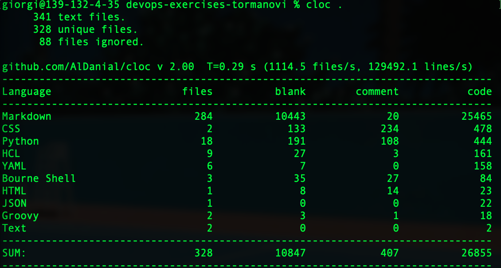
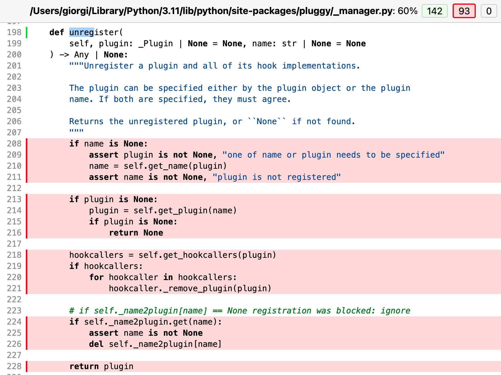
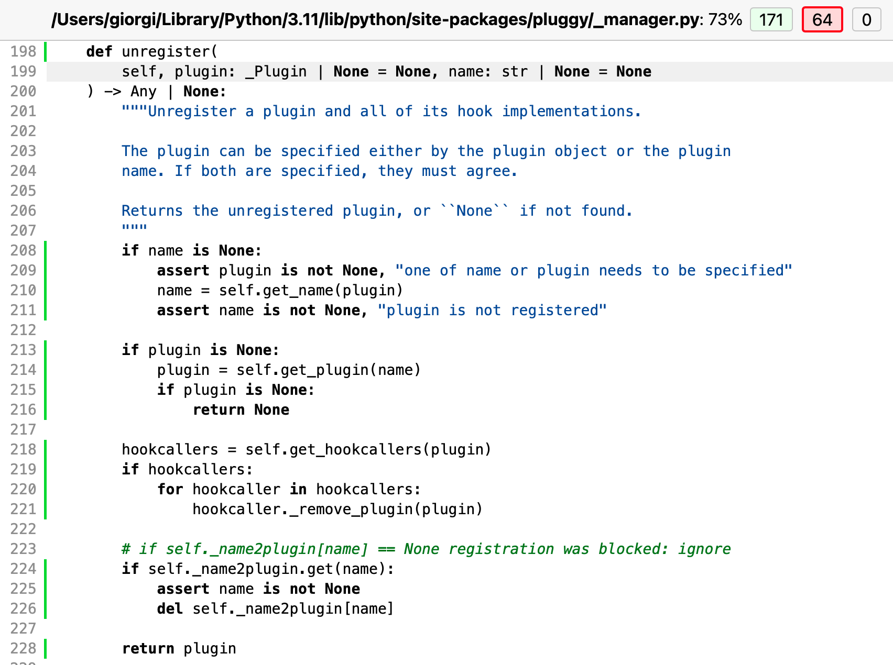
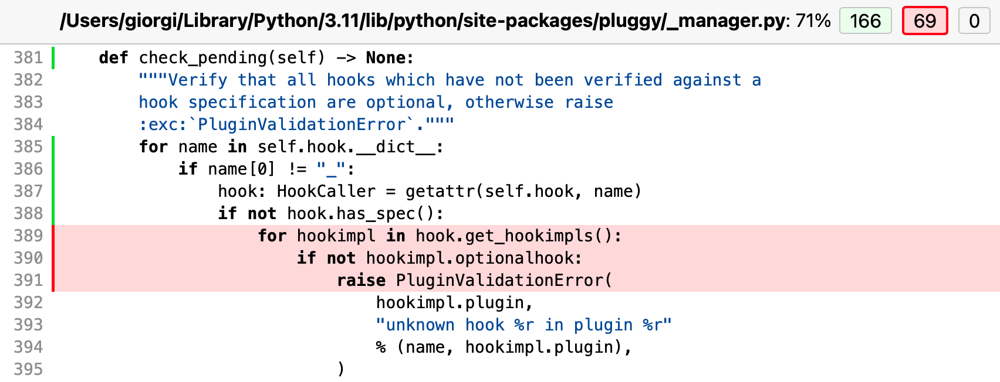
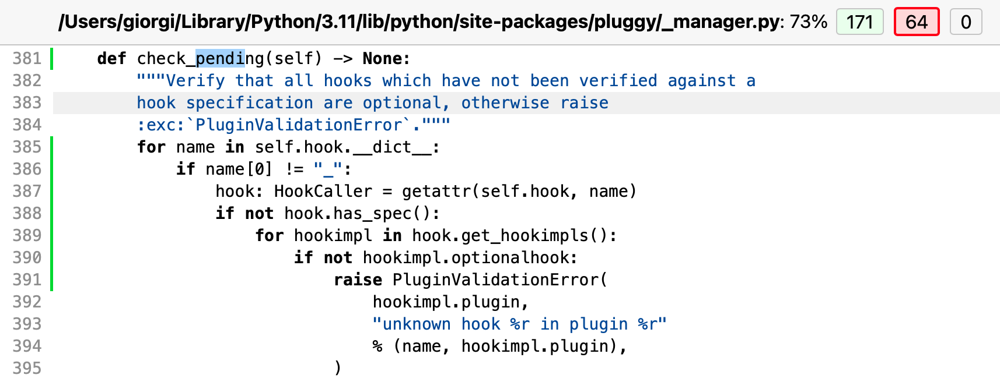
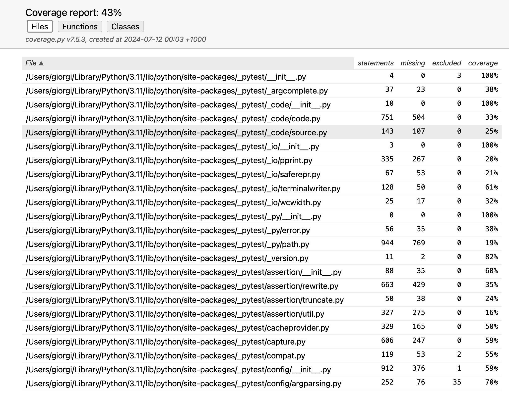
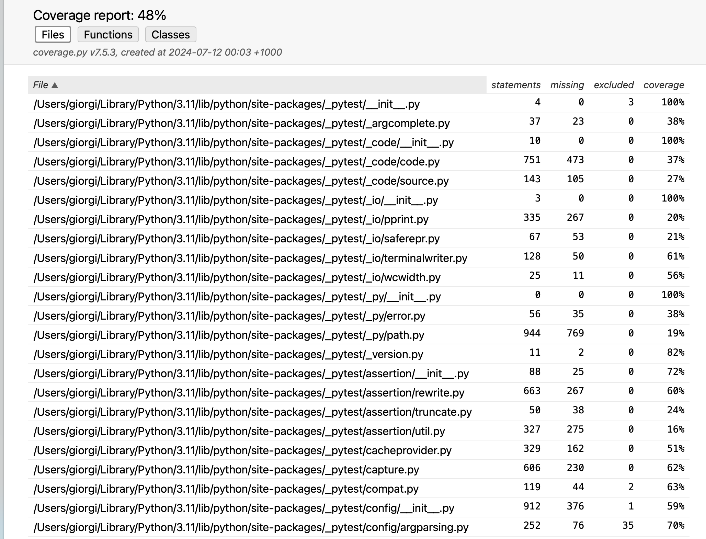

# Report for Assignment 1 resit

## Project chosen

Name: <devops-exercises>

URL: <https://github.com/bregman-arie/devops-exercises>

Number of lines of code and the tool used to count it: <26855, cloc>

Programming language: <python>

## Coverage measurement with existing tool

<Inform the name of the existing tool that was executed and how it was executed>

I used pytest. I used the commands:
pip3 install pytest, 
export PATH=$PATH:/Users/giorgi/Library/Python/3.11/bin,  
source ~/.zshrc  # or source ~/.bash_profile if you are using bash, 
coverage run -m pytest,  
coverage html
open htmlcov/index.html.

<Show the coverage results provided by the existing tool with a screenshot>

## Coverage improvement

### Individual tests

<The following is supposed to be repeated for each function (2 in total)>

<Function 1>

<Show a patch (diff) or a link to a commit made in your forked repository that shows the new/enhanced tests for function 1>

https://github.com/Tormanovi/devops-exercises-tormanovi/commit/d87958d807d3d363ce56a8d4457287c5e55f8d7d

<Provide a screenshot of the old coverage results for such function>

<Provide a screenshot of the new coverage results for such function>

<State the coverage improvement with a number and elaborate on why the coverage is improved>

The code coverage went from 0% coverage to 100% coverage, which can be seen by the fact that all lines inside the function went from from red to white in the coverage report.

<Function 2>

<Show a patch (diff) or a link to a commit made in your forked repository that shows the new/enhanced tests for function 1>

https://github.com/Tormanovi/devops-exercises-tormanovi/commit/d87958d807d3d363ce56a8d4457287c5e55f8d7d

<Provide a screenshot of the old coverage results for such function>

<Provide a screenshot of the new coverage results for such function>

<State the coverage improvement with a number and elaborate on why the coverage is improved>

The code coverage went from 66% coverage to 100% coverage. This can be seen by the fact that all lines inside the function which were red went from from red to white in the coverage report.

### Overall

<Provide a screenshot of the old coverage results by running an existing tool (the same as you already showed at the beginning of the report)>

<Provide a screenshot of the new coverage results by running the existing tool using all test modifications>

