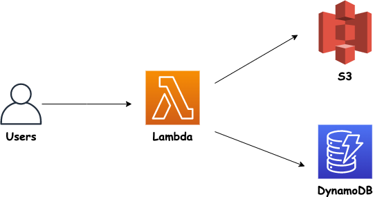
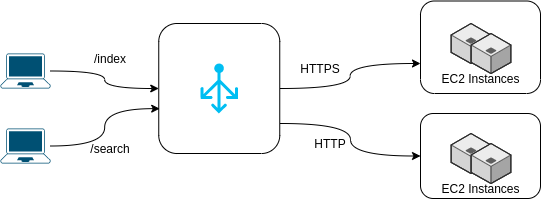

# AWS

**Note**: Some of the exercises <b>cost $$$</b> and can't be performed using the free tier/resources

**2nd Note**: Provided solutions are using the AWS console. It's recommended you'll use IaC technologies to solve the exercises (e.g. Terraform, Pulumi).<br>

- [AWS](#aws)
  - [Exercises](#exercises)
    - [IAM](#iam)
    - [EC2](#ec2)
    - [S3](#s3)
    - [ELB](#elb)
    - [Auto Scaling Groups](#auto-scaling-groups)
    - [VPC](#vpc)
    - [Databases](#databases)
    - [DNS](#dns)
    - [Containers](#containers)
    - [Lambda](#lambda)
    - [Elastic Beanstalk](#elastic-beanstalk)
    - [CodePipeline](#codepipeline)
    - [CDK](#cdk)
    - [Misc](#misc)
  - [Questions](#questions)
    - [Global Infrastructure](#global-infrastructure)
    - [IAM](#iam-1)
    - [EC2](#ec2-1)
      - [AMI](#ami)
      - [EBS](#ebs)
      - [Instance Store](#instance-store)
      - [EFS](#efs)
      - [Pricing Models](#pricing-models)
      - [Launch Template](#launch-template)
      - [ENI](#eni)
      - [Placement Groups](#placement-groups)
    - [VPC](#vpc-1)
      - [Default VPC](#default-vpc)
    - [Lambda](#lambda-1)
    - [Containers](#containers-1)
      - [ECS](#ecs)
      - [Fargate](#fargate)
    - [S3](#s3-1)
      - [Basics](#basics)
      - [Buckets 101](#buckets-101)
      - [Objects](#objects)
      - [S3 Security](#s3-security)
      - [Misc](#misc-1)
    - [Disaster Recovery](#disaster-recovery)
    - [CloudFront](#cloudfront)
    - [ELB](#elb-1)
      - [NLB](#nlb)
      - [ALB](#alb)
    - [Auto Scaling Group](#auto-scaling-group)
    - [Security](#security)
    - [Databases](#databases-1)
      - [RDS](#rds)
      - [Aurora](#aurora)
      - [DynamoDB](#dynamodb)
      - [ElastiCache](#elasticache)
      - [RedShift](#redshift)
    - [Identify the Service](#identify-the-service)
    - [DNS (Route 53)](#dns-route-53)
    - [SQS](#sqs)
    - [SNS](#sns)
    - [Monitoring and Logging](#monitoring-and-logging)
    - [Billing and Support](#billing-and-support)
      - [AWS Organizations](#aws-organizations)
    - [Automation](#automation)
    - [Misc](#misc-2)
    - [High Availability](#high-availability)
    - [Production Operations and Migrations](#production-operations-and-migrations)
    - [Scenarios](#scenarios)
    - [Architecture Design](#architecture-design)
    - [Misc](#misc-3)

## Exercises

### IAM

|Name|Topic|Objective & Instructions|Solution|Comments|
|--------|--------|------|----|----|
| Create a User | IAM | [Exercise](exercises/create_user/exercise.md) | [Solution](exercises/create_user/solution.md) | |
| Password Policy | IAM | [Exercise](exercises/password_policy_and_mfa/exercise.md) | [Solution](exercises/password_policy_and_mfa/solution.md) | |
| Create a role | IAM | [Exercise](exercises/create_role/exercise.md) | [Solution](exercises/create_role/solution.md) | |
| Credential Report | IAM | [Exercise](exercises/credential_report/exercise.md) | [Solution](exercises/credential_report/solution.md) | |
| Access Advisor | IAM | [Exercise](exercises/access_advisor/exercise.md) | [Solution](exercises/access_advisor/solution.md) | |

### EC2

|Name|Topic|Objective & Instructions|Solution|Comments|
|--------|--------|------|----|----|
| Launch EC2 web instance | EC2 | [Exercise](exercises/launch_ec2_web_instance/exercise.md) | [Solution](exercises/launch_ec2_web_instance/solution.md) | |
| Security Groups | EC2 | [Exercise](exercises/security_groups/exercise.md) | [Solution](exercises/security_groups/solution.md) | |
| IAM Roles | EC2, IAM | [Exercise](exercises/ec2_iam_roles/exercise.md) | [Solution](exercises/ec2_iam_roles/solution.md) | |
| Spot Instances | EC2 | [Exercise](exercises/create_spot_instances/exercise.md) | [Solution](exercises/create_spot_instances/solution.md) | |
| Elastic IP | EC2, Networking | [Exercise](exercises/elastic_ip/exercise.md) | [Solution](exercises/elastic_ip/solution.md) | |
| Placement Groups Creation | EC2, Placement Groups | [Exercise](exercises/placement_groups/exercise.md) | [Solution](exercises/placement_groups/solution.md) | |
| Elastic Network Interfaces | EC2, ENI | [Exercise](exercises/elastic_network_interfaces/exercise.md) | [Solution](exercises/elastic_network_interfaces/solution.md) | |
| Hibernate an Instance | EC2 | [Exercise](exercises/hibernate_instance.md) | [Solution](exercises/hibernate_instance/solution.md) | |
| Volume Creation | EC2, EBS | [Exercise](exercises/ebs_volume_creation/exercise.md) | [Solution](exercises/ebs_volume_creation/solution.md) | |
| Snapshots | EC2, EBS | [Exercise](exercises/snapshots/exercise.md) | [Solution](exercises/snapshots/solution.md) | |
| Create an AMI | EC2, AMI | [Exercise](exercises/create_ami/exercise.md) | [Solution](exercises/create_ami/solution.md) | |
| Create EFS | EC2, EFS | [Exercise](exercises/create_efs/exercise.md) | [Solution](exercises/create_efs/solution.md) | |

### S3

|Name|Topic|Objective & Instructions|Solution|Comments|
|--------|--------|------|----|----|
| Create buckets | S3 | [Exercise](exercises/s3/new_bucket/exercise.md) | [Solution](exercises/s3/new_bucket/solution.md)
| Bucket Lifecycle Policy | S3, Lifecycle Policy |  | 
### ELB

|Name|Topic|Objective & Instructions|Solution|Comments|
|--------|--------|------|----|----|
| Application Load Balancer | ELB, ALB | [Exercise](exercises/app_load_balancer/exercise.md) | [Solution](exercises/app_load_balancer/solution.md) | |
| Multiple Target Groups | ELB, ALB | [Exercise](exercises/alb_multiple_target_groups/exercise.md) | [Solution](exercises/alb_multiple_target_groups/solution.md) | |
| Network Load Balancer | ELB, NLB | [Exercise](exercises/network_load_balancer/exercise.md) | [Solution](exercises/network_load_balancer/solution.md) | |

### Auto Scaling Groups

|Name|Topic|Objective & Instructions|Solution|Comments|
|--------|--------|------|----|----|
| Auto Scaling Groups Basics | ASG | [Exercise](exercises/auto_scaling_groups_basics/exercise.md) | [Solution](exercises/auto_scaling_groups_basics/solution.md) | |
| Dynamic Scaling Policy | ASG, Policies | [Exercise](exercises/asg_dynamic_scaling_policy/exercise.md) | [Solution](exercises/asg_dynamic_scaling_policy/solution.md) | |

### VPC

|Name|Topic|Objective & Instructions|Solution|Comments|
|--------|--------|------|----|----|
| My First VPC | VPC | [Exercise](exercises/new_vpc/exercise.md) | [Solution](exercises/new_vpc/solution.md) | |
| Subnets | VPC | [Exercise](exercises/subnets/exercise.md) | [Solution](exercises/subnets/solution.md) | |

### Databases

|Name|Topic|Objective & Instructions|Solution|Comments|
|--------|--------|------|----|----|
| MySQL DB | RDS | [Exercise](exercises/mysql_db/exercise.md) | [Solution](exercises/mysql_db/solution.md) | |
| Aurora DB | RDS | [Exercise](exercises/aurora_db/exercise.md) | [Solution](exercises/aurora_db/solution.md) | |
| ElastiCache | ElastiCache | [Exercise](exercises/elasticache/exercise.md) | [Solution](exercises/elasticache/solution.md) | |

### DNS

|Name|Topic|Objective & Instructions|Solution|Comments|
|--------|--------|------|----|----|
Register Domain | Route 53 | [Exercise](exercises/register_domain/exercise.md) | [Solution](exercises/register_domain/solution.md) | |
Creating Records | Route 53 | [Exercise](exercises/creating_records/exercise.md) | [Solution](exercises/creating_records/solution.md) | |
Health Checks | Route 53 | [Exercise](exercises/health_checks/exercise.md) | [Solution](exercises/health_checks/solution.md) | |
Failover | Route 53 | [Exercise](exercises/route_53_failover/exercise.md) | [Solution](exercises/route_53_failover/solution.md) | |

### Containers

|Name|Topic|Objective & Instructions|Solution|Comments|
|--------|--------|------|----|----|
| ECS Task | ECS, Fargate | [Exercise](exercises/ecs_task/exercise.md) | [Solution](exercises/ecs_task/solution.md) | |

### Lambda

|Name|Topic|Objective & Instructions|Solution|Comments|
|--------|--------|------|----|----|
| Hello Function | Lambda | [Exercise](exercises/hello_function/exercise.md) | [Solution](exercises/hello_function/solution.md) | |
| URL Function | Lambda | [Exercise](exercises/url_function/exercise.md) | [Solution](exercises/url_function/solution.md) | |
| Web App with DB | Lambda, DynamoDB | [Exercise](exercises/web_app_dynamodb/exercise.md) | [Solution](exercises/web_app_dynamodb/solution.md) | |

### Elastic Beanstalk

|Name|Topic|Objective & Instructions|Solution|Comments|
|--------|--------|------|----|----|
| Simple Elastic Beanstalk Node.js app | Elastic Beanstalk | [Exercise](exercises/elastic_beanstalk_simple/exercise.md) | [Solution](exercises/elastic_beanstalk_simple/solution.md) | |

### CodePipeline

|Name|Topic|Objective & Instructions|Solution|Comments|
|--------|--------|------|----|----|
| Basic CI with S3 | CodePipeline & S3 | [Exercise](exercises/basic_s3_ci/exercise.md) | [Solution](exercises/basic_s3_ci/solution.md) | |

### CDK

|Name|Topic|Objective & Instructions|Solution|Comments|
|--------|--------|------|----|----|
| Sample CDK | CDK | [Exercise](exercises/sample_cdk/exercise.md) | [Solution](exercises/sample_cdk/solution.md) | |
### Misc

|Name|Topic|Objective & Instructions|Solution|Comments|
|--------|--------|------|----|----|
| Budget Setup | Budget | [Exercise](exercises/budget_setup/exercise.md) | [Solution](exercises/budget_setup/solution.md) | |
| No Application :'( | Troubleshooting | [Exercise](exercises/no_application/exercise.md) | [Solution](exercises/no_application/solution.md) | |

## Questions

### Global Infrastructure

<details>
<summary>Explain the following

  * Availability zone
  * Region
  * Edge location</summary><br><b>

AWS regions are data centers hosted across different geographical locations worldwide.<br>

Within each region, there are multiple isolated locations known as Availability Zones. Each availability zone is one or more data-centers with redundant network and connectivity and power supply. Multiple availability zones ensure high availability in case one of them goes down.<br>

Edge locations are basically content delivery network which caches data and insures lower latency and faster delivery to the users in any location. They are located in major cities in the world.
</b></details>

<details>
<summary>True or False? Each AWS region is designed to be completely isolated from the other AWS regions </summary><br><b>

True.
</b></details>

<details>
<summary>True or False? Each region has a minimum number of 1 availability zones and the maximum is 4</summary><br><b>

False. The minimum is 2 while the maximum is 6.
</b></details>

<details>
<summary>What considerations to take when choosing an AWS region for running a new application?</summary><br><b>

* Services Availability: not all service (and all their features) are available in every region
* Reduced latency: deploy application in a region that is close to customers
* Compliance: some countries have more strict rules and requirements such as making sure the data stays within the borders of the country or the region. In that case, only specific region can be used for running the application
* Pricing: the pricing might not be consistent across regions so, the price for the same service in different regions might be different.
</b></details>

### IAM

<details>
<summary>What is IAM? What are some of its features?</summary><br><b>

In short, it's used for managing users, groups, access policies & roles
Full explanation can be found [here](https://aws.amazon.com/iam)
</b></details>

<details>
<summary>True or False? IAM configuration is defined globally and not per region</summary><br><b>

True
</b></details>

<details>
<summary>True or False? When creating an AWS account, root account is created by default. This is the recommended account to use and share in your organization</summary><br><b>

False. Instead of using the root account, you should be creating users and use them.
</b></details>

<details>
<summary>True or False? Groups in AWS IAM, can contain only users and not other groups</summary><br><b>

True
</b></details>

<details>
<summary>True or False? Users in AWS IAM, can belong only to a single group</summary><br><b>

False. Users can belong to multiple groups.
</b></details>

<details>
<summary>What are some best practices regarding IAM in AWS?</summary><br><b>

* Delete root account access keys and don't use root account regularly
* Create IAM user for any physical user. Don't share users.
* Apply "least privilege principle": give users only the permissions they need, nothing more than that.
* Set up MFA and consider enforcing using it
* Make use of groups to assign permissions ( user -> group -> permissions )
</b></details>

<details>
<summary>What permissions does a new user have?</summary><br><b>

Only a login access.
</b></details>

<details>
<summary>True or False? If a user in AWS is using password for authenticating, he doesn't needs to enable MFA</summary><br><b>

False(!). MFA is a great additional security layer to use for authentication.
</b></details>

<details>
<summary>What ways are there to access AWS?</summary><br><b>

  * AWS Management Console
  * AWS CLI
  * AWS SDK
</b></details>

<details>
<summary>What are Roles?</summary><br><b>

[AWS docs](https://docs.aws.amazon.com/IAM/latest/UserGuide/id_roles.html): "An IAM role is an IAM identity that you can create in your account that has specific permissions...it is an AWS identity with permission policies that determine what the identity can and cannot do in AWS."
For example, you can make use of a role which allows EC2 service to access s3 buckets (read and write).
</b></details>

<details>
<summary>What are Policies?</summary><br><b>

Policies documents used to give permissions as to what a user, group or role are able to do. Their format is JSON.
</b></details>

<details>
<summary>A user is unable to access an s3 bucket. What might be the problem?</summary><br><b>

There can be several reasons for that. One of them is lack of policy. To solve that, the admin has to attach the user with a policy what allows him to access the s3 bucket.
</b></details>

<details>
<summary>What should you use to:

  - Grant access between two services/resources?
  - Grant user access to resources/services?</summary><br><b>

  * Role
  * Policy
</b></details>

<details>
<summary>What statements AWS IAM policies are consist of?</summary><br><b>

* Sid: identifier of the statement (optional)
* Effect: allow or deny access
* Action: list of actions (to deny or allow)
* Resource: a list of resources to which the actions are applied
* Principal: role or account or user to which to apply the policy
* Condition: conditions to determine when the policy is applied (optional)
</b></details>

<details>
<summary>Explain the following policy:

```
{
    "Version": "2012-10-17",
    "Statement": [
        {
            "Effect:": "Allow",
            "Action": "*",
            "Resources": "*"
        }
    ]
}
```
</summary><br><b>

This policy permits to perform any action on any resource. It happens to be the "AdministratorAccess" policy.
</b></details>

<details>
<summary>What security tools AWS IAM provides?</summary><br><b>

* IAM Credentials Report: lists all the account users and the status of their credentials
* IAM Access Advisor: Shows service permissions granted to a user and information on when he accessed these services the last time
</b></details>

<details>
<summary>Which tool would you use to optimize user permissions by identifying which services he doesn't regularly (or at all) access?</summary><br><b>

IAM Access Advisor
</b></details>

<details>
<summary>What type of IAM object would you use to allow inter-service communication?</summary><br><b>

Role
</b></details>
### EC2

<details>
<summary>What is EC2?</summary><br><b>

"a web service that provides secure, resizable compute capacity in the cloud".
Read more [here](https://aws.amazon.com/ec2)
</b></details>

<details>
<summary>True or False? EC2 is a regional service</summary><br><b>

True. As opposed to IAM for example, which is a global service, EC2 is a regional service.
</b></details>

<details>
<summary>What are some of the properties/configuration options of EC2 instances that can be set or modified?</summary><br><b>

* OS (Linux, Windows)
* RAM and CPU
* Networking - IP, Card properties like speed
* Storage Space - (EBS, EFS, EC2 Instance Store)
* EC2 User Data
* Security groups
</b></details>

<details>
<summary>What would you use for customizing EC2 instances? As in software installation, OS configuration, etc.</summary><br><b>

AMI. With AMI (Amazon Machine Image) you can customize EC2 instances by specifying which software to install, what OS changes should be applied, etc.
</b></details>

#### AMI

<details>
<summary>What is AMI?</summary><br><b>

Amazon Machine Images is "An Amazon Machine Image (AMI) provides the information required to launch an instance".
Read more [here](https://docs.aws.amazon.com/AWSEC2/latest/UserGuide/AMIs.html)
</b></details>

<details>
<summary>What are the different sources for AMIs?</summary><br><b>

* Personal AMIs - AMIs you create
* AWS Marketplace for AMIs - AMIs made by others, mostly sold for some price
* Public AMIs - Provided by AWS
</b></details>

<details>
<summary>True or False? AMI are built for specific region</summary><br><b>

True (but they can be copied from one region to another).
</b></details>

<details>
<summary>Describe in high-level the process of creating AMIs</summary><br><b>

1. Start an EC2 instance
2. Customized the EC2 instance (install packages, change OS configuration, etc.)
3. Stop the instance (for avoiding data integrity issues)
4. Create EBS snapshot and build an AMI
5. To verify and test the AMI, launch an instance from the AMI
</b></details>

<details>
<summary>What is an instance type?</summary><br><b>

"the instance type that you specify determines the hardware of the host computer used for your instance"
Read more about instance types [here](https://docs.aws.amazon.com/AWSEC2/latest/UserGuide/instance-types.html)
</b></details>

<details>
<summary>Explain the instance type naming convention</summary><br><b>

Let's take for example the following instance type: m5.large

`m` is the instance class
`5` is the generation
`large` is the size of the instance (affects the spec properties like vCPUs and RAM)
</b></details>

<details>
<summary>True or False? The following are instance types available for a user in AWS:

  * Compute optimized
  * Network optimized
  * Web optimized</summary><br><b>

False. From the above list only compute optimized is available.
</b></details>

<details>
<summary>Explain each of the following instance types:

  * "Compute Optimized"
  * "Memory Optimized"
  * "Storage Optimized"</summary><br><b>

Compute Optimized:

* Used for compute-intensive tasks
* It has high performance processors
* Use cases vary: gaming serves, machine learning, batch processing, etc.

Memory Optimized:

* Used for processing large data sets in memory
* Other use cases: high performance, databases, distributed cache stores

Storage Optimized:

* Used for storage intensive tasks - high read and write access to large data sets
* Use cases: databases, OLTP system, distributing file systems
</b></details>

<details>
<summary>What can you attach to an EC2 instance in order to store data?</summary><br><b>

EBS
</b></details>

#### EBS

<details>
<summary>Explain Amazon EBS</summary><br><b>

[AWS Docs](https://docs.aws.amazon.com/AWSEC2/latest/UserGuide/AmazonEBS.html): "provides block level storage volumes for use with EC2 instances. EBS volumes behave like raw, unformatted block devices."
</b></details>

<details>
<summary>What happens to EBS volumes when the instance is terminated?</summary><br><b>

By deafult, the root volume is marked for deletion, while other volumes will still remain.<br>
You can control what will happen to every volume upon termination.
</b></details>

<details>
<summary>What happens to the EC2 disk (EBS) when the instance is stopped?</summary><br><b>

Disk is intact and can be used when the instance starts.
</b></details>

<details>
<summary>True or False? EBS volumes are locked to a specific availability zone</summary><br><b>

True
</b></details>

<details>
<summary>Explain EBS Snapshots</summary><br><b>

EBS snapshots used for making a backup of the EBS volume at point of time.
</b></details>

<details>
<summary>What are the use cases for using EBS snapshots?</summary><br><b>

* Backups of the data
* Moving the data between AZs
</b></details>

<details>
<summary>Is it possible to attach the same EBS volume to multiple EC2 instances?</summary><br><b>

Yes, with multi-attach it's possible to attach a single EBS volume to multiple instances.
</b></details>

<details>
<summary>True or False? EBS is a network drive hence, it requires network connectivity</summary><br><b>

True
</b></details>

<details>
<summary>What EBS volume types are there?</summary><br><b>

* HDD (st 1, sc 1): Low cost HDD volumes
* SSD
  * io1, io2: Highest performance SSD
  * gp2, gp3: General purpose SSD
</b></details>

<details>
<summary>If you need an EBS volume for low latency workloads, which volume type would you use?</summary><br><b>

SSD - io1, io2
</b></details>

<details>
<summary>If you need an EBS volume for workloads that require good performance but the cost is also an important aspect for you, which volume type would you use?</summary><br><b>

SSD - gp2, gp3
</b></details>

<details>
<summary>If you need an EBS volume for high-throughput, which volume type would you use?</summary><br><b>

SSD - io1, io2
</b></details>

<details>
<summary>If you need an EBS volume for infrequently data access, which volume type would you use?</summary><br><b>

HDD - sc1
</b></details>

<details>
<summary>Which EBS volume types can be used as boot volumes for EC2 instances?</summary><br><b>

SSD: gp2, gp3, io1, io2
</b></details>

<details>
<summary>True or False? In EBS gp2 volume type, IP will increase if the disk size increases</summary><br><b>

True.
</b></details>

#### Instance Store

<details>
<summary>If you would like to have an hardware disk attached to your EC2 instead of a network one (EBS). What would you use?</summary><br><b>

EC2 Instance Store.
</b></details>

<details>
<summary>Explain EC2 Instance Store. Why would someone choose to use it over other options?</summary><br><b>

EC2 instance store provides better I/O performances when compared to EBS.<br>
It is mostly used for cache and temporary data purposes.
</b></details>

<details>
<summary>Are there any disadvantages in using instance store over EBS?</summary><br><b>

Yes, the data on instance store is lost when they are stopped.
</b></details>

#### EFS

<details>
<summary>What is Amazon EFS?</summary><br><b>

[AWS Docs](https://aws.amazon.com/efs): "Amazon Elastic File System (Amazon EFS) provides a simple, scalable, fully managed elastic NFS file system for use with AWS Cloud services and on-premises resources."

In simpler words, it's a network file system you can mount on one or more EC2 instances.
</b></details>

<details>
<summary>True or False? EFS is locked into a single availability zone</summary><br><b>

False. EFS can be mounted across multiple availability zones.
</b></details>

<details>
<summary>What are some use cases for using EFS?</summary><br><b>

* Data sharing (e.g. developers working on the same source control)
* Web serving
* Content management
</b></details>

<details>
<summary>True or False? EFS only compatible with Linux based AMI</summary><br><b>

True
</b></details>

<details>
<summary>True or False? EFS requires the user to perform capacity planning as it doesn't scales automatically</summary><br><b>

False. EFS scales automatically and you pay-per-use.
</b></details>

<details>
<summary>What EFS modes are there?</summary><br><b>

* Performance mode
  * General purpose: used mainly for CMS, web serving, ... as it's optimal for latency sensitive applications
  * Max I/O: great for scaling to high levels of throughput and I/O operations per second
* Throughput mode
  * Bursting: scale throughput based on FS size
  * Provisioned: fixed throughput
</b></details>

<details>
<summary>Which EFS mode would you use if you need to perform media processing?</summary><br><b>

Performance Mode (Max I/O): It provides high throughput and scales to operations per second. Mainly used for big data, media processing, etc.
</b></details>

<details>
<summary>What is the default EFS mode?</summary><br><b>

Performance Mode (General Purpose): Used for web serving, CMS, ... anything that is sensitive to latency.
</b></details>

<details>
<summary>What EFS storage tiers are there?</summary><br><b>

* Standard: frequently accessed files
* Infrequent access: lower prices to store files but it also costs to retrieve them
</b></details>

#### Pricing Models

<details>
<summary>What EC2 pricing models are there?</summary><br><b>

On Demand - pay a fixed rate by the hour/second with no commitment. You can provision and terminate it at any given time.
Reserved - you get capacity reservation, basically purchase an instance for a fixed time of period. The longer, the cheaper.
Spot - Enables you to bid whatever price you want for instances or pay the spot price.
Dedicated Hosts - physical EC2 server dedicated for your use.
</b></details>

<details>
<summary>True or False? Reserved instance has to be used for a minimum of 1 year</summary><br><b>

True.
</b></details>

<details>
<summary>Explain the following types of reserved instances:

  * Convertible Reserved Instances
  * Scheduled Reserved Instances</summary><br><b>

* Convertible Reserved Instances: used for long running workloads but used when instance type might change during the period of time it's reserved
* Scheduled Reserved Instances: when you need to reserve an instance for a long period but you don't need it continuously (so for example you need it only in the morning)
</b></details>

<details>
<summary>True or False? In EC2 On Demand, you pay per hour when using Linux or Windows and per second (after first minute) when using any other operating system</summary><br><b>

False. You pay per second (after the first minute) when using Windows or Linux and per hour for any other OS.
</b></details>

<details>
<summary>You need an instance for short-term and the workload running on instance must not be interrupted. Which pricing model would you use?</summary><br><b>

On Demand is good for short-term non-interrupted workloads (but it also has the highest cost).
</b></details>

<details>
<summary>You need an instance for running an application for a period of 2 years continuously, without changing instance type. Which pricing model would you use?</summary><br><b>

Reserved instances: they are cheaper than on-demand and the instance is yours for the chosen period of time.
</b></details>

<details>
<summary>Which pricing model has potentially the biggest discount and what its advantage</summary><br><b>

Spot instances provide the biggest discount but has the disadvantage of risking losing them due bigger bid price.
</b></details>

<details>
<summary>You need an instance for two years, but only between 10:00-15:00 every day. Which pricing model would you use?</summary><br><b>

Reserved instances from the "Scheduled Reserved Instances" type which allows you to reserve for specific time window (like 10:00-15:00 every day).
</b></details>

<details>
<summary>You need an instance for running workloads. You don't care if they fail for a given moment as long as they run eventually. Which pricing model would you use?</summary><br><b>

Spot instances. The discount potential is the highest compared to all other pricing models. The disadvantage is that you can lose the instance at any point so, you must run only workloads that you are fine with them failing suddenly.
</b></details>

<details>
<summary>You need a physical server only for your use. Which pricing model are you going to use?</summary><br><b>

EC2 Dedicated Host
</b></details>

<details>
<summary>What are some of the differences between dedicated hosts and dedicated instances?</summary><br><b>

In dedicated hosts you have per host billing, you have more visibility (sockets, cores, ...) and you can control where instance will be placed.<br>
In dedicated instances the billing is per instance but you can't control placement and you don't have visibility of sockets, cores, ...
</b></details>

<details>
<summary>For what use cases, EC2 dedicated hosts are useful for?</summary><br><b>

* Compliance needs
* When the software license is complex (Bring Your Own License) and doesn't support cloud or multi-tenants
* Regulatory requirements
</b></details>

<details>
<summary>What are Security Groups?</summary><br><b>

"A security group acts as a virtual firewall that controls the traffic for one or more instances"
More on this subject [here](https://docs.aws.amazon.com/AWSEC2/latest/UserGuide/ec2-security-groups.html)
</b></details>

<details>
<summary>True or False? Security groups only contain deny rules</summary><br><b>

False. Security groups only contain allow rules.
</b></details>

<details>
<summary>True or False? One security group can be attached to multiple instances</summary><br><b>

True
</b></details>

<details>
<summary>True or False? Security groups are not locked down to a region and VPC (meaning you don't have to create a new one when switching regions)</summary><br><b>

False. They are locked down to regions and VPC.
</b></details>

<details>
<summary>True or False? By default, when using security groups, all inbound traffic to an EC2 instance is blocked and all outbound traffic is allowed</summary><br><b>

True
</b></details>

<details>
<summary>What is the advantage of referencing security groups from a given security group?</summary><br><b>

Imagine you have an instance referencing two security groups, allowing to get inbound traffic from them.<br>
Now imagine you have two instances, each using one of the security groups referenced in the instance we've just mentioned. This means you can get traffic from these two instances because they use security groups which referenced in the instance mentioned at the beginning. No need to use IPs.
</b></details>

<details>
<summary>How to migrate an instance to another availability zone?</summary><br><b>
</b></details>

<details>
<summary>What can you attach to an EC2 instance in order to store data?</summary><br><b>

EBS
</b></details>

<details>
<summary>What EC2 reserved instance types are there?</summary><br><b>

Standard RI - most significant discount + suited for steady-state usage
Convertible RI - discount + change attribute of RI + suited for steady-state usage
Scheduled RI - launch within time windows you reserve

Learn more about EC2 RI [here](https://aws.amazon.com/ec2/pricing/reserved-instances)
</b></details>

<details>
<summary>For how long can reserved instances be reserved?</summary><br><b>

1 or 3 years.
</b></details>

<details>
<summary>What allows you to control inbound and outbound instance traffic?</summary><br><b>

Security Groups
</b></details>

<details>
<summary>What bootstrapping means and how to use it in AWS EC2?</summary><br><b>

Bootstrapping is about launching commands when a machine starts for the first time.
In AWS EC2 this is done using the EC2 user data script.
</b></details>

<details>
<summary>You get time out when trying reach your application which runs on an EC2 instance. Specify one reason why it would possibly happen</summary><br><b>

Security group isn't configured properly.
</b></details>

<details>
<summary>What is the AWS Instance Connect?</summary><br><b>

[AWS](https://docs.aws.amazon.com/AWSEC2/latest/UserGuide/Connect-using-EC2-Instance-Connect.html): "Amazon EC2 Instance Connect provides a simple and secure way to connect to your Linux instances using Secure Shell (SSH)."
</b></details>

<details>
<summary>You try to run EC2 commands in an EC2 instance you've just created but it fails due to missing credentials. What would you do?</summary><br><b>

DO NOT configure AWS credentials on the instance (this means anyone else in your account would be able to use and see your credentials).<br>
The best practice is to attach an IAM role with sufficient permissions (like `IAMReadOnlyAccess`)
</b></details>

<details>
<summary>True or False? Cancelling a Spot instance request terminates the instance</summary><br><b>

False. When you cancel a Spot instance request, you are not terminating the instances created by it.<br>
To terminate such instances, you must cancel the Spot instance request first.
</b></details>

<details>
<summary>What are Spot Fleets?</summary><br><b>

Set of Spot instances and if you would like, also on-demand instances.
</b></details>

<details>
<summary>What strategies are there to allocate Spot instances?</summary><br><b>

* lowestPrice: launch instances from the pool that has the lowest price
* diversified: distributed across all pools
* capacityOptimized: optimized based on the number of instances
</b></details>

<details>
<summary>From networking perspective, what do you get by default when running an EC2 instance?</summary><br><b>

A private IP and a public IP.
</b></details>

<details>
<summary>Explain EC2 hibernate</summary><br><b>

[AWS Docs](https://docs.aws.amazon.com/AWSEC2/latest/UserGuide/Hibernate.html: "Hibernation saves the contents from the instance memory (RAM) to your Amazon Elastic Block Store (Amazon EBS) root volume."
</b></details>

<details>
<summary>True or False? Using EC2 hibernate option results in having faster instance boot</summary><br><b>

True. This is because the operating system isn't restarted or stopped.
</b></details>

<details>
<summary>What are some use cases for using EC2 hibernate option?</summary><br><b>

* Save RAM state
* Service with long time initialization
* Keep long-running processes
</b></details>

<details>
<summary>What are some limitations of EC2 hibernate option?</summary><br><b>

* Instance RAM size is limited
* Root volume must be encrypted EBS
* Hibernation time is limited
* Doesn't supports all instances types
* No support for bare metal. Only On-Demand and Reserved instances
* Doesn't supports all AMIs
</b></details>

<details>
<summary>Explain what is EC2 Nitro</summary><br><b>

* Next generation EC2 instances using new virtualization technology
* Better EBS: 64,000 EBS IOPS
* Better networking: HPC, IPv6
* Better security
</b></details>

<details>
<summary>What CPU customization is available with EC2?</summary><br><b>

* Modifying number of CPU cores (useful for high RAM and low CPU applications)
* Modifying number of threads per cure (useful for HPC workloads)
</b></details>

<details>
<summary>Explain EC2 Capacity Reservations</summary><br><b>

* Allows you to ensure you have EC2 capacity when you need it
* Usually combined with Reserved Instances and Saving Plans to achieve cost saving
</b></details>

#### Launch Template

<details>
<summary>What is a launch template?</summary><br><b>

[AWS Docs](https://docs.aws.amazon.com/AWSEC2/latest/UserGuide/ec2-launch-templates.html): "You can create a launch template that contains the configuration information to launch an instance. You can use launch templates to store launch parameters so that you do not have to specify them every time you launch an instance"
</b></details>

<details>
<summary>What is the difference between Launch Configuration and Launch Template?</summary><br><b>

Launch configuration is a legacy form of Launch Template that must be recreated every time you would like to update the configuration.

In addition, launch template has the clear benefits of:
  * Provision both On-Demand and Spot instances
  * supporting multiple versions
  * support creating parameters subsets (used for re-use and inheritance)
</b></details>

#### ENI

<details>
<summary>Explain Elastic Network Interfaces (ENI)</summary><br><b>

[AWS Docs](https://docs.aws.amazon.com/AWSEC2/latest/UserGuide/using-eni.html): "An elastic network interface is a logical networking component in a VPC that represents a virtual network card."
</b></details>

<details>
<summary>Name at least three attributes the Elastic Network Interfaces (ENI) can include</summary><br><b>

1. One public IPv4 address
2. Mac Address
3. A primary private IPv4 address (from the address range of your VPC)
</b></details>

<details>
<summary>True or False? ENI are not bound to a specific availability zone</summary><br><b>

False. ENI are bound to specific availability zone.
</b></details>

<details>
<summary>True or False? ENI can be created independently of EC2 instances</summary><br><b>

True. They can be attached later on and on the fly (for failover purposes).
</b></details>

#### Placement Groups

<details>
<summary>What are "Placement Groups"?</summary><br><b>

[AWS Docs](https://docs.aws.amazon.com/AWSEC2/latest/UserGuide/placement-groups.html): "When you launch a new EC2 instance, the EC2 service attempts to place the instance in such a way that all of your instances are spread out across underlying hardware to minimize correlated failures. You can use placement groups to influence the placement of a group of interdependent instances to meet the needs of your workload."
</b></details>

<details>
<summary>What Placement Groups strategies are there?</summary><br><b>

* Cluster: places instance close together in an AZ.
* Spread: spreads the instance across the hardware
* Partition: spreads the instances across different partitions (= different sets of hardware/racks) within an AZ
</b></details>

<details>
<summary>For each of the following scenarios choose a placement group strategy:

  * High availability is top priority
  * Low latency between instances
  * Instances must be isolated from each other
  * Big Data applications that are partition aware
  * Big Data process that needs to end quickly</summary><br><b>

  * High availability is top priority - Spread
  * Low latency between instances - Cluster
  * Instances must be isolated from each other - Spread
  * Big Data applications that are partition aware - Partition
  * Big Data process that needs to end quickly - Cluster
</b></details>

<details>
<summary>What are the cons and pros of the "Cluster" placement group strategy?</summary><br><b> 

Cons: if the hardware fails, all instances fail
Pros: Low latency & high throughput network
</b></details>

<details>
<summary>What are the cons and pros of the "Spread" placement group strategy?</summary><br><b> 

Cons:
  * Current limitation is 7 instances per AZ (per replacement group)
Pros:
  * Maximized high availability (instances on different hardware, span across AZs)
</b></details>

### VPC

<details>
<summary>What is VPC?</summary><br><b>

"A logically isolated section of the AWS cloud where you can launch AWS resources in a virtual network that you define"
Read more about it [here](https://aws.amazon.com/vpc).
</b></details>

<details>
<summary>True or False? VPC spans multiple regions</summary><br><b>

False
</b></details>

<details>
<summary>True or False? It's possible to have multiple VPCs in one region</summary><br><b>

True. As of today, the soft limit is 5.
</b></details>

<details>
<summary>True or False? Subnets belong to the same VPC, can be in different availability zones</summary><br><b>

True. Just to clarify, a single subnet resides entirely in one AZ.
</b></details>

<details>
<summary>You have noticed your VPC's subnets (which use x.x.x.x/20 CIDR) have 4096 available IP addresses although this CIDR should have 4096 addresses. What is the reason for that?</summary><br><b>

AWS reserves 5 IP addresses in each subnet - first 4 and the last one, and so they aren't available for use.
</b></details>

<details>
<summary>What AWS uses the 5 reserved IP addresses for?</summary><br><b>

x.x.x.0 - network address
x.x.x.1 - VPC router
x.x.x.2 - DNS mapping
x.x.x.3 - future use
x.x.x.255 - broadcast address
</b></details>

<details>
<summary>What is an Internet Gateway?</summary><br><b>

[AWS Docs](https://docs.aws.amazon.com/vpc/latest/userguide/VPC_Internet_Gateway.html): "component that allows communication between instances in your VPC and the internet"

In addition it's good to know that IGW is:
  * Highly available and redundant
  * Not porivding internet access by its own (you need route tables to be edited)
  * Created separately from VPC
</b></details>

<details>
<summary>True or False? One or more VPCs can be attached to one Internet Gateway</summary><br><b>

False. Only one VPC can be attached to one IGW and vice versa
</b></details>

<details>
<summary>True or False? NACL allow or deny traffic on the subnet level</summary><br><b>

True
</b></details>

<details>
<summary>What is VPC peering?</summary><br><b>

[docs.aws](https://docs.aws.amazon.com/vpc/latest/peering/what-is-vpc-peering.html): "A VPC peering connection is a networking connection between two VPCs that enables you to route traffic between them using private IPv4 addresses or IPv6 addresses."
</b></details>

<details>
<summary>True or False? Multiple Internet Gateways can be attached to one VPC</summary><br><b>

False. Only one internet gateway can be attached to a single VPC.
</b></details>

<details>
<summary>You've restarted your EC2 instance and the public IP has changed. How would you deal with it so it won't happen?</summary><br><b>

Use Elastic IP which provides you a fixed IP address.
</b></details>

<details>
<summary>When creating a new VPC, there is an option called "Tenancy". What is it used for?</summary><br><b>
</b></details>

<details>
<summary>What is an Elastic IP address?</summary><br><b>

[AWS Docs](https://docs.aws.amazon.com/AWSEC2/latest/UserGuide/elastic-ip-addresses-eip.html): "An Elastic IP address is a static IPv4 address designed for dynamic cloud computing. An Elastic IP address is allocated to your AWS account, and is yours until you release it. By using an Elastic IP address, you can mask the failure of an instance or software by rapidly remapping the address to another instance in your account."
</b></details>

<details>
<summary>Why would you use an Elastic IP address?</summary><br><b>

Let's say you have an instance that you need to shutdown or perform some maintenance on. In that case, what you would want to do is to move the Elastic IP address to another instance that is operational, until you finish to perform the maintenance and then you can move it back to the original instance (or keep it assigned to the second one).
</b></details>

<details>
<summary>True or False? When stopping and starting an EC2 instance, its public IP changes</summary><br><b>

True
</b></details>

<details>
<summary>What are the best practices around Elastic IP?</summary><br><b>

The best practice is actually not using them in the first place. It's more common to use a load balancer without a public IP or use a random public IP and register a DNS record to it
</b></details>

<details>
<summary>True or False? An Elastic IP is free, as long it's not associated with an EC2 instance</summary><br><b>

False. An Elastic IP is free of charge as long as **it is ** associated with an EC2 instance. This instance should be running and should have only one Elastic IP.
</b></details>

<details>
<summary>True or False? Route Tables used to allow or deny traffic from the internet to AWS instances</summary><br><b>

False.
</b></details>

<details>
<summary>Explain Security Groups and Network ACLs</summary><br><b>

* NACL - security layer on the subnet level.
* Security Group - security layer on the instance level.

Read more about it [here](https://docs.aws.amazon.com/AWSEC2/latest/UserGuide/ec2-security-groups.html) and [here](https://docs.aws.amazon.com/vpc/latest/userguide/VPC_SecurityGroups.html)
</b></details>

<details>
<summary>What is AWS Direct Connect?</summary><br><b>

Allows you to connect your corporate network to AWS network.
</b></details>

<details>
<summary>What would you use if you need a fixed public IP for your EC2 instance?</summary><br><b>

Elastic IP
</b></details>

<details>
<summary>Kratos, your colleague, decided to use a subnet of /27 because he needs 29 IP addresses for EC2 instances. Is Kratos right?</summary><br><b>

No. Since AWS reserves 5 IP addresses for every subnet, Kratos will have 32-5=27 addresses and this is less than what he needs (29).

It's better if Kratos uses a subnet of size /26 but good luck telling him that.
</b></details>

#### Default VPC

<details>
<summary>True or False? By default, any new account has a default VPC</summary><br><b>

True.
</b></details>

<details>
<summary>True or False? Default VPC doesn't have internet connectivity and any launched EC2 will only have a private IP assigned</summary><br><b>

False. The default VPC has internet connectivity and any launched EC2 instance gets a public IPv4 address.

In addition, any launched EC2 instance gets a public and private DNS names.
</b></details>

<details>
<summary>Which of the following is included with default VPC?

* Internet gateway connected to the default VPC
* A route to main route table that points all traffic to internet gateway
* Default public subnet
* Default /16 IPv4 CIDR block</summary><br><b>

All of them :)
</b></details>
### Lambda

<details>
<summary>Explain what is AWS Lambda</summary><br><b>

AWS definition: "AWS Lambda lets you run code without provisioning or managing servers. You pay only for the compute time you consume."

Read more on it [here](https://aws.amazon.com/lambda)
</b></details>

<details>
<summary>True or False? In AWS Lambda, you are charged as long as a function exists, regardless of whether it's running or not</summary><br><b>

False. Charges are being made when the function is executed for the time it takes to execute and compute resources it uses.
</b></details>

<details>
<summary>Which of the following set of languages Lambda supports?

- R, Swift, Rust, Kotlin
- Python, Ruby, Go, Kotlin, Bash
- Python, Ruby, PHP, PowerShell, C#, Perl
- Python, Ruby, Go, Node.js, Groovy, C++
- Python, Ruby, Go, Node.js, PowerShell, C#
</summary><br><b>

- Python, Ruby, Go, Node.js, PowerShell, C#
</b></details>

<details>
<summary>True or False? Basic lambda permissions allow you only to upload logs to Amazon CloudWatch Logs</summary><br><b>

True
</b></details>

<details>
<summary>What's one of the issues with the current architecture?


</summary><br><b>

Users shouldn't access directly AWS Lambda directly. If you'd to like to expose your Lambda function to users a better approach would be to set up API Gateway endpoint between the users and the Lambda function.

This not only provides enhanced security but also easier access for the user where he can use HTTP or HTTPS for accessing the function.
</b></details>

<details>
<summary>Specify one or more use cases for using AWS Lambda</summary><br><b>

- Uploading images to S3 and tagging them or inserting information on the images to a database
- Uploading videos to S3 and edit them or add subtitles/captions to them and store the result in S3
- Use SNS and/or SQS to trigger functions based on notifications or messages receieved from these services.
- Cron Jobs: Use Lambda together with CloudWatch events to schedule tasks/functions periodically.
</b></details>

<details>
<summary>You run an architecture where you have a Lambda function that uploads images to S3 bucket and stores information on the images in DynamoDB. You would like to expose the function to users so they can invoke it. Your friend Carlos suggests you expose the credentials to the Lambda function. What's your take on that?</summary><br><b>

That's a big no. You shouldn't let users direct access to your Lambda function.

The way to go here and expose the Lambda function to users is to to an API Gateway endpoint.
</b></details>

### Containers

#### ECS

<details>
<summary>What is Amazon ECS?</summary><br><b>

[AWS Docs](https://aws.amazon.com/ecs): "Amazon Elastic Container Service (Amazon ECS) is a fully managed container orchestration service. Customers such as Duolingo, Samsung, GE, and Cook Pad use ECS to run their most sensitive and mission critical applications because of its security, reliability, and scalability."

In simpler words, it allows you to launch containers on AWS.<br>
While AWS takes care of starting/stopping containers, you need to provision and maintain the infrastructure where the containers are running (EC2 instances).
</b></details>

<details>
<summary>What one should do in order to make EC2 instance part of an ECS cluster?</summary><br><b>

Install ECS agent on it. Some AMIs have built-in configuration for that.
</b></details>

<details>
<summary>What ECS launch types are there?</summary><br><b>

* EC2 Instance
* AWS Fargate
</b></details>

<details>
<summary>What is Amazon ECR?</summary><br><b>

[AWS Docs](https://aws.amazon.com/ecr): "Amazon Elastic Container Registry (ECR) is a fully-managed Docker container registry that makes it easy for developers to store, manage, and deploy Docker container images."
</b></details>

<details>
<summary>What the role "EC2 Instance Profile" is used for in regards to ECS?</summary><br><b>

EC2 Instance Profile used by ECS agent on an EC2 instance to:

  * Make API calls to ECS Service
  * Send logs to CloudWatch from the container
  * Use secrets defined in SSM Parameter Store or Secrets Manager
  * Pull container images from ECR (Registry)
</b></details>

<details>
<summary>How to share data between containers (some from ECS and some from Fargate)?</summary><br><b>

Using EFS is a good way to share data between containers and it works also between different AZs.
</b></details>

#### Fargate

<details>
<summary>What is AWS Fargate?</summary><br><b>

[Amazon Docs](https://aws.amazon.com/fargate): "AWS Fargate is a serverless, pay-as-you-go compute engine that lets you focus on building applications without managing servers. AWS Fargate is compatible with both Amazon Elastic Container Service (ECS) and Amazon Elastic Kubernetes Service (EKS)"

In simpler words, AWS Fargate allows you launch containers on AWS without worrying about managing infrastructure. It runs containers based on the CPU and RAM you need.
</b></details>

<details>
<summary>How AWS Fargate different from AWS ECS?</summary><br><b>

In AWS ECS, you manage the infrastructure - you need to provision and configure the EC2 instances.<br>
While in AWS Fargate, you don't provision or manage the infrastructure, you simply focus on launching Docker containers. You can think of it as the serverless version of AWS ECS.
</b></details>

<details>
<summary>True or False? Fargate creates an ENI for every task it runs</summary><br><b>

True.
</b></details>

### S3

#### Basics

<details>
<summary>Explain what is AWS S3?</summary><br><b>

- S3 is a object storage service which is fast, scalable and durable. S3 enables customers to upload, download or store any file or object that is up to 5 TB in size.<br>
- S3 stands for: Simple Storage Service
- As a user you don't have to worry about filesystems or disk space
</b></details>

#### Buckets 101

<details>
<summary>What is a bucket?</summary><br><b>

An S3 bucket is a resource which is similar to folders in a file system and allows storing objects, which consist of data.
</b></details>

<details>
<summary>True or False? Buckets are defined globally</summary><br><b>

False. They are defined at the region level.
</b></details>

<details>
<summary>True or False? A bucket name must be globally unique</summary><br><b>

True
</b></details>

<details>
<summary>How to rename a bucket in S3?</summary><br><b>

A S3 bucket name is immutable. That means it's not possible to change it, without removing and creating a new bucket.

This is why the process for renaming a bucket is as follows:

* Create a new bucket with the desired name
* Move the data from the old bucket to it
* Delete the old bucket

With the AWS CLI that would be:

```sh
# Create new bucket
aws s3 mb s3://[NEW_BUCKET_NAME]
# Sync the content from the old bucket to the new bucket
$ aws s3 sync s3://[OLD_BUCKET_NAME] s3://[NEW_BUCKET_NAME]
# Remove old bucket
$ aws s3 rb --force s3://[OLD_BUCKET_NAME]
```
</b></details>

<details>
<summary>True or False? The max object size a user can upload in one go, is 5TB</summary><br><b>

True
</b></details>

<details>
<summary>Explain "Multi-part upload"</summary><br><b>

[Amazon docs](https://docs.aws.amazon.com/AmazonS3/latest/userguide/mpuoverview.html): "Multipart upload allows you to upload a single object as a set of parts. Each part is a contiguous portion of the object's data...In general, when your object size reaches 100 MB, you should consider using multipart uploads instead of uploading the object in a single operation."
</b></details>

#### Objects

<details>
<summary>Explain "Object Versioning"</summary><br><b>

When enabled at a bucket level, versioning allows you to upload new version of files, overriding previous version and so be able to easily roll-back and protect your data from being permanently deleted.
</b></details>

<details>
<summary>Explain the following:

  - Object Lifecycles
  - Object Sharing</summary><br><b>

  * Object Lifecycles - Transfer objects between storage classes based on defined rules of time periods
  * Object Sharing - Share objects via a URL link
</b></details>

<details>
<summary>Explain Object Durability and Object Availability</summary><br><b>

Object Durability: The percent over a one-year time period that a file will not be lost
Object Availability: The percent over a one-year time period that a file will be accessible
</b></details>

#### S3 Security

<details>
<summary>True or False? Every new S3 bucket is public by default</summary><br><b>

False. A newly created bucket is private unless it was configured to be public.
</b></details>

<details>
<summary>What's a presigned URL?</summary><br><b>

Since every newly created bucket is by default private it doesn't allows to share files with users. Even if the person who uploaded them tries to view them, it gets denied.

A presigned URL is a way to bypass that and allow sharing the files with users by including the credentials (token) as part of the URL. It can be done for limited time.
</b></details>

<details>
<summary>What security measures have you taken in context of S3?</summary><br><b>
	* Don't make a bucket public.
	* Enable encryption if it's disabled.
    * Define an access policy
</b></details>


<details>
<summary>What encryption types supported by S3?</summary><br><b>

* SSE-S3
* SSE-KMS
* SSE-C
</b></details>

<details>
<summary>Describe shortly how SSE-S3 (AES) encryption works</summary><br><b>

1. You upload a file to S3 using HTTP (or HTTPS) and header
2. S3 uses the managed data key to encrypt it
3. S3 stores the encrypted object in the bucket
</b></details>

<details>
<summary>True or False? In case of SSE-S3 (AES-256) encryption, you manage the key</summary><br><b>

False. S3 manages the key and uses AES-256 algorithm for the encryption.
</b></details>

<details>
<summary>Who or what manages the keys in the case of SSE-KMS encryption?</summary><br><b>

The KMS service.
</b></details>

<details>
<summary>Why would someone choose to use SSE-KMS instead of SSE-S3?</summary><br><b>

SS3-KMS provides control over who has access to the keys and you can also enabled audit trail.
</b></details>

<details>
<summary>True or False? In case of SSE-C encryption, both S3 and you manage the keys</summary><br><b>

False. You manage the keys. It's customer provided keys.
</b></details>

<details>
<summary>True or False? In case of SSE-C HTTPS must be used and encryption key must be provided in headers for every HTTP request</summary><br><b>

True.
</b></details>

<details>
<summary>Describe shortly how SSE-C encryption works</summary><br><b>

1. User uploads a file to S3 using HTTPS while providing data key in the header
2. AWS S3 performs the encryption using the provided data key and encrypted object is stored in the bucket

If a user would like to get the object, the same data key would have to be provided.
</b></details>

<details>
<summary>With which string an header starts?

* x-zmz
* x-amz
* x-ama
</summary><br><b>

x-amz
</b></details>

#### Misc

<details>
<summary>What is a storage class? What storage classes are there?</summary><br><b>

Each object has a storage class assigned to, affecting its availability and durability. This also has effect on costs.
Storage classes offered today:
  * Standard:
    * Used for general, all-purpose storage (mostly storage that needs to be accessed frequently)
    * The most expensive storage class
    * 11x9% durability
    * 2x9% availability
    * Default storage class

  * Standard-IA (Infrequent Access)
    * Long lived, infrequently accessed data but must be available the moment it's being accessed
    * 11x9% durability
    * 99.90% availability

  * One Zone-IA (Infrequent Access):
    * Long-lived, infrequently accessed, non-critical data
    * Less expensive than Standard and Standard-IA storage classes
    * 2x9% durability
    * 99.50% availability

  * Intelligent-Tiering:
    * Long-lived data with changing or unknown access patterns. Basically, In this class the data automatically moves to the class most suitable for you based on usage patterns
    * Price depends on the used class
    * 11x9% durability
    * 99.90% availability

  * Glacier: Archive data with retrieval time ranging from minutes to hours
  * Glacier Deep Archive: Archive data that rarely, if ever, needs to be accessed with retrieval times in hours
  * Both Glacier and Glacier Deep Archive are:
    * The most cheap storage classes
    * have 9x9% durability

More on storage classes [here](https://aws.amazon.com/s3/storage-classes)
</b></details>

<details>
<summary>A customer would like to move data which is rarely accessed from standard storage class to the most cheapest class there is. Which storage class should be used?

  * One Zone-IA
  * Glacier Deep Archive
  * Intelligent-Tiering</summary><br><b>

Glacier Deep Archive
</b></details>

<details>
<summary>What Glacier retrieval options are available for the user?</summary><br><b>

Expedited, Standard and Bulk
</b></details>

<details>
<summary>True or False? Each AWS account can store up to 500 PetaByte of data. Any additional storage will cost double</summary><br><b>

False. Unlimited capacity.
</b></details>

<details>
<summary>Explain what is Storage Gateway</summary><br><b>

"AWS Storage Gateway is a hybrid cloud storage service that gives you on-premises access to virtually unlimited cloud storage".
More on Storage Gateway [here](https://aws.amazon.com/storagegateway)
</b></details>

<details>
<summary>Explain the following Storage Gateway deployments types

  * File Gateway
  * Volume Gateway
  * Tape Gateway</summary><br><b>

Explained in detail [here](https://aws.amazon.com/storagegateway/faqs)
</b></details>

<details>
<summary>What is the difference between stored volumes and cached volumes?</summary><br><b>

Stored Volumes - Data is located at customer's data center and periodically backed up to AWS
Cached Volumes - Data is stored in AWS cloud and cached at customer's data center for quick access
</b></details>

<details>
<summary>What is "Amazon S3 Transfer Acceleration"?</summary><br><b>

AWS definition: "Amazon S3 Transfer Acceleration enables fast, easy, and secure transfers of files over long distances between your client and an S3 bucket"

Learn more [here](https://docs.aws.amazon.com/AmazonS3/latest/dev/transfer-acceleration.html)
</b></details>

<details>
<summary>Explain data consistency</summary><br><b>
	S3 Data Consistency provides strong read-after-write consistency for PUT and DELETE requests of objects in the S3 bucket in all AWS Regions. S3 always return latest file version.
</b></details>

<details>
<summary>Can you host dynamic websites on S3? What about static websites?</summary><br><b>
	No. S3 support only statis hosts. On a static website, individual webpages include static content. They might also contain client-side scripts. By contrast, a dynamic website relies on server-side processing, including server-side scripts such as PHP, JSP, or ASP.NET. Amazon S3 does not support server-side scripting.
</b></details>

### Disaster Recovery

<details>
<summary>In regards to disaster recovery, what is RTO and RPO?</summary><br><b>

RTO - The maximum acceptable length of time that your application can be offline.

RPO - The maximum acceptable length of time during which data might be lost from your application due to an incident.
</b></details>

<details>
<summary>What types of disaster recovery techniques AWS supports?</summary><br><b>

* The Cold Method - Periodically backups and sending the backups off-site<br>
* Pilot Light - Data is mirrored to an environment which is always running
* Warm Standby - Running scaled down version of production environment
* Multi-site - Duplicated environment that is always running
</b></details>

<details>
<summary>Which disaster recovery option has the highest downtime and which has the lowest?</summary><br><b>

Lowest - Multi-site
Highest - The cold method
</b></details>

### CloudFront

<details>
<summary>Explain what is CloudFront</summary><br><b>

AWS definition: "Amazon CloudFront is a fast content delivery network (CDN) service that securely delivers data, videos, applications, and APIs to customers globally with low latency, high transfer speeds, all within a developer-friendly environment."

More on CloudFront [here](https://aws.amazon.com/cloudfront)
</b></details>

<details>
<summary>Explain the following

  * Origin
  * Edge location
  * Distribution</summary><br><b>
</b></details>

<details>
<summary>What delivery methods available for the user with CDN?</summary><br><b>
</b></details>

<details>
<summary>True or False?. Objects are cached for the life of TTL</summary><br><b>

True
</b></details>

<details>
<summary>What is AWS Snowball?</summary><br><b>

A transport solution which was designed for transferring large amounts of data (petabyte-scale) into and out the AWS cloud.
</b></details>

### ELB

<details>
<summary>What is ELB (Elastic Load Balancing)?</summary><br><b>

[AWS Docs](https://aws.amazon.com/elasticloadbalancing): "Elastic Load Balancing automatically distributes incoming application traffic across multiple targets, such as Amazon EC2 instances, containers, IP addresses, and Lambda functions."
</b></details>

<details>
<summary>True or False? Elastic Load Balancer is a managed resource (= AWS takes care of it)</summary><br><b>

True. AWS responsible for making sure ELB is operational and takes care of lifecycle operations like upgrades, maintenance and high availability.
</b></details>

<details>
<summary>What types of AWS load balancers are there?</summary><br><b>

* Classic Load Balancer (CLB): Mainly for TCP (layer 4) and HTTP, HTTPS (layer 7)
* Application Load Balancer (ALB): Mainly for HTTP, HTTPS and WebSocket
* Network Load Balancer (NLB): Mainly for TCP, TLS and UDP
* Gateway Load Balancer (GWLB): Mainly for layer 3 operations (IP protocol)
</b></details>

<details>
<summary>What's a "listener" in regards to ELB?</summary><br><b>
</b></details>

<details>
<summary>What's a "target group" in regards to ELB?</summary><br><b>
</b></details>

<details>
<summary>Which load balancer would you use for services which use HTTP or HTTPS traffic?</summary><br><b>

Application Load Balancer (ALB).
</b></details>

<details>
<summary>What are some use cases for using Gateway Load Balancer?</summary><br><b>

* Intrusion Detection
* Firewall
* Payload manipulation
</b></details>

<details>
<summary>Explain "health checks" in the context of AWS ELB</summary><br><b>

Health checks used by ELB to check whether EC2 instance(s) are properly working.<br>
If health checks fail, ELB knows to not forward traffic to that specific EC2 instance where the health checks failed.
</b></details>

<details>
<summary>True or False? AWS ELB health checks are done on a port and a route</summary><br><b>

True.

For example, port `2017` and endpoint `/health`.
</b></details>

<details>
<summary>What types of load balancers are supported in EC2 and what are they used for?</summary><br><b>

* Application LB - layer 7 traffic<br>
* Network LB - ultra-high performances or static IP address (layer 4)<br>
* Classic LB - low costs, good for test or dev environments (retired by August 15, 2022)<br>
* Gateway LB - transparent network gateway and and distributes traffic such as firewalls, intrusion detection and prevention systems, and deep packet inspection systems. (layer 3)<br>
</b></details>

<details>
<summary>Which type of AWS load balancer is used in the following drawing?<br>

</summary><br><b>

Application Load Balancer (routing based on different endpoints + HTTP is used).
</b></details>

<details>
<summary>What are possible target groups for ALB (Application Load Balancer)?</summary><br><b>

* EC2 tasks
* ECS instances
* Lambda functions
* Private IP Addresses
</b></details>

<details>
<summary>True or False? ALB can route only to a single route group</summary><br><b>

False. ALB can route to multiple target groups.
</b></details>

<details>
<summary>If you wanted to analyze network traffic, you would use the `____ load balancer`</summary><br><b>

Gateway Load Balancer
</b></details>

<details>
<summary>Who has better latency? Application Load Balancer or Network Load Balancer?</summary><br><b>

Network Load Balancer (~100 ms) as ALB has a latency of ~400 ms
</b></details>

<details>
<summary>True or False? Network load balancer has one static IP per availability zone</summary><br><b>

True.
</b></details>

<details>
<summary>What are the supported target groups for network load balancer?</summary><br><b>

* EC2 instance
* IP addresses
* Application Load Balancer
</b></details>

<details>
<summary>What are the supported target groups for gateway load balancer?</summary><br><b>

* EC2 instance
* IP addresses (must be private IPs)
</b></details>

<details>
<summary>Name one use case for using application load balancer as a target group for network load balancer</summary><br><b>

You might want to have a fixed IP address (NLB) and then forward HTTP traffic based on path, query, ... which is then done by ALB
</b></details>

<details>
<summary>What are some use cases for using Network Load Balancer?</summary><br><b>

* TCP, UDP traffic
* Extreme performance
</b></details>

<details>
<summary>True or False? Network load balancers operate in layer 4</summary><br><b>

True. They forward TCP, UDP traffic.
</b></details>

<details>
<summary>True or False? It's possible to enable sticky session for network load balancer so the same client is always redirected to the same instance</summary><br><b>

False. This is only supported in Classic Load Balancer and Application Load Balancer.
</b></details>

<details>
<summary>Explain Cross Zone Load Balancing</summary><br><b>

With cross zone load balancing, traffic distributed evenly across all (registered) instances in all the availability zones.
</b></details>

<details>
<summary>True or False? For network load balancer, cross zone load balancing is always on and can't be disabled </summary><br><b>

False. It's disabled by default
</b></details>

<details>
<summary>True or False? In regards to cross zone load balancing, AWS charges you for inter AZ data in network load balancer but no in application load balancer</summary><br><b>

False. It charges for inter AZ data in network load balancer, but not in application load balancer
</b></details>

<details>
<summary>True or False? Both ALB and NLB support multiple listeners with multiple SSL certificates </summary><br><b>

True
</b></details>

<details>
<summary>Explain Deregistration Delay (or Connection Draining) in regards to ELB</summary><br><b>

The period of time or process of "draining" instances from requests/traffic (basically let it complete all active connections but don't start new ones) so it can be de-registered eventually and ELB won't send requests/traffic to it anymore.
</b></details>

#### NLB

<details>
<summary>At what network level/layer a Network Load Balancer operates?</summary><br><b>

Layer 4
</b></details>

#### ALB

<details>
<summary>True or False? With ALB (Application Load Balancer) it's possible to do routing based on query string and/or headers</summary><br><b>

True.
</b></details>

<details>
<summary>True or False? For application load balancer, cross zone load balancing is always on and can't be disabled</summary><br><b>

True
</b></details>

### Auto Scaling Group

<details>
<summary>Explain Auto Scaling Group</summary><br><b>

[Amazon Docs](https://docs.aws.amazon.com/autoscaling/ec2/userguide/AutoScalingGroup.html): "An Auto Scaling group contains a collection of Amazon EC2 instances that are treated as a logical grouping for the purposes of automatic scaling and management. An Auto Scaling group also enables you to use Amazon EC2 Auto Scaling features such as health check replacements and scaling policies"
</b></details>

<details>
<summary>You have two instance running as part of ASG. You change the desired capacity to 1. What will be the outcome of this change?</summary><br><b>

One of the instances will be terminated.
</b></details>

<details>
<summary>How can you customize the trigger for the scaling in/out of an auto scaling group?</summary><br><b>

One way is to use CloudWatch alarms where an alarm will monitor a metric and based on a certain value (or range) you can choose to scale-in or scale-out the ASG.
</b></details>

<details>
<summary>What are some metrics/rules used for auto scaling</summary><br><b>

* Network In/Out
* Number of requests on ELB per instance
* Average CPU, RAM usage
</b></details>

<details>
<summary>What is dynamic Scaling policy in regards to Auto Scaling Groups?</summary><br><b>

A policy in which scaling will occur automatically based on different metrics.

There are 3 types:

1. Target Tracking Scaling: scale when the baseline changes (e.g. CPU is over 60%)
2. Step Scaling: more granular scaling where you can choose different actions for different metrics values (e.g. when CPU less than 20%, remove one instance. When CPU is over 40%, add 3 instances)
3. Scheduled Actions: set in advance scaling for specific period of time (e.g. add instances on Monday between 10:00 am to 11:00 am)
</b></details>

<details>
<summary>What is a predictive scaling policy in regards to Auto Scaling Groups?</summary><br><b>

Scale by analyzing historical load and schedule scaling based on forecast load.
</b></details>

<details>
<summary>Explain scaling cooldowns in regards to Auto Scaling Groups</summary><br><b>

During a scaling cooldown, ASG will not terminate or launch additional instances. The cooldown happens after scaling activity and the reason for this behaviour is that some metrics have to be collected and stabilize before another scaling operating can take place.
</b></details>

<details>
<summary>Explain the default ASG termination policy</summary><br><b>

1. It finds the AZ which the most number of EC2 instances
2. If number of instances > 1, choose the one with oldest launch configuration, template and terminate it
</b></details>

<details>
<summary>True or False? by default, ASG tries to balance the number of instances across AZ</summary><br><b>

True, this is why when it terminates instances, it chooses the AZ with the most instances.
</b></details>

<details>
<summary>Explain Lifecycle hooks in regards to Auto Scaling Groups</summary><br><b>

Lifecycle hooks allows you perform extra steps before the instance goes in service (During pending state) or before it terminates (during terminating state).
</b></details>

<details>
<summary>If you use ASG and you would like to run extra steps before the instance goes in service, what will you use? </summary><br><b>

Lifecycle hooks in pending state.
</b></details>

<details>
<summary>Describe one way to test ASG actually works</summary><br><b>

In Linux instances, you can install the 'stress' package and run stress to load the system for certain period of time and see if ASG kicks in by adding additional capacity (= more instances).

For example: `sudo stress --cpu 100 --timeout 20`
</b></details>

### Security

<details>
<summary>What is the shared responsibility model? What AWS is responsible for and what the user is responsible for based on the shared responsibility model?</summary><br><b>

The shared responsibility model defines what the customer is responsible for and what AWS is responsible for.

More on the shared responsibility model [here](https://aws.amazon.com/compliance/shared-responsibility-model)
</b></details>

<details>
<summary>True or False? Based on the shared responsibility model, Amazon is responsible for physical CPUs and security groups on instances</summary><br><b>

False. It is responsible for Hardware in its sites but not for security groups which created and managed by the users.
</b></details>

<details>
<summary>Explain "Shared Controls" in regards to the shared responsibility model</summary><br><b>

AWS definition: "apply to both the infrastructure layer and customer layers, but in completely separate contexts or perspectives. In a shared control, AWS provides the requirements for the infrastructure and the customer must provide their own control implementation within their use of AWS services"

Learn more about it [here](https://aws.amazon.com/compliance/shared-responsibility-model)
</b></details>

<details>
<summary>What is the AWS compliance program?</summary><br><b>
</b></details>

<details>
<summary>How to secure instances in AWS?</summary><br><b>

  * Instance IAM roles should have minimal permissions needed. You don't want an instance-level incident to become an account-level incident
  * Use "AWS System Manager Session Manager" for SSH
  * Using latest OS images with your instances
</b></details>

<details>
<summary>What is AWS Artifact?</summary><br><b>

AWS definition: "AWS Artifact is your go-to, central resource for compliance-related information that matters to you. It provides on-demand access to AWS’ security and compliance reports and select online agreements."

Read more about it [here](https://aws.amazon.com/artifact)
</b></details>

<details>
<summary>What is AWS Inspector?</summary><br><b>

AWS definition: "Amazon Inspector is an automated security assessment service that helps improve the security and compliance of applications deployed on AWS. Amazon Inspector automatically assesses applications for exposure, vulnerabilities, and deviations from best practices.""

Learn more [here](https://aws.amazon.com/inspector)
</b></details>

<details>
<summary>What is AWS Guarduty?</summary><br><b>
AWS definition: "Amazon GuardDuty is a threat detection service that continuously monitors for malicious activity and unauthorized behavior to protect your Amazon Web Services accounts, workloads, and data stored in Amazon S3" <br>
Monitor VPC Flow lows, DNS logs, CloudTrail S3 events and CloudTrail Mgmt events.
</b></details>

<details>
<summary>What is AWS Shield?</summary><br><b>

AWS definition: "AWS Shield is a managed Distributed Denial of Service (DDoS) protection service that safeguards applications running on AWS."
</b></details>

<details>
<summary>What is AWS WAF? Give an example of how it can used and describe what resources or services you can use it with</summary><br><b>
</b></details>

<details>
<summary>What AWS VPN is used for?</summary><br><b>
</b></details>

<details>
<summary>What is the difference between Site-to-Site VPN and Client VPN?</summary><br><b>
</b></details>

<details>
<summary>What is AWS CloudHSM?</summary><br><b>

Amazon definition: "AWS CloudHSM is a cloud-based hardware security module (HSM) that enables you to easily generate and use your own encryption keys on the AWS Cloud."

Learn more [here](https://aws.amazon.com/cloudhsm)
</b></details>

<details>
<summary>True or False? AWS Inspector can perform both network and host assessments</summary><br><b>

True
</b></details>

<details>
<summary>What is AWS Key Management Service (KMS)?</summary><br><b>

AWS definition: "KMS makes it easy for you to create and manage cryptographic keys and control their use across a wide range of AWS services and in your applications."
More on KMS [here](https://aws.amazon.com/kms)
</b></details>

<details>
<summary>What is AWS Acceptable Use Policy?</summary><br><b>

It describes prohibited uses of the web services offered by AWS.
More on AWS Acceptable Use Policy [here](https://aws.amazon.com/aup)
</b></details>

<details>
<summary>True or False? A user is not allowed to perform penetration testing on any of the AWS services</summary><br><b>

False. On some services, like EC2, CloudFront and RDS, penetration testing is allowed.
</b></details>

<details>
<summary>True or False? DDoS attack is an example of allowed penetration testing activity</summary><br><b>

False.
</b></details>

<details>
<summary>True or False? AWS Access Key is a type of MFA device used for AWS resources protection</summary><br><b>

False. Security key is an example of an MFA device.
</b></details>

<details>
<summary>What is Amazon Cognito?</summary><br><b>

Amazon definition: "Amazon Cognito handles user authentication and authorization for your web and mobile apps."

Learn more [here](https://docs.aws.amazon.com/cognito/index.html)
</b></details>

<details>
<summary>What is AWS ACM?</summary><br><b>

Amazon definition: "AWS Certificate Manager is a service that lets you easily provision, manage, and deploy public and private Secure Sockets Layer/Transport Layer Security (SSL/TLS) certificates for use with AWS services and your internal connected resources."

Learn more [here](https://aws.amazon.com/certificate-manager)
</b></details>

### Databases

#### RDS

<details>
<summary>What is AWS RDS?</summary><br><b>

* Relational Database Service
* Managed DB service (you can't ssh the machine)
* Supports multiple DBs: MySQL, Oracle, Aurora (AWS Proprietary), ...
</b></details>

<details>
<summary>Why to use AWS RDS instead of launching an EC2 instance and install a database on it?</summary><br><b>

AWS RDS is a managed service, that means it's automatically provisioned and patched for you.

In addition, it provides you with continuous backup (and the ability to restore from any point of time), scaling capability (both horizontal and vertical), monitoring dashboard and read replicas.
</b></details>

<details>
<summary>What do you know about RDS backups?</summary><br><b>

* Automated backups
* Full daily backup (done during maintenance window)
* Transactions logs backup every 5 minutes
* Retention can be increased and by default it's 7 days
</b></details>

<details>
<summary>Explain AWS RDS Storage Auto Scaling</summary><br><b>

* RDS storage can automatically be increased upon lack in storage
* The user needs to set "Maximum Storage Threshold" to have some limit on storage scaling
* Use cases: applications with unpredictable workloads
* Supports multiple RDS database engines
</b></details>

<details>
<summary>Explain Amazon RDS Read Replicas</summary><br><b>

[AWS Docs](https://aws.amazon.com/rds/features/read-replicas): "Amazon RDS Read Replicas provide enhanced performance and durability for RDS database (DB) instances. They make it easy to elastically scale out beyond the capacity constraints of a single DB instance for read-heavy database workloads."

In simpler words, it allows you to scale your reads.
</b></details>

<details>
<summary>True or False? RDS read replicas are supported within az, cross az and cross region</summary><br><b>

True
</b></details>

<details>
<summary>True or False? RDS read replicas are asynchronous</summary><br><b>

True. This is done so the reads are consistent.
</b></details>

<details>
<summary>True or False? Amazon RDS supports MongoDB</summary><br><b>

False. RDS is relational database and MongoDB is a NoSQL db.
</b></details>

<details>
<summary>What are some use cases for using RDS read replicas?</summary><br><b>

You have a main application which works against your database but you would like to add additional app, one used for logging, analytics, ... so you prefer it won't use the same database. In this case, you create a read replica instance and the second application works against that instance.
</b></details>

<details>
<summary>Explain RDS Multi Availability Zone</summary><br><b>

* RDS multi AZ used mainly for disaster recovery purposes
* There is an RDS master instance and in another AZ an RDS standby instance
* The data is synced synchronously between them
* The user, application is accessing one DNS name and where there is a failure with the master instance, the DNS name moves to the standby instance, so the failover done automatically
</b></details>

<details>
<summary>True or False? Moving AWS RDS from single AZ to multi AZ is an operation with downtime (meaning there is a need to stop the DB)</summary><br><b>

False. It's a zero downtime operation = no need to stop the database.
</b></details>

<details>
<summary>How AWS RDS switches from single AZ to multi AZ?</summary><br><b>

1. Snapshot is taken by RDS
2. The snapshot is restored to another, standby, RDS instance
3. Synchronization is enabled between the two instances
</b></details>

<details>
<summary>True or False? RDS encryption should be defined at launch time</summary><br><b>

True
</b></details>

<details>
<summary>True or False? in regards to RDS, replicas can be encrypted even if the master isn't encrypted</summary><br><b>

False
</b></details>

<details>
<summary>How to make RDS snapshots encrypted?</summary><br><b>

* If RDS database is encrypted then, the snapshot itself is also encrypted
* If RDS database isn't encrypted then, the snapshot itself isn't encrypted and then you can copy the un-encrypted snapshot to created an encrypted copy
</b></details>

<details>
<summary>How to encrypt an un-encrypted RDS instance?</summary><br><b>

Create a copy of the un-encrypted instance -> copy the snapshot to create an encrypted copy -> restore the database from the encrypted snapshot -> migrate the application to work against the copied instance -> remove the original DB instance
</b></details>

<details>
<summary>How IAM authentication works with RDS?</summary><br><b>

For example:

1. EC2 instance uses IAM role to make an API call to get auth token
2. The token, with SSL encryption, is used for accessing the RDS instance

Note: The token has a lifetime of 15 minutes
</b></details>

<details>
<summary>True or False? In case of RDS (not Aurora), read replicas require you to change the SQL connection string</summary><br><b>

True. Since read replicas add endpoints, each with its own DNS name, you need to modify your app to reference these new endpoints to balance the load read.
</b></details>

#### Aurora

<details>
<summary>What do you know about Amazon Aurora?</summary><br><b>

* A MySQL & Postgresql based relational database.
* Proprietary technology from AWS
* The default database proposed for the user when using RDS for creating a database.
* Storage automatically grows in increments of 10 GiB
* HA native - failover in instant
* Has better performances over MySQL and Postgres
* Supports 15 replicas (while MySQL supports 5)
</b></details>

<details>
<summary>True or False? Aurora stores 4 copies of your data across 2 availability zones</summary><br><b>

False. It stores 6 copies across 3 availability zones
</b></details>

<details>
<summary>True or False? Aurora support self healing where corrupted data replaced by doing peer-to-peer replication</summary><br><b>

True
</b></details>

<details>
<summary>True or False? Aurora storage is striped across 20 volumes</summary><br><b>

False. 100 volumes.
</b></details>

<details>
<summary>True or False? It's possible to scale Aurora replicas</summary><br><b>

True. If your read replica instances exhaust their CPU, you can scale by adding more instances
</b></details>

<details>
<summary>Explain Aurora Serverless. What use cases is it good for?</summary><br><b>

* Aurora serverless is an automated database instantiation and it's auto scaled based on an actual usage
* It's good mainly for infrequent or unpredictable workflows
* You pay per second so it can eventually be more cost effective
</b></details>

<details>
<summary>What is the use case for Aurora multi-master?</summary><br><b>

Aurora multi-master is perfect for a use case where you want to have instant failover for write node.
</b></details>

#### DynamoDB

<details>
<summary>What is AWS DynamoDB?</summary><br><b>
</b></details>

<details>
<summary>Explain "Point-in-Time Recovery" feature in DynamoDB</summary><br><b>

Amazon definition: "You can create on-demand backups of your Amazon DynamoDB tables, or you can enable continuous backups using point-in-time recovery. For more information about on-demand backups, see On-Demand Backup and Restore for DynamoDB."

Learn more [here](https://docs.aws.amazon.com/amazondynamodb/latest/developerguide/PointInTimeRecovery.html)
</b></details>

<details>
<summary>Explain "Global Tables" in DynamoDB</summary><br><b>

Amazon definition: "A global table is a collection of one or more replica tables, all owned by a single AWS account."

Learn more [here](https://docs.aws.amazon.com/amazondynamodb/latest/developerguide/V2globaltables_HowItWorks.html)
</b></details>

<details>
<summary>What is DynamoDB Accelerator?</summary><br><b>

Amazon definition: "Amazon DynamoDB Accelerator (DAX) is a fully managed, highly available, in-memory cache for DynamoDB that delivers up to a 10x performance improvement – from milliseconds to microseconds..."

Learn more [here](https://aws.amazon.com/dynamodb/dax)
</b></details>

#### ElastiCache

<details>
<summary>What is AWS ElastiCache? In what use case should it be used?</summary><br><b>

Amazon Elasticache is a fully managed Redis or Memcached in-memory data store.<br>
It's great for read-intensive workloads where the common data/queries are cached and apps/users access the cache instead of the primary database.
</b></details>

<details>
<summary>Describe the workflow of an application using the cache in AWS</summary><br><b>

1. The application performs a query against the DB. There is a check to see if the data is in the cache
  1. If it is, it's a "cache hit" and the data is retrieved from there
  2. If it's not in there, it's a "cache miss" and the data is pulled from the database
   1. The data is then also written to the cache (assuming it is often accessed) and next time the user queries for the same data, it might be retrieved from the cache (depends on how much time passed and whether this specific data was invalidated or not)
</b></details>

<details>
<summary>How can you make an application stateless using ElastiCache?</summary><br><b>

Let's say you have multiple instances running the same application and every time you use the application, it creates a user session.<br>
This user session can be stored in ElastiCache so even if the user contacts a different instance of the application, the application can retrieve the session from the ElsatiCache.
</b></details>

<details>
<summary>You need a highly available cache with backup and restore features. Which one would you use?</summary><br><b>

ElastiCache Redis.
</b></details>

<details>
<summary>You need a cache with read replicas that can be scaled and one support multi AZ. Which one would you use?</summary><br><b>

ElastiCache Redis.
</b></details>

<details>
<summary>You need a cache that supports sharding and built with multi-threaded architecture in mind. Which one would you use?</summary><br><b>

ElastiCache Memcached
</b></details>

<details>
<summary>True or False? ElastiCache doesn't supports IAM authentication</summary><br><b>

True.
</b></details>

<details>
<summary>What patterns are there for loading data into the cache?</summary><br><b>

* Write Through: add or update data in the cache when the data is written to the DB
* Lazy Loading: all the read data is cached
* Session Store: store temporary session data in cache
</b></details>

#### RedShift

<details>
<summary>What is AWS Redshift and how is it different than RDS?</summary><br><b>

cloud data warehouse
</b></details>

<details>
<summary>What do you if you suspect AWS Redshift performs slowly?</summary><br><b>

* You can confirm your suspicion by going to AWS Redshift console and see running queries graph. This should tell you if there are any long-running queries.
* If confirmed, you can query for running queries and cancel the irrelevant queries
* Check for connection leaks (query for running connections and include their IP)
* Check for table locks and kill irrelevant locking sessions
</b></details>

<details>
<summary>What is Amazon DocumentDB?</summary><br><b>

Amazon definition: "Amazon DocumentDB (with MongoDB compatibility) is a fast, scalable, highly available, and fully managed document database service that supports MongoDB workloads. As a document database, Amazon DocumentDB makes it easy to store, query, and index JSON data."

Learn more [here](https://aws.amazon.com/documentdb)
</b></details>

<details>
<summary>What "AWS Database Migration Service" is used for?</summary><br><b>
</b></details>

<details>
<summary>What type of storage is used by Amazon RDS?</summary><br><b>

EBS
</b></details>


### Identify the Service

<details>
<summary>What would you use for automating code/software deployments?</summary><br><b>

AWS CodeDeploy
</b></details>

<details>
<summary>You would like to invoke a function every time you enter a URL in the browser. Which service would you use for that?</summary><br><b>

AWS Lambda
</b></details>

<details>
<summary>What would you use for easily creating similar AWS environments/resources for different customers?</summary><br><b>

CloudFormation
</b></details>

<details>
<summary>Using which service, can you add user sign-up, sign-in and access control to mobile and web apps?</summary><br><b>

Cognito
</b></details>

<details>
<summary>Which service would you use for building a website or web application?</summary><br><b>

Lightsail
</b></details>

<details>
<summary>Which tool would you use for choosing between Reserved instances or On-Demand instances?</summary><br><b>

Cost Explorer
</b></details>

<details>
<summary>What would you use to check how many unassociated Elastic IP address you have?</summary><br><b>

Trusted Advisor
</b></details>

<details>
<summary>Which service allows you to transfer large amounts (Petabytes) of data in and out of the AWS cloud?</summary><br><b>

AWS Snowball
</b></details>

<details>
<summary>Which service would you use if you need a data warehouse?</summary><br><b>

AWS RedShift
</b></details>

<details>
<summary>Which service provides a virtual network dedicated to your AWS account?</summary><br><b>

VPC
</b></details>

<details>
<summary>What you would use for having automated backups for an application that has MySQL database layer?</summary><br><b>

Amazon Aurora
</b></details>

<details>
<summary>What would you use to migrate on-premise database to AWS?</summary><br><b>

AWS Database Migration Service (DMS)
</b></details>

<details>
<summary>What would you use to check why certain EC2 instances were terminated?</summary><br><b>

AWS CloudTrail
</b></details>

<details>
<summary>What would you use for SQL database?</summary><br><b>

AWS RDS
</b></details>

<details>
<summary>What would you use for NoSQL database?</summary><br><b>

AWS DynamoDB
</b></details>

<details>
<summary>What would you use for adding image and video analysis to your application?</summary><br><b>

AWS Rekognition
</b></details>

<details>
<summary>Which service would you use for debugging and improving performances issues with your applications?</summary><br><b>

AWS X-Ray
</b></details>

<details>
<summary>Which service is used for sending notifications?</summary><br><b>

SNS
</b></details>

<details>
<summary>What would you use for running SQL queries interactively on S3?</summary><br><b>

AWS Athena
</b></details>

<details>
<summary>What would you use for preparing and combining data for analytics or ML?</summary><br><b>

AWS Glue
</b></details>

<details>
<summary>Which service would you use for monitoring malicious activity and unauthorized behavior in regards to AWS accounts and workloads?</summary><br><b>

Amazon GuardDuty
</b></details>

<details>
<summary>Which service would you use for centrally manage billing, control access, compliance, and security across multiple AWS accounts?</summary><br><b>

AWS Organizations
</b></details>

<details>
<summary>Which service would you use for web application protection?</summary><br><b>

AWS WAF
</b></details>

<details>
<summary>You would like to monitor some of your resources in the different services. Which service would you use for that?</summary><br><b>

CloudWatch
</b></details>

<details>
<summary>Which service would you use for performing security assessment?</summary><br><b>

AWS Inspector
</b></details>

<details>
<summary>Which service would you use for creating DNS record?</summary><br><b>

Route 53
</b></details>

<details>
<summary>What would you use if you need a fully managed document database?</summary><br><b>

Amazon DocumentDB
</b></details>

<details>
<summary>Which service would you use to add access control (or sign-up, sign-in forms) to your web/mobile apps?</summary><br><b>

AWS Cognito
</b></details>

<details>
<summary>Which service is often reffered to as "used for decoupling applications"?</summary><br><b>

AWS SQS. Since it's a messaging queue so it allows applications to switch from synchronous communication to asynchronous one.
</b></details>

<details>
<summary>Which service would you use if you need messaging queue?</summary><br><b>

Simple Queue Service (SQS)
</b></details>

<details>
<summary>Which service would you use if you need managed DDOS protection?</summary><br><b>

AWS Shield
</b></details>

<details>
<summary>Which service would you use if you need store frequently used data for low latency access?</summary><br><b>

ElastiCache
</b></details>

<details>
<summary>What would you use to transfer files over long distances between a client and an S3 bucket?</summary><br><b>

Amazon S3 Transfer Acceleration
</b></details>

<details>
<summary>Which services are involved in getting a custom string (based on the input) when inserting a URL in the browser?</summary><br><b>

Lambda - to define a function that gets an input and returns a certain string<br>
API Gateway - to define the URL trigger (= when you insert the URL, the function is invoked).
</b></details>

<details>
<summary>Which service would you use for data or events streaming?</summary><br><b>

Kinesis
</b></details>

<details>
<summary>Which (free) tool would you use to get information on cost savings?</summary><br><b>

Trusted Advisor
</b></details>

<details>
<summary>You would like to have on-perm storage access to AWS storage. What would you use for that?</summary><br><b>

Storage Gateway
</b></details>

### DNS (Route 53)

<details>
<summary>What is Route 53?</summary><br><b>

[AWS Route 53](https://aws.amazon.com/route53): "Amazon Route 53 is a highly available and scalable cloud Domain Name System (DNS) web service..."

Some of Route 53 features:
  * Register domains
  * DNS service - domain name translations
  * Health checks - verify your app is available
  * Not a feature but its SLA is 100% availability
</b></details>

<details>
<summary>What it means that "Route 53 is an Authoritative DNS"?</summary><br><b>

The customer can update DNS records
</b></details>

<details>
<summary>What each Route 53 record contains?</summary><br><b>

* Domain/subdomain name (e.g. blipblop.com)
* Value (e.g. 201.7.202.2)
* Record type (e.g. A, AAAA, MX)
* TTL: amount of time the  record is going to be cached
* Routing Policy: how to respond to queries
</b></details>

<details>
<summary>What DNS record types does Route 53 supports?</summary><br><b>

* A
* AAAA
* CNAME
* NS
* DS
* CAA
* SOA
* MX
* TXT
* SPF
* SRV
* NAPTR
* PTR
</b></details>

<details>
<summary>What are hosted zones?</summary><br><b>

A container that includes records for defining how to route traffic from a domain and its subdomains
</b></details>

<details>
<summary>What types of hosted zones are there?</summary><br><b>

* Public Hosted Zones - include records to specify how to route traffic on the internet
* Private Hosted Zones - contain records that specify how you traffic within VPC(s)
</b></details>

<details>
<summary>What is the difference between CNAME record and an Alias record?</summary><br><b>

CNAME is used for mapping one hostname to any other hostname while Alias is used to map an hostname to an AWS resource.

In addition, Alias work for both root domain (somedomain.com) and non-root domain, while CNAME works only with non-root domain (foo.somedomain.com)
</b></details>

<details>
<summary>True or False? Alias record can be set up for an EC2 DNS name</summary><br><b>

False
</b></details>

<details>
<summary>True or False? Alias record can be set up for an VPC interface endpoint</summary><br><b>

True
</b></details>

<details>
<summary>True or False? Alias record is only of type A or AAAA</summary><br><b>

True
</b></details>

<details>
<summary>What is a routing policy in regards to AWS Route 53?</summary><br><b>

A routing policy routing defines how Route 53 responds to DNS queries.
</b></details>

<details>
<summary>What Route 53 routing policies are there?</summary><br><b>

* Simple 
* Geolocation
* Failover
* Latency based
* Geoproximity
* Multi-Value Answer
* Weighted
</b></details>

<details>
<summary>Suppose you need to route % of your traffic to a certain instance and the rest of the traffic, to another instance. Which routing policy would you choose?</summary><br><b>

Weighted routing policy.
</b></details>

<details>
<summary>Suppose you need to route traffic to a single source with Route 53, without any other requirements, which routing policy would you choose?</summary><br><b>

The `simple` routing policy
</b></details>

<details>
<summary>Explain the geolocation routing policy</summary><br><b>

* Routing based on user location
* Location can be specified by continent, country or US state
* It's recommended to have a default record in case there is no match on location
</b></details>

<details>
<summary>What are some use cases for using geolocation routing policy?</summary><br><b>

* Restrict content distribution
* App localization
* Load balancing
</b></details>

<details>
<summary>Explain the geoproximity routing policy</summary><br><b>

* Route based on the geographic location of resources
* Shifting routing is done based on the `bias` value
* Resources can be of AWS and non-AWS type
    * For non-AWS you have to specify latitude and longitude in addition to AWS region as done in AWS-based resources
* To use it, you have to use Route 53 traffic flow
</b></details>

<details>
<summary>What are some use cases for <code>weighted</code> routing policy?</summary><br><b>

* Load balancing between regions
* Testing new applications versions
</b></details>

<details>
<summary>True or False? Route 53 <code>simple</code> routing policy supports both single and multiple values</summary><br><b>

True.

If multiple values are returned from Route 53 then, the client chooses a single value to use.
</b></details>

<details>
<summary>True or False? In <code>weighted</code> routing DNS records must have the same name but not the same type</summary><br><b>

False. They must have the same name AND type.
</b></details>

<details>
<summary>You would like to use a routing policy that will take latency into account and will route to the resource with the lowest latency. Which routing policy would you use?</summary><br><b>

Latency-based routing policy.
</b></details>

<details>
<summary>What happens when you set all records to weight 0 when using <code>Weighted</code> routing policy?</summary><br><b>

All records are used equally.
</b></details>

<details>
<summary>What Route 53 health checks are used for?</summary><br><b>

Automated DNS failover based on monitoring:

  * Another health check
  * endpoint (app, AWS resource, server)
  * CloudWatch alarms
</b></details>

<details>
<summary>You would like to use a routing policy based on the resource location and be able to shift more traffic to some resources. Which one would you use?</summary><br><b>

Geoproximity routing policy
</b></details>

<details>
<summary>Explain Route 53 Traffic Flow feature</summary><br><b>

It's a visual editor for managing complex routing decision trees. It allows you to simplify the process of managing records.

Configuration can be saved (as Traffic Flow Policy) and applied to different domains/hosted zones. In addition, it supports versioning
</b></details>

<details>
<summary>What are calculated health checks?</summary><br><b>

When you combine the results of multiple health checks into a single health check.
</b></details>

<details>
<summary>What is one possible use case for using calculated health checks?</summary><br><b>

Performing maintenance for a website without causing all the health checks to fail.
</b></details>

<details>
<summary>You would like to use a routing policy based on the user location. Which one would you use?</summary><br><b>

Geolocation routing policy. It's based on user location.

Don't confuse it with latency-based routing policy. While shorter distance may result in lower latency, this is not the requirement in the question.
</b></details>

<details>
<summary>True or False? Route 53 Multi Value is a substitute for those who want cheaper solution than ELB</summary><br><b>

False. Route 53 Multi Value is not a substitute for ELB. It's focused on client-side load balancing as opposed to ELB.
</b></details>

<details>
<summary>True or False? Domain registrar and DNS service is inherently the same thing</summary><br><b>

False. DNS service can be Route 53 (where you manage DNS records) while the domain itself can be purchased from other sources that aren't Amazon related (e.g. GoDadday).
</b></details>

### SQS

<details>
<summary>What is Simple Queue Service (SQS)?</summary><br><b>

AWS definition: "Amazon Simple Queue Service (SQS) is a fully managed message queuing service that enables you to decouple and scale microservices, distributed systems, and serverless applications".

Learn more about it [here](https://aws.amazon.com/sqs)
</b></details>

<details>
<summary>Explain "producer" and "consumer" in regards to messaging queue</summary><br><b>

Producer is the application or in general, the source that sends messages to the queue.

Consumer is the process or application that pulls the messages from the queue.
</b></details>

<details>
<summary>What "default retention of messages" means?</summary><br><b>

It refers to a retention period in which a message has to consumed/processed and deleted from the queue.

As of today, the retention of a message is 4 days by default and the maximum allows is 14 days.
</b></details>

<details>
<summary>What's the limitation on message size in SQS?

* 128KB
* 128MB
* 256KB
* 256MB</summary><br><b>

256KB
</b></details>

<details>
<summary>True or False? It's possible to have duplicated messages in the queue</summary><br><b>

True. It's referred to as "at least once delivery".
</b></details>

<details>
<summary>True or False? "Consumers" can be only EC2 instances</summary><br><b>

False. They can be Lambda functions and even on-premise instances
</b></details>

<details>
<summary>True or False? Processes/Applications use from the SDK the SendMessage API in order to send messages to the queue</summary><br><b>

True.
</b></details>

<details>
<summary>What it means "best effort ordering" in regards to SQS?</summary><br><b>

It means messages in the queue can be out of order.
</b></details>

<details>
<summary>What is "Delay Queue" in regards to SQS?</summary><br><b>

It's the time in seconds to delay the delivery of new messages (when they reached the queue already).

The limit as of today is 15 minutes.
</b></details>

<details>
<summary>What is "Visibility Timeout?"</summary><br><b>

The time in seconds for a message to not be visible for consumers.

The limit as of today is 12 hours
</b></details>

<details>
<summary>Give an example of architecture or workflow that involves SQS and EC2 & S3</summary><br><b>

A website that allows users to upload videos and adds subtitles to them:

1. First the user uploads the video through the web interface which uploads it to an S3 bucket
2. SQS gets notified with a message on the video location
3. EC2 instance (or Lambda function) starts to work on adding the subtitles
4. The video with the subtitles is uploaded to an S3 buckets
5. SQS gets notified of the result and specifically the video location
</b></details>

<details>
<summary>What's MessageGroupID?</summary><br><b>
</b></details>

### SNS

<details>
<summary>What is Simply Notification Service?</summary><br><b>

AWS definition: "a highly available, durable, secure, fully managed pub/sub messaging service that enables you to decouple microservices, distributed systems, and serverless applications."

Read more about it [here](https://aws.amazon.com/sns)
</b></details>

<details>
<summary>Explain the following in regards to SNS:

  - Topics
  - Subscribers
  - Publishers</summary><br><b>

  * Topics - used for grouping multiple endpoints
  * Subscribers - the endpoints where topics send messages to
  * Publishers - the provider of the message (event, person, ...)
</b></details>

<details>
<summary>How SNS is different from SQS?</summary><br><b>

SNS, as opposed to SQS, works in a publisher/subscriber model. Where's SQS works in  Producer/Consumer model.

SQS delivers the message to one consumer where's SNS will send a message to multiple subscribers.
</b></details>

<details>
<summary>What's a Fan-Out pattern?</summary><br><b>

A messaging pattern where a single message is send to multiple destinations (often simultaneously). So one-to-many broadcast message.
</b></details>

### Monitoring and Logging

<details>
<summary>What is AWS CloudWatch?</summary><br><b>

AWS definition: "Amazon CloudWatch is a monitoring and observability service..."

More on CloudWatch [here](https://aws.amazon.com/cloudwatch)
</b></details>

<details>
<summary>What is AWS CloudTrail?</summary><br><b>

AWS definition: "AWS CloudTrail is a service that enables governance, compliance, operational auditing, and risk auditing of your AWS account."

Read more on CloudTrail [here](https://aws.amazon.com/cloudtrail)
</b></details>

### Billing and Support

<details>
<summary>What are Service Control Policies and to what service they belong?</summary><br><b>

AWS organizations service and the definition by Amazon: "SCPs offer central control over the maximum available permissions for all accounts in your organization, allowing you to ensure your accounts stay within your organization’s access control guidelines."

Learn more [here](https://docs.aws.amazon.com/organizations/latest/userguide/orgs_manage_policies_scp.html)
</b></details>

<details>
<summary>Explain AWS pricing model</summary><br><b>

It mainly works on "pay-as-you-go" meaning you pay only for what are using and when you are using it.
In s3 you pay for 1. How much data you are storing 2. Making requests (PUT, POST, ...)
In EC2 it's based on the purchasing option (on-demand, spot, ...), instance type, AMI type and the region used.

More on AWS pricing model [here](https://aws.amazon.com/pricing)
</b></details>

<details>
<summary>How do you estimate AWS costs?</summary><br><b>

* TCO calculator
* AWS simple calculator
* Cost Explorer
* AWS Budgets
* Cost Allocation Tags
</b></details>

<details>
<summary>What basic support in AWS includes?</summary><br><b>

* 24x7 customer service
* Trusted Advisor
* AWS personal Health Dashoard
</b></details>

<details>
<summary>How are EC2 instances billed?</summary><br><b>
</b></details>

<details>
<summary>What AWS Pricing Calculator is used for?</summary><br><b>
</b></details>

<details>
<summary>What is Amazon Connect?</summary><br><b>

Amazon definition: "Amazon Connect is an easy to use omnichannel cloud contact center that helps companies provide superior customer service at a lower cost."

Learn more [here](https://aws.amazon.com/connect)
</b></details>

<details>
<summary>What are "APN Consulting Partners"?</summary><br><b>

Amazon definition: "APN Consulting Partners are professional services firms that help customers of all types and sizes design, architect, build, migrate, and manage their workloads and applications on AWS, accelerating their journey to the cloud."

Learn more [here](https://aws.amazon.com/partners/consulting)
</b></details>

<details>
<summary>Which of the following are AWS accounts types (and are sorted by order)?

  - Basic, Developer, Business, Enterprise
  - Newbie, Intermediate, Pro, Enterprise
  - Developer, Basic, Business, Enterprise
  - Beginner, Pro, Intermediate Enterprise
  </summary><br><b>

  - Basic, Developer, Business, Enterprise
</b></details>

<details>
<summary>True or False? Region is a factor when it comes to EC2 costs/pricing</summary><br><b>

True. You pay differently based on the chosen region.
</b></details>

<details>
<summary>What is "AWS Infrastructure Event Management"?</summary><br><b>

AWS Definition: "AWS Infrastructure Event Management is a structured program available to Enterprise Support customers (and Business Support customers for an additional fee) that helps you plan for large-scale events such as product or application launches, infrastructure migrations, and marketing events."
</b></details>
#### AWS Organizations

<details>
<summary>What is "AWS Organizations"?</summary><br><b>

AWS definition: "AWS Organizations helps you centrally govern your environment as you grow and scale your workloads on AWS."

Read more on Organizations [here](https://aws.amazon.com/organizations)
</b></details>

<details>
<summary>What's an OU in regards to AWS Organizations?'</summary><br><b>

OU (Organizational Units) is a way to group multiple accounts together so you can treat them as a single unit.

By default there is the "Root" OU created in AWS Organizations.

Most of the time OUs are based on functions or common set of controls. 
</b></details>
### Automation

<details>
<summary>What is AWS CodeDeploy?</summary><br><b>

Amazon definition: "AWS CodeDeploy is a fully managed deployment service that automates software deployments to a variety of compute services such as Amazon EC2, AWS Fargate, AWS Lambda, and your on-premises servers."

Learn more [here](https://aws.amazon.com/codedeploy)
</b></details>

<details>
<summary>Explain what is CloudFormation</summary><br><b>

AWS definition: "AWS CloudFormation is a service that helps you model and set up your Amazon Web Services resources so that you can spend less time managing those resources and more time focusing on your applications that run in AWS. You create a template that describes all the AWS resources that you want (like Amazon EC2 instances or Amazon RDS DB instances), and CloudFormation takes care of provisioning and configuring those resources for you."
</b></details>

<details>
<summary>What is AWS CDK?</summary><br><b>

AWS definition: "The AWS Cloud Development Kit (AWS CDK) is an open-source software development framework to define cloud infrastructure as code and provision it through AWS CloudFormation. CDK gives the flexibility to use popular programming languages like TypeScript, JavaScript, Python, Java, C# and Go (in Developer Preview) to define your infrastructure, and AWS CDK provides a set of libraries for AWS services that abstract away the need to write raw CloudFormation templates.

Learn more [here](https://aws.amazon.com/cdk)
</b></details>

### Misc

<details>
<summary>Which AWS service you have experience with that you think is not very common?</summary><br><b>
</b></details>

<details>
<summary>What is AWS CloudSearch?</summary><br><b>
</b></details>

<details>
<summary>What is AWS Lightsail?</summary><br><b>

AWS definition: "Lightsail is an easy-to-use cloud platform that offers you everything needed to build an application or website, plus a cost-effective, monthly plan."
</b></details>

<details>
<summary>What is AWS Rekognition?</summary><br><b>

AWS definition: "Amazon Rekognition makes it easy to add image and video analysis to your applications using proven, highly scalable, deep learning technology that requires no machine learning expertise to use."

Learn more [here](https://aws.amazon.com/rekognition)
</b></details>

<details>
<summary>What AWS Resource Groups used for?</summary><br><b>

Amazon definition: "You can use resource groups to organize your AWS resources. Resource groups make it easier to manage and automate tasks on large numbers of resources at one time. "

Learn more [here](https://docs.aws.amazon.com/ARG/latest/userguide/welcome.html)
</b></details>

<details>
<summary>What is AWS Global Accelerator?</summary><br><b>

Amazon definition: "AWS Global Accelerator is a service that improves the availability and performance of your applications with local or global users..."

Learn more [here](https://aws.amazon.com/global-accelerator)
</b></details>

<details>
<summary>What is AWS Config?</summary><br><b>

Amazon definition: "AWS Config is a service that enables you to assess, audit, and evaluate the configurations of your AWS resources."

Learn more [here](https://aws.amazon.com/config)
</b></details>

<details>
<summary>What is AWS X-Ray?</summary><br><b>

AWS definition: "AWS X-Ray helps developers analyze and debug production, distributed applications, such as those built using a microservices architecture."
Learn more [here](https://aws.amazon.com/xray)
</b></details>

<details>
<summary>What is AWS OpsWorks?</summary><br><b>

Amazon definition: "AWS OpsWorks is a configuration management service that provides managed instances of Chef and Puppet."

Learn more about it [here](https://aws.amazon.com/opsworks)
</b></details>

<details>
<summary>What is AWS Snowmobile?</summary><br><b>

"AWS Snowmobile is an Exabyte-scale data transfer service used to move extremely large amounts of data to AWS."

Learn more [here](https://aws.amazon.com/snowmobile)
</b></details>

<details>
<summary>What is AWS Athena?</summary><br><b>

"Amazon Athena is an interactive query service that makes it easy to analyze data in Amazon S3 using standard SQL."

Learn more about AWS Athena [here](https://aws.amazon.com/athena)
</b></details>

<details>
<summary>What is Amazon Cloud Directory?</summary><br><b>

Amazon definition: "Amazon Cloud Directory is a highly available multi-tenant directory-based store in AWS. These directories scale automatically to hundreds of millions of objects as needed for applications."

Learn more [here](https://docs.aws.amazon.com/clouddirectory/latest/developerguide/what_is_cloud_directory.html)
</b></details>

<details>
<summary>What is AWS Elastic Beanstalk?</summary><br><b>

AWS definition: "AWS Elastic Beanstalk is an easy-to-use service for deploying and scaling web applications and services...You can simply upload your code and Elastic Beanstalk automatically handles the deployment"

Learn more about it [here](https://aws.amazon.com/elasticbeanstalk)
</b></details>

<details>
<summary>What is AWS SWF?</summary><br><b>

Amazon definition: "Amazon SWF helps developers build, run, and scale background jobs that have parallel or sequential steps. You can think of Amazon SWF as a fully-managed state tracker and task coordinator in the Cloud."

Learn more on Amazon Simple Workflow Service [here](https://aws.amazon.com/swf)
</b></details>

<details>
<summary>What is AWS EMR?</summary><br><b>

AWS definition: "big data platform for processing vast amounts of data using open source tools such as Apache Spark, Apache Hive, Apache HBase, Apache Flink, Apache Hudi, and Presto."

Learn more [here](https://aws.amazon.com/emr)
</b></details>

<details>
<summary>What is AWS Quick Starts?</summary><br><b>

AWS definition: "Quick Starts are built by AWS solutions architects and partners to help you deploy popular technologies on AWS, based on AWS best practices for security and high availability."

Read more [here](https://aws.amazon.com/quickstart)
</b></details>

<details>
<summary>What is the Trusted Advisor?</summary><br><b>

Amazon definition: "AWS Trusted Advisor provides recommendations that help you follow AWS best practices. Trusted Advisor evaluates your account by using checks. These checks identify ways to optimize your AWS infrastructure, improve security and performance, reduce costs, and monitor service quotas."

Learn more [here](https://aws.amazon.com/premiumsupport/technology/trusted-advisor/)

</b></details>

<details>
<summary>What is AWS Service Catalog?</summary><br><b>

Amazon definition: "AWS Service Catalog allows organizations to create and manage catalogs of IT services that are approved for use on AWS."

Learn more [here](https://aws.amazon.com/servicecatalog)
</b></details>

<details>
<summary>What is AWS CAF?</summary><br><b>

Amazon definition: "AWS Professional Services created the AWS Cloud Adoption Framework (AWS CAF) to help organizations design and travel an accelerated path to successful cloud adoption. "

Learn more [here](https://aws.amazon.com/professional-services/CAF)
</b></details>

<details>
<summary>What is AWS Cloud9?</summary><br><b>

AWS: "AWS Cloud9 is a cloud-based integrated development environment (IDE) that lets you write, run, and debug your code with just a browser"
</b></details>

<details>
<summary>What is AWS CloudShell?</summary><br><b>

AWS: "AWS CloudShell is a browser-based shell that makes it easy to securely manage, explore, and interact with your AWS resources."
</b></details>

<details>
<summary>What is AWS Application Discovery Service?</summary><br><b>

Amazon definition: "AWS Application Discovery Service helps enterprise customers plan migration projects by gathering information about their on-premises data centers."

Learn more [here](https://aws.amazon.com/application-discovery)
</b></details>

<details>
<summary>What is the AWS well-architected framework and what pillars it's based on?</summary><br><b>

AWS definition: "The Well-Architected Framework has been developed to help cloud architects build secure, high-performing, resilient, and efficient infrastructure for their applications. Based on five pillars — operational excellence, security, reliability, performance efficiency, and cost optimization"

Learn more [here](https://aws.amazon.com/architecture/well-architected)
</b></details>

<details>
<summary>What AWS services are serverless (or have the option to be serverless)?</summary><br><b>

AWS Lambda
AWS Athena
</b></details>

### High Availability

<details>
<summary>What high availability means from AWS perspective?</summary><br><b>

* Application/Service is running in at least 2 availability zones
* Application/Service should survive (= operate as usual) a data center disaster
</b></details>

### Production Operations and Migrations

<details>
<summary>Describe in high-level how to upgrade a system on AWS with (near) zero downtime</summary><br><b>

One way is through launching a new instance. In more detail:

1. Launch a new instance
2. Install all the updates and applications
3. Test the instance
4. If all tests passed successfully, you can start using the new instance and perform the switch with the old one, in one of various ways:
  1. Go to route53 and update the record with the IP of the new instance
  2. If you are using an Elastic IP then move it to the new instance
  ...
</b></details>

<details>
<summary>You try to use an detached EBS volume from us-east-1b in us-east-1a, but it fails. What might be the reason?</summary><br><b>

EBS volumes are locked to a specific availability zone. To use them in another availability zone, you need to take a snapshot and restore it in the destination availability zone.
</b></details>

<details>
<summary>When you launch EC2 instances, it takes them time to boot due to commands you run with user data. How to improve instances boot time?</summary><br><b>

Consider creating customized AMI with the commands from user data already executed there. This will allow you launch instance instantly.
</b></details>

<details>
<summary>You try to mount EFS on your EC2 instance and it doesn't work (hangs...) What might be a possible reason?</summary><br><b>

Security group isn't attached to your EFS or it lacks a rule to allow NFS traffic.
</b></details>

<details>
<summary>How to migrate an EBS volume across availability zones?</summary><br><b>

1. Pause the application
2. Take a snapshot of the EBS volume
3. Restore the snapshot in another availability zone
</b></details>

<details>
<summary>How to encrypt an unencrypted EBS volume attached to an EC2 instance?</summary><br><b>

1. Create EBS snapshot of the volume
2. Copy the snapshot and mark the "Encrypt" option
3. Create a new EBS volume out of the encrypted snapshot
</b></details>

<details>
<summary>You've created a network load balancer but it doesn't work (you can't reach your app on your EC2 instance). What might be a possible reason?</summary><br><b>

Missing security group or misconfigured one.
For example, if you go to your instances in the AWS console you might see that the instances under your NLB are in "unhealthy status" and if you didn't create a dedicated security group for your NLB, that means that the security group used is the one attached to the EC2 instances.

Go to the security group of your instance(s) and enable the traffic that NLB should forward (e.g. TCP on port 80).
</b></details>

### Scenarios

<details>
<summary>You have a load balancer running and behind it 5 web servers. Users complain that every time they move to a new page, they have to authenticate, instead of doing it once. How can you solve it?</summary><br><b>


Enable sticky sessions. This way, the user keep working against the same instance, instead of being redirected to a different instance every request.
</b></details>

<details>
<summary>You have a load balancer running and behind it 5 web servers. Users complain that some times when they try to use the application it doesn't works. You've found out that sometimes some of the instances crash. How would you deal with it?</summary><br><b>

One possible way is to use health checks with the load balancer to ensure the instances are ready to be used before forwarding traffic to them.
</b></details>

<details>
<summary>You run your application on 5 EC2 instances on one AZ and on 10 EC2 instances in another AZ. You distribute traffic between all of them using a network load balancer, but it seems that instances in one AZ have higher CPU rates than the instances in the other AZ. What might be the issue and how to solve it?</summary><br><b>

It's possible that traffic is distributed evenly between the AZs but that doesn't mean it's distributed equally across all instances evenly.

To distribute it evenly between all the instances, you have to enable cross-zone load balancing.
</b></details>

<details>
<summary>You are running an ALB that routes traffic using two hostnames: a.b.com and d.e.com. Is it possible to configure HTTPS for both of the hostnames?</summary><br><b>

Yes, using SNI (Server Name Indication) each application can has its own SSL certificate (This is supported from 2017).
</b></details>

<details>
<summary>You have set up read replicas to scale reads but users complain that when they update posts in forums, the posts are not being updated. What may cause this issue?</summary><br><b>

Read Replicas use asynchronous replication so it's possible users access a read replica instance that wasn't synced yet.
</b></details>

<details>
<summary>You need a persistent shared storage between your containers that some are running in Fargate and some in ECS. What would you use?</summary><br><b>

EFS. It allows us to have persistent multi-AZ shared storage for containers.
</b></details>

<details>
<summary>You would like to run an AWS Fargate task every time a file is uploaded to a certain S3 bucket. How would you achieve that?</summary><br><b>

Use Amazon EventBridge so every time a file is uploaded to an S3 bucket (event) it will run an ECS task.

Such task should have an ECS Task Role so it can get the object from the S3 bucket (and possibly other permissions if it needs to update the DB for example).
</b></details>

<details>
<summary>Your hosts scale down and then back up quite often. What's your take on that? </summary><br><b>

Often circular scaling (scale down, up and vice versa) is not a sign that the threshold set for scaling down and up are met quite often. In most cases that's a sign for you to adjust the threshold so scaling down doesn't happen as often.
</b></details>

### Architecture Design

<details>
<summary>You've been asked to design an architecture for high performance and low-latency application (millions of requests per second). Which load balancer would you use?</summary><br><b>

Network Load Balancer
</b></details>

<details>
<summary>What should you use for scaling reads?</summary><br><b>

You can use an ElastiCache cluster or RDS Read Replicas.
</b></details>

<details>
<summary>You have two applications who communicate synchronously. It worked fine until there suddenly a spike of traffic. What change you might apply in this case?</summary><br><b>

More details are missing to determine for sure but it might be better to decouple the applications by introducing one of the following:

* Queue model with SQS
* Publisher/Subscriber model with SNS
</b></details>

### Misc

<details>
<summary>What's an ARN?</summary><br><b>

ARN (Amazon Resources Names) used for uniquely identifying different AWS resources.
It is used when you would like to identify resource uniqely across all AWS infra.
</b></details>
