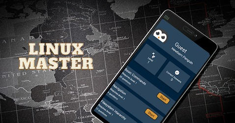

# Linux

## Linux Master Application

A completely free application for testing your knowledge on Linux.
Disclaimer: developed by repository owner

<a href="https://play.google.com/store/apps/details?id=com.codingshell.linuxmaster"></a>

- [Linux](#linux)
  - [Linux Master Application](#linux-master-application)
  - [Linux Exercises](#linux-exercises)
    - [Basics](#basics)
    - [Misc](#misc)
  - [Linux Questions](#linux-questions)
    - [Linux 101](#linux-101)
    - [I/O Redirection](#io-redirection)
    - [Filesystem Hierarchy Standard](#filesystem-hierarchy-standard)
    - [Permissions](#permissions)
    - [Scenarios](#scenarios)
    - [Systemd](#systemd)
    - [Troubleshooting and Debugging](#troubleshooting-and-debugging)
      - [Scenarios](#scenarios-1)
    - [Kernel](#kernel)
    - [SSH](#ssh)
    - [Globbing & Wildcards](#globbing--wildcards)
    - [Boot Process](#boot-process)
    - [Disk and Filesystem](#disk-and-filesystem)
    - [Performance Analysis](#performance-analysis)
    - [Processes](#processes)
    - [Security](#security)
    - [Networking](#networking)
    - [DNS](#dns)
    - [Packaging](#packaging)
    - [DNF](#dnf)
    - [Applications and Services](#applications-and-services)
    - [Users and Groups](#users-and-groups)
    - [Hardware](#hardware)
    - [Namespaces](#namespaces)
    - [Virtualization](#virtualization)
    - [AWK](#awk)
    - [System Calls](#system-calls)
    - [Filesystem & Files](#filesystem--files)
    - [Advanced Networking](#advanced-networking)
    - [Memory](#memory)
    - [Distributions](#distributions)
    - [Sed](#sed)
    - [Misc](#misc-1)

## Linux Exercises

### Basics

|Name|Topic|Objective & Instructions|Solution|Comments|
|--------|--------|------|----|----|
| Navigation | cd, pwd | [Exercise](exercises/navigation/README.md) | [Solution](exercises/navigation/solution.md)
| Create and Destroy | touch, rm, mkdir | [Exercise](exercises/create_remove/README.md) | [Solution](exercises/create_remove/solution.md)
| Copy Time | touch, cp, ls | [Exercise](exercises/copy/README.md) | [Solution](exercises/copy/solution.md)

### Misc

|Name|Topic|Objective & Instructions|Solution|Comments|
|--------|--------|------|----|----|
| Unique Count |  | [Exercise](exercises/uniqe_count/README.md) | [Solution](exercises/uniqe_count/solution.md)

## Linux Questions

### Linux 101

<details>
<summary>What is Linux?</summary><br><b>

[Wikipedia](https://en.wikipedia.org/wiki/Linux): "Linux is a family of open-source Unix-like operating systems based on the Linux kernel, an operating system kernel first released on September 17, 1991, by Linus Torvalds. Linux is typically packaged in a Linux distribution."

[Red Hat](https://www.redhat.com/en/topics/linux/what-is-linux): "Linux® is an open source operating system (OS). An operating system is the software that directly manages a system’s hardware and resources, like CPU, memory, and storage. The OS sits between applications and hardware and makes the connections between all of your software and the physical resources that do the work."

</b></details>

<details>
<summary>Explain what each of the following commands does and give an example on how to use it:

  * touch
  * ls
  * rm
  * cat
  * cp
  * mkdir
  * pwd
  * cd
</summary><br><b>

  * touch - update file's timestamp. More commonly used for creating files
  * ls - listing files and directories
  * rm - remove files and directories
  * cat - create, view and concatenate files
  * cp - copy files and directories
  * mkdir - create directories
  * pwd - print current working directory (= at what path the user currently located)
  * cd - change directory
</b></details>

<details>
<summary>What each of the following commands does?

  * cd /
  * cd ~
  * cd
  * cd ..
  * cd .
  * cd -
</summary><br><b>

  * cd / -> change to the root directory
  * cd ~ -> change to your home directory
  * cd -> change to your home directory
  * cd .. -> change to the directory above your current i.e parent directory
  * cd . -> change to the directory you currently in
  * cd - -> change to the last visited path
</b></details>

<details>
<summary>Some of the commands in the previous question can be run with the -r/-R flag. What does it do? Give an example to when you would use it</summary><br><b>

The -r (or -R in some commands) flag allows the user to run a certain command recursively. For example, listing all the files under the following tree is possible when done recursively (`ls -R`):

/dir1/
  dir2/
    file1
    file2
  dir3/
    file3

To list all the files, one can run `ls -R /dir1`
</b></details>

<details>
<summary>Explain each field in the output of `ls -l` command</summary><br><b>
It shows a detailed list of files in a long format. From the left:

* file permissions, number of links, owner name, owner group, file size, timestamp of last modification and directory/file name
</b></details>

<details>
<summary>What are hidden files/directories? How to list them?</summary><br><b>

These are files directly not displayed after performing a standard ls direct listing. An example of these files are .bashrc which are used to execute some scripts. Some also store configuration about services on your host like .KUBECONFIG. The command used to list them is, `ls -a`
</b></details>

<details>
<summary>What do > and < do in terms of input and output for programs?</summary><br><b>
They take in input (<) and output for a given file (>) using stdin and stdout.

`myProgram < input.txt > executionOutput.txt`
</b></details>

<details>
<summary>Explain what each of the following commands does and give an example on how to use it:

  * sed
  * grep
  * cut
  * awk
</summary><br><b>

  - sed: a stream editor. Can be used for various purposes like replacing a word in a file: `sed -i s/salad/burger/g`
  - grep: a search tool. Used to search, count or match a text in a file:
    - searching for any line that contains a word in a file: `grep 'word' file.md`
    - or displaying the total number of times a string appears in a file: `grep -c 'This is a string' file.md`
  - cut: a tool for cutting out selected portions of each line of a file:
    - syntax: `cut OPTION [FILE]`
      - cutting first two bytes from a word in a file: `cut -b 1-2 file.md`, output: `wo`
  - awk: a programming language that is mainly used for text processing and data extraction. It can be used to manipulate and modify text in a file:
    - syntax: awk [OPTIONS] [FILTER] [FILE]
extracting a specific field from a CSV file: awk -F ',' '{print $1}' file.csv, output: first field of each line in the file
</b></details>

<details>
<summary>How to rename the name of a file or a directory?</summary><br><b>

Using the `mv` command.
</b></details>

<details>
<summary>Specify which command would you use (and how) for each of the following scenarios 

  * Remove a directory with files
  * Display the content of a file
  * Provides access to the file /tmp/x for everyone
  * Change working directory to user home directory
  * Replace every occurrence of the word "good" with "great" in the file /tmp/y</summary><br><b>

  - `rm -rf dir`
  - `cat or less`
  - `chmod 777 /tmp/x`
  - `cd ~`
  - `sed -i s/good/great/g /tmp/y`
</b></details>

<details>
<summary>How can you check what is the path of a certain command?</summary><br><b>

  * whereis
  * which
</b></details>

<details>
<summary>What is the difference between these two commands? Will it result in the same output?

```
echo hello world
echo "hello world"
```
</summary><br><b>

The echo command receives two separate arguments in the first execution and in the second execution it gets one argument which is the string "hello world". The output will be the same.
</b></details>

<details>
<summary>Explain piping. How do you perform piping?</summary><br><b>

Using a pipe in Linux, allows you to send the output of one command to the input of another command. For example: `cat /etc/services | wc -l`
</b></details>

<details>
<summary>Fix the following commands:

  * sed "s/1/2/g' /tmp/myFile
  * find . -iname \*.yaml -exec sed -i "s/1/2/g" {} ;
</summary><br><b>

```
sed 's/1/2/g' /tmp/myFile  # sed "s/1/2/g" is also fine
find . -iname "*.yaml" -exec sed -i "s/1/2/g" {} \;
```
</b></details>

<details>
<summary>How to check which commands you executed in the past?</summary><br><b>

history command or .bash_history file
</b></details>

<details>
<summary>Running the command <code>df</code> you get "command not found". What could be wrong and how to fix it?</summary><br><b>
</b>
<p><b>
Most likely the default/generated $PATH was somehow modified or overridden thus not containing <code>/bin/</code> where df would normally go.
This issue could also happen if bash_profile or any configuration file of your interpreter was wrongly modified, causing erratics behaviours.
You would solve this by fixing your $PATH variable:

As to fix it there are several options:

1. Manually adding what you need to your $PATH <code>PATH="$PATH":/user/bin:/..etc</code>
2. You have your weird env variables backed up.
3. You would look for your distro default $PATH variable, copy paste using method #1

Note: There are many ways of getting errors like this: if bash_profile or any configuration file of your interpreter was wrongly modified; causing erratics behaviours,
permissions issues, bad compiled software (if you compiled it by yourself)... there is no answer that will be true 100% of the time.
</b>
</p>
</details>

<details>
<summary>How do you schedule tasks periodically?</summary><br><b>

You can use the commands <code>cron</code> and <code>at</code>.
With cron, tasks are scheduled using the following format:

<code>*/30 * * * * bash myscript.sh</code> Executes the script every 30 minutes.

<minute> <hour> <day of month> <month> <day of week> <command to execute>

The tasks are stored in a cron file, you can write in it using <code>crontab -e</code>

Alternatively if you are using a distro with systemd it's recommended to use systemd timers.
</b></details>

<a name="questions-linux-redirection"></a>
### I/O Redirection

<details>
<summary>Explain Linux I/O redirection</summary><br><b>
</b></details>

<details>
<summary>Demonstrate Linux output redirection</summary><br><b>

ls > ls_output.txt
</b></details>

<details>
<summary>Demonstrate Linux stderr output redirection</summary><br><b>

yippiekaiyay 2> ls_output.txt
</b></details>

<details>
<summary>Demonstrate Linux stderr to stdout redirection</summary><br><b>

yippiekaiyay &> file
</b></details>

<details>
<summary>What is the result of running the following command? <code>yippiekaiyay 1>&2 die_hard</code></code></summary><br><b>

An output similar to: `yippikaiyay: command not found...`<br>
The file `die_hard` will not be created
</b></details>

<a name="questions-linux-fhs"></a>
### Filesystem Hierarchy Standard

<details>
<summary>In Linux FHS (Filesystem Hierarchy Standard) what is the <code>/</code>?</summary><br><b>

The root of the filesystem. The beginning of the tree.
</b></details>

<details>
<summary>What is stored in each of the following paths?

  - /bin, /sbin, /usr/bin and /usr/sbin
  - /etc
  - /home
  - /var
  - /tmp</summary><br><b>

  * binaries
  * configuration files
  * home directories of the different users
  * files that tend to change and be modified like logs
  * temporary files
</b></details>

<details>
<summary>What is special about the /tmp directory when compared to other directories?</summary><br><b>

`/tmp` folder is cleaned automatically, usually upon reboot.
</b></details>

<details>
<summary>What kind of information one can find in /proc?</summary><br><b>
 
It contains useful information about the processes that are currently running, it is regarded as control and information center for kernel.
</b></details>

<details>
<summary>What makes /proc different from other filesystems?</summary><br><b>
</b></details>

<details>
<summary>True or False? only root can create files in /proc</summary><br><b>

False. No one can create file in /proc directly (certain operations can lead to files being created in /proc by the kernel).
</b></details>

<details>
<summary>What can be found in /proc/cmdline?</summary><br><b>

The command passed to the boot loader to run the kernel
</b></details>

<details>
<summary>In which path can you find the system devices (e.g. block storage)?</summary><br><b>
</b></details>

<a name="questions-linux-permissions"></a>
### Permissions

<details>
<summary>How to change the permissions of a file?</summary><br><b>

Using the `chmod` command.
</b></details>

<details>
<summary>What does the following permissions mean?:

  * 777
  * 644
  * 750</summary><br><b>

<pre>
777 - You give the owner, group and other: Execute (1), Write (2) and Read (4); 4+2+1 = 7.
644 - Owner has Read (4), Write (2), 4+2 = 6; Group and Other have Read (4).
750 - Owner has x+r+w, Group has Read (4) and Execute (1); 4+1 = 5. Other have no permissions.
</pre>
</b></details>

<details>
<summary>What this command does? <code>chmod +x some_file</code></summary><br><b>
It adds execute permissions to all sets i.e user, group and others
</b></details>

<details>
<summary>Explain what is setgid and setuid</summary><br><b>

* setuid is a linux file permission that permits a user to run a file or program with the permissions of the owner of that file. This is possible by elevation of current user privileges.
* setgid is a process when executed will run as the group that owns the file.
</b></details>

<details>
<summary>What is the purpose of sticky bit?</summary><br><b>
Its a bit that only allows the owner or the root user to delete or modify the file.
</b></details>

<details>
<summary>What the following commands do?

  - chmod
  - chown
  - chgrp</summary><br><b>

  * chmod - changes access permissions to files system objects
  * chown - changes the owner of file system files and directories
  * chgrp - changes the group associated with a file system object
</b></details>

<details>
<summary>What is sudo? How do you set it up?</summary><br><b>
</b></details>

<details>
<summary>True or False? In order to install packages on the system one must be the root user or use the sudo command</summary><br><b>

True
</b></details>

<details>
<summary>Explain what are ACLs. For what use cases would you recommend to use them?</summary><br><b>
</b></details>

<details>
<summary>You try to create a file but it fails. Name at least three different reason as to why it could happen</summary><br><b>

* No more disk space
* No more inodes
* No permissions
</b></details>

<details>
<summary>A user accidentally executed the following <code>chmod -x $(which chmod)</code>. How to fix it?</summary><br><b>

Using `sudo setfacl -m u::rx /usr/bin/chmod` will set the execute permissions on `chmod` for all the users. Post this, the `chmod` binary can be used as usual.
</b></details>

<a name="questions-linux-scenarios"></a>
### Scenarios

<details>
<summary>You would like to copy a file to a remote Linux host. How would you do?</summary><br><b>

There are multiple ways to transfer files between hosts. Personal opinion: use `rsync`
</b></details>

<details>
<summary>How to generate a random string?</summary><br><b>

One way is to run the following: `cat /proc/sys/kernel/random/uuid`
</b></details>

<details>
<summary>How to generate a random string of 7 characters?</summary><br><b>

`mkpasswd -l 7`
</b></details>

<a name="questions-linux-systemd"></a>
### Systemd

<details>
<summary>What is systemd?</summary><br>
<b>
Systemd is a daemon (System 'd', d stands for daemon).

A daemon is a program that runs in the background without direct control of the user, although the user can at any time
talk to the daemon.

systemd has many features such as user processes control/tracking, snapshot support, inhibitor locks..

If we visualize the unix/linux system in layers, systemd would fall directly after the linux kernel.<br>
Hardware -> Kernel -> <u>Daemons</u>, System Libraries, Server Display.
</b>
</details>

<details>
<summary>How to start or stop a service?</summary><br><b>

To start a service: `systemctl start <service name>`
To stop a service: `systemctl stop <service name>`
</b></details>

<details>
<summary>How to check the status of a service?</summary><br><b>

`systemctl status <service name>`
</b></details>

<details>
<summary>On a system which uses systemd, how would you display the logs?</summary><br><b>

<code>journalctl</code>
</b></details>

<details>
<summary>Describe how to make a certain process/app a service</summary><br><b>
</b></details>

### Troubleshooting and Debugging

<details>
<summary>Where system logs are located?</summary><br><b>

/var/log
</b></details>

<details>
<summary>How to follow file's content as it being appended without opening the file every time?</summary><br><b>

tail -f <file_name>
</b></details>

<details>
<summary>What are you using for troubleshooting and debugging <b>network</b> issues?</summary><br><b>

<code>dstat -t</code> is great for identifying network and disk issues.
<code>netstat -tnlaup</code> can be used to see which processes are running on which ports.
<code>lsof -i -P</code> can be used for the same purpose as netstat.
<code>ngrep -d any metafilter</code> for matching regex against payloads of packets.
<code>tcpdump</code> for capturing packets
<code>wireshark</code> same concept as tcpdump but with GUI (optional).
</b></details>

<details>
<summary>What are you using for troubleshooting and debugging <b>disk & file system</b> issues?</summary><br><b>

<code>dstat -t</code> is great for identifying network and disk issues.
<code>opensnoop</code> can be used to see which files are being opened on the system (in real time).
</b></details>

<details>
<summary>What are you using for troubleshooting and debugging <b>process</b> issues?</summary><br><b>

<code>strace</code> is great for understanding what your program does. It prints every system call your program executed.
</b></details>

<details>
<summary>What are you using for debugging CPU related issues?</summary><br><b>

<code>top</code> will show you how much CPU percentage each process consumes
<code>perf</code> is a great choice for sampling profiler and in general, figuring out what your CPU cycles are "wasted" on
<code>flamegraphs</code> is great for CPU consumption visualization (http://www.brendangregg.com/flamegraphs.html)
</b></details>

<details>
<summary>You get a call from someone claiming "my system is SLOW". What do you do?</summary><br><b>

* Check with `top` for anything unusual
* Run `dstat -t` to check if it's related to disk or network.
* Check if it's network related with `sar`
* Check I/O stats with `iostat`
</b></details>

<details>
<summary>Explain iostat output</summary><br><b>
</b></details>

<details>
<summary>How to debug binaries?</summary><br><b>
</b></details>

<details>
<summary>What is the difference between CPU load and utilization?</summary><br><b>
</b></details>

<details>
<summary>How you measure time execution of a program?</summary><br><b>
</b></details>

#### Scenarios

<details>
<summary>You have a process writing to a file. You don't know which process exactly, you just know the path of the file. You would like to kill the process as it's no longer needed. How would you achieve it?</summary><br><b>

1. Run `lsof <FILE_PATH>`
2. Use the pid (process ID) from the lsof command and run `kill <PID>`

</b></details>

### Kernel

<details>
<summary>What is a kernel, and what does it do?</summary><br><b>

The kernel is part of the operating system and is responsible for tasks like:

  * Allocating memory
  * Schedule processes
  * Control CPU
</b></details>

<details>
<summary>How do you find out which Kernel version your system is using?</summary><br><b>

`uname -a` command
</b></details>

<details>
<summary>What is a Linux kernel module and how do you load a new module?</summary><br><b>
</b></details>

<details>
<summary>Explain user space vs. kernel space</summary><br><b>

The operating system executes the kernel in protected memory to prevent anyone from changing (and risking it crashing). This is what is known as "Kernel space".
"User space" is where users executes their commands or applications. It's important to create this separation since we can't rely on user applications to not tamper with the kernel, causing it to crash.

Applications can access system resources and indirectly the kernel space by making what is called "system calls".
</b></details>

<details>
<summary>In what phases of kernel lifecycle, can you change its configuration?</summary><br><b>

  * Build time (when it's compiled)
  * Boot time (when it starts)
  * Runtime (once it's already running)
</b></details>

<details>
<summary>Where can you find kernel's configuration?</summary><br><b>

Usually it will reside in `/boot/config-<kernel version>.<os release>.<arch>`
</b></details>

<details>
<summary>Where can you find the file that contains the command passed to the boot loader to run the kernel?</summary><br><b>

`/proc/cmdline`
</b></details>

<details>
<summary>How to list kernel's runtime parameters?</summary><br><b>

`sysctl -a`
</b></details>

<details>
<summary>Will running <code>sysctl -a</code> as a regular user vs. root, produce different result?</summary><br><b>

Yes, you might notice that in most systems, when running `systctl -a` with root, you'll get more runtime parameters compared to executing the same command with a regular user.
</b></details>

<details>
<summary>You would like to enable IPv4 forwarding in the kernel, how would you do it?</summary><br><b>

`sudo sysctl net.ipv4.ip_forward=1`

To make it persistent (applied after reboot for example): insert `net.ipv4.ip_forward = 1` into `/etc/sysctl.conf`

Another way to is to run `echo 1 | sudo tee /proc/sys/net/ipv4/ip_forward`
</b></details>

<details>
<summary>How <code>sysctl</code> applies the changes to kernel's runtime parameters the moment you run sysctl command?</summary><br><b>

If you `strace` the sysctl command you can see it does it by changing the file under /proc/sys/...

In the past it was done with sysctl system call, but it was deprecated at some point.
</b></details>

<details>
<summary>How changes to kernel runtime parameters persist? (applied even after reboot to the system for example)</summary><br><b>

There is a service called `systemd-sysctl` that takes the content of /etc/sysctl.conf and applies it. This is how changes persist, even after reboot, when they are written in /etc/sysctl.conf
</b></details>

<details>
<summary>Are the changes you make to kernel parameters in a container, affects also the kernel parameters of the host on which the container runs?</summary><br><b>

No. Containers have their own /proc filesystem so any change to kernel parameters inside a container, are not affecting the host or other containers running on that host.
</b></details>

<a name="questions-linux-ssh"></a>
### SSH

<details>
<summary>What is SSH? How to check if a Linux server is running SSH?</summary><br><b>

[Wikipedia Definition](https://en.wikipedia.org/wiki/SSH_(Secure_Shell)): "SSH or Secure Shell is a cryptographic network protocol for operating network services securely over an unsecured network."

[Hostinger.com Definition](https://www.hostinger.com/tutorials/ssh-tutorial-how-does-ssh-work): "SSH, or Secure Shell, is a remote administration protocol that allows users to control and modify their remote servers over the Internet."

An SSH server will have SSH daemon running. Depends on the distribution, you should be able to check whether the service is running (e.g. systemctl status sshd).
</b></details>

<details>
<summary>Why SSH is considered better than telnet?</summary><br><b>

Telnet also allows you to connect to a remote host but as opposed to SSH where the communication is encrypted, in telnet, the data is sent in clear text, so it doesn't considered to be secured because anyone on the network can see what exactly is sent, including passwords.
</b></details>

<details>
<summary>What is stored in <code>~/.ssh/known_hosts</code>?</summary><br><b>

The file stores the key fingerprints for the clients connecting to the SSH server. This fingerprint creates a trust between the client and the server for future SSH connections.
</b></details>

<details>
<summary>You try to ssh to a server and you get "Host key verification failed". What does it mean?</summary><br><b>

It means that the key of the remote host was changed and doesn't match the one that stored on the machine (in ~/.ssh/known_hosts).
</b></details>

<details>
<summary>What is the difference between SSH and SSL?</summary><br><b>
</b></details>

<details>
<summary>What <code>ssh-keygen</code> is used for?</summary><br><b>

<code>ssh-keygen</code> is a tool to generate an authentication key pair for SSH, that consists of a private and a public key. It supports a number of algorithms to generate authentication keys : 
- dsa
- ecdsa
- ecdsa-sk
- ed25519
- ed25519-sk
- rsa (default)

One can also specify number of bits in key. Command below generates an SSH key pair with RSA 4096-bits :
```
$ ssh-keygen -t rsa -b 4096
```

The output looks like this:
```
Generating public/private rsa key pair.
Enter file in which to save the key (/home/user/.ssh/id_rsa): 
Enter passphrase (empty for no passphrase): 
Enter same passphrase again: 
Your identification has been saved in /home/user/.ssh/id_rsa
Your public key has been saved in /home/user/.ssh/id_rsa.pub
The key fingerprint is:
SHA256:f5MOGnhzYfC0ZCHvbSXXiRiNVYETjxpHcXD5xSojx+M user@mac-book-pro
The key's randomart image is:
+---[RSA 4096]----+
|        . ..+***o|
|         o o++*o+|
|        . =+.++++|
|         B.oX+. .|
|        S *=o+   |
|       . o oE.   |
|      . + + +    |
|       . = + .   |
|        .   .    |
+----[SHA256]-----+
```

One can check how many bits an SSH key has with :
```
$ ssh-keygen -l -f /home/user/.ssh/id_rsa
```

Output should look like this :
```
4096 SHA256:f5MOGnhzYfC0ZCHvbSXXiRiNVYETjxpHcXD5xSojx+M user@mac-book-pro (RSA)
```
It shows the key is RSA 4096-bits.

`-l` and `-f` parameters usage explanation :
```
-l          Show the fingerprint of the key file.
-f filename Filename of the key file.
```

Learn more : [How can I tell how many bits my ssh key is? - Superuser](https://superuser.com/a/139311)
</b></details>

<details>
<summary>What is SSH port forwarding?</summary><br><b>
</b></details>

<a name="questions-linux-wildcards"></a>
### Globbing & Wildcards

<details>
<summary>What is Globbing?</summary><br><b>
</b></details>

<details>
<summary>What are wildcards? Can you give an example of how to use them?</summary><br><b>
</b></details>

<details>
<summary>Explain what will <code>ls [XYZ]</code> match</summary><br><b>
</b></details>

<details>
<summary>Explain what will <code>ls [^XYZ]</code> match</summary><br><b>
</b></details>

<details>
<summary>Explain what will <code>ls [0-5]</code> match</summary><br><b>
</b></details>

<details>
<summary>What each of the following matches

  - ?
  - *</summary><br><b>

  * The ? matches any single character
  * The * matches zero or more characters
</b></details>

<details>
<summary>What do we grep for in each of the following commands?:

  * <code>grep '[0-9]\{1,3\}\.[0-9]\{1,3\}\.[0-9]\{1,3\}\.[0-9]\{1,3\}' some_file</code>
  * <code>grep -E "error|failure" some_file</code>
  * <code>grep '[0-9]$' some_file</code>
</summary><br><b>

1. An IP address
2. The word "error" or "failure"
3. Lines which end with a number
</b></details>

<details>
<summary>Which line numbers will be printed when running `grep '\baaa\b'` on the following content:

aaa
bbb
ccc.aaa
aaaaaa</summary><br><b>

lines 1 and 3.
</b></details>

<details>
<summary>What is the difference single and double quotes?</summary><br><b>
</b></details>

<details>
<summary>What is escaping? What escape character is used for escaping?</summary><br><b>
</b></details>

<details>
<summary>What is an exit code? What exit codes are you familiar with?</summary><br><b>

An exit code (or return code) represents the code returned by a child process to its
parent process.

0 is an exit code which represents success while anything higher than 1 represents error.
Each number has different meaning, based on how the application was developed.

I consider this as a good blog post to read more about it: https://shapeshed.com/unix-exit-codes
</b></details>

<a name="questions-linux-boot"></a>
### Boot Process

<details>
<summary>Tell me everything you know about the Linux boot process</summary><br><b>

Another way to ask this: what happens from the moment you turned on the server until you get a prompt
</b></details>

<details>
<summary>What is GRUB2?</summary><br><b>
</b></details>

<details>
<summary>What is Secure Boot?</summary><br><b>
</b></details>

<details>
<summary>What can you find in /boot?</summary><br><b>
</b></details>

<a name="questions-linux-disk-fs"></a>
### Disk and Filesystem

<details>
<summary>What's an inode?</summary><br><b>

For each file (and directory) in Linux there is an inode, a data structure which stores meta data
related to the file like its size, owner, permissions, etc.
</b></details>

<details>
<summary>Which of the following is not included in inode:

  * Link count
  * File size
  * File name
  * File timestamp</summary><br><b>

File name (it's part of the directory file)
</b></details>

<details>
<summary>How to check which disks are currently mounted?</summary><br><b>

Run `mount`
</b></details>

<details>
<summary>You run the <code>mount</code> command but you get no output. How would you check what mounts you have on your system?</summary><br><b>

`cat /proc/mounts`
</b></details>

<details>
<summary>What is the difference between a soft link and hard link?</summary><br><b>

Hard link is the same file, using the same inode.
Soft link is a shortcut to another file, using a different inode.
</b></details>

<details>
<summary>True or False? You can create an hard link for a directory</summary><br><b>

False
</b></details>

<details>
<summary>True or False? You can create a soft link between different filesystems</summary><br><b>

True
</b></details>

<details>
<summary>True or False? Directories always have by minimum 2 links</summary><br><b>

True.
</b></details>

<details>
<summary>What happens when you delete the original file in case of soft link and hard link?</summary><br><b>
</b></details>

<details>
<summary>Can you check what type of filesystem is used in /home?</summary><br><b>

There are many answers for this question. One way is running `df -T`
</b></details>

<details>
<summary>What is a swap partition? What is it used for?</summary><br><b>
</b></details>

<details>
<summary>How to create a

  - new empty file
  - a file with text (without using text editor)
  - a file with given size</summary><br><b>
  
  * touch new_file.txt
  * cat > new_file [enter] submit text; ctrl + d to exit insert mode
  * truncate -s <size> new_file.txt
</b></details>

<details>
<summary>You are trying to create a new file but you get "File system is full". You check with df for free space and you see you used only 20% of the space. What could be the problem?</summary><br><b>
</b></details>

<details>
<summary>How would you check what is the size of a certain directory?</summary><br><b>

`du -sh`
</b></details>

<details>
<summary>What is LVM?</summary><br><b>
</b></details>

<details>
<summary>Explain the following in regards to LVM:

  * PV
  * VG
  * LV</summary><br><b>


</b></details>

<details>
<summary>What is NFS? What is it used for?</summary><br><b>
</b></details>

<details>
<summary>What RAID is used for? Can you explain the differences between RAID 0, 1, 5 and 10?</summary><br><b>
</b></details>

<details>
<summary>Describe the process of extending a filesystem disk space</summary><br><b>
</b></details>

<details>
<summary>What is lazy umount?</summary><br><b>
</b></details>

<details>
<summary>What is tmpfs?</summary><br><b>
</b></details>

<details>
<summary>What is stored in each of the following logs?

  * /var/log/messages
  * /var/log/boot.log</summary><br><b>
</b></details>

<details>
<summary>True or False? both /tmp and /var/tmp cleared upon system boot</summary><br><b>

False. /tmp is cleared upon system boot while /var/tmp is cleared every a couple of days or not cleared at all (depends on distro).
</b></details>

<a name="questions-linux-performance-analysis"></a>
### Performance Analysis

<details>
<summary>How to check what is the current load average?</summary><br><b>

One can use `uptime` or `top`
</b></details>

<details>
<summary>You know how to see the load average, great. but what each part of it means? for example 1.43, 2.34, 2.78</summary><br><b>

[This article](http://www.brendangregg.com/blog/2017-08-08/linux-load-averages.html) summarizes the load average topic in a great way
</b></details>

<details>
<summary>How to check process usage?</summary><br><b>

pidstat
</b></details>

<details>
<summary>How to check disk I/O?</summary><br><b>

`iostat -xz 1`
</b></details>

<details>
<summary>How to check how much free memory a system has? How to check memory consumption by each process?</summary><br><b>

You can use the commands <code>top</code> and <code>free</code>
</b></details>

<details>
<summary>How to check TCP stats?</summary><br><b>

sar -n TCP,ETCP 1
</b></details>

<a name="questions-linux-processes"></a>
### Processes

<details>
<summary>how to list all the processes running in your system?</summary><br><b>

The "ps" command can be used to list all the processes running in a system. The "ps aux" command provides a detailed list of all the processes, including the ones running in the background.
</b></details>

<details>
<summary>How to run a process in the background and why to do that in the first place?</summary><br><b>

You can achieve that by specifying & at the end of the command.
As to why, since some commands/processes can take a lot of time to finish
execution or run forever, you may want to run them in the background instead of waiting for them to finish before gaining control again in current session.
</b></details>

<details>
<summary>How can you find how much memory a specific process consumes?</summary><br><b>
<code>
mem()
{                                                                                                      
    ps -eo rss,pid,euser,args:100 --sort %mem | grep -v grep | grep -i $@ | awk '{printf $1/1024 "MB"; $1=""; print }'
}
</code>
[Source](https://stackoverflow.com/questions/3853655/in-linux-how-to-tell-how-much-memory-processes-are-using)
</b></details>

<details>
<summary>What signal is used by default when you run 'kill *process id*'?</summary><br><b>
<pre>
The default signal is SIGTERM (15). This signal kills
process gracefully which means it allows it to save current
state configuration.
</pre>
</b></details>

<details>
<summary>What signals are you familiar with?</summary><br><b>

SIGTERM - default signal for terminating a process
SIGHUP - common usage is for reloading configuration
SIGKILL - a signal which cannot caught or ignored

To view all available signals run `kill -l`
</b></details>

<details>
<summary>What <code>kill 0</code> does?</summary><br><b>
"kill 0" sends a signal to all processes in the current process group. It is used to check if the processes exist or not
</b></details>

<details>
<summary>What <code>kill -0 <PID></code> does?</summary><br><b>
"kill -0" checks if a process with a given process ID exists or not. It does not actually send any signal to the process.
</b></details>

<details>
<summary>What is a trap?</summary><br><b>
A trap is a mechanism that allows the shell to intercept signals sent to a process and perform a specific action, such as handling errors or cleaning up resources before terminating the process.

</b></details>

<details>
<summary>Every couple of days, a certain process stops running. How can you look into why it's happening?</summary><br><b>
One way to investigate why a process stops running is to check the system logs, such as the messages in /var/log/messages or journalctl. Additionally, checking the process's resource usage and system load may provide clues as to what caused the process to stop
</b></details>

<details>
<summary>What happens when you press ctrl + c?</summary><br><b>
When you press "Ctrl+C," it sends the SIGINT signal to the foreground process, asking it to terminate gracefully.
</b></details>

<details>
<summary>What is a Daemon in Linux?</summary><br><b>

A background process. Most of these processes are waiting for requests or set of conditions to be met before actually running anything.
Some examples: sshd, crond, rpcbind.
</b></details>

<details>
<summary>What are the possible states of a process in Linux?</summary><br><b>
<pre>
Running (R)
Uninterruptible Sleep (D) - The process is waiting for I/O
Interruptible Sleep (S)
Stopped (T)
Dead (x)
Zombie (z)
</pre>
</b></details>

<details>
<summary>How do you kill a process in D state?</summary><br><b>
A process in D state (also known as "uninterruptible sleep") cannot be killed using the "kill" command. The only way to terminate it is to reboot the system.
</b></details>

<details>
<summary>What is a zombie process?</summary><br><b>

A process which has finished to run but has not exited.

One reason it happens is when a parent process is programmed incorrectly. Every parent process should execute wait() to get the exit code from the child process which finished to run. But when the parent isn't checking for the child exit code, the child process can still exists although it finished to run.
</b></details>

<details>
<summary>How to get rid of zombie processes?</summary><br><b>

You can't kill a zombie process the regular way with `kill -9` for example as it's already dead.

One way to kill zombie process is by sending SIGCHLD to the parent process telling it to terminate its child processes. This might not work if the parent process wasn't programmed properly. The invocation is `kill -s SIGCHLD [parent_pid]`

You can also try closing/terminating the parent process. This will make the zombie process a child of init (1) which does periodic cleanups and will at some point clean up the zombie process.
</b></details>

<details>
<summary>How to find all the

  * Processes executed/owned by a certain user
  * Process which are Java processes
  * Zombie Processes
</summary><br><b>

If you mention at any point ps command with arugments, be familiar with what these arguments does exactly.
</b></details>

<details>
<summary>What is the init process?</summary><br><b>
It is the first process executed by the kernel during the booting of a system. It is a daemon process which runs till the system is shutdown. That is why, it is the parent of all the processes
</b></details>

<details>
<summary>Can you describe how processes are being created?</summary><br><b>
</b></details>

<details>
<summary>How to change the priority of a process? Why would you want to do that?</summary><br><b>
To change the priority of a process, you can use the nice command in Linux. The nice command allows you to specify the priority of a process by assigning a priority value ranging from -20 to 19. A higher value of priority means lower priority for the process, and vice versa.

You may want to change the priority of a process to adjust the amount of CPU time it is allocated by the system scheduler. For example, if you have a CPU-intensive process running on your system that is slowing down other processes, you can lower its priority to give more CPU time to other processes.
</b></details>

<details>
<summary>Can you explain how network process/connection is established and how it's terminated?></summary><br></b>
When a client process on one system wants to establish a connection with a server process on another system, it first creates a socket using the socket system call. The client then calls the connect system call, passing the address of the server as an argument. This causes a three-way handshake to occur between the client and server, where the two systems exchange information to establish a connection.

Once the connection is established, the client and server can exchange data using the read and write system calls. When the connection is no longer needed, the client or server can terminate the connection by calling the close system call on the socket.
</b></details>

<details>
<summary>What <code>strace</code> does? What about <code>ltrace</code>?</summary><br><b>
Strace is a debugging tool that is used to monitor the system calls made by a process. It allows you to trace the execution of a process and see the system calls it makes, as well as the signals it receives. This can be useful for diagnosing issues with a process, such as identifying why it is hanging or crashing.

Ltrace, on the other hand, is a similar tool that is used to trace the library calls made by a process. It allows you to see the function calls made by a process to shared libraries, as well as the arguments passed to those functions. This can be useful for diagnosing issues with a process that involve library calls, such as identifying why a particular library is causing a problem.

</b></details>

<details>
<summary>Find all the files which end with '.yml' and replace the number 1 in 2 in each file</summary><br><b>

find /some_dir -iname \*.yml -print0 | xargs -0 -r sed -i "s/1/2/g"
</b></details>

<details>
<summary>You run ls and you get "/lib/ld-linux-armhf.so.3 no such file or directory". What is the problem?</summary><br><b>

The ls executable is built for an incompatible architecture.
</b></details>

<details>
<summary>How would you split a 50 lines file into 2 files of 25 lines each?</summary><br><b>

You can use the <code>split</code> command this way: <code>split -l 25 some_file</code>
</b></details>

<details>
<summary>What is a file descriptor? What file descriptors are you familiar with?</summary><br><b>
Kerberos
File descriptor, also known as file handler, is a unique number which identifies an open file in the operating system.

In Linux (and Unix) the first three file descriptors are:

  * 0 - the default data stream for input
  * 1 - the default data stream for output
  * 2 - the default data stream for output related to errors

This is a great article on the topic: https://www.computerhope.com/jargon/f/file-descriptor.htm
</b></details>

<details>
<summary>What is NTP? What is it used for?</summary><br><b>
</b></details>

<details>
<summary>Explain Kernel OOM</summary><br><b>
</b></details>

<a name="questions-linux-security"></a>
### Security

<details>
<summary>What is chroot? In what scenarios would you consider using it?</summary><br><b>
</b></details>

<details>
<summary>What is SELiunx?</summary><br><b>
</b></details>

<details>
<summary>What is Kerberos?</summary><br><b>
</b></details>

<details>
<summary>What is nftables?</summary><br><b>
</b></details>

<details>
<summary>What firewalld daemon is responsible for?</summary><br><b>
</b></details>

<details>
<summary>Do you have experience with hardening servers? Can you describe the process?</summary><br><b>
</b></details>

<details>
<summary>How do you create a private key for a CA (certificate authority)?</summary><br><b>

One way is using openssl this way:

`openssl genrsa -aes256 -out ca-private-key.pem 4096`
</b></details>

<details>
<summary>How do you create a public key for a CA (certificate authority)?</summary><br><b>

`openssl req -new -x509 -days 730 -key [private key file name] -sha256 -out ca.pem`

If using the private key from the previous question then the command would be:

`openssl req -new -x509 -days 730 -key ca-private-key.pem -sha256 -out ca.pem`
</b></details>

<details>
<summary>Demonstrate one way to encode and decode data in Linux</summary><br><b>

Encode: `echo -n "some password" | base64`
Decode: `echo -n "allE19remO91" | base64`
</b></details>

<a name="questions-linux-networking"></a>
### Networking

<details>
<summary>How to list all the interfaces?</summary><br><b>

```
ip link show
```
</b></details>

<details>
<summary>What is the loopback (lo) interface?</summary><br><b>

The loopback interface is a special, virtual network interface that your computer uses to communicate with itself. It is used mainly for diagnostics and troubleshooting, and to connect to servers running on the local machine.
</b></details>

<details>
<summary>What the following commands are used for?

  * ip addr
  * ip route
  * ip link
  * ping
  * netstat
  * traceroute</summary><br><b>
</b></details>

<details>
<summary>What is a network namespace? What is it used for?</summary><br><b>
</b></details>

<details>
<summary>How to check if a certain port is being used?</summary><br><b>

One of the following would work:

```
netstat -tnlp | grep <port_number>
lsof -i -n -P | grep <port_number>
```
</b></details>

<details>
<summary>How can you turn your Linux server into a router?</summary><br><b>
</b></details>

<details>
<summary>What is a virtual IP? In what situation would you use it?</summary><br><b>
</b></details>

<details>
<summary>True or False? The MAC address of an interface is assigned/set by the OS</summary><br><b>

False
</b></details>

<details>
<summary>Can you have more than one default gateway in a given system?</summary><br><b>

Technically, yes.
</b></details>

<details>
<summary>What is telnet and why is it a bad idea to use it in production? (or at all)</summary><br><b>

Telnet is a type of client-server protocol that can be used to open a command line on a remote computer, typically a server.
By default, all the data sent and received via telnet is transmitted in clear/plain text, therefore it should not be used as it does not encrypt any data between the client and the server.
</b></details>

<details>
<summary>What is the routing table? How do you view it?</summary><br><b>
</b></details>

<details>
<summary>How can you send an HTTP request from your shell?</summary><br><b>
<br>
Using nc is one way<br>
</b></details>

<details>
<summary>What are packet sniffers? Have you used one in the past? If yes, which packet sniffers have you used and for what purpose?</summary><br><b>
It is a network utility that analyses and may inject tasks into the data-stream travelling over the targeted network.
</b></details>

<details>
<summary>How to list active connections?</summary><br><b>
</b></details>

<details>
<summary>How to trigger neighbor discovery in IPv6?</summary><br><b>

One way would be `ping6 ff02::1`
</b></details>

<details>
<summary>What is network interface bonding and do you know how it's performed in Linux?</summary><br><b>
</b></details>

<details>
<summary>What network bonding modes are there?</summary><br><b>

There a couple of modes:

  * balance-rr: round robing bonding
  * active-backup: a fault tolerance mode where only one is active
  * balance-tlb: Adaptive transmit load balancing
  * balance-alb: Adaptive load balancing
</b></details>

<details>
<summary>What is a bridge? How it's added in Linux OS?</summary><br><b>
</b></details>

<a name="questions-linux-dns"></a>
### DNS

<details>
<summary>How to check what is the hostname of the system?</summary><br><b>

`cat /etc/hostname`

You can also run `hostnamectl` or `hostname` but that might print only a temporary hostname. The one in the file is the permanent one.
</b></details>

<details>
<summary>What the file <code>/etc/resolv.conf</code> is used for? What does it include?</summary><br><b>
</b></details>

<details>
<summary>What commands are you using for performing DNS queries (or troubleshoot DNS related issues)?</summary><br><b>

You can specify one or more of the following:

 * <code>dig</code>
 * <code>host</code>
 * <code>nslookup</code>
</b></details>

<details>
<summary>You run <code>dig codingshell.com</code> and get the following result: 

```
ANSWER SECTION:
codingshell.com.	3515	IN	A	185.199.109.153
```

What is the meaning of the number 3515?
</summary><br><b>

This is the TTL. When you lookup for an address using a domain/host name, your OS is performing DNS resolution by contacting DNS name servers to get the IP address of the host/domain you are looking for.<br>
When you get a reply, this reply in cached in your OS for a certain period of time. This is period of time is also known as TTL and this is the meaning of 3515 number - it will be cached for 3515 seconds before removed from the cache and during that period of time, you'll get the value from the cache instead of asking DNS name servers for the address again.
</b></details>

<details>

<summary> How can we modify the network connection via `nmcli` command, to use `8.8.8.8` as a DNS server? </summary><br><b>

1. Find the connection name: 
    ```
    # nmcli con show
    NAME         UUID                                  TYPE      DEVICE
    System ens5  8126c120-a964-e959-ff98-ac4973344505  ethernet  ens5
    System eth0  5fb06bd0-0bb0-7ffb-45f1-d6edd65f3e03  ethernet  --
    ```
    Here the connection name is "System ens5". Let's say we want to modify settings for this connection.

2. Modify the connection to use 8.8.8.8 as DNS server:
    ```
    # nmcli con mod "System ens5" ipv4.dns "8.8.8.8"
    ```

3. We need to reactivate the connection for the change to take effect:
    ```
    nmcli con up "System ens5"
    ```

4. Verify our settings once more:
    ```
    cat /etc/resolv.conf
    nmcli -f ipv4.dns con show "System ens5"
    ```
</b>

</details>
 
<a name="questions-linux-packaging"></a>
### Packaging

<details>
<summary>Do you have experience with packaging? (as in building packages) Can you explain how does it works?</summary><br><b>
</b></details>

<details>
<summary>How packages installation/removal is performed on the distribution you are using?</summary><br><b>

The answer depends on the distribution being used.

In Fedora/CentOS/RHEL/Rocky it can be done with `rpm` or `dnf` commands.
In Ubuntu it can be done with the `apt` command.
</b></details>

<details>
<summary>RPM: explain the spec format (what it should and can include)</summary><br><b>
</b></details>

<details>
<summary>How do you list the content of a package without actually installing it?</summary><br><b>
</b></details>

<details>
<summary>How to know to which package a file on the system belongs to? Is it a problem if it doesn't belongs to any package?</summary><br><b>
</b></details>

<details>
<summary>Where repositories are stored? (based on the distribution you are using)</summary><br><b>
</b></details>

<details>
<summary>What is an archive? How do you create one in Linux?</summary><br><b>
</b></details>

<details>
<summary>How to extract the content of an archive?</summary><br><b>
</b></details>

<details>
<summary>Why do we need package managers? Why not simply creating archives and publish them?</summary><br><b>

Package managers allow you to manage packages lifecycle as in installing, removing and updating the packages.<br>
In addition, you can specify in a spec how a certain package will be installed - where to copy the files, which commands to run prior to the installation, post the installation, etc.
</b></details>

<a name="questions-linux-dnf"></a>
### DNF

<details>
<summary>What is DNF?</summary><br><b>

From the [repo](https://github.com/rpm-software-management/dnf):

"Dandified YUM (DNF) is the next upcoming major version of YUM. It does package management using RPM, libsolv and hawkey libraries."

Official [docs](https://dnf.readthedocs.io/en/latest/)

</b></details>

<details>
<summary>How to look for a package that provides the command /usr/bin/git? (the package isn't necessarily installed)</summary><br><b>

dnf provides /usr/bin/git
</b></details>

<a name="questions-linux-apps-and-services"></a>
### Applications and Services

<details>
<summary>What can you find in /etc/services?</summary><br><b>
</b></details>

<details>
<summary>How to make sure a Service starts automatically after a reboot or crash?</summary><br><b>

Depends on the init system.

Systemd: <code> systemctl enable [service_name] </code>
System V: <code> update-rc.d [service_name] </code> and add this line <code> id:5678:respawn:/bin/sh /path/to/app </code> to /etc/inittab
Upstart: add Upstart init script at /etc/init/service.conf
</b></details>

<details>
<summary>You run <code>ssh 127.0.0.1</code> but it fails with "connection refused". What could be the problem?</summary><br><b>

1. SSH server is not installed
2. SSH server is not running
</b></details>

<details>
<summary>How to print the shared libraries required by a certain program? What is it useful for?</summary><br><b>
</b></details>

<details>
<summary>What is CUPS?</summary><br><b>
</b></details>

<details>
<summary>What types of web servers are you familiar with?</summary><br><b>

Nginx, Apache httpd.
</b></details>

<a name="questions-linux-users-and-groups"></a>
### Users and Groups

<details>
<summary>What is a "superuser" (or root user)? How is it different from regular users?</summary><br><b>
</b></details>

<details>
<summary>How do you create users? Where user information is stored?</summary><br>

Command to create users is `useradd` 

Syntax:
`useradd [options] Username`

There are 2 configuration files, which stores users information

1. `/etc/passwd` - Users information like, username, shell etc is stored in this file 

2. `/etc/shadow` - Users password is stored in encrypted format 
</details>

<details>
<summary>Which file stores information about groups?</summary><br>

`/etc/groups` file stores the group name, group ID, usernames which are in secondary group.
</details>

<details>
<summary>How do you change/set the password of a user?</summary><br>

`passwd <username>` is the command to set/change password of a user.
</details>

<details>
<summary>Which file stores users passwords? Is it visible for everyone?</summary><br>

`/etc/shadow` file holds the passwords of the users in encryted format. NO, it is only visble to the `root` user
</details>

<details>
<summary>Do you know how to create a new user without using adduser/useradd command?</summary><br>

YES, we can create new user by manually adding an entry in the `/etc/passwd` file. 

For example, if we need to create a user called `john`. 

Step 1: Add an entry to `/etc/passwd` file, so user gets created.

`echo "john:x:2001:2001::/home/john:/bin/bash" >> /etc/passwd` 

Step 2: Add an entry to `/etc/group` file, because every user belong to the primary group that has same name as the username.

`echo "john:x:2001:" >> /etc/group`

Step 3: Verify if the user got created

`id john`

</details>

<details>
<summary>What information is stored in /etc/passwd? explain each field</summary><br>

`/etc/passwd` is a configuration file, which contains users information. Each entry in this file has, 7 fields,

`username:password:UID:GID:Comment:home directory:shell`

`username` - The name of the user.

`password` - This field is actually a placeholder of the password field. Due to security concerns, this field does not contain the password, just a placeholder (x) to the encrypted password stored in `/etc/shadow` file.

`UID` - User ID of the user.

`GID` - Group ID 

`Comment` - This field is to provide description about the user.

`home directory` - Abousulte path of the user's home directory. This directory gets created once the user is added.

`shell` - This field contains the absolute path of the shell that will be used by the respective user.
</details>

<details>
<summary>How to add a new user to the system without providing him the ability to log-in into the system?</summary><br><b>

`adduser user_name --shell=/bin/false --no-create-home`
You can also add a user and then edit /etc/passwd.
</b></details>

<details>
<summary>How to switch to another user? How to switch to the root user?</summary><br><b>

su command.
Use su - to switch to root
</b></details>

<details>
<summary>What is the UID the root user? What about a regular user?</summary><br>

UID of root user is 0

Default values of UID_MIN and UID_MAX in `/etc/login.defs`
`UID_MIN` is `1000`
`UID_MAX` is `60000`

Actually, we can change this value. But UID < 1000 are reserved for system accounts.
Therefore, as per the default configuration, for regular user UID starts from `1000`. 
</details>

<details>
<summary>What can you do if you lost/forogt the root password?</summary><br><b>

Re-install the OS IS NOT the right answer :)
</b></details>

<details>
<summary>What is /etc/skel?</summary><br>

`/etc/skel` is a directory, that contains files or directories, so when a new user is created, these files/directories created under `/etc/skel` will be copied to user's home directory.
</details>

<details>
<summary>How to see a list of who logged-in to the system?</summary><br><b>

Using the `last` command.
</b></details>

<details>
<summary>Explain what each of the following commands does:

  * useradd
  * usermod
  * whoami
  * id</summary><br><b>

  `useradd` - Command for creating new users 
  `usermod` - Modify the users setting
  `whoami`  - Outputs, the username that we are currently logged in
  `id`      - Prints the  
</b></details>

<details>
<summary>You run <code>grep $(whoami) /etc/passwd</code> but the output is empty. What might be a possible reason for that?</summary><br><b>

The user you are using isn't defined locally but originates from services like LDAP.<br>
You can verify with: `getent passwd`
</b></details>

<a name="questions-linux-hardware"></a>
### Hardware

<details>
<summary>Where can you find information on the processor (like number of CPUs)?</summary><br><b>

/proc/cpuinfo

You can also use `nproc` for number of processors
</b></details>

<details>
<summary>How can you print information on the BIOS, motherboard, processor and RAM?</summary><br><b>

dmidecoode
</b></details>

<details>
<summary>How can you print all the information on connected block devices in your system?</summary><br><b>

lsblk
</b></details>

<details>
<summary>True or False? In user space, applications don't have full access to hardware resources</summary><br><b>

True. Only in kernel space they have full access to hardware resources.
</b></details>

<a name="questions-linux-namespaces"></a>
### Namespaces

<details>
<summary>What types of namespaces are there in Linux?</summary><br><b>

  - Process ID namespaces: these namespaces include independent set of process IDs
  - Mount namespaces: Isolation and control of mountpoints
  - Network namespaces: Isolates system networking resources such as routing table, interfaces, ARP table, etc.
  - UTS namespaces: Isolate host and domains
  - IPC namespaces: Isolates interprocess communications
  - User namespaces: Isolate user and group IDs
  - Time namespaces: Isolates time machine
</b></details>

<details>
<summary>True or False? In every PID (Process ID) namespace the first process assigned with the process id number 1</summary><br><b>

True. Inside the namespace it's PID 1 while to the parent namespace the PID is a different one.
</b></details>

<details>
<summary>True or False? In a child PID namespace all processes are aware of parent PID namespace and processes and the parent PID namespace has no visibility of child PID namespace processes</summary><br><b>

False. The opposite is true. Parent PID namespace is aware and has visibility of processes in child PID namespace and child PID namespace has no visibility as to what is going on in the parent PID namespace.
</b></details>

<details>
<summary>True or False? By default, when creating two separate network namespaces, a ping from one namespace to another will work fine</summary><br><b>

False. Network namespace has its own interfaces and routing table. There is no way (without creating a bridge for example) for one network namespace to reach another.
</b></details>

<details>
<summary>True or False? With UTS namespaces, processes may appear as if they run on different hosts and domains while running on the same host</summary><br><b>

True
</b></details>

<details>
<summary>True or False? It's not possible to have a root user with ID 0 in child user namespaces</summary><br><b>

False. In every child user namespace, it's possible to have a separate root user with uid of 0.
</b></details>

<details>
<summary>What time namespaces are used for?</summary><br><b>

In time namespaces processes can use different system time.
</b></details>

<a name="questions-linux-virtualization"></a>
### Virtualization

<details>
<summary>What virtualization solutions are available for Linux?</summary><br><b>

  * [KVM](https://www.linux-kvm.org/page/Main_Page)
  * [XEN](http://www.xen.org/)
  * [VirtualBox](https://www.virtualbox.org/)
  * [Linux-VServer](http://linux-vserver.org/Welcome_to_Linux-VServer.org)
  * [User-mode Linux](http://user-mode-linux.sourceforge.net/)
  * ...
</b></details>

<details>
<summary>What is KVM?</summary><br><b>

Is an open source virtualization technology used to operate on x86 hardware. 

From the official [docs](https://www.linux-kvm.org/page/Main_Page)
Recommended read:
  * [Red Hat Article - What is KVM?](https://www.redhat.com/en/topics/virtualization/what-is-KVM)
</b></details>

<details>
<summary>What is Libvirt?</summary><br><b>

It's an open source collection of software used to manage virtual machines. It can be used with: KVM, Xen, LXC and others. It's also called Libvirt Virtualization API.

From the official [docs](https://libvirt.org/)
Hypervisor supported [docs](https://libvirt.org/drivers.html)
</b></details>

<a name="questions-linux-awk"></a>
### AWK

<details>
<summary>What the <code>awk</code> command does? Have you used it? What for?</summary><br><b>

From Wikipedia: "AWK is domain-specific language designed for text processing and typically used as a data extraction and reporting tool"
</b></details>

<details>
<summary>How to print the 4th column in a file?</summary><br><b>

`awk '{print $4}' file`
</b></details>

<details>
<summary>How to print every line that is longer than 79 characters?</summary><br><b>

`awk 'length($0) > 79' file`
</b></details>

<details>
<summary>What the <code>lsof</code> command does? Have you used it? What for?</summary><br><b>
</b></details>

<details>
<summary>What is the difference between find and locate?</summary><br><b>
</b></details>

<details>
<summary>How a user process performs a privileged operation, such as reading from the disk?</summary><br><b>

Using system calls
</b></details>

<a name="questions-linux-system-calls"></a>
### System Calls

<details>
<summary>What is a system call? What system calls are you familiar with?</summary><br><b>
</b></details>

<details>
<summary>How a program executes a system call?</summary><br><b>

- A program executes a trap instruction. The instruction jump into the kernel while raising the privileged level to kernel space.
- Once in kernel space, it can perform any privileged operation
- Once it's finished, it calls a "return-from-trap" instruction which returns to user space while reducing back the privilege level to user space.
</b></details>

<details>
<summary>Explain the fork() system call</summary><br><b>

fork() is used for creating a new process. It does so by cloning the calling process but the child process has its own PID and any memory locks, I/O operations and semaphores are not inherited.
</b></details>

<details>
<summary>What is the return value of fork()?</summary><br><b>

  - On success, the PID of the child process in parent and 0 in child process
  - On error, -1 in the parent
</b></details>

<details>
<summary>Name one reason for fork() to fail</summary><br><b>

Not enough memory to create a new process
</b></details>

<details>
<summary>Why do we need the wait() system call?</summary><br><b>

wait() is used by a parent process to wait for the child process to finish execution.
If wait is not used by a parent process then a child process might become a zombie process.
</b></details>

<details>
<summary>How the kernel notifies the parent process about child process termination?</summary><br><b>

The kernel notifies the parent by sending the SIGCHLD to the parent.
</b></details>

<details>
<summary>How the waitpid() is different from wait()?</summary><br><b>

The waitpid() is a non-blocking version of the wait() function.<br>
It also supports using library routine (e.g. system()) to wait a child process without messing up with other children processes for which the process has not waited.
</b></details>

<details>
<summary>True or False? The wait() system call won't return until the child process has run and exited</summary><br><b>

True in most cases though there are cases where wait() returns before the child exits.
</b></details>

<details>
<summary>Explain the exec() system call</summary><br><b>

It transforms the current running program into another program.<br>
Given the name of an executable and some arguments, it loads the code and static data from the specified executable and overwrites its current code segment and current static code data. After initializing its memory space (like stack and heap) the OS runs the program passing any arguments as the argv of that process.
</b></details>

<details>
<summary>True or False? A successful call to exec() never returns</summary><br><b>

True<br>
Since a succesful exec replace the current process, it can't return anything to the process that made the call.
</b></details>

<details>
<summary>What system call is used for listing files?</summary><br><b>
</b></details>

<details>
<summary>What system calls are used for creating a new process?</summary><br><b>

fork(), exec() and the wait() system call is also included in this workflow.
</b></details>

<details>
<summary>What execve() does?</summary><br><b>

Executes a program. The program is passed as a filename (or path) and must be a binary executable or a script.
</b></details>

<details>
<summary>What is the return value of malloc?</summary><br><b>
</b></details>

<details>
<summary>Explain the pipe() system call. What does it used for?</summary><br><b>

[Unix pipe implementation](https://toroid.org/unix-pipe-implementation)

"Pipes provide a unidirectional interprocess communication channel. A pipe has a read end and a write end. Data written to the write end of a pipe can be read from the read end of the pipe.
A pipe is created using pipe(2), which returns two file descriptors, one referring to the read end of the pipe, the other referring to the write end."
</b></details>

<details>
<summary>What happens when you execute <code>ls -l</code>?</summary><br><b>

* Shell reads the input using getline() which reads the input file stream and stores into a buffer as a string
* The buffer is broken down into tokens and stored in an array this way: {"ls", "-l", "NULL"}
* Shell checks if an expansion is required (in case of ls *.c)

* Once the program in memory, its execution starts. First by calling readdir()

Notes:

* getline() originates in GNU C library and used to read lines from input stream and stores those lines in the buffer
</b></details>

<details>
<summary>What happens when you execute <code>ls -l *.log</code>?</summary><br><b>
</b></details>

<details>
<summary>What readdir() system call does?</summary><br><b>
</b></details>

<details>
<summary>What exactly the command <code>alias x=y</code> does?</summary><br><b>
</b></details>

<details>
<summary>Why running a new program is done using the fork() and exec() system calls? why a different API wasn't developed where there is one call to run a new program?</summary><br><b>

This way provides a lot of flexibility. It allows the shell for example, to run code after the call to fork() but before the call to exec(). Such code can be used to alter the environment of the program it about to run.
</b></details>

<details>
<summary>Describe shortly what happens when you execute a command in the shell</summary><br><b>

The shell figures out, using the PATH variable, where the executable of the command resides in the filesystem. It then calls fork() to create a new child process for running the command. Once the fork was executed successfully, it calls a variant of exec() to execute the command and finally, waits the command to finish using wait(). When the child completes, the shell returns from wait() and prints out the prompt again.
</b></details>

<a name="questions-linux-fs-files"></a>
### Filesystem & Files

<details>
<summary>How to create a file of a certain size?</summary><br><b>

There are a couple of ways to do that:

  * dd if=/dev/urandom of=new_file.txt bs=2MB count=1
  * truncate -s 2M new_file.txt
  * fallocate -l 2097152 new_file.txt
</b></details>

<details>
<summary>What does the following block do?:

```
open("/my/file") = 5
read(5, "file content")
```
</summary><br><b>

These system calls are reading the file <code>/my/file</code> and 5 is the file descriptor number.
</b></details>

<details>
<summary>Describe three different ways to remove a file (or its content)</summary><br><b>
</b></details>

<details>
<summary>What is the difference between a process and a thread?</summary><br><b>
</b></details>

<details>
<summary>What is context switch?</summary><br><b>

From [wikipedia](https://en.wikipedia.org/wiki/Context_switch): a context switch is the process of storing the state of a process or thread, so that it can be restored and resume execution at a later point
</b></details>

<details>
<summary>You found there is a server with high CPU load but you didn't find a process with high CPU. How is that possible?</summary><br><b>
</b></details>

<a name="questions-linux-advanced-networking"></a>
### Advanced Networking

<details>
<summary>When you run <code>ip a</code> you see there is a device called 'lo'. What is it and why do we need it?</summary><br><b>
</b></details>

<details>
<summary>What the <code>traceroute</code> command does? How does it works?</summary><br><b>

Another common way to task this questions is "what part of the tcp header does traceroute modify?"
</b></details>

<details>
<summary>What is network bonding? What types are you familiar with?</summary><br><b>
</b></details>

<details>
<summary>How to link two separate network namespaces so you can ping an interface on one namespace from the second one?</summary><br><b>
</b></details>

<details>
<summary>What are cgroups?</summary><br><b>
</b></details>

<details>
<summary>Explain Process Descriptor and Task Structure</summary><br><b>
</b></details>

<details>
<summary>What are the differences between threads and processes?</summary><br><b>
</b></details>

<details>
<summary>Explain Kernel Threads</summary><br><b>
</b></details>

<details>
<summary>What happens when socket system call is used?</summary><br><b>

This is a good article about the topic: https://ops.tips/blog/how-linux-creates-sockets
</b></details>

<details>
<summary>You executed a script and while still running, it got accidentally removed. Is it possible to restore the script while it's still running?</summary><br><b>
</b></details>

<a name="questions-linux-memory"></a>
### Memory

<details>
<summary>What is the difference between MemFree and MemAvailable in /proc/meminfo?</summary><br><b>

MemFree - The amount of unused physical RAM in your system
MemAvailable - The amount of available memory for new workloads (without pushing system to use swap) based on MemFree, Active(file), Inactive(file), and SReclaimable.
</b></details>

<details>
<summary>What is the difference between paging and swapping?</summary><br><b>
</b></details>

<details>
<summary>Explain what is OOM killer</summary><br><b>
</b></details>

<a name="questions-linux-distributions"></a>
### Distributions

<details>
<summary>What is a Linux distribution?</summary><br><b>
</b></details>

<details>
<summary>What Linux distributions are you familiar with?</summary><br><b>
</b></details>

<details>
<summary>What are the components of a Linux distribution?</summary><br><b>

* Kernel
* Utilities
* Services
* Software/Packages Management
</b></details>

<a name="questions-linux-sed"></a>
### Sed

<details>
<summary>Using sed, extract the date from the following line: <code>201.7.19.90 - - [05/Jun/1985:13:42:99 +0000] "GET /site HTTP/1.1" 200 32421</code></summary><br><b>

`echo $line | sed 's/.*\[//g;s/].*//g;s/:.*//g'`
</b></details>

<a name="questions-linux-misc"></a>
### Misc

<details>
<summary>What is a Linux distribution?</summary><br><b>

* A collection of packages - kernel, GNU, third party apps, ...
* Sometimes distributions store some information on the distribution in `/etc/*-release` file
    * For example for Red Hat distribution it will be `/etc/redhat-release` and for Amazon it will be `/etc/os-release`
    * `lsb_release` is a common command you can use in multiple different distributions
</b></details>

<details>
<summary>Name 5 commands which are two letters long</summary><br><b>

ls, wc, dd, df, du, ps, ip, cp, cd ...
</b></details>

<details>
<summary>What ways are there for creating a new empty file?</summary><br><b>

  * touch new_file
  * echo "" > new_file
</b></details>

<details>
<summary>How `cd -` works? How does it knows the previous location?</summary><br><b>

$OLDPWD
</b></details>

<details>
<summary>List three ways to print all the files in the current directory</summary><br><b>

* ls
* find .
* echo *
</b></details>

<details>
<summary>How to count the number of lines in a file? What about words?</summary><br><b>
</b></details>

<details>
<summary>You define x=2 in /etc/bashrc and x=6 ~/.bashrc you then login to the system. What would be the value of x?</summary><br><b>
</b></details>

<details>
<summary>What is the difference between man and info?</summary><br><b>

A good answer can be found [here](https://askubuntu.com/questions/9325/what-is-the-difference-between-man-and-info-documentation)
</b></details>

<details>
<summary>Explain "environment variables". How do you list all environment variables?</summary><br><b>
</b></details>

<details>
<summary>What is a TTY device?</summary><br><b>
</b></details>

<details>
<summary>How to create your own environment variables?</summary><br><b>

`X=2` for example. But this will persist to new shells. To have it in new shells as well, use `export X=2`
</b></details>

<details>
<summary>What a double dash (--) mean?</summary><br><b>

It's used in commands to mark the end of commands options. One common example is when used with git to discard local changes: `git checkout -- some_file`
</b></details>

<details>
<summary>Wildcards are implemented on user or kernel space?</summary><br><b>
</b></details>

<details>
<summary>If I plug a new device into a Linux machine, where on the system, a new device entry/file will be created?</summary><br><b>

/dev
</b></details>

<details>
<summary>Why there are different sections in man? What is the difference between the sections?</summary><br><b>
</b></details>

<details>
<summary>What is User-mode Linux?</summary><br><b>
</b></details>

<details>
<summary>Under which license Linux is distributed? </summary><br><b>

GPL v2
</b></details>
